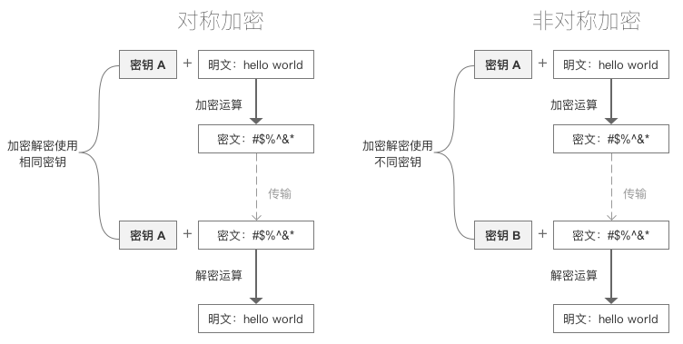
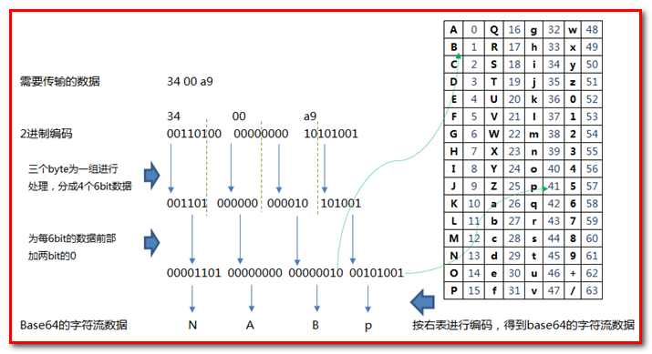
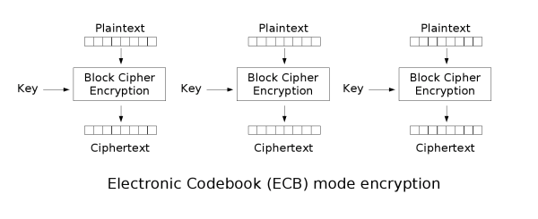
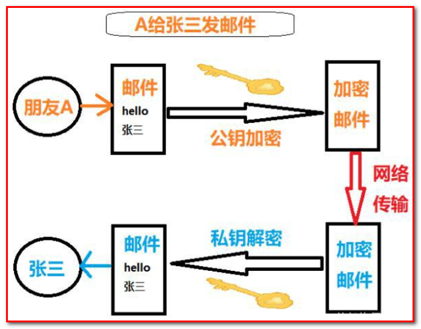
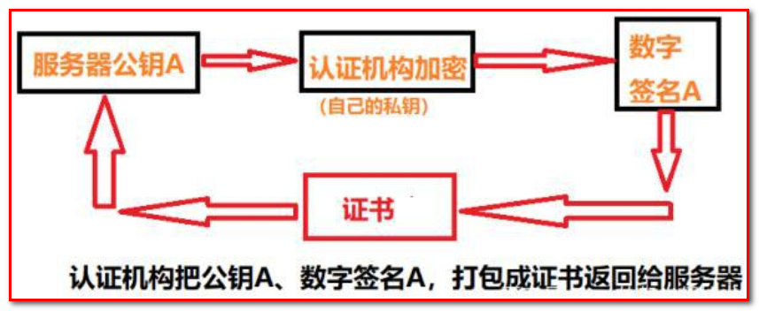
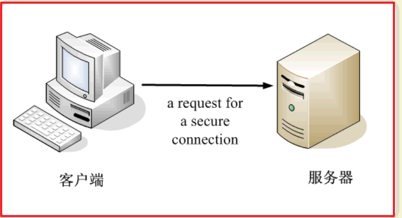
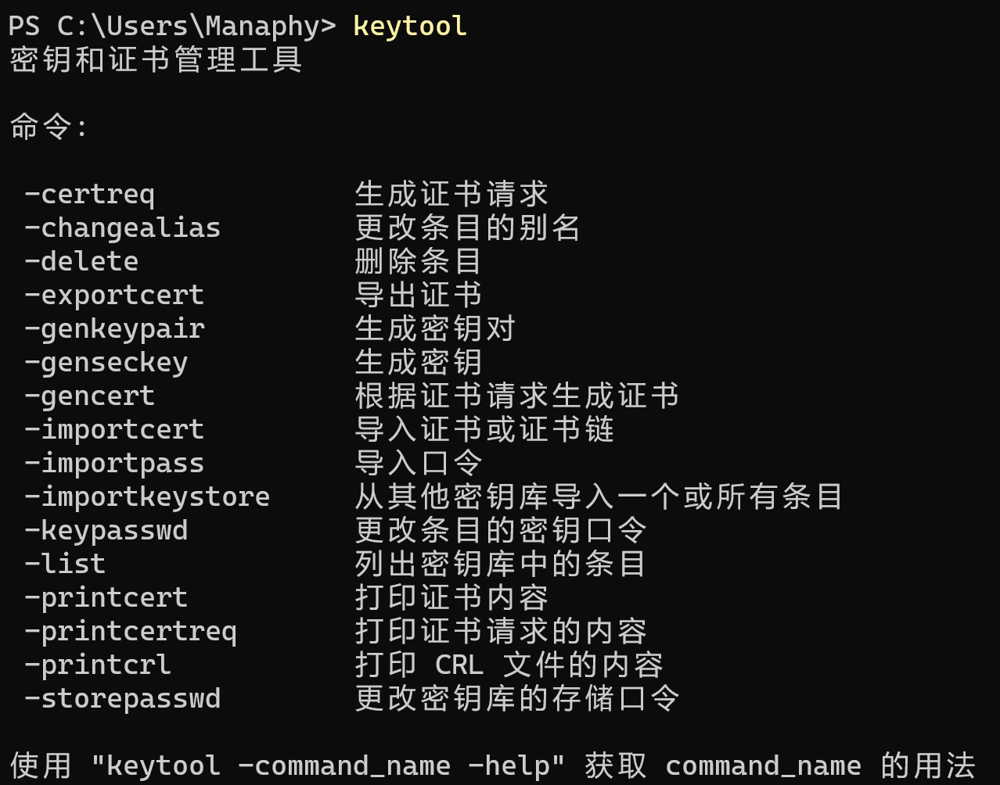

## 1 常见加密方式

### 1.1 对称加密

- 采用单钥密码系统的加密方法，同一个密钥可以同时用作信息的加密和解密，这种加密方法称为对称加密，也称为单密钥加密。
- 常见加密算法
   - DES : Data Encryption Standard，即数据加密标准，是一种使用密钥加密的块算法，1977年被美国联邦政府的国家标准局确定为联邦资料处理标准（FIPS），并授权在非密级政府通信中使用，随后该算法在国际上广泛流传开来。
   - AES : Advanced Encryption Standard, 高级加密标准。在密码学中又称Rijndael加密法，是美国联邦政府采用的一种区块加密标准。这个标准用来替代原先的DES，已经被多方分析且广为全世界所使用。
- 特点
   - 加密速度快, 可以加密大文件
   - 密文可逆, 一旦密钥文件泄漏, 就会导致数据暴露
   - 加密后编码表找不到对应字符, 出现乱码
   - 一般结合Base64使用
### 1.2 Base64 算法
#### 1.2.1 算法简介
> Base64是网络上最常见的用于传输8Bit字节码的可读性编码算法之一
>
> 可读性编码算法不是为了保护数据的安全性，而是为了可读性
>
> 可读性编码不改变信息内容，只改变信息内容的表现形式
>
> 所谓Base64，即是说在编码过程中使用了64种字符：大写A到Z、小写a到z、数字0到9、“+”和“/”
>
> Base58是Bitcoin(比特币)中使用的一种编码方式，主要用于产生Bitcoin的钱包地址
>
> 相比Base64，Base58不使用数字"0"，字母大写"O"，字母大写"I"，和字母小写"i"，以及"+"和"/"符号

#### 1.2.2 Base64 算法原理
base64 是 3个字节为一组，一个字节 8位，一共 就是24位 ，然后，把3个字节转成4组，每组6位，3×8 _=_ 4×6 = 24 ，每组6位，缺少的2位，会在高位进行补0 ，这样做的好处在于 base取的是后面6位，去掉高2位 ，那么base64的取值就可以控制在0-63位了，所以就叫base64，`111 111 = 32 + 16 + 8 + 4 + 2 + 1`
#### 1.2.3 base64 构成原则
① 小写 `a - z` => 26个字母

② 大写 `A - Z` => 26个字母

③ 数字 `0 - 9` => 10 个数字

④ `+ /` =>2个符号

大家可能发现一个问题，咱们的base64有个 = 号，但是在映射表里面没有发现 = 号 ， 这个地方需要注意，等号非常特殊，因为base64是三个字节一组 ，如果当我们的位数不够的时候，会使用等号来补齐


### 1.3 DES加密和解密
```java
import cn.hutool.core.codec.Base64;
import org.junit.Test;

import javax.crypto.Cipher;
import javax.crypto.spec.SecretKeySpec;

public class EncryptTest {

    @Test
    public void DesTest() throws Exception {
        // 要加密的内容
        String input = "内容";
        // DES加密算法，key的大小必须是8个字节
        String key = "12345678";
        String transformation = "DES";
        // 指定获取密钥的算法
        String algorithm = "DES";
        String encryptDES = encryptDesAes(input, key, transformation, algorithm);
        System.out.println("加密:" + encryptDES);//加密:w4M6kCoVpZE=
        String s = decryptDesAes(encryptDES, key, transformation, algorithm);
        System.out.println("解密:" + s);//解密:内容
    }

    /**
	 * DES AES加密数据
	 *
	 * @param input          : 原文
	 * @param key            : 密钥(DES,密钥的长度必须是8个字节;AES是16个字节)
	 * @param transformation : 获取Cipher对象的算法
	 * @param algorithm      : 获取密钥的算法
	 * @return {@link String}
	 * @throws Exception 异常
	 */
    private static String encryptDesAes(String input, String key, String transformation, String algorithm) throws Exception {
        // 获取加密对象
        Cipher cipher = Cipher.getInstance(transformation);
        // 创建加密规则
        // 第一个参数key的字节
        // 第二个参数表示加密算法
        SecretKeySpec sks = new SecretKeySpec(key.getBytes(), algorithm);
        // ENCRYPT_MODE：加密模式
        // DECRYPT_MODE: 解密模式
        // 初始化加密模式和算法
        cipher.init(Cipher.ENCRYPT_MODE, sks);
        // 加密
        byte[] bytes = cipher.doFinal(input.getBytes());
        // 返回加密后的数据
        return Base64.encode(bytes);
    }

    /**
	 * DES AES解密
	 *
	 * @param input          : 密文
	 * @param key            : 密钥
	 * @param transformation : 获取Cipher对象的算法
	 * @param algorithm      : 获取密钥的算法
	 * @return 原文
	 * @throws Exception 异常
	 */
    private static String decryptDesAes(String input, String key, String transformation, String algorithm) throws Exception {
        // 1.获取Cipher对象
        Cipher cipher = Cipher.getInstance(transformation);
        // 2.指定密钥规则
        SecretKeySpec sks = new SecretKeySpec(key.getBytes(), algorithm);
        cipher.init(Cipher.DECRYPT_MODE, sks);
        // 3. 解密，上面使用的base64编码，下面直接用密文
        byte[] bytes = cipher.doFinal(Base64.decode(input));
        //  因为是明文，所以直接返回
        return new String(bytes);
    }
}
```
### 1.4 AES加密解密
```java
@Test
public void AesTest() throws Exception {
    // 要加密的内容
    String input = "内容";
    // AES加密算法，key的大小必须是16个字节
    String key = "1234567812345678";
    String transformation = "AES";
    // 指定获取密钥的算法
    String algorithm = "AES";
    String encryptDES = encryptDesAes(input, key, transformation, algorithm);
    System.out.println("加密:" + encryptDES);//加密:uZFKEeJj50wA5bq8PzuPLw==
    String s = decryptDesAes(encryptDES, key, transformation, algorithm);
    System.out.println("解密:" + s);//解密:内容
}
```
## 2 加密模式
### 2.1 ECB
> ECB : Electronic codebook, 电子密码本. 需要加密的消息按照块密码的块大小被分为数个块，并对每个块进行独立加密



- 优点 : 可以并行处理数据
- 缺点 : 同样的原文生成同样的密文, 不能很好的保护数据
- 同时加密，原文是一样的，加密出来的密文也是一样的
### 2.2 CBC
> CBC : Cipher-block chaining, 密码块链接. 每个明文块先与前一个密文块进行异或后，再进行加密。在这种方法中，每个密文块都依赖于它前面的所有明文块


- 优点 : 同样的原文生成的密文不一样
- 缺点 : 串行处理数据
## 3 填充模式
> 当需要按块处理的数据, 数据长度不符合块处理需求时, 按照一定的方法填充满块长的规则

### 3.1 NoPadding

- 不填充.
- 在DES加密算法下, 要求原文长度必须是8byte的整数倍
- 在AES加密算法下, 要求原文长度必须是16byte的整数倍
### 3.2 PKCS5Padding
数据块的大小为8位, 不够就补足
### 3.3 说明

- 默认情况下, 加密模式和填充模式为 : ECB/PKCS5Padding
- 如果使用CBC模式, 在初始化Cipher对象时, 需要增加参数, 初始化向量IV : `IvParameterSpec iv = new IvParameterSpec(key.getBytes());`

加密模式和填充模式
```
AES/CBC/NoPadding (128)
AES/CBC/PKCS5Padding (128)
AES/ECB/NoPadding (128)
AES/ECB/PKCS5Padding (128)
DES/CBC/NoPadding (56)
DES/CBC/PKCS5Padding (56)
DES/ECB/NoPadding (56)
DES/ECB/PKCS5Padding (56)
DESede/CBC/NoPadding (168)
DESede/CBC/PKCS5Padding (168)
DESede/ECB/NoPadding (168)
DESede/ECB/PKCS5Padding (168)
RSA/ECB/PKCS1Padding (1024, 2048)
RSA/ECB/OAEPWithSHA-1AndMGF1Padding (1024, 2048)
RSA/ECB/OAEPWithSHA-256AndMGF1Padding (1024, 2048)
```
### 3.4 案例
DES/ECB/NoPadding 加密模式
```java
@Test
public void test() throws Exception {
    // 要加密的内容
    String input = "内容12";
    // DES加密算法，key的大小必须是8个字节
    String key = "12345678";
    // 指定获取Cipher的算法,如果没有指定加密模式和填充模式,ECB/PKCS5Padding就是默认值
    // NoPadding模式,原文的长度必须是8个字节的整倍数 ，所以必须把 内容 改成 内容12 补足8位
    String transformation = "DES/ECB/NoPadding";
    // 指定获取密钥的算法
    String algorithm = "DES";
    String encryptDES = encryptDesAes(input, key, transformation, algorithm);
    System.out.println("加密:" + encryptDES);//加密:LpgdNawVOqY=
    String s = decryptDesAes(encryptDES, key, transformation, algorithm);
    System.out.println("解密:" + s);//解密:内容12
}
```
DES/CBC/PKCS5Padding 加密模式
```java
import cn.hutool.core.codec.Base64;
import org.junit.Test;

import javax.crypto.Cipher;
import javax.crypto.spec.IvParameterSpec;
import javax.crypto.spec.SecretKeySpec;

public class EncryptTest {

    @Test
    public void test() throws Exception {
        // 要加密的内容
        String input = "内容";
        // DES加密算法，key的大小必须是8个字节
        String key = "12345678";
        // 指定获取Cipher的算法,如果没有指定加密模式和填充模式,ECB/PKCS5Padding就是默认值
        String transformation = "DES/CBC/PKCS5Padding";
        // 指定获取密钥的算法
        String algorithm = "DES";
        String encryptDES = encryptDesAes(input, key, transformation, algorithm);
        System.out.println("加密:" + encryptDES);//加密:aBDOoVb1td4=
        String s = decryptDesAes(encryptDES, key, transformation, algorithm);
        System.out.println("解密:" + s);//解密:内容
    }

    private static String encryptDesAes(String input, String key, String transformation, String algorithm) throws Exception {
        Cipher cipher = Cipher.getInstance(transformation);
        SecretKeySpec sks = new SecretKeySpec(key.getBytes(), algorithm);
        // 初始向量，参数表示跟谁进行异或，初始向量的长度必须是8位
        IvParameterSpec iv = new IvParameterSpec(key.getBytes());
        cipher.init(Cipher.ENCRYPT_MODE, sks, iv);
        byte[] bytes = cipher.doFinal(input.getBytes());
        return Base64.encode(bytes);
    }

    private static String decryptDesAes(String input, String key, String transformation, String algorithm) throws Exception {
        Cipher cipher = Cipher.getInstance(transformation);
        SecretKeySpec sks = new SecretKeySpec(key.getBytes(), algorithm);
        IvParameterSpec iv = new IvParameterSpec(key.getBytes());
        cipher.init(Cipher.DECRYPT_MODE, sks,iv);
        byte[] bytes = cipher.doFinal(Base64.decode(input));
        return new String(bytes);
    }
}
```
## 4 消息摘要

- 消息摘要（Message Digest）又称为数字摘要(Digital Digest)
- 它是一个唯一对应一个消息或文本的固定长度的值，它由一个单向Hash加密函数对消息进行作用而产生
- 使用数字摘要生成的值是不可以篡改的，为了保证文件或者值的安全
### 4.1 特点
> 无论输入的消息有多长，计算出来的消息摘要的长度总是固定的。例如应用MD5算法摘要的消息有128个比特位，用SHA-1算法摘要的消息最终有160比特位的输出
>
> 只要输入的消息不同，对其进行摘要以后产生的摘要消息也必不相同；但相同的输入必会产生相同的输出
>
> 消息摘要是单向、不可逆的

### 4.2 常见算法
```
- MD5
- SHA1
- SHA256
- SHA512
```
### 4.3 获取字符串消息摘要
```java
public class EncryptTest {


    @Test
    public void test02() throws Exception {
        String input = "chen";
        // 获取数字摘要对象
        String md5 = getDigest(input, "MD5");
        System.out.println(md5);//a1a8887793acfc199182a649e905daab

        String sha1 = getDigest(input, "SHA-1");
        System.out.println(sha1);//8a89798cf0878e37bb6589ae1c36b9d8a036275b

        String sha256 = getDigest(input, "SHA-256");
        System.out.println(sha256);//3abd72ec6352d6085d85e34f0478dca7d14ef8048f3c1986e28106d654713946

        String sha512 = getDigest(input, "SHA-512");
        System.out.println(sha512);//e3b92710045fbae402523dbf08fdf0b07c7ba1969c0311c618a33f0cb82b76d3fa325bee6eb5a9ae5dd0bcf137e76d50587184493f1e70daa4a5366dd7776af0
    }


    /**
	 * 十六进制化字节数组
	 *
	 * @param digest 字节数组
	 * @return {@link String}
	 */
    private static String toHex(byte[] digest) {
        // 创建对象用来拼接
        StringBuilder sb = new StringBuilder();
        for (byte b : digest) {
            // 转成 16进制
            String s = Integer.toHexString(b & 0xff);
            if (s.length() == 1) {
                // 如果生成的字符只有一个，前面补0
                s = "0" + s;
            }
            sb.append(s);
        }
        return sb.toString();
    }

    /**
 * 消息数字摘要
 *
 * @param input     输入
 * @param algorithm 算法
 * @return {@link String}* @throws Exception 异常
 */
    private static String getDigest(String input, String algorithm) throws Exception {
        MessageDigest messageDigest = MessageDigest.getInstance(algorithm);
        // 消息数字摘要
        byte[] digest = messageDigest.digest(input.getBytes());
        return toHex(digest);
    }

}
```
### 4.4 获取文件消息摘要
```java
@Test
public void test03() throws Exception {
    String sha1 = getDigestFile("D:\\Data\\Pictures\\1.jpg", "SHA-1");
    System.out.println(sha1);//63be2a2ad212f3965962eaf0e302efca18fc7d2d

    String sha512 = getDigestFile("D:\\Data\\Pictures\\1.jpg", "SHA-512");
    System.out.println(sha512);//d98baf298686f862b714410b4605e93e1644ca528465ba7ff0567b6f8851674567248d53740b6a24ec3c88ec26bb7c163bfcca981a753cf8f50c438e08031082
}

private static String getDigestFile(String filePath, String algorithm) throws Exception {
    FileInputStream fis = new FileInputStream(filePath);
    int len;
    byte[] buffer = new byte[1024];
    ByteArrayOutputStream baos = new ByteArrayOutputStream();
    while ((len = fis.read(buffer)) != -1) {
        baos.write(buffer, 0, len);
    }
    // 获取消息摘要对象
    MessageDigest messageDigest = MessageDigest.getInstance(algorithm);
    // 获取消息摘要
    byte[] digest = messageDigest.digest(baos.toByteArray());
    return toHex(digest);
}
```
### 4.5 总结

- MD5算法 : 摘要结果16个字节, 转16进制后32个字节
- SHA1算法 : 摘要结果20个字节, 转16进制后40个字节
- SHA256算法 : 摘要结果32个字节, 转16进制后64个字节
- SHA512算法 : 摘要结果64个字节, 转16进制后128个字节
## 5 非对称加密

::: tip 简介

非对称加密算法又称`现代加密算法`。

非对称加密是计算机通信安全的基石，保证了加密数据`不会被破解`。

与对称加密算法不同，非对称加密算法需要两个密钥：`公开密钥(publickey)` 和`私有密(privatekey)`

公开密钥和私有密钥是`一对`

如果用`公开密钥`对数据进行`加密`，只有用`对应的私有密钥`才能`解密`。

如果用`私有密钥`对数据进行`加密`，只有用`对应的公开密钥`才能`解密`。

因为加密和解密使用的是两个`不同`的密钥，所以这种算法叫作`非对称加密算法`。

:::

**示例**

- 首先生成密钥对, 公钥为(5,14), 私钥为(11,14)
- 现在A希望将原文2发送给B
- A使用公钥加密数据. 2的5次方mod 14 = 4 , 将密文4发送给B
- B使用私钥解密数据. 4的11次方mod14 = 2, 得到原文2

**特点**

- 加密和解密使用不同的密钥
- 如果使用私钥加密, 只能使用公钥解密
- 如果使用公钥加密, 只能使用私钥解密
- 处理数据的速度较慢, 因为安全级别高

**常见算法**

- RSA
- ECC
### 5.1 生成公钥和私钥
```java
@Test
public void test04() throws Exception {
    // 加密算法
    String algorithm = "RSA";
    //  创建密钥对生成器对象
    KeyPairGenerator keyPairGenerator = KeyPairGenerator.getInstance(algorithm);
    // 生成密钥对
    KeyPair keyPair = keyPairGenerator.generateKeyPair();
    // 生成私钥
    PrivateKey privateKey = keyPair.getPrivate();
    // 生成公钥
    PublicKey publicKey = keyPair.getPublic();
    // 获取私钥字节数组
    byte[] privateKeyEncoded = privateKey.getEncoded();
    // 获取公钥字节数组
    byte[] publicKeyEncoded = publicKey.getEncoded();
    // 对公私钥进行base64编码
    String privateKeyString = Base64.encode(privateKeyEncoded);
    String publicKeyString = Base64.encode(publicKeyEncoded);
    // 打印私钥
    System.out.println(privateKeyString);
    // 打印公钥
    System.out.println(publicKeyString);
}
```
**生成示例**

私钥
```
MIIEvAIBADANBgkqhkiG9w0BAQEFAASCBKYwggSiAgEAAoIBAQCCwVvY3aa69jqkbiLiKaqil0FNOF9husmKaQcl1R29iQetFFCNYvipJaKpvUdeUSzgo9LnEsvCpY+nYiBAbIH8v/ddk9KlSwz+y6sU/JAGRCMjE799hHFeM/wWwjsro/ZimmTXDsx5WOT2+hTz/EbcIwk0JRBPvMnZ+8ZDjuyu8PUHFz48y9suf427B0jb/H2+Va9mAZTivR01ENFme+mflXwDYT3JPzUT8s/qTQW+lc2XZoQDU8T+iSHyqcjjRpyo1CARTJ9yJ1RUSzDNeM/QzNkOjb3HIL4A3fFkNkt4GUz6FhqJQIPoWFw4ktXOT8x44koHAExBTl9AlqAz5LQtAgMBAAECggEAI216klb0HwIqP3Ur9HVvq2AqLF8S0OsIQn1Ul3aX+UvQjZ/Md5KSZ1owKaeEV9TMwQ0CTuOz28h6FNMsg+gijDYDMxKjZ2/fVIYgk64e4+PAVXe7Uan6AZk6O3xjBd8GGg9VNUPoORTR7O0zkiwPkwPXMY69Ta2MT4i9Xn6yOG/hUxOylz7K7LjbZzDApTgsr924QoZ8AnHWrla7fmgeyn+lW5XMFQJMlM9nZJQ4z0cwzT1DpV2r1T9b3Zhm4Rg6MEJ+Alip0a4t62bChV1jbdR8iVwfpItaD3d8hBd2nBlDOgh8fyBbu6vNGq8yFmLl3rhRG5eQJZOhQaqyUePUAQKBgQDmpWFjDX/zyGJoHy8cjXVI27tcdNjk4k714z10OkEwMmMGYU3q94qCmirB/J3xg/GGXXP6JsGa37VDn1CU7ebdHkdHWhaDpqCVbjnIEBanBg7P6BRw+GfQeyG0M9l8CXOLNcNw68Wn8o32YWB3ao8nUS3OVL6K+LTYkF7j1M9FLQKBgQCRIPMW3w+q+G8BBKNlNeDAQJSVkrt1LpSwIgrQRl9pkAz9/66N9bpiIQgTo0UJmL2QcX6dQfIXZOQHMrC/6P0ILkITrtNSal8IdaK3ulfA25UZ3JP07Vu209aBu5Jqm2nkuTYugDc/CEPrsa4Ge1MEBgKYniodejJnoVNm5l6LAQKBgF4LHNRokr1x/T37SRhZTXMxtQmT00QwSoXT7CDSB/aA9QOK9VxTJrTt63VBbZ0mcXqZ7EoZN2PQx3YVJaQ0BKgwSlv7jaaMcHm9ge3jMXlU7QE03fDaOGo3apyxb4I10Fj4yQHoAKXkLqJBPjYyyr/7R7QTtcWwdvy+kRJQmVrZAoGAK+4rZ1ryJTC6eTZsN3DNraRe1b/q2pfVDlPfrhf/PbcLF7/TmMkvOBEDnt4nQbZoe1a/mt6hZ490rvEbK5xdK6LFAaxD74ifZ7IkJTVU5t4RDhkE+Hj48CjDn9Wlhnuw3DlsOzs4fe4EkU3hfbjK8kbXdlc6LF4W7+OXmWhWagECgYA83s1t/Irl3drqnb36SKCVjdZPrx75HxKier3Ptn11Jb49GA06UOlxAkpcLQDlbQ4dghQnjiUsf3ATDOjrdaCF98Ysk15XWMNNeYGfpbHXm0fu0gU/JAVOkPuPIxuL95e1227+8Sm8u4S19qn7GgjpiKx/+4B8zPjNtzzuTp+keg==
```
公钥
```
MIIBIjANBgkqhkiG9w0BAQEFAAOCAQ8AMIIBCgKCAQEAgsFb2N2muvY6pG4i4imqopdBTThfYbrJimkHJdUdvYkHrRRQjWL4qSWiqb1HXlEs4KPS5xLLwqWPp2IgQGyB/L/3XZPSpUsM/surFPyQBkQjIxO/fYRxXjP8FsI7K6P2Yppk1w7MeVjk9voU8/xG3CMJNCUQT7zJ2fvGQ47srvD1Bxc+PMvbLn+NuwdI2/x9vlWvZgGU4r0dNRDRZnvpn5V8A2E9yT81E/LP6k0FvpXNl2aEA1PE/okh8qnI40acqNQgEUyfcidUVEswzXjP0MzZDo29xyC+AN3xZDZLeBlM+hYaiUCD6FhcOJLVzk/MeOJKBwBMQU5fQJagM+S0LQIDAQAB
```
### 5.2 私钥加密公钥解密
公钥加密私钥解密类似
```java
@Test
public void test05() throws Exception {
    String input = "内容";
    String algorithm = "RSA";
    KeyPairGenerator keyPairGenerator = KeyPairGenerator.getInstance(algorithm);
    KeyPair keyPair = keyPairGenerator.generateKeyPair();
    PrivateKey privateKey = keyPair.getPrivate();
    PublicKey publicKey = keyPair.getPublic();

    // 创建加密对象
    // 参数表示加密算法
    Cipher cipher = Cipher.getInstance(algorithm);
    // 初始化加密
    // 第一个参数:加密的模式
    // 第二个参数：使用私钥进行加密
    cipher.init(Cipher.ENCRYPT_MODE, privateKey);
    // 私钥加密
    byte[] bytes = cipher.doFinal(input.getBytes());
    System.out.println(Base64.encode(bytes));
    // 公钥进行解密
    cipher.init(Cipher.DECRYPT_MODE, publicKey);
    // 对密文进行解密，不需要使用base64，因为原文不会乱码
    byte[] bytes1 = cipher.doFinal(bytes);
    System.out.println(new String(bytes1));
}
```
输出如下
```
k0W9BD/vBjVe4o2od1rStveoy2lMwsOpha6yBKTR15tX6aw/AlMcOju1AZrGKi7pgD/1Md/ki49tJR9/+YRTczVHOlIT63EDSd12H4KPfHAEH5jQMxKvEZ1xYlRQ52TicRNer254Df77uxKqiYoiUdcKx4+DGS+nPPhRIZtVP0oSnPnC956S26hKtrLqYdHusHG7sdq3+aOLtK1uUVoxlCiiBIU5oWomRCfLZgVjCya7ZvK/vLWKk2W0B6/4m5xrGae1fzJGGSBpZKS+Gt+3Z+Z4U9QK7QsAVVO7dix46F5DngMb3nr2uvwWM+HcEQ0GPK2lRo9glzvGZ/9InlhGuw==
内容
```
### 5.3 保存公钥和私钥
```java
@Test
public void test06() throws Exception {
    String algorithm = "RSA";
    //生成密钥对并保存在本地文件中
    generateKeyToFile(algorithm, "a.pub", "a.pri");
}

/**
 * 生成密钥对并保存在本地文件中
 *
 * @param algorithm : 算法
 * @param pubPath   : 公钥保存路径
 * @param priPath   : 私钥保存路径
 * @throws Exception 异常
 */
private static void generateKeyToFile(String algorithm, String pubPath, String priPath) throws Exception {
    // 获取密钥对生成器
    KeyPairGenerator keyPairGenerator = KeyPairGenerator.getInstance(algorithm);
    // 获取密钥对
    KeyPair keyPair = keyPairGenerator.generateKeyPair();
    // 获取公钥
    PublicKey publicKey = keyPair.getPublic();
    // 获取私钥
    PrivateKey privateKey = keyPair.getPrivate();
    // 获取byte数组
    byte[] publicKeyEncoded = publicKey.getEncoded();
    byte[] privateKeyEncoded = privateKey.getEncoded();
    // 进行Base64编码
    String publicKeyString = Base64.encode(publicKeyEncoded);
    String privateKeyString = Base64.encode(privateKeyEncoded);
    // 保存文件
    FileUtils.writeStringToFile(new File(pubPath), publicKeyString, StandardCharsets.UTF_8);
    FileUtils.writeStringToFile(new File(priPath), privateKeyString, StandardCharsets.UTF_8);

}
```
### 5.4 使用本地公钥私钥加密解密
```java
@Test
public void test07() throws Exception {
    String input = "内容";
    // 加密算法
    String algorithm = "RSA";
    PrivateKey privateKey = getPrivateKey("a.pri", algorithm);
    PublicKey publicKey = getPublicKey("a.pub", algorithm);

    String encrypt = encryptRSA(algorithm, privateKey, input);
    String decrypt = decryptRSA(algorithm, publicKey, encrypt);
    System.out.println(encrypt);
    System.out.println(decrypt);
}

/**
 * 读取公钥
 *
 * @param publicPath 公钥路径
 * @param algorithm  算法
 * @return {@link PublicKey}* @throws Exception 异常
 */
public static PublicKey getPublicKey(String publicPath, String algorithm) throws Exception {
    // 将文件内容转为字符串
    String publicKeyString = FileUtils.readFileToString(new File(publicPath), Charset.defaultCharset());
    // 获取密钥工厂
    KeyFactory keyFactory = KeyFactory.getInstance(algorithm);
    // 构建密钥规范 进行Base64解码
    X509EncodedKeySpec spec = new X509EncodedKeySpec(Base64.decode(publicKeyString));
    // 生成公钥
    return keyFactory.generatePublic(spec);
}

/**
 * 读取私钥
 *
 * @param priPath   私钥路径
 * @param algorithm 算法
 * @return {@link PrivateKey}* @throws Exception 异常
 */
public static PrivateKey getPrivateKey(String priPath, String algorithm) throws Exception {
    // 将文件内容转为字符串
    String privateKeyString = FileUtils.readFileToString(new File(priPath), Charset.defaultCharset());
    // 获取密钥工厂
    KeyFactory keyFactory = KeyFactory.getInstance(algorithm);
    // 构建密钥规范 进行Base64解码
    PKCS8EncodedKeySpec spec = new PKCS8EncodedKeySpec(Base64.decode(privateKeyString));
    // 生成私钥
    return keyFactory.generatePrivate(spec);
}

/**
 * 使用密钥加密数据
 *
 * @param algorithm : 算法
 * @param input     : 原文
 * @param key       : 密钥
 * @return {@link String}
 * @throws Exception 异常
 */
public static String encryptRSA(String algorithm, Key key, String input) throws Exception {
    // 创建加密对象
    // 参数表示加密算法
    Cipher cipher = Cipher.getInstance(algorithm);
    // 初始化加密
    // 第一个参数:加密的模式
    // 第二个参数：使用私钥进行加密
    cipher.init(Cipher.ENCRYPT_MODE, key);
    // 私钥加密
    byte[] bytes = cipher.doFinal(input.getBytes());
    // 对密文进行Base64编码
    return Base64.encode(bytes);
}

/**
 * 解密数据
 *
 * @param algorithm : 算法
 * @param encrypted : 密文
 * @param key       : 密钥
 * @return {@link String}
 * @throws Exception 异常
 */
public static String decryptRSA(String algorithm, Key key, String encrypted) throws Exception {
    // 创建加密对象
    // 参数表示加密算法
    Cipher cipher = Cipher.getInstance(algorithm);
    // 私钥进行解密
    cipher.init(Cipher.DECRYPT_MODE, key);
    // 由于密文进行了Base64编码, 在这里需要进行解码
    byte[] decode = Base64.decode(encrypted);
    // 对密文进行解密，不需要使用base64，因为原文不会乱码
    byte[] bytes1 = cipher.doFinal(decode);
    return new String(bytes1);

}
```
## 6 数字签名
> 数字签名（又称[公钥](https://baike.baidu.com/item/%E5%85%AC%E9%92%A5)数字签名）是只有信息的发送者才能产生的别人无法伪造的一段数字串，这段数字串同时也是对信息的发送者发送信息真实性的一个有效证明。它是一种类似写在纸上的普通的物理签名，但是使用了[公钥加密](https://baike.baidu.com/item/%E5%85%AC%E9%92%A5%E5%8A%A0%E5%AF%86/6245950)领域的技术来实现的，用于鉴别数字信息的方法。一套数字签名通常定义两种互补的运算，一个用于签名，另一个用于验证。数字签名是非对称[密钥加密技术](https://baike.baidu.com/item/%E5%AF%86%E9%92%A5%E5%8A%A0%E5%AF%86%E6%8A%80%E6%9C%AF)与[数字摘要](https://baike.baidu.com/item/%E6%95%B0%E5%AD%97%E6%91%98%E8%A6%81/4069118)技术的应用。

### 6.1  简单认识
相信我们都写过信，在写信的时候落款处总是要留下自己的名字，用来表示写信的人是谁。我们签的这个字就是生活中的签名：

而数字签名呢？其实也是同样的道理，他的含义是：在网络中传输数据时候，给数据添加一个数字签名，表示是谁发的数据，而且还能证明数据没有被篡改。

OK，数字签名的主要作用就是保证了数据的有效性（验证是谁发的）和完整性（证明信息没有被篡改）。下面我们就来好好地看一下他的底层实现原理是什么样子的。
### 6.2 基本原理
为了理解得清楚，我们通过案例一步一步来讲解。话说张三有俩好哥们A、B。由于工作原因，张三和AB写邮件的时候为了安全都需要加密。于是张三想到了数字签名：

整个思路是这个样子的：

第一步：加密采用非对称加密，张三有三把钥匙，两把公钥，送给朋友。一把私钥留给自己。

第二步：A或者B写邮件给张三：A先用公钥对邮件加密，然后张三收到邮件之后使用私钥解密。

第三步：张三写邮件给A或者B：

（1）张三写完邮件，先用hash函数生成邮件的摘要，附着在文章上面，这就完成了数字签名，然后张三再使用私钥加密。就可以把邮件发出去了。

（2）A或者是B收到邮件之后，先把数字签名取下来，然后使用自己的公钥解密即可。这时候取下来的数字签名中的摘要若和张三的一致，那就认为是张三发来的，再对信件本身使用Hash函数，将得到的结果，与上一步得到的摘要进行对比。如果两者一致，就证明这封信未被修改过。

上面的流程我们使用一张图来演示一下：

首先把公钥送给朋友A和B：


### 6.3 数字证书
上面提到我们对签名进行验证时，需要用到公钥。如果公钥是伪造的，那我们无法验证数字签名了，也就根本不可能从数字签名确定对方的合法性了。这时候证书就闪亮登场了。我们可能都有考各种证书的经历，比如说普通话证书，四六级证书等等，但是归根结底，到任何场合我们都能拿出我们的证书来证明自己确实已经考过了普通话，考过了四六级。这里的证书也是同样的道理。

如果不理解证书的作用，我们可以举一个例子，比如说我们的毕业证书，任何公司都会承认。为什么会承认？因为那是国家发得，大家都信任国家。也就是说只要是国家的认证机构，我们都信任它是合法的。

那么这个证书是如何生成的呢？我们再来看一张图：



此时即使张三的朋友A把公钥弄错了，张三也可以通过这个证书验证。
### 6.4 网页加密
我们看一个应用“数字证书”的实例：https协议。这个协议主要用于网页加密

首先，客户端向服务器发出加密请求。


### 6.5 代码实现
```java
@Test
public void test08() throws Exception {
    String a = "123";
    PublicKey publicKey = getPublicKey("a.pub", "RSA");
    PrivateKey privateKey = getPrivateKey("a.pri", "RSA");
    String signaturedData = getSignature(a, "sha256withrsa", privateKey);
    boolean b = verifySignature(a, "sha256withrsa", publicKey, signaturedData);
    System.out.println(b);//true
}

/**
 * 生成签名
 *
 * @param input      : 原文
 * @param algorithm  : 算法
 * @param privateKey : 私钥
 * @return {@link String}
 * @throws Exception 异常
 */
private static String getSignature(String input, String algorithm, PrivateKey privateKey) throws Exception {
    // 获取签名对象
    Signature signature = Signature.getInstance(algorithm);
    // 初始化签名
    signature.initSign(privateKey);
    // 传入原文
    signature.update(input.getBytes());
    // 开始签名
    byte[] sign = signature.sign();
    // 对签名数据进行Base64编码
    return Base64.encode(sign);
}

/**
 * 校验签名
 *
 * @param input          : 原文
 * @param algorithm      : 算法
 * @param publicKey      : 公钥
 * @param signaturedData : 签名
 * @return boolean
 * @throws Exception 异常
 */
private static boolean verifySignature(String input, String algorithm, PublicKey publicKey, String signaturedData) throws Exception {
    // 获取签名对象
    Signature signature = Signature.getInstance(algorithm);
    // 初始化签名
    signature.initVerify(publicKey);
    // 传入原文
    signature.update(input.getBytes());
    // 校验数据
    return signature.verify(Base64.decode(signaturedData));
}
```
## 7 keytool工具使用
keytool工具路径：Java bin目录



**常用命令**

生成keypair

keytool -genkeypair

keytool -genkeypair -alias lisi（后面部分是为证书指定别名，否则采用默认的名称为mykey)

看看keystore中有哪些项目：

keytool -list或keytool -list -v

keytool -exportcert -alias lisi -file lisi.cer

生成可打印的证书：

keytool -exportcert -alias lisi -file lisi.cer –rfc

显示数字证书文件中的证书信息：

keytool -printcert -file lisi.cer

直接双击lisi.cer，用window系统的内置程序打开lisi.cer

**生成私钥公钥**

生成密钥证书 下边命令生成密钥证书，采用RSA 算法每个证书包含公钥和私钥

创建一个文件夹，在该文件夹下执行如下命令行：
```shell
keytool -genkeypair -alias chen -keyalg RSA -keypass chennn -keystore chen.jks -storepass chennn
```
Keytool 是一个java提供的证书管理工具
```
-alias：密钥的别名 
-keyalg：使用的hash算法 
-keypass：密钥的访问密码 
-keystore：密钥库文件名，xc.keystore保存了生成的证书 
-storepass：密钥库的访问密码
```
查询证书信息
```shell
keytool -list -keystore chen.jks
```
删除别名
```shell
keytool -delete -alias chen -keystore chen.jsk
```
