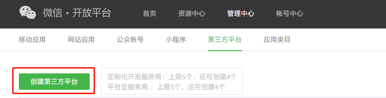

# 一 注册账号
在[微信开放平台](https://open.weixin.qq.com/)上注册账号
# 二 创建第三方平台


授权测试公众号/小程序列表: gh_xxxxxxxxxx

其余配置看微信提示

# 三 公众号授权给第三方平台
## 授权事件接收URL
引入微信第三方平台依赖
```xml
<dependency>
  <groupId>com.github.binarywang</groupId>
  <artifactId>weixin-java-open</artifactId>
  <version>4.1.7.B</version>
</dependency>
```
配置**微信开放平台属性**
```java
@Data
@Component
@ConfigurationProperties(prefix = "wechat.open")
public class WechatOpenProperties {
    /** 设置微信三方平台的appid */
    private String componentAppId;

    /** 设置微信三方平台的app secret */
    private String componentSecret;

    /** 设置微信三方平台的token */
    private String componentToken;

    /** 设置微信三方平台的EncodingAESKey */
    private String componentAesKey;

}
```
```java
@Slf4j
@Service
public class WechatOpenService extends WxOpenServiceImpl {

    @Resource
    private WechatOpenProperties wechatOpenProperties;

    private WxOpenMessageRouter wxOpenMessageRouter;

    @PostConstruct
    public void init() {
        WxOpenInMemoryConfigStorage configStorage = new WxOpenInMemoryConfigStorage();
        configStorage.setComponentAppId(wechatOpenProperties.getComponentAppId());
        configStorage.setComponentAppSecret(wechatOpenProperties.getComponentSecret());
        configStorage.setComponentToken(wechatOpenProperties.getComponentToken());
        configStorage.setComponentAesKey(wechatOpenProperties.getComponentAesKey());
        setWxOpenConfigStorage(configStorage);

        wxOpenMessageRouter = new WxOpenMessageRouter(this);
        wxOpenMessageRouter.rule().handler((wxMpXmlMessage, map, wxMpService, wxSessionManager) -> {
            log.info("\n接收到 {} 公众号请求消息，内容：{}", wxMpService.getWxMpConfigStorage().getAppId(), wxMpXmlMessage);
            return null;
        }).next();
    }

    public WxOpenMessageRouter getWxOpenMessageRouter() {
        return wxOpenMessageRouter;
    }
}
```
```java
@Slf4j
@RestController
@RequestMapping("/wechat/open/notify")
public class ThirdNotifyController {

    @Resource
    private WechatOpenService openService;

    /**
     * 授权事件接收URL
     * 用于接收取消授权通知、授权成功通知、授权更新通知，也用于接收验证票据
     */
    @PostMapping("receive_ticket")
    public String receiveTicket(@RequestBody(required = false) String requestBody,
                                @RequestParam("timestamp") String timestamp,
                                @RequestParam("nonce") String nonce,
                                @RequestParam("signature") String signature,
                                @RequestParam(name = "encrypt_type", required = false) String encType,
                                @RequestParam(name = "msg_signature", required = false) String msgSignature
    ) {
        log.info("\n接收微信请求：[signature=[{}], encType=[{}], msgSignature=[{}], timestamp=[{}], nonce=[{}], requestBody=[\n{}\n] ",
                signature, encType, msgSignature, timestamp, nonce, requestBody);

        if (!StringUtils.equalsIgnoreCase("aes", encType)
                || !openService.getWxOpenComponentService().checkSignature(timestamp, nonce, signature)) {
            throw new IllegalArgumentException("非法请求，可能属于伪造的请求！");
        }

        // aes加密的消息
        WxOpenXmlMessage inMessage = WxOpenXmlMessage.fromEncryptedXml(requestBody,
                openService.getWxOpenConfigStorage(), timestamp, nonce, msgSignature);
        log.info("\n消息解密后内容为：\n{} ", inMessage.toString());

        try {
            String out = openService.getWxOpenComponentService().route(inMessage);
            log.info("\n组装回复信息：{}", out);
        } catch (WxErrorException e) {
            log.error("receive_ticket", e);
        }
        return "success";
    }

}
```
```java
@Slf4j
@Controller
@RequestMapping("/wechat/open/api")
public class ThirdApiController {

    @Resource
    private WechatOpenService openService;

    @GetMapping("/auth/goto_auth_url_show")
    @ResponseBody
    public String gotoPreAuthUrlShow() {
        return "<a href='goto_auth_url'>go</a>";
    }

    @GetMapping("/auth/goto_auth_url")
    public void gotoPreAuthUrl(HttpServletResponse response) {
        String host = "example.com/wechat/open";
        String url = "http://" + host + "/api/auth/jump";
        try {
            url = openService.getWxOpenComponentService().getPreAuthUrl(url);
            // 添加来源，解决302跳转来源丢失的问题
            response.addHeader("Referer", "http://" + host);
            response.sendRedirect(url);
        } catch (WxErrorException | IOException e) {
            log.error("gotoPreAuthUrl", e);
            throw new RuntimeException(e);
        }
    }

    @GetMapping("/auth/jump")
    @ResponseBody
    public WxOpenQueryAuthResult jump(@RequestParam("auth_code") String authorizationCode) {
        try {
            WxOpenQueryAuthResult queryAuthResult = openService.getWxOpenComponentService().getQueryAuth(authorizationCode);
            log.info("getQueryAuth:{}", queryAuthResult);
            return queryAuthResult;
        } catch (WxErrorException e) {
            log.error("gotoPreAuthUrl", e);
            throw new RuntimeException(e);
        }
    }

    @GetMapping("/get_authorizer_info")
    @ResponseBody
    public WxOpenAuthorizerInfoResult getAuthorizerInfo(@RequestParam String appId) {
        try {
            return openService.getWxOpenComponentService().getAuthorizerInfo(appId);
        } catch (WxErrorException e) {
            log.error("getAuthorizerInfo", e);
            throw new RuntimeException(e);
        }
    }
}
```
将项目部署到服务器并配置好对应的域名,使 [http://example.com/wechat/open/notify/receive_ticket](http://example.com/wechat/third/notify/receive_ticket) 能请求到对应的接口

在第三方平台创建审核通过后，微信服务器会向其 "授权事件接收URL" 每隔 10 分钟以 POST 的方式推送 component_verify_ticket

监控日志 当监控到

```
接收微信请求：.....
...
消息解密后内容为：
WxOpenXmlMessage(... componentVerifyTicket=ticket@@@-...
组装回复信息：success
```
说明接收授权事件成功

浏览器访问 [http://example.com/wechat/open/api/auth/goto_auth_url_show](http://example.com/wechat/open/api/auth/goto_auth_url_show) 进行公众号授权
