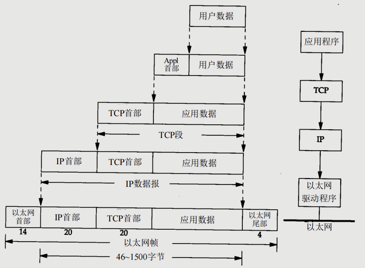

# 网络相关概念
## 网络
> 两台或多台设备通过一定物理设备连接起来构成了网络

根据网络的覆盖范围不同，对网络进行分类

- 局域网：覆盖范围小，仅仅覆盖一个教室或一个机房
- 城域网：覆盖范围大，可以覆盖一个城市
- 广域网：覆盖范围大，可以覆盖全国，甚至全球，万维网是广域网的代表
## IP地址
> 用于唯一标识网络中每台计算机

## 网络通信协议
TCP/IP协议：又叫网络通信协议，这个协议是 Internet 最基本的协议、Internet 国际互联网的基础，简单地说，就是有网络层的IP协议和传输层的TCP协议组成的。


## TCP和UDP
TCP协议：传输控制协议

1. 使用TCP协议前，须先建立TCP连接，形成传输数据通道
2. 传输前，采用"三次握手"方式，是可靠的
3. TCP协议进行通信的两个应用进程:客户端、服务端
4. 在连接中可进行大数据量的传输
5. 传输完毕，需释放已建立的连接，效率低

UDP协议：

1. 将数据、源、目的封装成数据包，不需要建立连接
2. 每个数据报的大小限制在64K内，不适合传输大量数据
3. 因无需连接，故是不可靠的
4. 发送数据结束时无需释放资源(因为不是面向连接的)，速度快
5. 举例:厕所通知:发短信
## InetAddress类
```java
public static void main(String[] args) throws UnknownHostException {
    // 获取本机的 InetAddress 对象
    InetAddress localHost = InetAddress.getLocalHost();
    System.out.println(localHost);// Manaphy-PC/192.168.24.1
    // 根据指定主机名 获取 InetAddress 对象
    InetAddress host1 = InetAddress.getByName("Manaphy-PC");
    System.out.println(host1);// Manaphy-PC/192.168.24.1
    // 根据域名获取 InetAddress 对象
    InetAddress host2 = InetAddress.getByName("www.baidu.com");
    System.out.println(host2);// www.baidu.com/182.61.200.6
    // 通过 InetAddress 对象,获取对应的地址
    String hostAddress = host2.getHostAddress();
    System.out.println(hostAddress);// 182.61.200.6
    // 通过 InetAddress 对象,获取对应的主机名或者域名
    String hostName = host2.getHostName();
    System.out.println(hostName);// www.baidu.com
}
```
## Socket

1. 套接字(Socket)开发网络应用程序被广泛采用，以至于成为事实上的标准。
2. 通讯的两端都要有Socket，是两台机器间通信的端点
3. 网络通信其实就是Socket间的通信
4. Socket允许程序把网络连接当成一个流，数据在两个Socket间通过IO传输
5. 一般主动发起通信的应用程序属客户端，等待通信请求的为服务端
### 案例一
客户端向服务端发送消息
```java
public class TCPTest {
    @Test
    public void ClientTest01() throws IOException {
        // 1.创建Socket连接服务端(指定ip地址,端口号)通过ip地址找对应的服务器
        Socket socket = new Socket("localhost", 8888);
        // 2.调用Socket的getInputStream()和getOutputStream()方法获取和服务端相连的IO流
        OutputStream os = socket.getOutputStream();
        // 3.通过输出流,写入数据到数据通道
        os.write("我爱你".getBytes(StandardCharsets.UTF_8));
        // 4.关闭流和Socket
        os.close();
        socket.close();
    }

    @Test
    public void ServerTest01() throws IOException {
        // 1.创建ServerSocket(需要指定端口号)
        ServerSocket serverSocket = new ServerSocket(8888);
        System.out.println("服务端在8888端口开始监听...");
        // 当没有客户端连接8888端口时,程序会阻塞,等待连接
        // 2.用ServerSocket的accept()方法接收一个客户端请求，得到一个Socket
        Socket socket = serverSocket.accept();
        // 3.通过 socket.getInputStream() 读取客户端写入到数据通道的数据
        InputStream is = socket.getInputStream();
        // 4.IO读取
        byte[] bytes = new byte[1024];
        int len = is.read(bytes);
        while (len != -1) {
            System.out.println(new String(bytes, 0, len));
            len = is.read(bytes);
        }
        // 5.关闭流和Socket
        is.close();
        socket.close();
        serverSocket.close();
    }
}
```
### 案例二
客户端向服务端发送消息，服务端回复消息
```java
public class TCPTest {
    @Test
    public void ClientTest02() throws IOException {
        // 创建Socket连接服务端(指定ip地址,端口号)通过ip地址找对应的服务器
        Socket socket = new Socket("localhost", 8888);
        // 调用Socket的getInputStream()和getOutputStream()方法获取和服务端相连的IO流
        OutputStream os = socket.getOutputStream();
        // 通过输出流,写入数据到数据通道
        os.write("我爱你".getBytes(StandardCharsets.UTF_8));
        // 设置结束标记
        socket.shutdownOutput();
        InputStream is = socket.getInputStream();
        readInputStream(is);
        // 关闭流和Socket
        is.close();
        os.close();
        socket.close();
    }

    @Test
    public void ServerTest02() throws IOException {
        // 创建ServerSocket(需要指定端口号)
        ServerSocket serverSocket = new ServerSocket(8888);
        System.out.println("服务端在8888端口开始监听...");
        // 当没有客户端连接8888端口时,程序会阻塞,等待连接
        // 用ServerSocket的accept()方法接收一个客户端请求，得到一个Socket
        Socket socket = serverSocket.accept();
        // 通过 socket.getInputStream() 读取客户端写入到数据通道的数据
        InputStream is = socket.getInputStream();
        // IO读取
        readInputStream(is);
        // 回复
        OutputStream os = socket.getOutputStream();
        os.write("我也爱你".getBytes(StandardCharsets.UTF_8));
        socket.shutdownOutput();
        // 关闭流和Socket
        os.close();
        is.close();
        socket.close();
        serverSocket.close();
    }

    private void readInputStream(InputStream is) throws IOException {
        byte[] bytes = new byte[1024];
        int len = is.read(bytes);
        while (len != -1) {
            System.out.println(new String(bytes, 0, len));
            len = is.read(bytes);
        }
    }
}
```
### 案例三 使用字符流
```java
@Test
public void ClientTest03() throws IOException {
    Socket socket = new Socket("localhost", 8888);
    OutputStream os = socket.getOutputStream();
    // 使用字符流写入数据到数据通道
    BufferedWriter bw = new BufferedWriter(new OutputStreamWriter(os));
    bw.write("我爱你");
    bw.newLine();// 插入一个换行符,表示写入的内容结束 注意:要求对方使用 readLine()
    bw.flush();// 使用字符流需要手动刷新,否则数据不会写入数据通道
    InputStream is = socket.getInputStream();
    BufferedReader br = new BufferedReader(new InputStreamReader(is));
    String content = br.readLine();
    System.out.println(content);
    br.close();
    bw.close();
    socket.close();
}

@Test
public void ServerTest03() throws IOException {
    ServerSocket serverSocket = new ServerSocket(8888);
    System.out.println("服务端在8888端口开始监听...");
    Socket socket = serverSocket.accept();
    InputStream is = socket.getInputStream();
    // 使用字符流读取
    BufferedReader br = new BufferedReader(new InputStreamReader(is));
    String content = br.readLine();
    System.out.println(content);

    // 使用字符输出流回复信息
    OutputStream os = socket.getOutputStream();
    BufferedWriter bw = new BufferedWriter(new OutputStreamWriter(os));
    bw.write("我也爱你");
    bw.newLine();
    bw.flush();
    // 关闭流和Socket
    bw.close();
    br.close();
    socket.close();
    serverSocket.close();
}
```
### 案例四 传输图片
```java
@Test
public void ClientTest04() throws IOException {
    Socket socket = new Socket("localhost", 8888);
    // 将文件转换为对应的字节数组
    BufferedInputStream bis = new BufferedInputStream(new FileInputStream("d:/sao1.jpg"));
    byte[] bytes = streamToByteArray(bis);
    BufferedOutputStream bos = new BufferedOutputStream(socket.getOutputStream());
    // 将对应的字节数组写入到数据通道
    bos.write(bytes);
    bis.close();
    socket.shutdownOutput();
    // 接收回复消息
    InputStream is = socket.getInputStream();
    String content = streamToString(is);
    System.out.println(content);
    bos.close();
    socket.close();
}

@Test
public void ServerTest04() throws IOException {
    ServerSocket serverSocket = new ServerSocket(8888);
    Socket socket = serverSocket.accept();
    BufferedInputStream bis = new BufferedInputStream(socket.getInputStream());
    byte[] bytes = streamToByteArray(bis);
    BufferedOutputStream bos = new BufferedOutputStream(new FileOutputStream("d:/sao2.jpg"));
    bos.write(bytes);
    bos.close();
    // 回复收到图片
    BufferedWriter bw = new BufferedWriter(new OutputStreamWriter(socket.getOutputStream()));
    bw.write("收到图片");
    bw.flush();
    socket.shutdownOutput();
    bw.close();
    bis.close();
    socket.close();
    serverSocket.close();
}

/**
 * 将输入流转换成 byte 数组
 */
private static byte[] streamToByteArray(InputStream is) throws IOException {
    ByteArrayOutputStream baos = new ByteArrayOutputStream();// 创建输出流对象
    byte[] bytes = new byte[1024];
    int len;
    while ((len = is.read(bytes)) != -1) {
        baos.write(bytes, 0, len);
    }
    byte[] array = baos.toByteArray();
    baos.close();
    return array;
}

private static String streamToString(InputStream is) throws IOException {
    BufferedReader br = new BufferedReader(new InputStreamReader(is));
    StringBuilder sb = new StringBuilder();
    String line;
    while ((line = br.readLine()) != null) {
        sb.append(line).append("\r\n");
    }
    return sb.toString();
}
```
## UDP网络通信编程
类DatagramSocket和DatagramPacket[数据包/数据报]实现了基于UDP协议网络程序。

UDP数据报通过数据报套接字DatagramSocket发送和接收，系统不保证UDP数据报一定能够安全送到目的地，也不能确定什么时候可以抵达。

DatagramPacket对象封装了UDP数据报，在数据报中包含了发送端的IP地址和端口号以及接收端的IP地址和端口号。

UDP协议中每个数据报都给出了完整的地址信息，因此无须建立发送方和接收方的连接
### 案例一
```java
public class UDPTest {
    @Test
    public void ReceiveTest01() throws IOException {
        // 创建一个 DatagramSocket 对象，准备在9999接收数据
        DatagramSocket socket = new DatagramSocket(9999);
        // 构建一个 DatagramPacket 对象，准备接收数据
        byte[] buf = new byte[1024];
        DatagramPacket packet = new DatagramPacket(buf, buf.length);
        // 调用接收方法,将通过网络传输的 DatagramPacket 对象填充到 packet 对象
        // 注意: 如果没有数据包发送到本机的9999端口,就会阻塞等待
        System.out.println("接收端A等待接收数据...");
        socket.receive(packet);
        // 可以把packet进行拆包,取出数据,并显示
        byte[] data = packet.getData();// 接收到数据
        String content = new String(data, 0, packet.getLength());
        System.out.println(content);
        // 回复内容
        packet.setPort(9998);
        packet.setAddress(InetAddress.getByName("localhost"));
        packet.setData("好的 明天见".getBytes());
        socket.send(packet);
        // 关闭资源
        socket.close();
    }

    @Test
    public void SenderTest01() throws IOException {
        // 创建 DatagramSocket 对象,准备在9998端口接收数据
        DatagramSocket socket = new DatagramSocket(9998);
        // 将需要发送的数据封装到 DatagramPacket 对象
        byte[] data = "hello 明天吃火锅".getBytes();
        DatagramPacket packet = new DatagramPacket(data, data.length, InetAddress.getByName("localhost"), 9999);
        socket.send(packet);
        // 接收回复
        socket.receive(packet);
        System.out.println(new String(packet.getData(), 0, packet.getLength()));
        // 关闭资源
        socket.close();
    }
}
```
