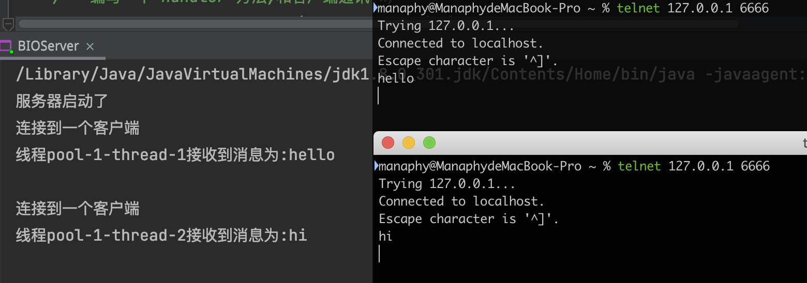
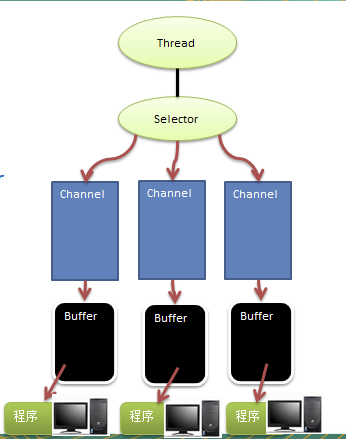
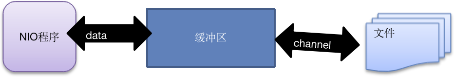
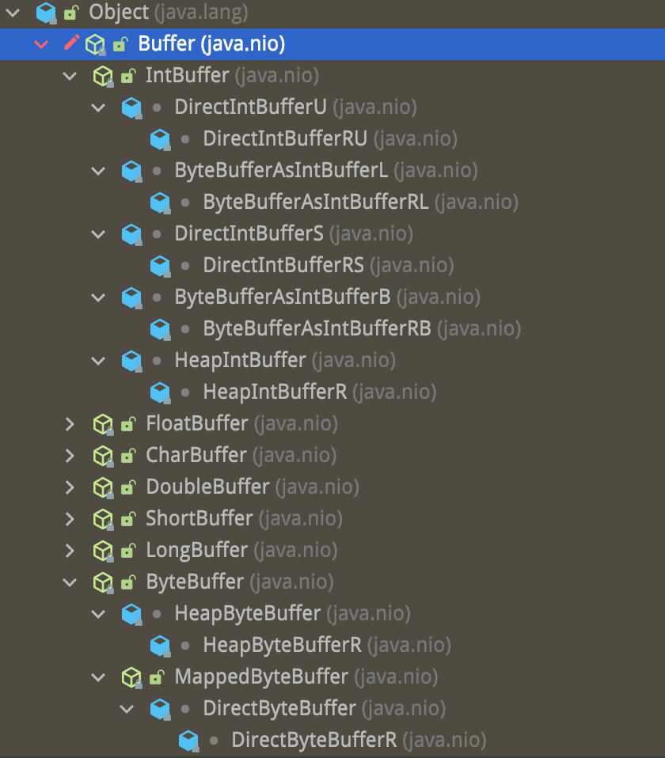
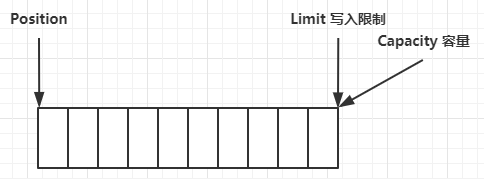
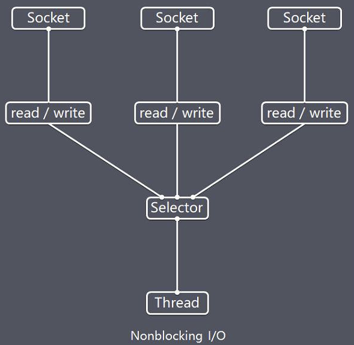
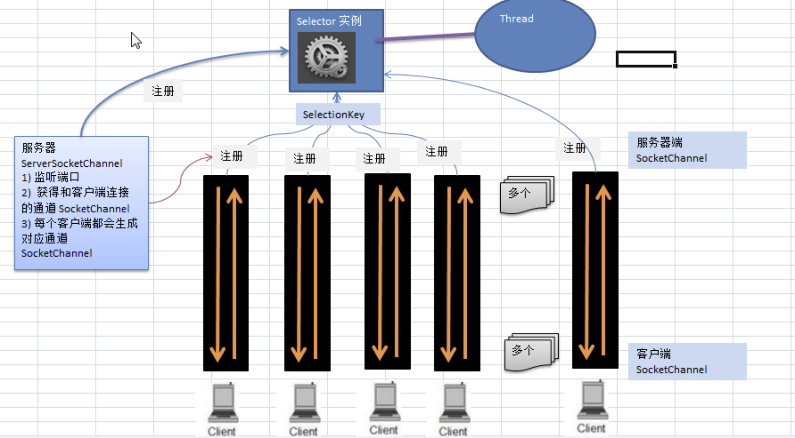
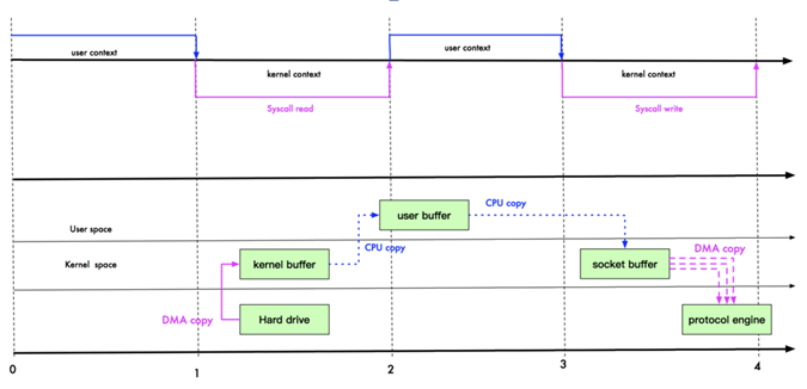
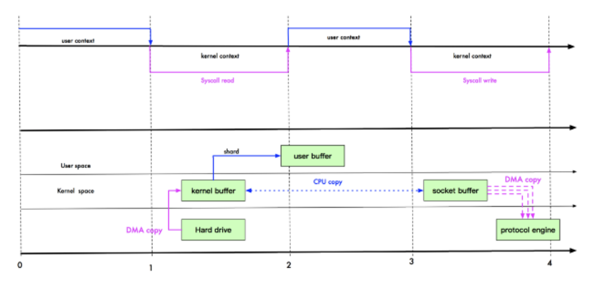
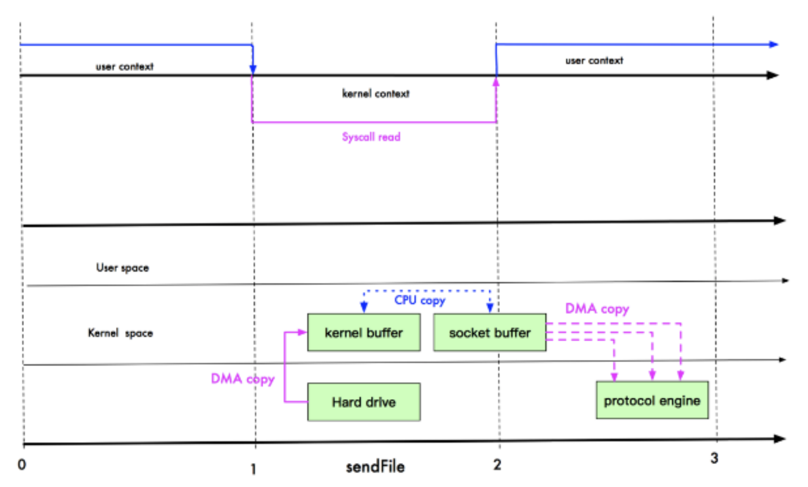

# 第 1 章 Netty 介绍和应用场景
## 1.1 Netty的介绍

1. Netty 是由 JBOSS 提供的一个 Java 开源框架，现为 Github上的独立项目。
2. Netty 是一个异步的、基于事件驱动的网络应用框架，用以快速开发高性能、高可靠性的网络 IO 程序。
3. Netty主要针对在TCP协议下，面向Clients端的高并发应用，或者Peer-to-Peer场景下的大量数据持续传输的应用。
4. Netty本质是一个NIO框架，适用于服务器通讯相关的多种应用场景
## 1.2 Netty的应用场景
### 1.2.1 互联网行业
互联网行业：在分布式系统中，各个节点之间需要远程服务调用，高性能的 RPC 框架必不可少，Netty 作为异步高性能的通信框架，往往作为基础通信组件被这些 RPC 框架使用。

典型的应用有：阿里分布式服务框架 Dubbo 的 RPC 框架使用 Dubbo 协议进行节点间通信，Dubbo 协议默认使用 Netty 作为基础通信组件，用于实现各进程节点之间的内部通信
### 1.2.2 游戏行业
无论是手游服务端还是大型的网络游戏，Java 语言得到了越来越广泛的应用

Netty 作为高性能的基础通信组件，提供了 TCP/UDP 和 HTTP 协议栈，方便定制和开发私有协议栈，账号登录服务器

地图服务器之间可以方便的通过 Netty 进行高性能的通信
### 1.2.3 大数据领域
经典的 Hadoop 的高性能通信和序列化组件 Avro 的 RPC 框架，默认采用 Netty 进行跨界点通信

它的 Netty Service 基于 Netty 框架二次封装实现。
### 1.2.4 其它开源项目使用到Netty
[https://netty.io/wiki/related-projects.html](https://netty.io/wiki/related-projects.html) 
# 第 2 章 Java BIO 编程
## 2.1 I/O 模型
### 2.1.1 I/O 模型基本说明

1. I/O 模型简单的理解：就是用什么样的通道进行数据的发送和接收，很大程度上决定了程序通信的性能
2. Java共支持3种网络编程模型/IO模式：BIO、NIO、AIO
3. Java BIO ： 同步并阻塞(传统阻塞型)，服务器实现模式为一个连接一个线程，即客户端有连接请求时服务器端就需要启动一个线程进行处理，如果这个连接不做任何事情会造成不必要的线程开销
4. Java NIO ： 同步非阻塞，服务器实现模式为一个线程处理多个请求(连接)，即客户端发送的连接请求都会注册到多路复用器上，多路复用器轮询到连接有I/O请求就进行处理
5. Java AIO(NIO.2) ： 异步非阻塞，AIO 引入异步通道的概念，采用了 Proactor 模式，简化了程序编写，有效的请求才启动线程，它的特点是先由操作系统完成后才通知服务端程序启动线程去处理，一般适用于连接数较多且连接时间较长的应用
### 2.1.2 BIO、NIO、AIO适用场景分析

1. BIO方式适用于连接数目比较小且固定的架构，这种方式对服务器资源要求比较高，并发局限于应用中，JDK1.4以前的唯一选择，但程序简单易理解。
2. NIO方式适用于连接数目多且连接比较短（轻操作）的架构，比如聊天服务器，弹幕系统，服务器间通讯等。编程比较复杂，JDK1.4开始支持。
3. AIO方式使用于连接数目多且连接比较长（重操作）的架构，比如相册服务器，充分调用OS参与并发操作，编程比较复杂，JDK7开始支持。
## 2.2 Java BIO 基本介绍

1. Java BIO 就是传统的java io 编程，其相关的类和接口在 java.io 
2. BIO(blocking I/O) ： 同步阻塞，服务器实现模式为一个连接一个线程，即客户端有连接请求时服务器端就需要启动一个线程进行处理，如果这个连接不做任何事情会造成不必要的线程开销，可以通过线程池机制改善(实现多个客户连接服务器)。 
3. BIO方式适用于连接数目比较小且固定的架构，这种方式对服务器资源要求比较高，并发局限于应用中，JDK1.4以前的唯一选择，程序简单易理解
## 2.3 Java BIO 工作机制
**BIO编程简单流程**

1. 服务器端启动一个ServerSocket
2. 客户端启动Socket对服务器进行通信，默认情况下服务器端需要对每个客户建立一个线程与之通讯
3. 客户端发出请求后, 先咨询服务器是否有线程响应，如果没有则会等待，或者被拒绝
4. 如果有响应，客户端线程会等待请求结束后，在继续执行
## 2.4 Java BIO 应用实例
**实例说明**

1. 使用BIO模型编写一个服务器端，监听6666端口，当有客户端连接时，就启动一个线程与之通讯。
2. 要求使用线程池机制改善，可以连接多个客户端。
3. 服务器端可以接收客户端发送的数据(telnet 方式即可)。
```java
public class BIOServer {
    public static void main(String[] args) throws IOException {
        // 线程池机制
        ExecutorService newCachedThreadPool = Executors.newCachedThreadPool();
        // 创建serverSocket
        ServerSocket serverSocket = new ServerSocket(6666);
        System.out.println("服务器启动了");

        while (true) {
            // 监听,等待客户端连接
            final Socket socket = serverSocket.accept();
            System.out.println("连接到一个客户端");
            // 创建一个线程,与之进行通讯
            newCachedThreadPool.execute(() -> {
                handler(socket);
            });
        }
    }

    /** 编写一个 handler 方法,和客户端通讯 */
    public static void handler(Socket socket) {
        byte[] bytes = new byte[16];
        // 通过 Socket 获取输入流
        try {
            InputStream inputStream = socket.getInputStream();
            // 循环的读取客户端发送的数据
            int read = inputStream.read(bytes);
            while (read != -1) {
                System.out.println("线程" + Thread.currentThread().getName() + "接收到消息为:" + new String(bytes, 0, read));
                // 当没有消息时,线程会阻塞在此处
                read = inputStream.read(bytes);
            }


        } catch (IOException e) {
            e.printStackTrace();
        } finally {
            System.out.println("关闭和 client 的连接");
            try {
                socket.close();
            } catch (IOException e) {
                e.printStackTrace();
            }
        }

    }
}
```

## 2.5 Java BIO 问题分析

1. 每个请求都需要创建独立的线程，与对应的客户端进行数据 Read，业务处理，数据 Write 。
2. 当并发数较大时，需要创建大量线程来处理连接，系统资源占用较大。
3. 连接建立后，如果当前线程暂时没有数据可读，则线程就阻塞在 Read 操作上，造成线程资源浪费。
# 第 3 章 Java NIO 编程
## 3.1 Java NIO 基本介绍

1. Java NIO 全称 java non-blocking IO，是指 JDK 提供的新 API。从 JDK1.4 开始，Java 提供了一系列改进的输入/输出的新特性，被统称为 NIO(即 New IO)，是同步非阻塞的NIO 
2. 相关类都被放在 java.nio 包及子包下，并且对原 java.io 包中的很多类进行改写。
3. NIO 有三大核心部分：Channel(通道)，Buffer(缓冲区), Selector(选择器) 
4. NIO是面向缓冲区，或者面向块编程的。数据读取到一个它稍后处理的缓冲区，需要时可在缓冲区中前后移动，这就增加了处理过程中的灵活性，使用它可以提供**非阻塞式**的高伸缩性网络
5. Java NIO的非阻塞模式，使一个线程从某通道发送请求或者读取数据，但是它仅能得到目前可用的数据，如果目前没有数据可用时，就什么都不会获取，而不是保持线程阻塞，所以直至数据变的可以读取之前，该线程可以继续做其他的事情。 非阻塞写也是如此，一个线程请求写入一些数据到某通道，但不需要等待它完全写入，这个线程同时可以去做别的事情。
6. 通俗理解：NIO是可以做到用一个线程来处理多个操作的。假设有10000个请求过来,根据实际情况，可以分配50或者100个线程来处理。不像之前的阻塞IO那样，非得分配10000个。
7. HTTP2.0使用了多路复用的技术，做到同一个连接并发处理多个请求，而且并发请求的数量比HTTP1.1大了好几个数量级。
## 3.2 NIO 和 BIO 的比较

1. BIO 以流的方式处理数据,而 NIO 以块的方式处理数据,块 I/O 的效率比流 I/O 高很多
2. BIO 是阻塞的，NIO 则是非阻塞的
3. BIO基于字节流和字符流进行操作，而 NIO 基于 Channel(通道)和 Buffer(缓冲区)进行操作，数据总是从通道读取到缓冲区中，或者从缓冲区写入到通道中。Selector(选择器)用于监听多个通道的事件（比如：连接请求，数据到达等），因此使用单个线程就可以监听多个客户端通道 
## 3.3 NIO 三大核心原理


1. 每个channel 都会对应一个Buffer
2. Selector 对应一个线程， 一个线程对应多个channel(连接)
3. 该图反应了有三个channel 注册到 该selector
4. 程序切换到哪个channel 是有事件决定的, Event 就是一个重要的概念
5. Selector 会根据不同的事件，在各个通道上切换
6. Buffer 就是一个内存块，底层是有一个数组
7. 数据的读取写入是通过Buffer, 这个和BIO , BIO 中要么是输入流，或者是输出流, 不能双向，但是NIO的Buffer 是可以读也可以写, 需要 flip 方法切换
8. channel 是双向的, 可以返回底层操作系统的情况，比如Linux，底层的操作系统通道就是双向的
## 3.4 缓冲区(Buffer)
### 3.4.1 基本介绍
缓冲区（**Buffer**）：缓冲区本质上是一个可以读写数据的内存块，可以理解成是一个容器对象(含数组)，该对象提供了一组方法，可以更轻松地使用内存块，缓冲区对象内置了一些机制，能够跟踪和记录缓冲区的状态变化情况。Channel 提供从文件、网络读取数据的渠道，但是读取或写入的数据都必须经由 Buffer，如图: 


### 3.4.2 Buffer 类及其子类

1. 在 NIO 中，Buffer 是一个顶层父类，它是一个抽象类, 如下图:



2. Buffer类定义了所有的缓冲区都具有的四个属性来提供关于其所包含的数据元素的信息:
```java
// Invariants: mark <= position <= limit <= capacity
private int mark = -1;// 标记(一般不用管，每 flip 一次 mark=-1,就失效了)
private int position = 0;// 位置，下一个要被读或写的元素的索引，每次读写缓冲区数据时都会改变改值，为下次读写作准备
private int limit;// 表示缓冲区的当前终点，不能对缓冲区超过极限的位置进行读写操作。且极限是可以修改的
private int capacity;// 容量，即可以容纳的最大数据量；在缓冲区创建时被设定并且不能改变
```
```java
public abstract class Buffer {
    //JDK1.4时，引入的api
    public final int capacity();//返回此缓冲区的容量
    public final int position();//返回此缓冲区的位置
    public final Buffer position (int newPositio);//设置此缓冲区的位置
    public final int limit();//返回此缓冲区的限制
    public final Buffer limit (int newLimit);//设置此缓冲区的限制
    public final Buffer mark();//在此缓冲区的位置设置标记
    public final Buffer reset();//将此缓冲区的位置重置为以前标记的位置
    public final Buffer clear();//清除此缓冲区, 即将各个标记恢复到初始状态，但是数据并没有真正擦除, 后面操作会覆盖
    public final Buffer flip();//反转此缓冲区
    public final Buffer rewind();//将 position 重新置为 0
    public final int remaining();//返回当前位置与限制之间的元素数
    public final boolean hasRemaining();//告知在当前位置和限制之间是否有元素
    public abstract boolean isReadOnly();//告知此缓冲区是否为只读缓冲区
 
    //JDK1.6时引入的api
    public abstract boolean hasArray();//告知此缓冲区是否具有可访问的底层实现数组
    public abstract Object array();//返回此缓冲区的底层实现数组
    public abstract int arrayOffset();//返回此缓冲区的底层实现数组中第一个缓冲区元素的偏移量
    public abstract boolean isDirect();//告知此缓冲区是否为直接缓冲区
}

```
```java
public class BasicBuffer {
    public static void main(String[] args) {
        // 创建一个 buffer,并分配5个空间,即可以存放5个int
        IntBuffer intBuffer = IntBuffer.allocate(5);
        // 向 buffer 存放数据
        // intBuffer.put(1);
        // intBuffer.put(2);
        // intBuffer.put(3);
        // intBuffer.put(4);
        // intBuffer.put(5);
        // intBuffer.put(6); 会报 BufferOverflowException
        for (int i = 0; i < intBuffer.capacity(); i++) {
            intBuffer.put(i);
        }
        // 将 buffer 转换,读写切换
        intBuffer.flip();
        intBuffer.position(1);
        intBuffer.limit(3);// 将会读取 1 2 号位置数据
        while (intBuffer.hasRemaining()) {
            // 从 buffer 中读取数据
            System.out.println(intBuffer.get());
        }
    }
}
```
### 3.4.3 ByteBuffer
从前面可以看出对于 Java 中的基本数据类型(boolean除外)，都有一个 Buffer 类型与之相对应，最常用的自然是ByteBuffer 类(二进制数据)
```java
public abstract class ByteBuffer {
    //缓冲区创建相关api
    public static ByteBuffer allocateDirect(int capacity);//创建直接缓冲区
    public static ByteBuffer allocate(int capacity);//设置缓冲区的初始容量
    public static ByteBuffer wrap(byte[] array);//把一个数组放到缓冲区中使用
    //构造初始化位置offset和上界length的缓冲区
    public static ByteBuffer wrap(byte[] array,int offset, int length);
     //缓存区存取相关API
    public abstract byte get();//从当前位置position上get，get之后，position会自动+1
    public abstract byte get(int index);//从绝对位置get
    public abstract ByteBuffer put (byte b);//从当前位置上添加，put之后，position会自动+1
    public abstract ByteBuffer put (int index, byte b);//从绝对位置上put
 }
```
```java
ByteBuffer buffer1 = StandardCharsets.UTF_8.encode("你好");
ByteBuffer buffer2 = Charset.forName("utf-8").encode("你好");

debug(buffer1);
debug(buffer2);

CharBuffer buffer3 = StandardCharsets.UTF_8.decode(buffer1);
System.out.println(buffer3.getClass());
System.out.println(buffer3.toString());
```
### 3.4.4 ByteBuffer 结构
ByteBuffer 有以下重要属性

- capacity
- position
- limit

一开始


### 3.4.5 黏包与半包
网络上有多条数据发送给服务端，数据之间使用 \n 进行分隔

但由于某种原因这些数据在接收时，被进行了重新组合，例如原始数据有3条为

- Hello,world\n
- I'm zhangsan\n
- How are you?\n

变成了下面的两个 byteBuffer (黏包，半包)

- Hello,world\nI'm zhangsan\nHo
- w are you?\n

将错乱的数据恢复成原始的按 \n 分隔的数据
```java
/** 黏包与半包 */
@Test
public void dealBagTest() {
    ByteBuffer source = ByteBuffer.allocate(32);
    source.put("Hello,world\nI'm zhangsan\nHo".getBytes(StandardCharsets.UTF_8));
    split(source);
    source.put("w are you?\n".getBytes(StandardCharsets.UTF_8));
    split(source);
}

private static void split(ByteBuffer source) {
    source.flip();
    int oldLimit = source.limit();
    for (int i = 0; i < oldLimit; i++) {
        if (source.get(i) == '\n') {
            ByteBuffer target = ByteBuffer.allocate(i + 1 - source.position());
            // 0 ~ limit
            source.limit(i + 1);
            target.put(source);// 从source 读，向 target 写
            ByteBufferUtil.debugAll(target);
            source.limit(oldLimit);
        }
    }
    source.compact();
}
```
### 3.4.6 Scattering 和 Gathering
```java
/**
 * Scattering:读取数据时,可以将数据填充至多个 buffer
 */
@Test
public void scatteringTest() {
    // 3.txt 内容为`onetwothree`
    try (RandomAccessFile file = new RandomAccessFile("/Users/manaphy/Documents/nio/3.txt", "rw")) {
        FileChannel channel = file.getChannel();
        ByteBuffer a = ByteBuffer.allocate(3);
        ByteBuffer b = ByteBuffer.allocate(3);
        ByteBuffer c = ByteBuffer.allocate(5);
        channel.read(new ByteBuffer[]{a, b, c});
        a.flip();
        b.flip();
        c.flip();
        ByteBufferUtil.debugAll(a);
        ByteBufferUtil.debugAll(b);
        ByteBufferUtil.debugAll(c);
    } catch (IOException e) {
        e.printStackTrace();
    }
}

/** Gathering: 从 buffer 读取数据时,可以采用 buffer 数组依次读 */
@Test
public void gatheringTest() {
    try (RandomAccessFile file = new RandomAccessFile("/Users/manaphy/Documents/nio/4.txt", "rw")) {
        FileChannel channel = file.getChannel();
        ByteBuffer d = StandardCharsets.UTF_8.encode("four");
        ByteBuffer e = StandardCharsets.UTF_8.encode("five");
        channel.write(new ByteBuffer[]{d, e});
    } catch (IOException e) {
        e.printStackTrace();
    }
}
```
## 3.5 通道(Channel)
### 3.5.1 基本介绍

1. NIO的通道类似于流，但有些区别如下：
   - 通道可以同时进行读写，而流只能读或者只能写
   - 通道可以实现异步读写数据
   - 通道可以从缓冲读数据，也可以写数据到缓冲
2. BIO 中的 stream 是单向的，例如 FileInputStream 对象只能进行读取数据的操作，而 NIO 中的通道(Channel)是双向的，可以读操作，也可以写操作。
3. Channel在NIO中是一个接口`public interface Channel extends Closeable{}`
4. 常用的 Channel 类有：FileChannel、DatagramChannel、ServerSocketChannel 和 SocketChannel。【ServerSocketChanne 类似 ServerSocket , SocketChannel 类似 Socket】
5. FileChannel 用于文件的数据读写，DatagramChannel 用于 UDP 的数据读写，ServerSocketChannel 和 SocketChannel 用于 TCP 的数据读写
### 3.5.2 FileChannel 类
FileChannel主要用来对本地文件进行 IO 操作。
```java
// 从通道读取数据并放到缓冲区中
public int read(ByteBuffer dst);
// 把缓冲区的数据写到通道中
public int write(ByteBuffer src);
// 从目标通道中复制数据到当前通道
public long transferFrom(ReadableByteChannel src, long position, long count);
// 把数据从当前通道复制给目标通道
public long transferTo(long position, long count, WritableByteChannel target);
```
### 3.5.3 应用实例1-本地文件写数据
```java
@Test
public void fileChannelWriteTest() throws IOException {
    String str = "天安门";
    FileOutputStream fos = new FileOutputStream("/Users/manaphy/Desktop/nio/1.txt");
    // 通过 FileOutputStream 获取对应的 FileChannel
    // 这个 FileChannel 真实类型是 FileChannelImpl
    FileChannel fileChannel = fos.getChannel();
    // 创建一个缓冲区 ByteBuffer
    ByteBuffer byteBuffer = ByteBuffer.allocate(1024);
    // 将 str 放入 byteBuffer
    byteBuffer.put(str.getBytes());
    // 对 byteBuffer 进行 flip
    byteBuffer.flip();
    // 将 byteBuffer 数据写入到 FileChannel
    fileChannel.write(byteBuffer);
    fos.close();
}
```
### 3.5.4 应用实例2-本地文件读数据
```java
@Test
public void fileChannelReadTest() throws IOException {
    // 创建文件输入流
    File file = new File("/Users/manaphy/Desktop/nio/1.txt");
    FileInputStream fis = new FileInputStream(file);
    // 通过 FileInputStream 获取对应的 FileChannel
    FileChannel fileChannel = fis.getChannel();
    // 创建缓冲区
    ByteBuffer byteBuffer = ByteBuffer.allocate(Math.toIntExact(file.length()));
    // 将通道的数据读入到 Buffer
    fileChannel.read(byteBuffer);
    // 将 ByteBuffer 的字节转成字符串
    System.out.println(new String(byteBuffer.array()));
    fis.close();
}
```
### 3.5.5 应用实例3-使用一个Buffer完成文件读取、写入

```java
@Test
public void fileChannelCopyFileTest() throws IOException {
    FileInputStream fis = new FileInputStream("/Users/manaphy/Desktop/nio/1.txt");
    FileChannel fisChannel = fis.getChannel();
    FileOutputStream fos = new FileOutputStream("/Users/manaphy/Desktop/nio/2.txt");
    FileChannel fosChannel = fos.getChannel();
    ByteBuffer byteBuffer = ByteBuffer.allocate(32);
    while (true) {// 循环读取
        /*public final Buffer clear() {
            position = 0;
            limit = capacity;
            mark = -1;
            return this;
        }*/
        byteBuffer.clear();// 清空 buffer,使 position-->0
        int read = fisChannel.read(byteBuffer);// position-->读取的长度
        if (read == -1) {
            break;
        }
        byteBuffer.flip();// position-->0
        fosChannel.write(byteBuffer);// position-->写入的长度
    }
    fos.close();
    fis.close();
}
```
### 3.5.6 应用实例4-拷贝文件transferFrom/transferTo 方法
```java
@Test
public void fileChannelCopyImageTest() throws IOException {
    // 创建相关流
    FileInputStream fis = new FileInputStream("/Users/manaphy/Downloads/1.png");
    FileOutputStream fos = new FileOutputStream("/Users/manaphy/Downloads/2.png");
    // 获取各个流对应的 fileChannel
    FileChannel source = fis.getChannel();
    FileChannel dest = fos.getChannel();
    // 使用 transferFrom 完成复制
    // dest.transferFrom(source, 0, source.size());
    // 或者使用 transferTo 完成复制
    source.transferTo(0, source.size(), dest);
    // 关闭相关流和通道
    source.close();
    dest.close();
    fis.close();
    fos.close();
}
```
### 3.5.7 关于Buffer 和 Channel的注意事项和细节

1. ByteBuffer 支持类型化的put 和 get, put 放入的是什么数据类型，get就应该使用相应的数据类型来取出，否则可能有 BufferUnderflowException 异常。
```java
@Test
public void bufferTypeTest() {
    ByteBuffer byteBuffer = ByteBuffer.allocate(64);
    byteBuffer.putInt(1);
    byteBuffer.putLong(100);
    byteBuffer.putDouble(1.2);
    byteBuffer.putChar('陈');

    byteBuffer.flip();
    System.out.println(byteBuffer.getInt());
    System.out.println(byteBuffer.getLong());
    System.out.println(byteBuffer.getDouble());
    System.out.println(byteBuffer.getChar());
}
```

2. 可以将一个普通Buffer 转成只读Buffer。
```java
@Test
public void readOnlyBufferTest() {
    ByteBuffer buffer = ByteBuffer.allocate(64);
    for (int i = 0; i < buffer.capacity(); i++) {
        buffer.put((byte) i);
    }
    buffer.flip();
    // 得到一个只读的 buffer,该 buffer 实际类型为 HeapByteBufferR
    ByteBuffer readOnlyBuffer = buffer.asReadOnlyBuffer();
    System.out.println(readOnlyBuffer.getClass());// class java.nio.HeapByteBufferR
    // 读取
    while (readOnlyBuffer.hasRemaining()) {
        System.out.println(readOnlyBuffer.get());
    }
    // readOnlyBuffer.put(1, (byte) 64);// 抛出 ReadOnlyBufferException
}
```

3. NIO 还提供了 MappedByteBuffer， 可以让文件直接在内存（堆外的内存）中进行修改， 而如何同步到文件由NIO 来完成。
```java
@Test
public void mappedByteBufferTest() throws IOException {
    RandomAccessFile randomAccessFile = new RandomAccessFile("/Users/manaphy/Desktop/nio/1.txt", "rw");
    // 获取对应的文件通道
    FileChannel channel = randomAccessFile.getChannel();
    /*
    参数解析
    mode: 使用读写模式
    position: 可以直接修改的起始位置
    size: 映射到内存的大小,即从起始位置开始能修改的字节数
    MappedByteBuffer 的实际类型是 DirectByteBuffer
     */
    MappedByteBuffer mappedByteBuffer = channel.map(FileChannel.MapMode.READ_WRITE, 0, 5);
    mappedByteBuffer.put("我".getBytes(), 0, 3);// 文件的第一个字被修改成`我`
    randomAccessFile.close();
}
```
## 3.6 Selector(选择器) 
### 3.6.1 基本介绍

1. Java 的 NIO，用非阻塞的 IO 方式。可以用一个线程，处理多个的客户端连接，就会使用到Selector(选择器)
2. Selector 能够检测多个注册的通道上是否有事件发生(注意:多个Channel以事件的方式可以注册到同一个Selector)，如果有事件发生，便获取事件然后针对每个事件进行相应的处理。这样就可以只用一个单线程去管理多个通道，也就是管理多个连接和请求。
3. 只有在 连接/通道 真正有读写事件发生时，才会进行读写，就大大地减少了系统开销，并且不必为每个连接都创建一个线程，不用去维护多个线程
4. 避免了多线程之间的上下文切换导致的开销
### 3.6.2 Selector特点说明


**说明：**

1. Netty 的 IO 线程 NioEventLoop 聚合了 Selector(选择器，也叫多路复用器)，可以同时并发处理成百上千个客户端连接。
2. 当线程从某客户端 Socket 通道进行读写数据时，若没有数据可用时，该线程可以进行其他任务。
3. 线程通常将非阻塞 IO 的空闲时间用于在其他通道上执行 IO 操作，所以单独的线程可以管理多个输入和输出通道。
4. 由于读写操作都是非阻塞的，这就可以充分提升 IO 线程的运行效率，避免由于频繁 I/O 阻塞导致的线程挂起。
5. 一个 I/O 线程可以并发处理 N 个客户端连接和读写操作，这从根本上解决了传统同步阻塞 I/O 一连接一线程模型，架构的性能、弹性伸缩能力和可靠性都得到了极大的提升。
### 3.6.3 Selector类相关方法
```java
public abstract class Selector implements Closeable { 
    public static Selector open();//得到一个选择器对象
    public int select(long timeout);//监控所有注册的通道，当其中有 IO 操作可以进行时，将对应的 SelectionKey 加入到内部集合中并返回，参数用来设置超时时间
    public Set<SelectionKey> selectedKeys();//从内部集合中得到所有的 SelectionKey	
}
```
### 3.6.4 注意事项

1. NIO中的 ServerSocketChannel功能类似ServerSocket，SocketChannel功能类似Socket
2. selector 相关方法说明
   - selector.select()//阻塞
   - selector.select(1000);//阻塞1000毫秒，在1000毫秒后返回
   - selector.wakeup();//唤醒selector
   - selector.selectNow();//不阻塞，立马返还
## 3.7 NIO 非阻塞网络编程原理分析


1. 当客户端连接时，会通过ServerSocketChannel 得到 SocketChannel
2. Selector 进行监听  select 方法，返回有事件发生的通道的个数
3. 将socketChannel注册到Selector上, `register(Selector sel, int ops)`, 一个selector上可以注册多个SocketChannel
4. 注册后返回一个 SelectionKey，会和该 Selector 关联(集合)
5. 进一步得到各个 SelectionKey (有事件发生)
6. 在通过 SelectionKey  反向获取 SocketChannel，方法`channel()`可以通过得到的 channel, 完成业务
## 3.8 NIO 非阻塞 网络编程快速入门
```java
public class NIOServer {
    public static void main(String[] args) throws IOException {
        ServerSocketChannel serverSocketChannel = ServerSocketChannel.open();
        Selector selector = Selector.open();
        serverSocketChannel.socket().bind(new InetSocketAddress(6666));
        serverSocketChannel.configureBlocking(false);
        // 把 serverSocketChannel 注册到 selector 关心事件为 OP_ACCEPT
        serverSocketChannel.register(selector, SelectionKey.OP_ACCEPT);
        // 循环等待客户端连接
        while (true) {
            // 这里等待1秒,如果没有事件发生,就返回
            if (selector.select(1000) == 0) {// 没有事件发生
                // System.out.println("服务器等待了1秒,无连接");
                continue;
            }
            // 如果返回的>0,就获取到相关的 selectKey 集合
            // 1.如果返回的>0,表示已经获取到关注的事件
            Set<SelectionKey> selectionKeys = selector.selectedKeys();
            Iterator<SelectionKey> keyIterator = selectionKeys.iterator();
            while (keyIterator.hasNext()) {
                SelectionKey key = keyIterator.next();
                // 根据 key 对应的通道发生的事件做响应的处理
                if (key.isAcceptable()) {// 如果是 OP_ACCEPT,有新的客户端连接
                    // 该客户端生成一个 SocketChannel
                    SocketChannel socketChannel = serverSocketChannel.accept();
                    System.out.println("客户端连接成功,生成了一个 socketChannel " + socketChannel.hashCode());
                    // 将 socketChannel 设置为非阻塞
                    socketChannel.configureBlocking(false);
                    // 将当前的 socketChannel 注册到 selector,关注事件为 OP_READ,同时给 socketChannel 关联一个 Buffer
                    socketChannel.register(selector, SelectionKey.OP_READ, ByteBuffer.allocate(1024));
                } else if (key.isReadable()) {// 发生 OP_READ
                    // 通过 key 反向获取到对应 channel
                    SocketChannel channel = (SocketChannel) key.channel();
                    // 获取到该 channel 关联的 buffer
                    ByteBuffer buffer = (ByteBuffer) key.attachment();
                    int read = channel.read(buffer);
                    System.out.println("从客户端接收消息:" + new String(buffer.array(), 0, read));
                }
                // 手动从集合中移动当前的 selectionKey,防止重复操作
                keyIterator.remove();
            }
        }
    }
}
```
```java
public class NIOClient {
    public static void main(String[] args) throws IOException {
        SocketChannel socketChannel = SocketChannel.open();
        socketChannel.configureBlocking(false);
        // 提供服务器端的 ip 和 port
        InetSocketAddress inetSocketAddress = new InetSocketAddress("127.0.0.1", 6666);
        // 连接服务器
        if (!socketChannel.connect(inetSocketAddress)) {
            while (!socketChannel.finishConnect()) {
                System.out.println("因为连接需要时间,客户端不会阻塞,可以做其他工作...");
            }
        }
        // 如果连接成功,就发送数据
        String str = "你好世界~";
        ByteBuffer buffer = ByteBuffer.wrap(str.getBytes());
        socketChannel.write(buffer);
        System.in.read();
    }
}
```
## 3.9 SelectionKey
> 表示 Selector 和网络通道的注册关系，共四种

```java
public static final int OP_READ = 1 << 0;// 代表读操作
public static final int OP_WRITE = 1 << 2;// 代表写操作
public static final int OP_CONNECT = 1 << 3;// 代表连接已经建立
public static final int OP_ACCEPT = 1 << 4;// 有新的网络连接可以 accept
```
```java
public abstract class SelectionKey {
	public abstract Selector selector();//得到与之关联的 Selector 对象
	public abstract SelectableChannel channel();//得到与之关联的通道
	public final Object attachment();//得到与之关联的共享数据
	public abstract SelectionKey interestOps(int ops);//设置或改变监听事件
	public final boolean isAcceptable();//是否可以 accept
	public final boolean isReadable();//是否可以读
	public final boolean isWritable();//是否可以写
}
```
## 3.10 ServerSocketChannel
> ServerSocketChannel 在服务器端监听新的客户端 Socket 连接

```java
public abstract class ServerSocketChannel extends AbstractSelectableChannel implements NetworkChannel {
    public static ServerSocketChannel open();// 得到一个 ServerSocketChannel 通道
    public final ServerSocketChannel bind(SocketAddress local);// 设置服务器端端口号
    public final SelectableChannel configureBlocking(boolean block);// 设置阻塞或非阻塞模式，取值 false 表示采用非阻塞模式
    public SocketChannel accept();// 接受一个连接，返回代表这个连接的通道对象
    public final SelectionKey register(Selector sel, int ops);// 注册一个选择器并设置监听事件
}
```
## 3.11 SocketChannel
> SocketChannel，网络 IO 通道，具体负责进行读写操作。NIO 把缓冲区的数据写入通道，或者把通道里的数据读到缓冲区。

```java
public abstract class SocketChannel extends AbstractSelectableChannel implements ByteChannel, ScatteringByteChannel, GatheringByteChannel, NetworkChannel{
    public static SocketChannel open();//得到一个 SocketChannel 通道
    public final SelectableChannel configureBlocking(boolean block);//设置阻塞或非阻塞模式，取值 false 表示采用非阻塞模式
    public boolean connect(SocketAddress remote);//连接服务器
    public boolean finishConnect();//如果上面的方法连接失败，接下来就要通过该方法完成连接操作
    public int write(ByteBuffer src);//往通道里写数据
    public int read(ByteBuffer dst);//从通道里读数据
    public final SelectionKey register(Selector sel, int ops, Object att);//注册一个选择器并设置监听事件，最后一个参数可以设置共享数据
    public final void close();//关闭通道
}

```
## 3.12 NIO 网络编程应用实例-群聊系统
```java
public class GroupChatServer {
    public static void main(String[] args) {
        GroupChatServer groupChatServer = new GroupChatServer();
        groupChatServer.listen();
    }

    private Selector selector;
    private ServerSocketChannel listenChannel;
    private static final int PORT = 6667;

    public GroupChatServer() {
        try {
            selector = Selector.open();
            listenChannel = ServerSocketChannel.open();
            listenChannel.socket().bind(new InetSocketAddress(PORT));
            listenChannel.configureBlocking(false);
            listenChannel.register(selector, SelectionKey.OP_ACCEPT);

        } catch (IOException e) {
            e.printStackTrace();
        }
    }

    /** 监听 */
    public void listen() {
        try {
            while (true) {
                int count = selector.select();
                if (count > 0) {// 有事件要处理
                    Iterator<SelectionKey> iterator = selector.selectedKeys().iterator();
                    while (iterator.hasNext()) {
                        SelectionKey key = iterator.next();
                        iterator.remove();
                        if (key.isAcceptable()) {
                            SocketChannel sc = listenChannel.accept();
                            sc.configureBlocking(false);
                            sc.register(selector, SelectionKey.OP_READ);
                            System.out.println(sc.getRemoteAddress() + "上线了");
                        }
                        if (key.isReadable()) {
                            readMsg(key);
                        }
                    }
                }
            }
        } catch (IOException e) {
            e.printStackTrace();
        }
    }

    /** 读取客户端消息 */
    private void readMsg(SelectionKey key) {
        SocketChannel channel = null;
        try {
            channel = (SocketChannel) key.channel();
            ByteBuffer buffer = ByteBuffer.allocate(1024);
            int count = channel.read(buffer);
            if (count > 0) {
                String msg = new String(buffer.array(), 0, count);
                System.out.println("客户端消息:" + msg);
                // 向其他的客户端转发消息
                sendMsgToOtherClients(msg, channel);
            }

        } catch (IOException e) {
            try {
                System.out.println(channel.getRemoteAddress() + " 离线了");
                key.channel();// 取消注册
                channel.close();// 关闭通道
            } catch (IOException ex) {
                ex.printStackTrace();
            }
        }
    }

    /** 转发消息给其他客户(通道) */
    private void sendMsgToOtherClients(String msg, SocketChannel self) throws IOException {
        System.out.println("服务器转发消息中...");
        // 遍历所有注册到 selector 上的 SocketChannel,并排除 self
        for (SelectionKey key : selector.keys()) {
            // 通过 key 取出对应的 SocketChannel
            Channel targetChannel = key.channel();
            // 排除自己
            if (targetChannel instanceof SocketChannel && targetChannel != self) {
                SocketChannel dest = (SocketChannel) targetChannel;
                // 将 msg 存储到 buffer
                ByteBuffer buffer = ByteBuffer.wrap(msg.getBytes());
                // 将 buffer 写入通道
                dest.write(buffer);
            }
        }

    }
}
```
```java
public class GroupChatClient {
    public static void main(String[] args) throws IOException {
        GroupChatClient chatClient = new GroupChatClient();
        // 启动一个线程,每隔3秒读取从服务器发送的数据
        new Thread(() -> {
            while (true) {
                chatClient.readMsg();
                try {
                    TimeUnit.SECONDS.sleep(3);
                } catch (InterruptedException e) {
                    e.printStackTrace();
                }
            }
        }).start();

        // 发送数据给服务端
        Scanner scanner = new Scanner(System.in);
        while (scanner.hasNextLine()) {
            String msg = scanner.nextLine();
            chatClient.sendMsg(msg);
        }
    }


    public static final String HOST = "127.0.0.1";
    public static final int PORT = 6667;
    private final Selector selector;
    private final SocketChannel socketChannel;
    private final String username;

    public GroupChatClient() throws IOException {
        selector = Selector.open();
        socketChannel = SocketChannel.open(new InetSocketAddress(HOST, PORT));
        socketChannel.configureBlocking(false);
        socketChannel.register(selector, SelectionKey.OP_READ);
        username = socketChannel.getLocalAddress().toString().substring(1);
        System.out.println(username + " is ok");
    }

    /** 向服务器发送消息 */
    public void sendMsg(String msg) {
        msg = username + " 说: " + msg;
        try {
            socketChannel.write(ByteBuffer.wrap(msg.getBytes()));
        } catch (IOException e) {
            e.printStackTrace();
        }
    }

    /** 读取从服务器端发送的消息 */
    public void readMsg() {
        try {
            int readChannels = selector.select();
            if (readChannels > 0) {
                Iterator<SelectionKey> iterator = selector.selectedKeys().iterator();
                while (iterator.hasNext()) {
                    SelectionKey key = iterator.next();
                    iterator.remove();
                    if (key.isReadable()) {
                        SocketChannel sc = (SocketChannel) key.channel();
                        ByteBuffer buffer = ByteBuffer.allocate(1024);
                        int read = sc.read(buffer);
                        System.out.println(new String(buffer.array(), 0, read));
                    }
                }
            }
        } catch (IOException e) {
            e.printStackTrace();
        }
    }
}
```
## 3.13 NIO与零拷贝
### 3.13.1 零拷贝基本介绍

1. 零拷贝是网络编程的关键，很多性能优化都离不开。
2. 在 Java 程序中，常用的零拷贝有 mmap(内存映射) 和 sendFile。
### 3.13.2 传统IO数据读写
```java
File file = new File("test.txt");
RandomAccessFile raf = new RandomAccessFile(file, "rw");

byte[] arr = new byte[(int) file.length()];
raf.read(arr);

Socket socket = new ServerSocket(8080).accept();
socket.getOutputStream().write(arr);
```

### 3.13.3 mmap 优化
mmap 通过内存映射，将文件映射到内核缓冲区，同时，用户空间可以共享内核空间的数据。这样，在进行网络传输时，就可以减少内核空间到用户控件的拷贝次数。如下图


3.13.4 sendFile 优化
Linux 2.1 版本 提供了 sendFile 函数，其基本原理如下：数据根本不经过用户态，直接从内核缓冲区进入到 Socket Buffer，同时，由于和用户态完全无关，就减少了一次上下文切换



**这里其实有 一次cpu 拷贝kernel buffer -> socket buffer但是，拷贝的信息很少，比如lenght , offset , 消耗低，可以忽略**
### 3.13.5  零拷贝的再次理解

1. 我们说零拷贝，是从操作系统的角度来说的。因为内核缓冲区之间，没有数据是重复的（只有 kernel buffer 有一份数据）。
2. 零拷贝不仅仅带来更少的数据复制，还能带来其他的性能优势，例如更少的上下文切换，更少的 CPU 缓存伪共享以及无 CPU 校验和计算。
### 3.13.6 mmap 和 sendFile 的区别

1. mmap 适合小数据量读写，sendFile 适合大文件传输。
2. mmap 需要 4 次上下文切换，3 次数据拷贝；sendFile 需要 3 次上下文切换，最少 2 次数据拷贝。
3. sendFile 可以利用 DMA 方式，减少 CPU 拷贝，mmap 则不能（必须从内核拷贝到 Socket 缓冲区）。
## 3.14 NIO 零拷贝案例
```java
public class OldIOClient {

    public static void main(String[] args) throws Exception {
        Socket socket = new Socket("localhost", 7001);
        String fileName = "/Users/manaphy/Downloads/pkg/ideaIU-2021.2.1.dmg";
        InputStream inputStream = new FileInputStream(fileName);
        DataOutputStream dataOutputStream = new DataOutputStream(socket.getOutputStream());
        byte[] buffer = new byte[4096];
        long readCount;
        long total = 0;

        long startTime = System.currentTimeMillis();

        while ((readCount = inputStream.read(buffer)) >= 0) {
            total += readCount;
            dataOutputStream.write(buffer);
        }
        System.out.println("发送总字节数： " + total + ", 耗时： " + (System.currentTimeMillis() - startTime));
        dataOutputStream.close();
        socket.close();
        inputStream.close();
    }
}

public class OldIOServer {

    public static void main(String[] args) throws Exception {
        ServerSocket serverSocket = new ServerSocket(7001);
        while (true) {
            Socket socket = serverSocket.accept();
            DataInputStream dataInputStream = new DataInputStream(socket.getInputStream());
            try {
                byte[] byteArray = new byte[4096];
                while (true) {
                    int readCount = dataInputStream.read(byteArray, 0, byteArray.length);

                    if (-1 == readCount) {
                        break;
                    }
                }
            } catch (Exception ex) {
                ex.printStackTrace();
            }
        }
    }
}

```
```java
public class NewIOClient {

    public static void main(String[] args) throws Exception {
        SocketChannel socketChannel = SocketChannel.open();
        socketChannel.connect(new InetSocketAddress("localhost", 7001));
        socketChannel.configureBlocking(true);
        String fileName = "/Users/manaphy/Downloads/pkg/ideaIU-2021.2.1.dmg";
        FileChannel fileChannel = new FileInputStream(fileName).getChannel();
        long startTime = System.currentTimeMillis();
        // 在 Linux 下 一个 transferTo 方法就可以完成传输
        // 在 Windows 下 一次调用 transferTo 只能发送 8m,就需要分段传输文件
        // transferTo 底层使用到零拷贝
        long transferCount = fileChannel.transferTo(0, fileChannel.size(), socketChannel);
        System.out.println("发送总字节数：" + transferCount + "，耗时： " + (System.currentTimeMillis() - startTime));
        fileChannel.close();
    }
}

public class NewIOServer {

    public static void main(String[] args) throws Exception{
        InetSocketAddress address = new InetSocketAddress(7001);

        ServerSocketChannel serverSocketChannel = ServerSocketChannel.open();
        ServerSocket serverSocket = serverSocketChannel.socket();
        serverSocket.setReuseAddress(true);
        serverSocket.bind(address);

        ByteBuffer byteBuffer = ByteBuffer.allocate(4096);
        while (true) {
            SocketChannel socketChannel = serverSocketChannel.accept();
            socketChannel.configureBlocking(true);
            int readCount = 0;
            while (-1 != readCount) {
                try {
                    readCount = socketChannel.read(byteBuffer);
                } catch (Exception ex) {
                    ex.printStackTrace();
                }
                byteBuffer.rewind();
            }
        }
    }
}
```
## 3.15 Java AIO 基本介绍
### 3.15.1 Java AIO 基本介绍

1. JDK 7 引入了 Asynchronous I/O，即 AIO。在进行 I/O 编程中，常用到两种模式：Reactor和 Proactor。Java 的 NIO 就是 Reactor，当有事件触发时，服务器端得到通知，进行相应的处理
2. AIO 即 NIO2.0，叫做异步不阻塞的 IO。AIO 引入异步通道的概念，采用了 Proactor 模式，简化了程序编写，有效的请求才启动线程，它的特点是先由操作系统完成后才通知服务端程序启动线程去处理，一般适用于连接数较多且连接时间较长的应用
3. 目前 AIO 还没有广泛应用，Netty 也是基于NIO, 而不是AIO
### 3.15.2 BIO、NIO、AIO对比表
| <br /> | **BIO** | **NIO** | **AIO** |
| :-- | :-- | :-- | :-- |
| IO 模型 | 同步阻塞 | 同步非阻塞（多路复用） | 异步非阻塞 |
| 编程难度 | 简单 | 复杂 | 复杂 |
| 可靠性 | 差 | 好 | 好 |
| 吞吐量 | 低 | 高 | 高 |

举例说明 

- 同步阻塞：到理发店理发，就一直等理发师，直到轮到自己理发。
- 同步非阻塞：到理发店理发，发现前面有其它人理发，给理发师说下，先干其他事情，一会过来看是否轮到自己。
- 异步非阻塞：给理发师打电话，让理发师上门服务，自己干其它事情，理发师自己来家给你理发

