# 第 4 章 Netty 概述
## 4.1 原生NIO存在的问题

1. NIO 的类库和 API 繁杂，使用麻烦：需要熟练掌握 Selector、ServerSocketChannel、SocketChannel、ByteBuffer 等。
2. 需要具备其他的额外技能：要熟悉 Java 多线程编程，因为 NIO 编程涉及到 Reactor 模式，你必须对多线程和网络编程非常熟悉，才能编写出高质量的 NIO 程序。
3. 开发工作量和难度都非常大：例如客户端面临断连重连、网络闪断、半包读写、失败缓存、网络拥塞和异常流的处理等等。
4. JDK NIO 的 Bug：例如臭名昭著的 Epoll Bug，它会导致 Selector 空轮询，最终导致 CPU 100%。直到 JDK 1.7 版本该问题仍旧存在，没有被根本解决。
## 4.2 Netty官网说明
官网：[https://netty.io/](https://netty.io/) 

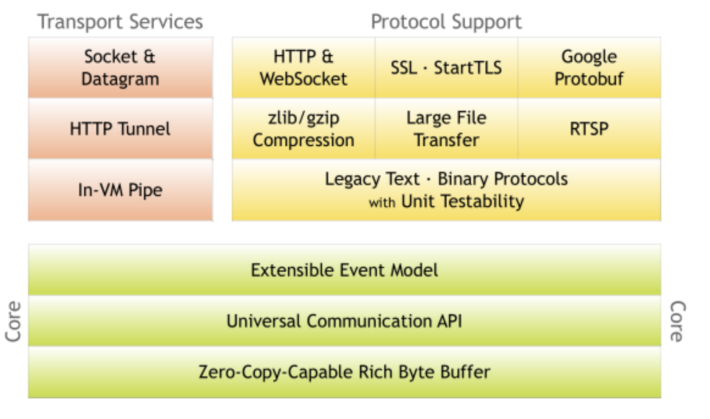

1. Netty 是由 JBOSS 提供的一个 Java 开源框架。Netty 提供异步的、基于事件驱动的网络应用程序框架，用以快速开发高性能、高可靠性的网络 IO 程序。
2. Netty 可以帮助你快速、简单的开发出一个网络应用，相当于简化和流程化了 NIO 的开发过程。
3. Netty 是目前最流行的 NIO 框架，Netty 在互联网领域、大数据分布式计算领域、游戏行业、通信行业等获得了广泛的应用，知名的 Elasticsearch 、Dubbo 框架内部都采用了 Netty。
## 4.3 Netty的优点
Netty 对 JDK 自带的 NIO 的 API 进行了封装，解决了上述问题。

1. **设计优雅**：适用于各种传输类型的统一 API 阻塞和非阻塞 Socket；基于灵活且可扩展的事件模型，可以清晰地分离关注点；高度可定制的线程模型 - 单线程，一个或多个线程池。
2. **使用方便**：详细记录的 Javadoc，用户指南和示例；没有其他依赖项，JDK 5（Netty 3.x）或 6（Netty 4.x）就足够了。
3. **高性能、吞吐量更高**：延迟更低；减少资源消耗；最小化不必要的内存复制。
4. **安全**：完整的 SSL/TLS 和 StartTLS 支持。社区活跃、不断更新。
5. **社区活跃**，版本迭代周期短，发现的 Bug 可以被及时修复，同时，更多的新功能会被加入。
## 4.4 Netty版本说明

1. netty版本分为  netty3.x  和  netty4.x、netty5.x
2. 因为Netty5出现重大bug，已经被官网废弃了，目前推荐使用的是Netty4.x的稳定版本
3. 目前在官网可下载的版本 netty3.x netty4.0.x 和 netty4.1.x
# 第 5 章 Netty 高性能架构设计
## 5.1 线程模型基本介绍

1. 不同的线程模式，对程序的性能有很大影响，为了搞清Netty 线程模式，我们来统的讲解下各个线程模式， 最后看看 Netty 线程模型有什么优越性
2. 目前存在的线程模型有：
   - **传统阻塞 I/O 服务模型 **
   - **Reactor 模式**
3. **根据 Reactor 的数量和处理资源池线程的数量不同，有 3 种典型的实现**
   - 单 Reactor 单线程
   - 单 Reactor 多线程
   - 主从 Reactor 多线程
4. Netty 线程模式(Netty 主要基于主从 Reactor 多线程模型做了一定的改进，其中主从 Reactor 多线程模型有多个 Reactor)
## 5.2 传统阻塞 I/O 服务模型
### 5.2.1 工作原理图
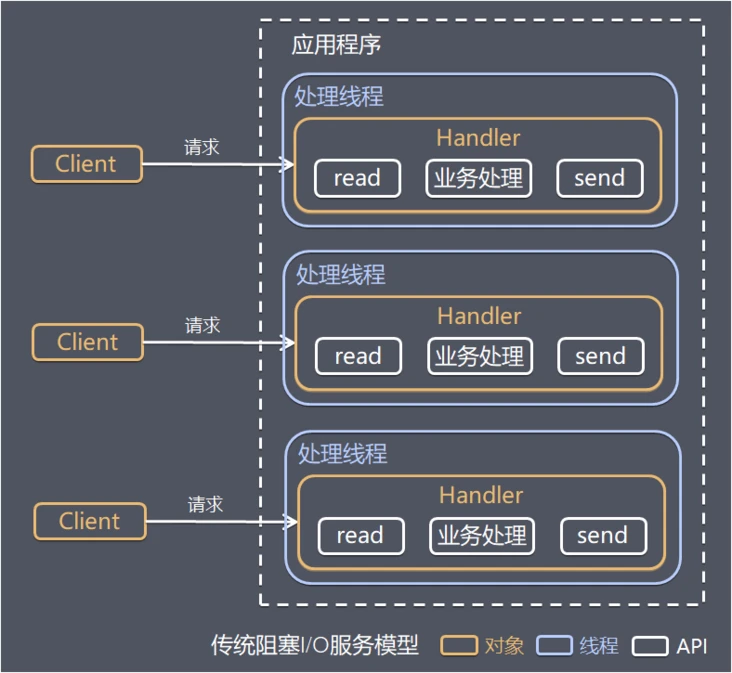
### 5.2.2 模型特点

1. 采用阻塞IO模式获取输入的数据
2. 每个连接都需要独立的线程完成数据的输入，业务处理,数据返回
### 5.2.3 问题分析

1. 当并发数很大，就会创建大量的线程，占用很大系统资源
2. 连接创建后，如果当前线程暂时没有数据可读，该线程会阻塞在read 操作，造成线程资源浪费
## 5.3 Reactor 模式
### 5.3.1 针对传统阻塞 I/O 服务模型的 2 个缺点，解决方案

1. 基于 I/O 复用模型：多个连接共用一个阻塞对象，应用程序只需要在一个阻塞对象等待，无需阻塞等待所有连接。当某个连接有新的数据可以处理时，操作系统通知应用程序，线程从阻塞状态返回，开始进行业务处理
   1. Reactor 对应的叫法: 1. 反应器模式 2. 分发者模式(Dispatcher) 3. 通知者模式(notifier)
2. 基于线程池复用线程资源：不必再为每个连接创建线程，将连接完成后的业务处理任务分配给线程进行处理，一个线程可以处理多个连接的业务。

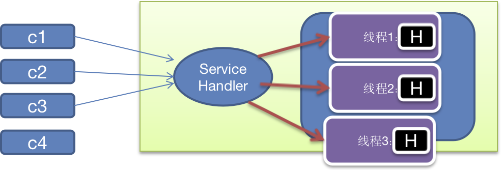
### 5.3.2 I/O 复用结合线程池，就是 Reactor 模式基本设计思想
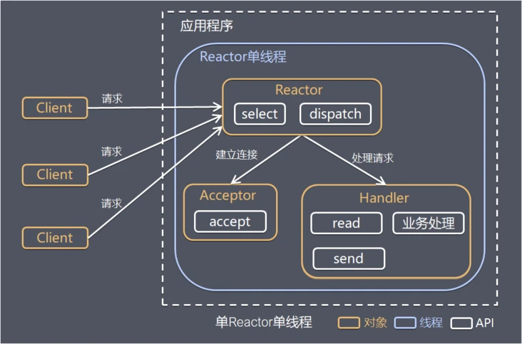

1. Reactor 模式，通过一个或多个输入同时传递给服务处理器的模式(基于事件驱动)
2. 服务器端程序处理传入的多个请求，并将它们同步分派到相应的处理线程，因此Reactor模式也叫 Dispatcher 模式
3. Reactor 模式使用IO复用监听事件，收到事件后，分发给某个线程(进程)，这点就是网络服务器高并发处理关键
### 5.3.3 Reactor 模式中核心组成
**Reactor**：Reactor 在一个单独的线程中运行，负责监听和分发事件，分发给适当的处理程序来对 IO 事件做出反应。 它就像公司的电话接线员，它接听来自客户的电话并将线路转移到适当的联系人

**Handlers**：处理程序执行 I/O 事件要完成的实际事件，类似于客户想要与之交谈的公司中的实际官员。Reactor 通过调度适当的处理程序来响应 I/O 事件，处理程序执行非阻塞操作。
### 5.3.4 Reactor 模式分类
根据 Reactor 的数量和处理资源池线程的数量不同，有 3 种典型的实现

- 单 Reactor 单线程
- 单 Reactor 多线程
- 主从 Reactor 多线程
## 5.4 单 Reactor 单线程
### 5.4.1 工作原理示意图


前面的 NIO 群聊系统就是这种模型
### 5.4.2 方案说明

1. Select 是前面 I/O 复用模型介绍的标准网络编程 API，可以实现应用程序通过一个阻塞对象监听多路连接请求
2. Reactor 对象通过 Select 监控客户端请求事件，收到事件后通过 Dispatch 进行分发
3. 如果是建立连接请求事件，则由 Acceptor 通过 Accept 处理连接请求，然后创建一个 Handler 对象处理连接完成后的后续业务处理
4. 如果不是建立连接事件，则 Reactor 会分发调用连接对应的 Handler 来响应
5. Handler 会完成 Read→业务处理→Send 的完整业务流程

**结合实例**：服务器端用一个线程通过多路复用搞定所有的 IO 操作（包括连接，读、写等），编码简单，清晰明了，但是如果客户端连接数量较多，将无法支撑，前面的 NIO 案例就属于这种模型。
### 5.4.3 方案优缺点分析

1. **优点**：模型简单，没有多线程、进程通信、竞争的问题，全部都在一个线程中完成
2. **缺点**：性能问题，只有一个线程，无法完全发挥多核 CPU 的性能。Handler 在处理某个连接上的业务时，整个进程无法处理其他连接事件，很容易导致性能瓶颈
3. **缺点**：可靠性问题，线程意外终止，或者进入死循环，会导致整个系统通信模块不可用，不能接收和处理外部消息，造成节点故障
4. **使用场景**：客户端的数量有限，业务处理非常快速，比如 Redis在业务处理的时间复杂度 O(1) 的情况
## 5.5 单Reactor多线程
### 5.5.1 工作原理示意图
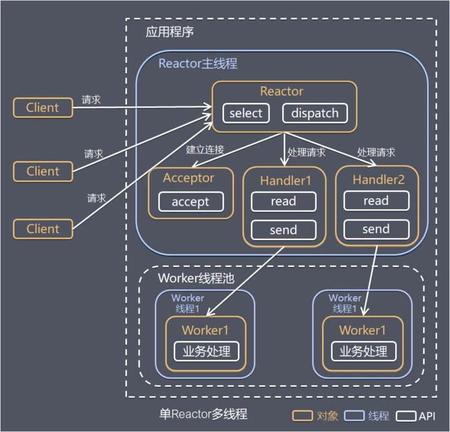
### 5.5.2 方案说明

1. Reactor 对象通过select 监控客户端请求事件, 收到事件后，通过dispatch进行分发
2. 如果建立连接请求, 则右Acceptor 通过accept 处理连接请求, 然后创建一个Handler对象处理完成连接后的各种事件
3. 如果不是连接请求，则由reactor分发调用连接对应的handler 来处理
4. handler 只负责响应事件，不做具体的业务处理, 通过read 读取数据后，会分发给后面的worker线程池的某个线程处理业务
5. worker 线程池会分配独立线程完成真正的业务，并将结果返回给handler
6. handler收到响应后，通过send 将结果返回给client
### 5.5.3 方案优缺点分析

1. **优点**：可以充分的利用多核cpu 的处理能力
2. **缺点**：多线程数据共享和访问比较复杂， reactor 处理所有的事件的监听和响应，在单线程运行， 在高并发场景容易出现性能瓶颈
## 5.6 主从 Reactor 多线程
### 5.6.1 工作原理示意图
针对单 Reactor 多线程模型中，Reactor 在单线程中运行，高并发场景下容易成为性能瓶颈，可以让 Reactor 在多线程中运行

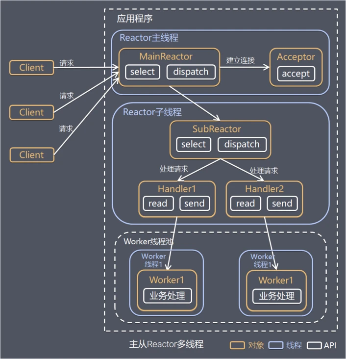
### 5.6.2 方案说明

1. Reactor主线程 MainReactor 对象通过select 监听连接事件，收到事件后，通过Acceptor 处理连接事件
2. 当 Acceptor  处理连接事件后，MainReactor 将连接分配给SubReactor 
3. subreactor 将连接加入到连接队列进行监听，并创建handler进行各种事件处理
4. 当有新事件发生时，subreactor 就会调用对应的handler处理
5. handler 通过read 读取数据，分发给后面的worker 线程处理
6. worker 线程池分配独立的 worker 线程进行业务处理，并返回结果
7. handler 收到响应的结果后，再通过 send 将结果返回给client
8. Reactor 主线程可以对应多个 Reactor 子线程, 即MainRecator 可以关联多个SubReactor
### 5.6.3 Scalable IO in Java 对 Multiple Reactors 的原理图解
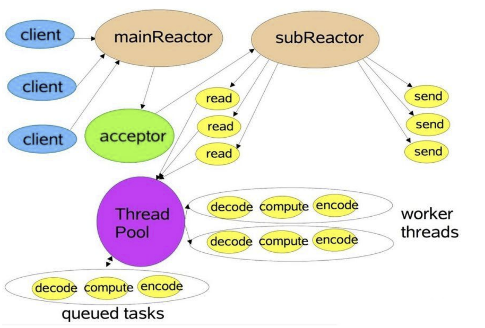
### 5.6.4 方案优缺点说明

1. **优点**：父线程与子线程的数据交互简单职责明确，父线程只需要接收新连接，子线程完成后续的业务处理。
2. **优点**：父线程与子线程的数据交互简单，Reactor 主线程只需要把新连接传给子线程，子线程无需返回数据。
3. **缺点**：编程复杂度较高。

**结合实例**：这种模型在许多项目中广泛使用，包括 Nginx 主从 Reactor 多进程模型，Memcached 主从多线程，Netty 主从多线程模型的支持
## 5.7 Reactor 模式小结
### 5.7.1 3 种模式用生活案例来理解

1. 单 Reactor 单线程，前台接待员和服务员是同一个人，全程为顾客服务
2. 单 Reactor 多线程，1 个前台接待员，多个服务员，接待员只负责接待
3. 主从 Reactor 多线程，多个前台接待员，多个服务生
### 5.7.2 Reactor 模式具有如下的优点

1. 响应快，不必为单个同步时间所阻塞，虽然 Reactor 本身依然是同步的
2. 可以最大程度的避免复杂的多线程及同步问题，并且避免了多线程/进程的切换开销
3. 扩展性好，可以方便的通过增加 Reactor 实例个数来充分利用 CPU 资源
4. 复用性好，Reactor 模型本身与具体事件处理逻辑无关，具有很高的复用性
## 5.8 Netty模型
### 5.8.1 工作原理-简单版
Netty 主要基于主从 Reactors 多线程模型（如图）做了一定的改进，其中主从 Reactor 多线程模型有多个 Reactor

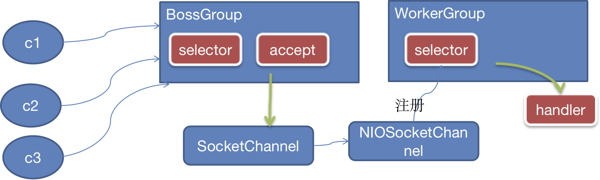

**说明**

1. BossGroup 线程维护Selector , 只关注Accecpt
2. 当接收到Accept事件，获取到对应的SocketChannel, 封装成 NIOScoketChannel并注册到Worker 线程(事件循环), 并进行维护
3. 当Worker线程监听到selector 中通道发生自己感兴趣的事件后，就进行处理(就由handler)， 注意handler 已经加入到通道
### 5.8.2 工作原理-进阶版
Netty 主要基于主从 Reactors 多线程模型（如图）做了一定的改进，其中主从 Reactor 多线程模型有多个 Reactor

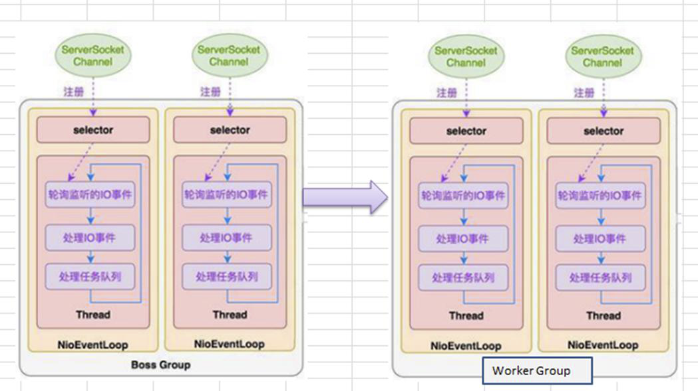
### 5.8.3 工作原理-详细版
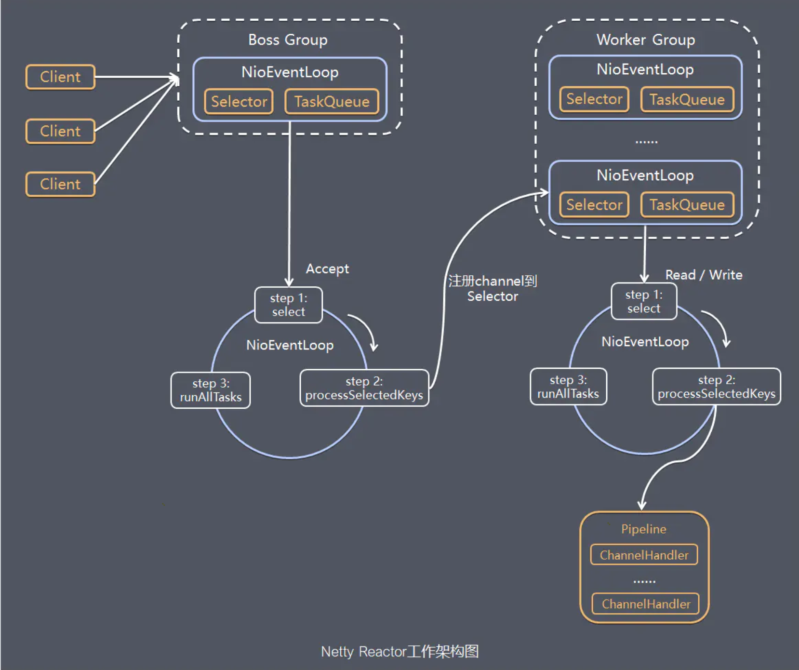

1. Netty抽象出两组线程池 BossGroup 专门负责接收客户端的连接, WorkerGroup 专门负责网络的读写
2. BossGroup 和 WorkerGroup 类型都是 NioEventLoopGroup
3. NioEventLoopGroup 相当于一个事件循环组, 这个组中含有多个事件循环 ，每一个事件循环是 NioEventLoop
4. NioEventLoop 表示一个不断循环的执行处理任务的线程， 每个NioEventLoop 都有一个selector , 用于监听绑定在其上的socket的网络通讯
5. NioEventLoopGroup 可以有多个线程, 即可以含有多个NioEventLoop
6. 每个Boss NioEventLoop 循环执行的步骤有3步
   1. 轮询accept 事件
   2. 处理accept 事件 , 与client建立连接 , 生成NioScocketChannel , 并将其注册到某个worker NIOEventLoop 上的 selector
   3. 处理任务队列的任务 ， 即 runAllTasks
7. 每个 Worker NIOEventLoop 循环执行的步骤
   1. 轮询read, write 事件
   2. 处理i/o事件， 即read , write 事件，在对应NioScocketChannel 处理
   3. 处理任务队列的任务 ， 即 runAllTasks
8. 每个Worker NIOEventLoop  处理业务时，会使用pipeline(管道), pipeline 中包含了 channel , 即通过pipeline 可以获取到对应通道, 管道中维护了很多的 处理器
### 5.8.4 Netty快速入门实例-TCP服务
```java
public class NettyServer {
    public static void main(String[] args) throws InterruptedException {
        // 创建 BossGroup 和 WorkerGroup
        // 1.创建两个线程组 bossGroup 和 workerGroup
        // 2.bossGroup 只是处理连接请求,真正和客户端业务处理会交给 workerGroup 完成
        // 3.两个都是无限循环
        // 4.bossGroup 和 workerGroup 含有的子线程(NioEventLoop)的个数 默认是实际 CPU核心数*2
        NioEventLoopGroup bossGroup = new NioEventLoopGroup();
        NioEventLoopGroup workerGroup = new NioEventLoopGroup();
        try {
            // 创建服务器端的启动端,配置参数
            ServerBootstrap bootstrap = new ServerBootstrap();

            bootstrap.group(bossGroup, workerGroup)// 设置两个线程组
                    .channel(NioServerSocketChannel.class) //使用 NioServerSocketChannel 作为服务器的通道实现
                    .option(ChannelOption.SO_BACKLOG, 128)// 设置线程队列得到连接个数
                    .childOption(ChannelOption.SO_KEEPALIVE, true)// 设置保持活动连接状态
                    //.handler(null) --> 这个 handler 在 bossGroup 中生效, childHandler() 在 workerGroup 中生效
                    .childHandler(new ChannelInitializer<SocketChannel>() {
                        // 给 pipeline 设置处理器
                        @Override
                        protected void initChannel(SocketChannel ch) throws Exception {
                            ch.pipeline().addLast(new NettyServerHandler());
                        }
                    });// 给我们的 workerGroup 的 EventLoop 对应的管道设置处理器

            System.out.println("服务器启动成功...");

            // 绑定一个端口并且同步,生成了一个 ChannelFuture 对象
            // 启动服务器(并绑定端口)
            ChannelFuture cf = bootstrap.bind(6668).sync();
            // 对关闭通道进行监听
            cf.channel().closeFuture().sync();
        } finally {
            bossGroup.shutdownGracefully();
            workerGroup.shutdownGracefully();
        }

    }
}

/**
 * 1.我们自定义一个 Handler 需要继承 Netty 规定好的某个 HandlerAdapter(规范)
 * 2.这时我们自定义一个 Handler,才能称为一个 handler
 *
 * @author manaphy
 * @date 2021/10/01
 */
public class NettyServerHandler extends ChannelInboundHandlerAdapter {
    /**
     * 读取数据事件(这里我们可以读取客户端发送的消息)
     * 1.ChannelHandlerContext ctx:上下文对象,含有管道 pipeline,通道 channel,地址
     * 2.Object msg:就是客户端发送的数据 默认是Object
     */
    @Override
    public void channelRead(ChannelHandlerContext ctx, Object msg) throws Exception {
        System.out.println("server ctx = " + ctx);
        // 将 msg 转成一个 ByteBuf
        // ByteBuf 是 Netty 提供的,不是 NIO 的 ByteBuffer
        ByteBuf buf = (ByteBuf) msg;
        System.out.println("客户端发送的消息是: " + buf.toString(Charset.defaultCharset()));
        System.out.println("客户端地址:" + ctx.channel().remoteAddress());
    }

    /** 数据读取完毕 */
    @Override
    public void channelReadComplete(ChannelHandlerContext ctx) throws Exception {
        // writeAndFlush 是 write+flush
        // 将数据写入到缓存,并刷新
        // 一般讲,我们对这个发送的数据进行编码
        ctx.writeAndFlush(Unpooled.copiedBuffer("hello,客户端~", Charset.defaultCharset()));
    }

    /** 处理异常,一般是需要关闭通道 */
    @Override
    public void exceptionCaught(ChannelHandlerContext ctx, Throwable cause) throws Exception {
        ctx.close();
    }
}

```
```java
public class NettyClient {
    public static void main(String[] args) throws InterruptedException {
        // 客户端需要一个事件循环组
        NioEventLoopGroup group = new NioEventLoopGroup();
        try {
            // 创建客户端启动对象
            // 注意客户端使用的不是 ServerBootstrap 而是 Bootstrap
            Bootstrap bootstrap = new Bootstrap();

            // 设置相关参数
            bootstrap.group(group)// 设置线程组
                    .channel(NioSocketChannel.class)// 设置客户端通道的实现类(反射)
                    .handler(new ChannelInitializer<SocketChannel>() {
                        @Override
                        protected void initChannel(SocketChannel ch) throws Exception {
                            ch.pipeline().addLast(new NettyClientHandler());
                        }
                    });
            System.out.println("客户端启动成功");

            // 启动客户端去连接服务器端
            ChannelFuture channelFuture = bootstrap.connect("127.0.0.1", 6668).sync();
            // 给关闭通道进行监听
            channelFuture.channel().closeFuture().sync();
        } finally {
            group.shutdownGracefully();
        }
    }
}

public class NettyClientHandler extends ChannelInboundHandlerAdapter {

    /** 当通道就绪就会触发该方法 */
    @Override
    public void channelActive(ChannelHandlerContext ctx) throws Exception {
        System.out.println("client " + ctx);
        ctx.writeAndFlush(Unpooled.copiedBuffer("hello 服务器~", CharsetUtil.UTF_8));
    }

    /** 当通道有读取事件时,会触发 */
    @Override
    public void channelRead(ChannelHandlerContext ctx, Object msg) throws Exception {
        ByteBuf buf = (ByteBuf) msg;
        System.out.println("服务器回复的消息:" + buf.toString(CharsetUtil.UTF_8));
        System.out.println("服务器的地址:" + ctx.channel().remoteAddress());
    }

    @Override
    public void exceptionCaught(ChannelHandlerContext ctx, Throwable cause) throws Exception {
        cause.printStackTrace();
        ctx.close();
    }
}
```
### 5.8.5 任务队列中的 Task 有 3 种典型使用场景

1. 用户程序自定义的普通任务
2. 用户自定义定时任务
3. 非当前 Reactor 线程调用 Channel 的各种方法

例如在推送系统的业务线程里面，根据用户的标识，找到对应的 Channel 引用，然后调用 Write 类方法向该用户推送消息，就会进入到这种场景。最终的 Write 会提交到任务队列中后被异步消费
```java
@Override
public void channelRead(ChannelHandlerContext ctx, Object msg) throws Exception {
    // ==================== 用户程序自定义的普通任务案例演示 ====================
    // 如果有一个耗时很长的任务 -> 就需要异步执行 -> 提交该 channel 对应的 NIOEventLoop 的 taskQueue 中
    ctx.writeAndFlush(Unpooled.copiedBuffer("hello 客户端0 " + new Date(), CharsetUtil.UTF_8));
    // 解决方案1 用户程序自定义的普通任务
    ctx.channel().eventLoop().execute(() -> {
        try {
            TimeUnit.SECONDS.sleep(5);
            ctx.writeAndFlush(Unpooled.copiedBuffer("hello 客户端1 " + new Date(), CharsetUtil.UTF_8));
        } catch (InterruptedException e) {
            e.printStackTrace();
        }
    });
    // 第二个任务会在第一个任务结束后才开始执行
    ctx.channel().eventLoop().execute(() -> {
        try {
            TimeUnit.SECONDS.sleep(5);
            ctx.writeAndFlush(Unpooled.copiedBuffer("hello 客户端2 " + new Date(), CharsetUtil.UTF_8));
        } catch (InterruptedException e) {
            e.printStackTrace();
        }
    });

    // 解决方案2 用户自定义定时任务 -> 该任务是提交到 scheduleTaskQueue 中
    // 不会被前两个任务阻塞
    ctx.channel().eventLoop().schedule(() -> {
        try {
            TimeUnit.SECONDS.sleep(5);
            ctx.writeAndFlush(Unpooled.copiedBuffer("hello 客户端3 " + new Date(), CharsetUtil.UTF_8));
        } catch (InterruptedException e) {
            e.printStackTrace();
        }
    }, 0, TimeUnit.SECONDS);// 延时0秒执行

}
```
### 5.8.6 方案再说明

1. Netty 抽象出两组**线程池**，BossGroup 专门负责接收客户端连接，WorkerGroup 专门负责网络读写操作。
2. NioEventLoop 表示一个不断循环执行处理任务的线程，每个 NioEventLoop 都有一个 selector，用于监听绑定在其上的 socket 网络通道。
3. NioEventLoop 内部采用串行化设计，从消息的读取->解码->处理->编码->发送，始终由 IO 线程 NioEventLoop 负责
   - NioEventLoopGroup 下包含多个 NioEventLoop
   - 每个 NioEventLoop 中包含有一个 Selector，一个 taskQueue
   - 每个 NioEventLoop 的 Selector 上可以注册监听多个 NioChannel
   - 每个 NioChannel 只会绑定在唯一的 NioEventLoop 上
   - 每个 NioChannel 都绑定有一个自己的 ChannelPipeline
## 5.9 异步模型
### 5.9.1 基本介绍

1. 异步的概念和同步相对。当一个异步过程调用发出后，调用者不能立刻得到结果。实际处理这个调用的组件在完成后，通过状态、通知和回调来通知调用者。
2. Netty 中的 I/O 操作是异步的，包括 Bind、Write、Connect 等操作会简单的返回一个 ChannelFuture。
3. 调用者并不能立刻获得结果，而是通过 Future-Listener 机制，用户可以方便的主动获取或者通过通知机制获得 IO 操作结果。
4. Netty 的异步模型是建立在 future 和 callback 的之上的。callback 就是回调。重点说 Future，它的核心思想是：假设一个方法 fun，计算过程可能非常耗时，等待 fun返回显然不合适。那么可以在调用 fun 的时候，立马返回一个 Future，后续可以通过 Future去监控方法 fun 的处理过程(即 ： Future-Listener 机制)。
### 5.9.2 Future 说明

1. 表示异步的执行结果, 可以通过它提供的方法来检测执行是否完成，比如检索计算等等。
2. ChannelFuture 是一个接口：`public interface ChannelFuture extends Future<Void>`我们可以添加监听器，当监听的事件发生时，就会通知到监听器。
### 5.9.3 工作原理
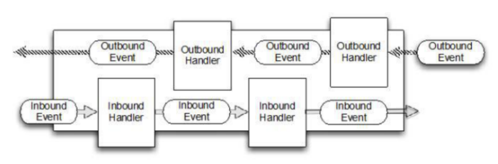

**说明：**

1. 在使用 Netty 进行编程时，拦截操作和转换出入站数据只需要您提供 callback 或利用future 即可。这使得链式操作简单、高效, 并有利于编写可重用的、通用的代码。
2. Netty 框架的目标就是让你的业务逻辑从网络基础应用编码中分离出来、解脱出来。
### 5.9.4 Future-Listener 机制

1. 当 Future 对象刚刚创建时，处于非完成状态，调用者可以通过返回的 ChannelFuture 来获取操作执行的状态，注册监听函数来执行完成后的操作。
2. 常见有如下操作
   1. 通过 isDone 方法来判断当前操作是否完成
   2. 通过 isSuccess 方法来判断已完成的当前操作是否成功
   3. 通过 getCause 方法来获取已完成的当前操作失败的原因
   4. 通过 isCancelled 方法来判断已完成的当前操作是否被取消
   5. 通过 addListener 方法来注册监听器，当操作已完成(isDone 方法返回完成)，将会通知指定的监听器；如果 Future 对象已完成，则通知指定的监听器
3. 演示：绑定端口是异步操作，当绑定操作处理完，将会调用相应的监听器处理逻辑
```java
// 绑定一个端口并且同步,生成了一个 ChannelFuture 对象
// 启动服务器(并绑定端口)
ChannelFuture cf = bootstrap.bind(6668).sync();

cf.addListener((ChannelFutureListener) channelFuture -> {
    if (cf.isSuccess()) {
        System.out.println("监听端口 6668 成功");
    } else {
        System.out.println("监听端口 6668 失败");
    }
});
```
**小结**：相比传统阻塞 I/O，执行 I/O 操作后线程会被阻塞住, 直到操作完成；异步处理的好处是不会造成线程阻塞，线程在 I/O 操作期间可以执行别的程序，在高并发情形下会更稳定和更高的吞吐量
## 5.10 快速入门实例-HTTP服务
Netty 服务器在 8888 端口监听，浏览器发出请求 "[http://localhost:8888/](http://localhost:6668/)"
```java
public class HttpServer {
    public static void main(String[] args) throws InterruptedException {
        NioEventLoopGroup bossGroup = new NioEventLoopGroup(1);
        NioEventLoopGroup workerGroup = new NioEventLoopGroup();

        try {
            ServerBootstrap serverBootstrap = new ServerBootstrap();

            serverBootstrap.group(bossGroup, workerGroup)
                    .channel(NioServerSocketChannel.class)
                    .childHandler(new ServerInitializer());

            ChannelFuture channelFuture = serverBootstrap.bind(8888).sync();

            channelFuture.channel().closeFuture().sync();

        } finally {
            bossGroup.shutdownGracefully();
            workerGroup.shutdownGracefully();
        }
    }
}

public class ServerInitializer extends ChannelInitializer<SocketChannel> {
    @Override
    protected void initChannel(SocketChannel ch) throws Exception {
        // 向管道加入处理器

        // 得到管道
        ChannelPipeline pipeline = ch.pipeline();

        // 加入一个 Netty 提供的 httpServerCodec codec =>[coder - decoder]
        // HttpServerCodec 说明
        // 1.HttpServerCodec 是 Netty 提供的处理 http 的编-解码器
        pipeline.addLast("MyHttpServerCodec", new HttpServerCodec());
        // 2.增加一个自定义的 handler
        pipeline.addLast("MyTestHttpServerHandler", new HttpServerHandler());

        System.out.println("ok~~~~");
    }
}

public class HttpServerHandler extends SimpleChannelInboundHandler<HttpObject> {
    /** channelRead0 读取客户端数据 */
    @Override
    protected void channelRead0(ChannelHandlerContext ctx, HttpObject msg) throws Exception {

        // 判断 msg 是不是 httpRequest 请求
        if (msg instanceof HttpRequest) {
            System.out.println("msg 类型=" + msg.getClass());
            System.out.println("客户端地址" + ctx.channel().remoteAddress());

            // 获取到
            HttpRequest httpRequest = (HttpRequest) msg;
            // 获取uri,过滤指定的资源
            URI uri = new URI(httpRequest.uri());
            if ("/favicon.ico".equals(uri.getPath())) {
                System.out.println("请求了 favicon.ico,不做响应");
                return;
            }

            // 回复信息给浏览器[http协议]
            ByteBuf content = Unpooled.copiedBuffer("hello 我是服务器", Charset.forName("GBK"));
            // 构造一个 http 的响应,即 httpResponse
            FullHttpResponse response = new DefaultFullHttpResponse(HttpVersion.HTTP_1_1, HttpResponseStatus.OK, content);

            response.headers().set(HttpHeaderNames.CONTENT_TYPE, "text/plain");
            response.headers().set(HttpHeaderNames.CONTENT_LENGTH, content.readableBytes());

            // 将构建好的 response 返回
            ctx.writeAndFlush(response);
        }
    }
}
```
# 第 6 章 Netty 核心模块组件
## 6.1 Bootstrap、ServerBootstrap
Bootstrap 意思是引导，一个 Netty 应用通常由一个 Bootstrap 开始，主要作用是配置整个 Netty 程序，串联各个组件，Netty 中 Bootstrap 类是客户端程序的启动引导类，ServerBootstrap 是服务端启动引导类

**常见的方法有**

- `public ServerBootstrap group(EventLoopGroup parentGroup, EventLoopGroup childGroup)`，该方法用于服务器端，用来设置两个 EventLoop
- `public B group(EventLoopGroup group)`，该方法用于客户端，用来设置一个 EventLoopGroup
- `public B channel(Class<? extends C> channelClass)`，该方法用来设置一个服务器端的通道实现
- `public <T> B option(ChannelOption<T> option, T value)`，用来给 ServerChannel 添加配置
- `public <T> ServerBootstrap childOption(ChannelOption<T> childOption, T value)`，用来给接收到的通道添加配置
- `public ServerBootstrap childHandler(ChannelHandler childHandler)`，该方法用来设置业务处理类（自定义的 handler）
- `public ChannelFuture bind(int inetPort)`，该方法用于服务器端，用来设置占用的端口号
- `public ChannelFuture connect(String inetHost, int inetPort)`，该方法用于客户端，用来连接服务器端
## 6.2 Future、ChannelFuture
Netty 中所有的 IO 操作都是异步的，不能立刻得知消息是否被正确处理。但是可以过一会等它执行完成或者直接注册一个监听，具体的实现就是通过 Future 和 ChannelFutures，他们可以注册一个监听，当操作执行成功或失败时监听会自动触发注册的监听事件

**常见的方法有**

- `Channel channel()`，返回当前正在进行 IO 操作的通道
- `ChannelFuture sync()`，等待异步操作执行完毕
## 6.3 Channel

1. Netty 网络通信的组件，能够用于执行网络 I/O 操作。
2. 通过Channel 可获得当前网络连接的通道的状态
3. 通过Channel 可获得 网络连接的配置参数 （例如接收缓冲区大小）
4. Channel 提供异步的网络 I/O 操作(如建立连接，读写，绑定端口)，异步调用意味着任何 I/O 调用都将立即返回，并且不保证在调用结束时所请求的 I/O 操作已完成
5. 调用立即返回一个 ChannelFuture 实例，通过注册监听器到 ChannelFuture 上，可以 I/O 操作成功、失败或取消时回调通知调用方
6. 支持关联 I/O 操作与对应的处理程序
7. 不同协议、不同的阻塞类型的连接都有不同的 Channel 类型与之对应，常用的 Channel 类型
   1. NioSocketChannel，异步的客户端 TCP Socket 连接。
   2. NioServerSocketChannel，异步的服务器端 TCP Socket 连接。
   3. NioDatagramChannel，异步的 UDP 连接。
   4. NioSctpChannel，异步的客户端 Sctp 连接。
   5. NioSctpServerChannel，异步的 Sctp 服务器端连接，这些通道涵盖了 UDP 和 TCP 网络 IO 以及文件 IO。
## 6.4 Selector

1. Netty 基于 Selector 对象实现 I/O 多路复用，通过 Selector 一个线程可以监听多个连接的 Channel 事件。
2. 当向一个 Selector 中注册 Channel 后，Selector 内部的机制就可以自动不断地查询(Select) 这些注册的 Channel 是否有已就绪的 I/O 事件（例如可读，可写，网络连接完成等），这样程序就可以很简单地使用一个线程高效地管理多个 Channel
## 6.5 ChannelHandler 及其实现类
ChannelHandler 是一个接口，处理 I/O 事件或拦截 I/O 操作，并将其转发到其 ChannelPipeline(业务处理链)中的下一个处理程序。

ChannelHandler 本身并没有提供很多方法，因为这个接口有许多的方法需要实现，方便使用期间，可以继承它的子类

**ChannelHandler 及其实现类**

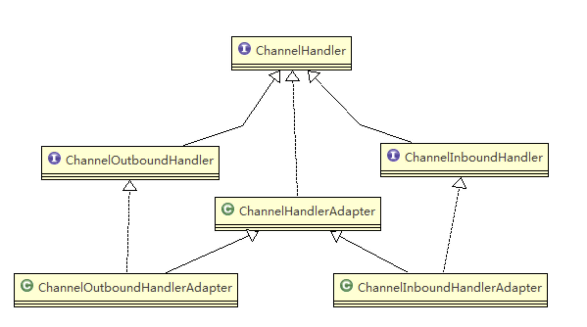

- ChannelInboundHandler 用于处理入站 I/O 事件。
- ChannelOutboundHandler 用于处理出站 I/O 操作。

- ChannelInboundHandlerAdapter 用于处理入站 I/O 事件。
- ChannelOutboundHandlerAdapter 用于处理出站 I/O 操作。
- ChannelDuplexHandler 用于处理入站和出站事件。

我们经常需要自定义一个 Handler 类去继承 ChannelInboundHandlerAdapter，然后通过重写相应方法实现业务逻辑，我们接下来看看一般都需要重写哪些方法
```java
public class ChannelInboundHandlerAdapter extends ChannelHandlerAdapter implements ChannelInboundHandler {
    public ChannelInboundHandlerAdapter() {
    }
	
    @Skip
    public void channelRegistered(ChannelHandlerContext ctx) throws Exception {
        ctx.fireChannelRegistered();
    }

    @Skip
    public void channelUnregistered(ChannelHandlerContext ctx) throws Exception {
        ctx.fireChannelUnregistered();
    }
	// 通道就绪事件
    @Skip
    public void channelActive(ChannelHandlerContext ctx) throws Exception {
        ctx.fireChannelActive();
    }

    @Skip
    public void channelInactive(ChannelHandlerContext ctx) throws Exception {
        ctx.fireChannelInactive();
    }
	// 通道读取数据事件
    @Skip
    public void channelRead(ChannelHandlerContext ctx, Object msg) throws Exception {
        ctx.fireChannelRead(msg);
    }
	// 数据读取完毕事件
    @Skip
    public void channelReadComplete(ChannelHandlerContext ctx) throws Exception {
        ctx.fireChannelReadComplete();
    }

    @Skip
    public void userEventTriggered(ChannelHandlerContext ctx, Object evt) throws Exception {
        ctx.fireUserEventTriggered(evt);
    }

    @Skip
    public void channelWritabilityChanged(ChannelHandlerContext ctx) throws Exception {
        ctx.fireChannelWritabilityChanged();
    }
	// 通道发生异常事件
    @Skip
    public void exceptionCaught(ChannelHandlerContext ctx, Throwable cause) throws Exception {
        ctx.fireExceptionCaught(cause);
    }
}

```
## 6.6 Pipeline 和 ChannelPipeline
**ChannelPipeline 是一个重点**

1. ChannelPipeline 是一个 Handler 的集合，它负责处理和拦截 inbound 或者 outbound 的事件和操作，相当于一个贯穿 Netty 的链。(也可以这样理解：ChannelPipeline 是 保存 ChannelHandler 的 List，用于处理或拦截 Channel 的入站事件和出站操作)
2. ChannelPipeline 实现了一种高级形式的拦截过滤器模式，使用户可以完全控制事件的处理方式，以及 Channel 中各个的 ChannelHandler 如何相互交互
3. 在 Netty 中每个 Channel 都有且仅有一个 ChannelPipeline 与之对应

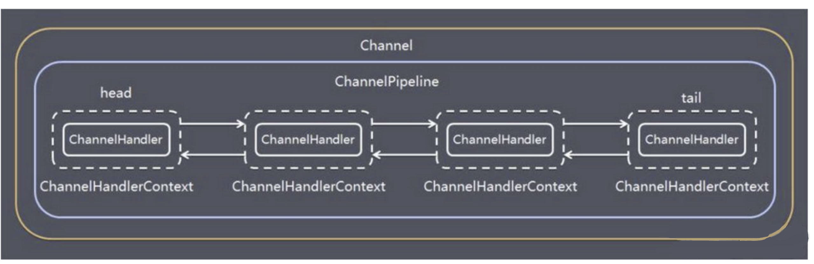

- 一个 Channel 包含了一个 ChannelPipeline，而 ChannelPipeline 中又维护了一个由 ChannelHandlerContext 组成的双向链表，并且每个 ChannelHandlerContext 中又关联着一个 ChannelHandler
- 入站事件和出站事件在一个双向链表中，入站事件会从链表 head 往后传递到最后一个入站的 handler，出站事件会从链表 tail 往前传递到最前一个出站的 handler，两种类型的 handler 互不干扰
4. **常用方法**
- ChannelPipeline addFirst(ChannelHandler... handlers)，把一个业务处理类（handler）添加到链中的第一个位置
- ChannelPipeline addLast(ChannelHandler... handlers)，把一个业务处理类（handler）添加到链中的最后一个位置
## 6.7 ChannelHandlerContext

1. 保存 Channel 相关的所有上下文信息，同时关联一个 ChannelHandler 对象
2. 即ChannelHandlerContext 中 包 含 一 个 具 体 的 事 件 处 理 器 ChannelHandler ， 同 时ChannelHandlerContext 中也绑定了对应的 pipeline 和 Channel 的信息，方便对 ChannelHandler进行调用。
3. **常用方法**
- `ChannelFuture close()`，关闭通道
- `ChannelOutboundInvoker flush()`，刷新
- `ChannelFuture writeAndFlush(Object msg)` ， 将 数 据 写 到 ChannelPipeline 中 当 前ChannelHandler 的下一个 ChannelHandler 开始处理（出站）
## 6.8 ChannelOption
Netty 在创建 Channel 实例后,一般都需要设置 ChannelOption 参数。

ChannelOption 参数如下:

**ChannelOption.SO_BACKLOG**

对应 TCP/IP 协议 listen 函数中的 backlog 参数，用来初始化服务器可连接队列大小。服务端处理客户端连接请求是顺序处理的，所以同一时间只能处理一个客户端连接。多个客户端来的时候，服务端将不能处理的客户端连接请求放在队列中等待处理，backlog 参数指定了队列的大小。

**ChannelOption.SO_KEEPALIVE**

一直保持连接活动状态
## 6.9 EventLoopGroup 和其实现类 NioEventLoopGroup

1. EventLoopGroup 是一组 EventLoop 的抽象，Netty 为了更好的利用多核 CPU 资源，一般会有多个 EventLoop 同时工作，每个 EventLoop 维护着一个 Selector 实例。
2. EventLoopGroup 提供 next 接口，可以从组里面按照一定规则获取其中一个 EventLoop来处理任务。在 Netty 服务器端编程中，我们一般都需要提供两个 EventLoopGroup，例如：BossEventLoopGroup 和 WorkerEventLoopGroup。
3. 通常一个服务端口即一个 ServerSocketChannel对应一个Selector 和一个EventLoop线程。BossEventLoop 负责接收客户端的连接并将 SocketChannel 交给 WorkerEventLoopGroup 来进行 IO 处理，如下图所示

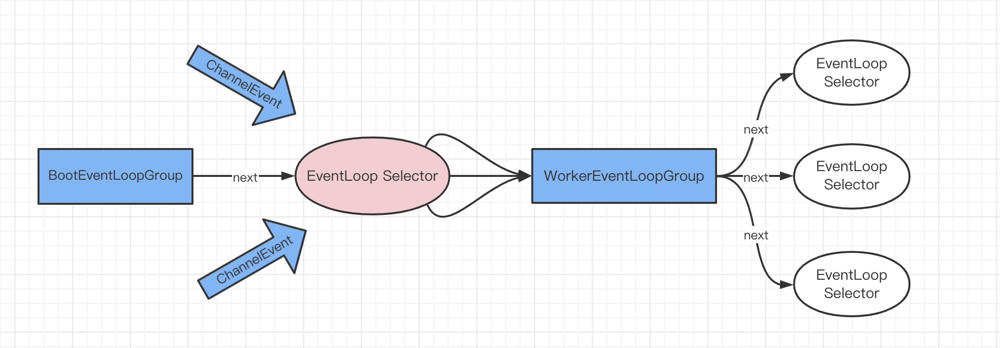

- BossEventLoopGroup 通常是一个单线程的 EventLoop，EventLoop 维护着一个注册了ServerSocketChannel 的 Selector 实例BossEventLoop 不断轮询 Selector 将连接事件分离出来
- 通常是 OP_ACCEPT 事件，然后将接收到的 SocketChannel 交给 WorkerEventLoopGroup
- WorkerEventLoopGroup 会由 next 选择其中一个 EventLoop来将这个 SocketChannel 注册到其维护的 Selector 并对其后续的 IO 事件进行处理
4. **常用方法**

`public NioEventLoopGroup()`，构造方法

`public Future<?> shutdownGracefully()`，断开连接，关闭线程
## 6.10 Unpooled 类
Netty 提供一个专门用来操作缓冲区(即Netty的数据容器)的工具类
```java
@Test
public void gettingStartTest() {
    // 创建一个 ByteBuf
    // 说明
    // 1.创建对象,该对象包含一个数组 arr,是一个 byte[10]
    // 2.在 Netty 的 buffer 中,不需要使用 flip 进行反转 [底层维护了 readerIndex 和 writerIndex]
    // 3.通过 readerIndex、readerIndex 和 capacity 将 buffer 分成三个区域
    // 0-->readerIndex 可读区域
    // readerIndex-->writerIndex 可写区域
    // writerIndex-->capacity 可写区域
    ByteBuf buffer = Unpooled.buffer(10);
    for (int i = 0; i < 10; i++) {
        buffer.writeByte(i);
    }
    // 输出
    for (int i = 0; i < buffer.capacity(); i++) {
        System.out.println(buffer.readByte());
    }
}

@Test
public void methodTest() {
    // 创建 ByteBuf
    ByteBuf byteBuf = Unpooled.copiedBuffer("hello,world!", StandardCharsets.UTF_8);
    // 使用相关的方法
    if (byteBuf.hasArray()) {
        byte[] content = byteBuf.array();
        // 将 content 转成字符串
        System.out.println(new String(content, 0, byteBuf.writerIndex(), StandardCharsets.UTF_8));

        System.out.println("byteBuf = " + byteBuf);
        System.out.println(byteBuf.arrayOffset());// 0
        System.out.println(byteBuf.readerIndex());// 0
        System.out.println(byteBuf.writerIndex());// 12
        System.out.println(byteBuf.capacity());// 64
        System.out.println((char) byteBuf.readByte());// h
        System.out.println(byteBuf.readableBytes());// 11 [可读的字节数(上一步已经读取过一个了)]

        // 使用 for 取出各个字节
        for (int i = 0; i < byteBuf.capacity(); i++) {
            System.out.print((char) byteBuf.getByte(i));
        }
        System.out.println();
        System.out.println(byteBuf.getCharSequence(0, 4, StandardCharsets.UTF_8));
    }
}
```
## 6.11 Netty应用实例-群聊系统
```java
public class GroupChatServer {

    public static void main(String[] args) {
        new GroupChatServer(7000).run();
    }


    private final int port;

    public GroupChatServer(int port) {
        this.port = port;
    }

    /** 处理客户端请求 */
    public void run() {
        NioEventLoopGroup bossGroup = new NioEventLoopGroup(1);
        NioEventLoopGroup workerGroup = new NioEventLoopGroup();
        try {
            ServerBootstrap b = new ServerBootstrap();

            b.group(bossGroup, workerGroup)
                    .channel(NioServerSocketChannel.class)
                    .option(ChannelOption.SO_BACKLOG, 128)
                    .childOption(ChannelOption.SO_KEEPALIVE, true)
                    .childHandler(new ChannelInitializer<SocketChannel>() {

                        @Override
                        protected void initChannel(SocketChannel ch) throws Exception {
                            // 获取到 pipeline
                            ChannelPipeline pipeline = ch.pipeline();
                            // 向 pipeline 加入解码器
                            pipeline.addLast("decoder", new StringDecoder());
                            // 向 pipeline 加入编码器
                            pipeline.addLast("encoder", new StringEncoder());
                            // 加入自己的业务处理 handler
                            pipeline.addLast(new GroupChatServerHandler());
                        }
                    });

            System.out.println("netty 服务器启动");
            ChannelFuture channelFuture = b.bind(port).sync();

            // 监听关闭
            channelFuture.channel().closeFuture().sync();
        } catch (InterruptedException e) {
            e.printStackTrace();
        } finally {
            bossGroup.shutdownGracefully();
            workerGroup.shutdownGracefully();
        }

    }
}

public class GroupChatServerHandler extends SimpleChannelInboundHandler<String> {

    /**
     * 定义一个 channel 组,管理所有的 channel
     * GlobalEventExecutor.INSTANCE 是全局的事件执行器,是一个单例
     */
    private static final ChannelGroup CHANNEL_GROUP = new DefaultChannelGroup(GlobalEventExecutor.INSTANCE);


    /**
     * 表示连接建立,一旦连接,第一个被执行
     * 将当前 channel 加入到 channelGroup
     */
    @Override
    public void handlerAdded(ChannelHandlerContext ctx) throws Exception {
        Channel channel = ctx.channel();
        // 将该客户加入聊天的信息推送给其他在线的客户端
        // 该方法会将 channelGroup 中所有的 channel 遍历,并发送消息(不需要自己遍历)
        CHANNEL_GROUP.writeAndFlush(String.format("%tT [客户端]%s 加入聊天%n", new Date(), channel.remoteAddress()));
        CHANNEL_GROUP.add(channel);
    }

    /** 表示 channel 处于活动状态 */
    @Override
    public void channelActive(ChannelHandlerContext ctx) throws Exception {
        System.out.printf("%tT %s上线了%n", new Date(), ctx.channel().remoteAddress());
    }

    /** 表示 channel 处于不活动状态 */
    @Override
    public void channelInactive(ChannelHandlerContext ctx) throws Exception {
        System.out.printf("%tT %s离线了%n", new Date(), ctx.channel().remoteAddress());
    }

    /** 断开连接 */
    @Override
    public void handlerRemoved(ChannelHandlerContext ctx) throws Exception {
        // 将xx客户离开信息推送给当前在线的客户
        Channel channel = ctx.channel();
        CHANNEL_GROUP.writeAndFlush(String.format("%tT [客户端]%s 离开了%n", new Date(), channel.remoteAddress()));
    }

    @Override
    protected void channelRead0(ChannelHandlerContext ctx, String msg) throws Exception {
        // 获取到当前 channel
        Channel channel = ctx.channel();
        // 这时我们遍历 channelGroup,根据不同的情况,回送不同的消息
        CHANNEL_GROUP.forEach(ch -> {
            if (channel != ch) {
                ch.writeAndFlush(String.format("%tT [客户]%s 发送了消息: %s%n", new Date(), channel.remoteAddress(), msg));
            } else {// 回显
                ch.writeAndFlush(String.format("%tT [自己]发送了消息: %s%n", new Date(), msg));
            }
        });
    }

    @Override
    public void exceptionCaught(ChannelHandlerContext ctx, Throwable cause) throws Exception {
        ctx.close();
    }
}
```
```java
public class GroupChatClient {

    public static void main(String[] args) {
        new GroupChatClient("127.0.0.1", 7000).run();
    }


    private final String host;
    private final int port;

    public GroupChatClient(String host, int port) {
        this.host = host;
        this.port = port;
    }

    public void run() {
        NioEventLoopGroup group = new NioEventLoopGroup();

        try {
            Bootstrap bootstrap = new Bootstrap();
            bootstrap.group(group)
                    .channel(NioSocketChannel.class)
                    .handler(new ChannelInitializer<SocketChannel>() {

                        @Override
                        protected void initChannel(SocketChannel ch) throws Exception {
                            ChannelPipeline pipeline = ch.pipeline();
                            pipeline.addLast("decoder", new StringDecoder());
                            pipeline.addLast("encoder", new StringEncoder());
                            pipeline.addLast(new GroupChatClientHandler());
                        }
                    });
            ChannelFuture channelFuture = bootstrap.connect(host, port).sync();
            Channel channel = channelFuture.channel();
            System.out.println("-----" + channel.localAddress() + "-----");
            // 客户端需要输入信息,创建一个扫描器
            Scanner scanner = new Scanner(System.in);
            while (scanner.hasNextLine()) {
                String msg = scanner.nextLine();
                // 通过 channel 发送到服务器
                channel.writeAndFlush(msg + "\r\n");
            }
        } catch (InterruptedException e) {
            e.printStackTrace();
        } finally {
            group.shutdownGracefully();
        }

    }
}

public class GroupChatClientHandler extends SimpleChannelInboundHandler<String> {
    @Override
    protected void channelRead0(ChannelHandlerContext channelHandlerContext, String msg) throws Exception {
        System.out.println(msg.trim());
    }
}
```
## 6.12 Netty心跳检测机制
```java
public class MyServer {
    public static void main(String[] args) {
        NioEventLoopGroup bossGroup = new NioEventLoopGroup(1);
        NioEventLoopGroup workerGroup = new NioEventLoopGroup();
        try {
            ServerBootstrap b = new ServerBootstrap();

            b.group(bossGroup, workerGroup)
                    .channel(NioServerSocketChannel.class)
                    .handler(new LoggingHandler(LogLevel.INFO))// 在 bossGroup 增加一个入职处理器
                    .childHandler(new ChannelInitializer<SocketChannel>() {

                        @Override
                        protected void initChannel(SocketChannel ch) throws Exception {
                            // 获取到 pipeline
                            ChannelPipeline pipeline = ch.pipeline();
                            // 加入一个 netty 提供 IdleStateHandler
                            // 1.IdleStateHandler 是 netty 提供的处理空闲状态的处理器
                            // 2.long readerIdleTime: 表示多长时间没有读,就会发送一个心跳检测包检测是否连接
                            // 3.long writerIdleTime: 表示多长时间没有写,就会发送一个心跳检测包检测是否连接
                            // 4.long allIdleTime: 表示多长时间没有读写,就会发送一个心跳检测包检测是否连接
                            // 5.当 IdleStateHandler 触发后,就会传递给 pipeline 的下一个 handler 去处理,
                            //  通过调用(触发)下一个 handler 的 userEventTriggered,在该方法中去处理
                            pipeline.addLast(new IdleStateHandler(3, 5, 7, TimeUnit.SECONDS));
                            // 加入一个队空闲检测进一步处理的 handler(自定义)
                            pipeline.addLast(new MyServerHandler());
                        }
                    });

            ChannelFuture channelFuture = b.bind(7000).sync();
            channelFuture.channel().closeFuture().sync();
        } catch (InterruptedException e) {
            e.printStackTrace();
        } finally {
            bossGroup.shutdownGracefully();
            workerGroup.shutdownGracefully();
        }
    }
}

public class MyServerHandler extends ChannelInboundHandlerAdapter {

    @Override
    public void userEventTriggered(ChannelHandlerContext ctx, Object evt) throws Exception {
        if (evt instanceof IdleStateEvent) {
            // 将 evt 向下转型 IdleStatsEvent
            IdleStateEvent event = (IdleStateEvent) evt;
            String eventType = null;
            switch (event.state()) {
                case READER_IDLE:
                    eventType = "读空闲"; break;
                case WRITER_IDLE:
                    eventType = "写空闲"; break;
                case ALL_IDLE:
                    eventType = "读写空闲"; break;
                default:
            }
            System.out.printf("%s--超时时间--%s%n", ctx.channel().remoteAddress(), eventType);
            System.out.println("服务器做相应处理...");
            // 如果发生空闲,关闭通道
            // ctx.channel().close();
        }
    }
}
```
使用群聊案例的客户端作为客户端进行测试
## 6.13 Netty 通过WebSocket编程实现服务器和客户端长连接
```java
public class MyServer {
    public static void main(String[] args) {
        NioEventLoopGroup bossGroup = new NioEventLoopGroup(1);
        NioEventLoopGroup workerGroup = new NioEventLoopGroup();
        try {
            ServerBootstrap b = new ServerBootstrap();

            b.group(bossGroup, workerGroup)
                    .channel(NioServerSocketChannel.class)
                    .handler(new LoggingHandler(LogLevel.INFO))
                    .childHandler(new ChannelInitializer<SocketChannel>() {

                        @Override
                        protected void initChannel(SocketChannel ch) throws Exception {
                            ChannelPipeline pipeline = ch.pipeline();
                            // 因为基于 http 协议,使用 http 的编解码器
                            pipeline.addLast(new HttpServerCodec());
                            // 是以块方式写,添加 ChunkedWrite 处理器
                            pipeline.addLast(new ChunkedWriteHandler());
                            /*
                            说明
                            1. http 数据在传输工程中是分段的, HttpObjectAggregator 就是可以将多个段聚合
                            2. 这就是为什么当浏览器发送大量数据时,就会发出多次 http 请求
                             */
                            pipeline.addLast(new HttpObjectAggregator(8192));
                            /*
                            说明
                            1. 对应 websocket,它的数据是以帧(frame)形式传递
                            2. 可以看到WebSocketFrame 下面有 6 个子类
                            3. 浏览器请求时 ws://localhost:7000/hello
                            4. WebSocketServerProtocolHandler 核心功能是将 http 协议升级为 ws 协议,保持长连接
                             */
                            pipeline.addLast(new WebSocketServerProtocolHandler("/hello"));
                            // 自定义的handler,处理业务逻辑
                            pipeline.addLast(new MyTextWebSocketFrameHandler());
                        }
                    });

            ChannelFuture channelFuture = b.bind(7000).sync();
            channelFuture.channel().closeFuture().sync();
        } catch (InterruptedException e) {
            e.printStackTrace();
        } finally {
            bossGroup.shutdownGracefully();
            workerGroup.shutdownGracefully();
        }
    }
}

public class MyTextWebSocketFrameHandler extends SimpleChannelInboundHandler<TextWebSocketFrame> {
    @Override
    protected void channelRead0(ChannelHandlerContext ctx, TextWebSocketFrame msg) throws Exception {
        System.out.println("服务器端收到消息 " + msg.text());
        // 回复消息
        ctx.channel().writeAndFlush(new TextWebSocketFrame(String.format("服务器时间 %s :%s", LocalDateTime.now(), msg.text())));
    }

    /** 当 web 客户端连接后,触发方法 */
    @Override
    public void handlerAdded(ChannelHandlerContext ctx) throws Exception {
        // id 表示唯一的值,LongText 是唯一的;ShortText 不是唯一
        System.out.println("handlerAdded 被调用" + ctx.channel().id().asLongText());
        System.out.println("handlerAdded 被调用" + ctx.channel().id().asShortText());
    }

    @Override
    public void handlerRemoved(ChannelHandlerContext ctx) throws Exception {
        System.out.println("handlerRemoved 被调用" + ctx.channel().id().asLongText());
    }

    @Override
    public void exceptionCaught(ChannelHandlerContext ctx, Throwable cause) throws Exception {
        System.out.println("异常发生 " + cause.getMessage());
        ctx.close();
    }
}
```
使用 在线 websocket 进行测试
