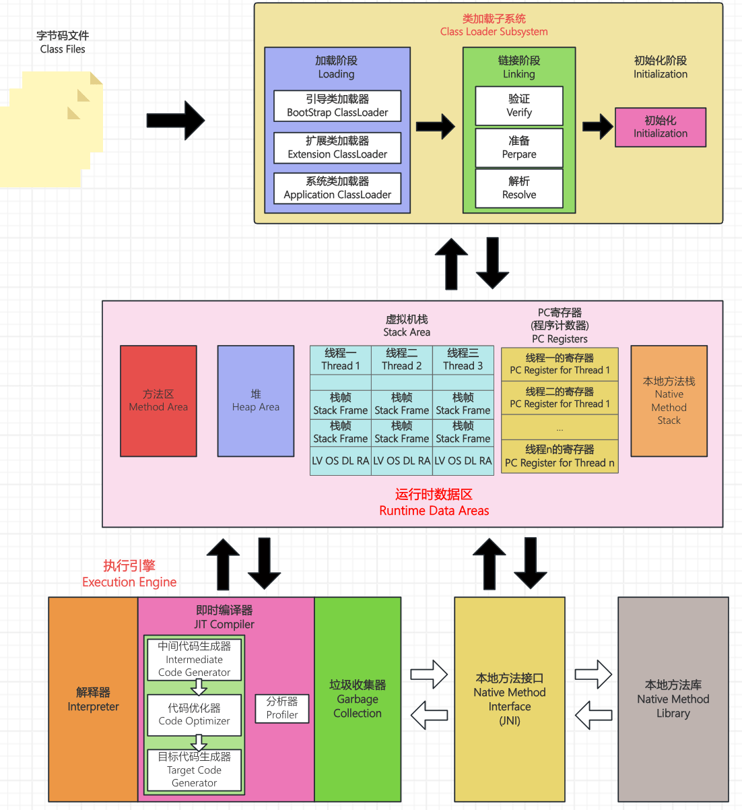
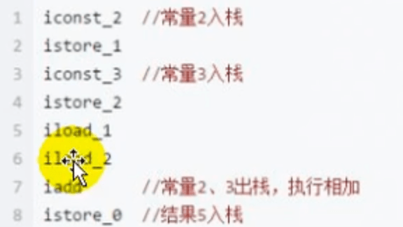
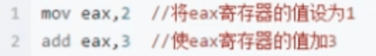

# JVM与Java体系结构

## 虚拟机与Java虚拟机

### 虚拟机

所谓虚拟机（Nirtual Machine），就是一台虚拟的计算机。它是一款软件，用来执行一系列虚拟计算机指令。大体上，虚拟机可以分为系统虚拟机和程序虚拟机。

大名鼎鼎的Visual Box,VMware就属于系统虚拟机，它们完全是对物理计算机的仿真，提供了一个可运行完整操作系统的软件平台。

程序虚拟机的典型代表就是Java虚拟机，它专门为执行单个计算机程序而设计，在Java虚拟机中执行的指令我们称内Java字节码指令。

无论是系统虚拟机还是程序虚拟机，在上面运行的软件都被限制于虚拟机提供的资源中。

### Java虚拟机

Java虚拟机是一台执行Java字节码的虚拟计算机，它拥有独立的运行机制， 其运行的Java字节码也未必由Java语言编译而成。

JVM平台的各种语言可以共享Java虚拟机带来的跨平台性、优秀的垃圾回器，以及可靠的即时编译器。

Java技术的核心就是Java虚拟机（JVM, Java Virtual Machine）， 因为所有的Java程序都运行在Java虚拟机内部。

#### 作用

Java虚拟机就是二进制字节码的运行环境，负责装载字节码到其内部，解释/编译为对应平台上的机器指令执行。每一条Java指令，Java虚拟机规范中都有详细定义，如怎么取操作数，怎么处理操作数，处理结果放在哪里。

#### 特点

+ 一次编译，到处运行
+ 自动内存管理
+ 自动垃圾回收功能

## JVM整体结构

HotSpot VM是目前市面上高性能虚拟机的代表作之一。

它采用解释器与即时编译器并存的架构。

在今天，Java程序的运行性能早已脱胎换骨，己经达到了可以和C/C++程序一较高下的地步。

## JVM的架构模型

Java编译器输入的指令流基本上是一种基于栈的指令集架构，另外一种指令集架构则是基于寄存器的指令集架构。 

具体来说：这两种架构之间的区别：

+ **基于栈式架构的特点**
  + 设计和实现更简单，适用于资源受限的系统；
  + 避开了寄存器的分配难题：使用零地址指令方式分配。
  + 指令流中的指令大部分是零地址指令，其执行过程依赖于操作栈。指令集更小，编译器容易实现。
  + 不需要硬件支持，可移植性更好，更好实现跨平台

+ **基于寄存器架构的特点**
  + 典型的应用是x86的二进制指令集：比如传统的PC以及Android的Davlik虚拟机。
  + 指令集架构则完全依赖硬件，可移植性差。
  + 性能优秀和执行更高效；
  + 花费更少的指令去完成一项操作。
  + 在大部分情况下，基于寄存器架构的指令集往往都以一地址指令、二地址指令和三地址指令主，而基于栈式架构的指令集却是以零地址指令为主。

::: note 举例

同样执行2+3这种逻辑操作，其指令分别如下：

基于栈的计算流程（以Java虚拟机例）：

而基于寄存器的计算流程：

:::

### 总结

由于跨平台性的设计，Java的指令都是根据栈来设计的。不同平台CPU架构不同，所以不能设计为基于寄存器的。优点是跨平台，指令集小，编译器容易实现，缺点是性能下降，实现同样的功能需要更多的指令。

时至今日，尽管嵌入式平台已经不是Java程序的主流运行平台了（准确来说应该是HotSpotVM的宿主环境已经不局限于嵌入式平台了），那么为什么不将架构更换方基于寄存器的架构呢？

## JVM的生命周期

**虚拟机的启动**

Java虚拟机的启动是通过引导类加载器(bootstrap class loader) 创建一个初始类(initial class)来完成的， 这个类是由虚拟机的具体实现指定的。

**虚拟机的执行**

- 一个运行中的Java虛拟机有着一个清晰的任务: 执行Java程序。
- 程序开始执行时他才运行，程序结束时他就停止。
- 执行一个所谓的Java程序的时候，真真正正在执行的是一个叫做Java虚拟机的进程。

**虚拟机的退出**

有如下的几种情况:

- 程序正常执行结束
- 程序在执行过程中遇到了异常或错误而异常终止
- 由于操作系统出现错误而导致Java虛拟机进程终止
- 某线程调用Runtime类或System类的`exit`方法，或Runtime类的`halt`方法，并且Java安全管理器也允许这次`exit`或`halt`操作。

- 除此之外，JNI (Java Native Interface)规范描述了用JNI Invocation API来加载或卸载Java虚拟机时，Java虚拟机的退出情况。

## JVM发展历程

略...

