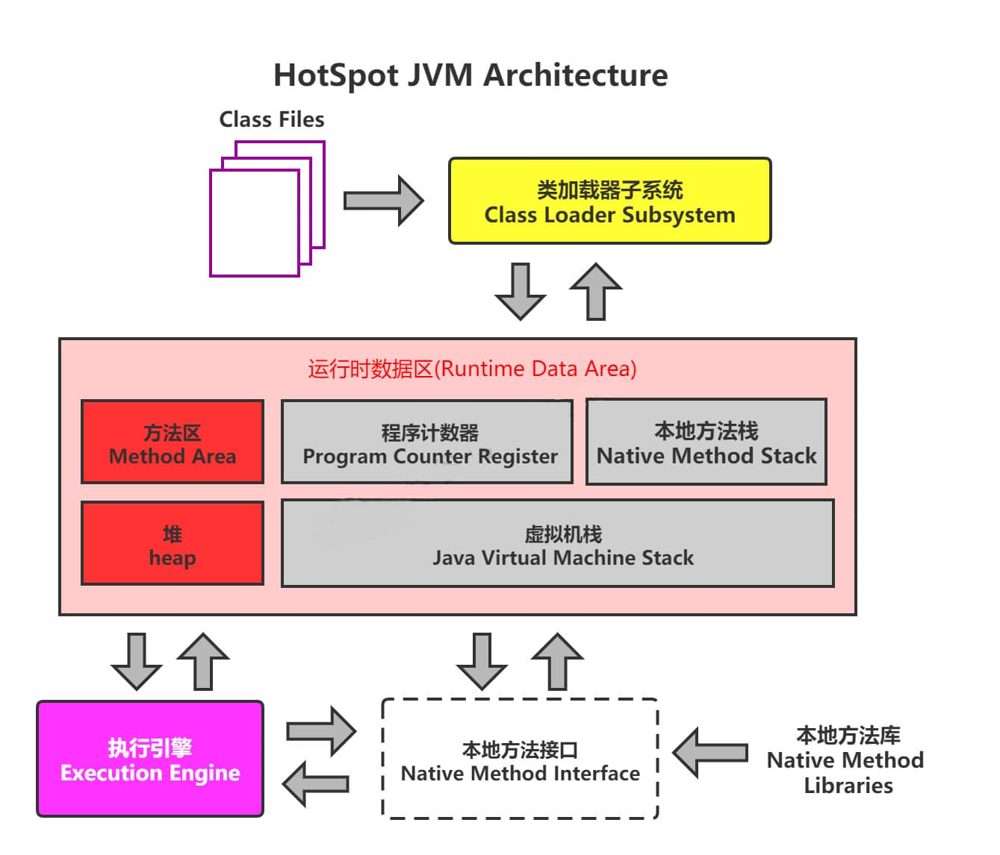
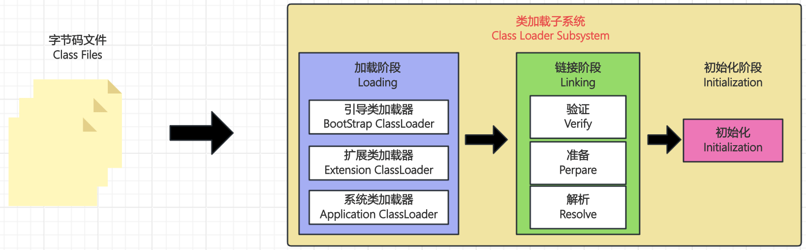
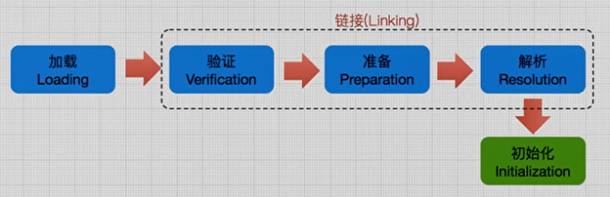
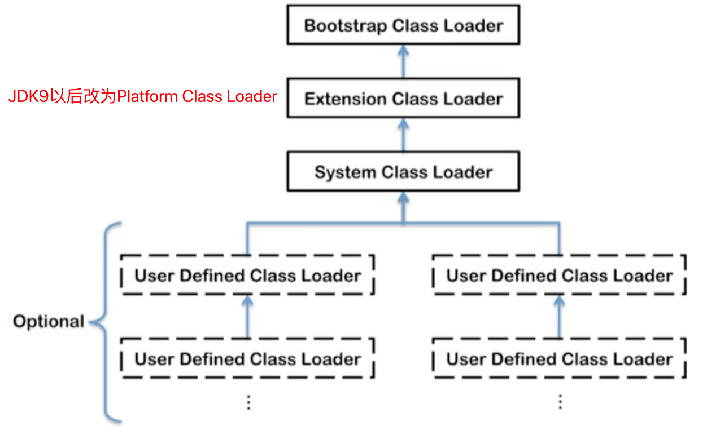
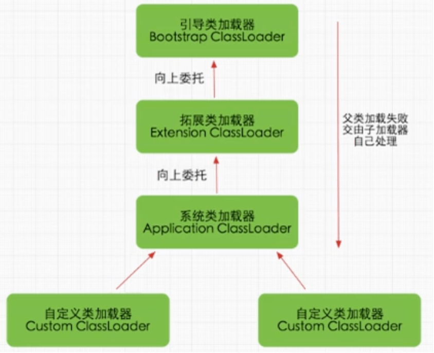
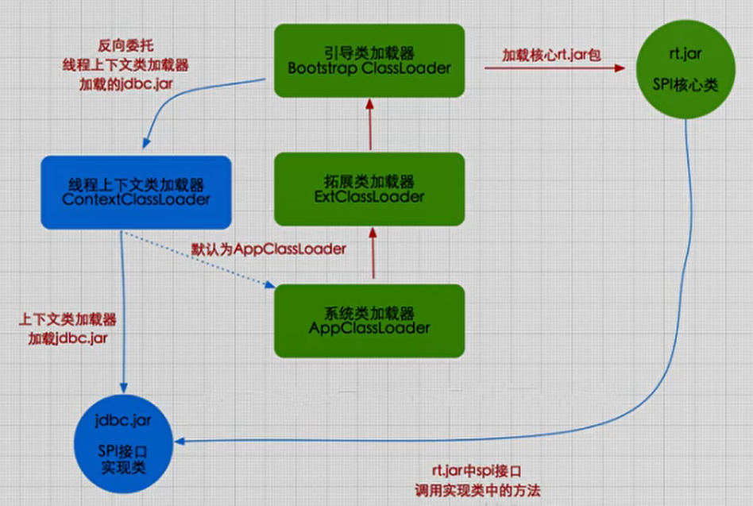

# 类加载子系统

## 内存结构概述



## 类加载器与类的加载过程



类加载器子系统负责从文件系统或者网络中加载Class文件，class文件在文件开头有特定的文件标识。

ClassLoader只负责class文件的加载，至于它是否可以运行，则由Execution Engine决定。

加载的类信息存放于一块称为方法区的内存空间。除了类的信息外，方法区中还会存放运行时常量池信息，可能还包括字符串字面量和数字常量（这部分常量信息是 Class文件中常量池部分的内存映射）

### 类加载过程



#### 加载

1. 通过一个类的全限定名获取定义此类的二进制字节流
2. 将这个字节流所代表的静态存储结构转化方法区的运行时数据结构
3. <span style="color:red">在内存中生成一个代表这个类的java.lang.Class对象</span>，作为方法区这个类的各种数据的访问入口

::: tip 补充：加载.class文件的方式
+ 从本地系统中直接加载
+ 通过网络获取，典型场景：Web Applet
+ 从zip压缩包中读取，成为日后jar、war格式的基础
+ 运行时计算生成，使用最多的是：动态代理技术
+ 由其他文件生成，典型场景：JSP应用
+ 从专有数据库中提取.class文件，比较少见
+ 从加密文件中获取，典型的防Class文件被反编译的保护措施

:::

#### 链接

##### 验证

+ 目的在于确保Class文件的字节流中包含信息符合当前虚拟机要求，保证被加载类的正确性，不会危害虚拟机自身安全。
+ 主要包括四种验证，文件格式验证，元数据验证，字节码验证，符号引用验证。

##### 准备

+ <span style="color:red">为类变量分配内存并且设置该类变量的默认初始值，即零值。</span>
+ <span style="color:blue">这里不包含用final修饰的static，因为final在编译的时候就会分配了，准备阶段会显式初始化；</span>
+ <span style="color:blue">这里不会为实例变量分配初始化</span>，类变量会分配在方法区中，而实例变量是会随着对象一起分配到Java堆中。

##### 解析

+ 将常量池内的符号引用转换为直接引用的过程。
+ 事实上，解析操作往往会伴随着JVM在执行完初始化之后再执行。
+ 符号引用就是一组符号来描述所引用的目标。符号引用的字面量形式明确定义在《java虚拟机规范》的Class文件格式中。直接引用就是直接指向目标的指针、相对偏移量或一个间接定位到目标的句柄。
+ 解析动作主要针对类或接口、字段、类方法、接口方法、方法类型等。对应常量池中的CONSTANT_Class_info、CONSTANT_Fieldref_info、 CONSTANT_Methodref_info等。

#### 初始化

+ <span style="color:blue">初始化阶段就是执行类构造器方法`<clinit>()`的过程。</span>
+ 此方法不需定义，是javac编译器自动收集类中的所有类变量的赋值动作和静态代码块中的语句合并而来。
+ 构造器方法中指令按语句在源文件中出现的顺序执行。
+ <span style="color:blue">`<clinit>()`不同于类的构造器</span>。（关联：构造器是虚拟机视角下的`<init>()`） 若该类具有父类，JVM会保证子类的`<clinit>()`执行前，父类的`<clinit>()`已经执行完毕。
+ 虚拟机必须保证一个类的`<clinit>()`方法在多线程下被同步加锁。

## 类加载器分类

JVM支持两种类型的类加载器，分别为<span style="color:red">引导类加载器(Bootstrap ClassLoader)</span>和<span style="color:red">自定义类加载器(User-Defined ClassLoader)</span>。

从概上来讲，自定义类加载器一般指的是程序中由开发人员自定义的一类类加载器，但是Java虚拟机规范却没有这么定义，而是<span style="color:red">将所有派生于抽象类 ClassLoader的类加载器都划分为自定义类加载器</span>。

无论类加载器的类型如何划分，在程序中我们最常见的类加载器始终只有3个，如下所示：



<span style="color:red">这里的四者之间的关系是包含关系。不是上层下层，也不是子父类的继承关系。</span>

```java
// 获取系统类加载器
ClassLoader systemClassLoader = ClassLoader.getSystemClassLoader();
System.out.println(systemClassLoader);// sun.misc.Launcher$AppClassLoader@18b4aac2
// 获取其上层: 扩展类加载器
ClassLoader extClassLoader = systemClassLoader.getParent();
System.out.println(extClassLoader);// sun.misc.Launcher$ExtClassLoader@6bc7c054
// 获取其上层: 获取不到引导类加载器
ClassLoader bootstrapClassLoader = extClassLoader.getParent();
System.out.println(bootstrapClassLoader);// null

// 对于用户自定义来说: 默认使用系统类加载器进行加载
ClassLoader classLoader = ClassLoaderTest.class.getClassLoader();
System.out.println(classLoader);// sun.misc.Launcher$AppClassLoader@18b4aac2
```

jdk9及以后

```java
// 获取系统类加载器
ClassLoader systemClassLoader = ClassLoader.getSystemClassLoader();
System.out.println(systemClassLoader);// jdk.internal.loader.ClassLoaders$AppClassLoader@1dbd16a6
// 获取其上层: 平台类加载器
ClassLoader platformClassLoader = systemClassLoader.getParent();
System.out.println(platformClassLoader);// jdk.internal.loader.ClassLoaders$PlatformClassLoader@543c6f6d
// 获取其上层: 获取不到引导类加载器
ClassLoader bootstrapClassLoader = platformClassLoader.getParent();
System.out.println(bootstrapClassLoader);// null

// 对于用户自定义来说: 默认使用系统类加载器进行加载
ClassLoader classLoader = TempTest.class.getClassLoader();
System.out.println(classLoader);// jdk.internal.loader.ClassLoaders$AppClassLoader@1dbd16a6
```

### 虚拟机自带的加载器

**启动类加载器(引导类加载器，Bootstrap ClassLoader)**

这个类加载使用C/C++语言实现的， 嵌套在JVM内部。

它用来加载Java的核心库（JAVA_HOME/jre/1ib/rt.jar、 resources.jar或sun.boot.ciass.path路径下的内容），用于提供JVM自身需要的类

并不继承自java.lang.ClassLoader，没有父加载器。

加载扩展类和应用程序类加载器，并指定为他们的父类加载器。

出于安全考虑，Bootstrap启动类加载器只加载包名为java、javax、sun等开头的类

**扩展类加载器(Extension ClassLoader)**

<span style="color:red">Java语言编写</span>，由sun.misc.Launcher$ExtClassLoader实现。

<span style="color:red">派生于ClassLoader类</span>

父类加载器启动类加载器

从java.ext.dirs系统属性所指定的目录中加载类库，或从JDK的安装目录的`jre/lib/ext`子目录（扩展目录）下加载类库。<span style="color:red">如果用户创建的JAR放在此目录下，也会自动由扩展类加载器加载</span>。

**应用程序类加载器(系统类加载器，AppClassLoader)**

java语言编写，由sun.misc.Launcher$AppClassLoader实现

派生于ClassLoader类

父类加载器为扩展类加载器

它负责加载环境变量classpath或系统属性 java.class.path 指定路径下的类库

<span style="color:red">该类加载是程序中默认的类加载器</span>，一般来说，Java应用的类都是由它来完成加载

通过`ClassLoader.getSystemClassLoader()`方法可以获取到该类加载器

**用户自定义类加载器**

在Java的日常应用程序开发中，类的加载几乎是由上述3种类加载器相互配合执行的，在必要时，我们还可以自定义类加载器，来定制类的加载方式。

::: tip 为什么要自定义类加载器？

+ 隔离加载类
+ 修改类加载的方式
+ 扩展加载源
+ 防止源码泄漏

:::

用户自定义类加载器实现步骤：

1. 开发人员可以通过继承抽象类`java.lang.ClassLoader`类的方式，实现自己的类加载器，以满足一些特殊的需求

2. 在JDK1.2之前，在自定义类加载器时，总会去继承ClassLoader类并重写`loadClass()`方法，从而实现自定义的类加载类，但是在JDK1.2之后已不再建议用户去覆盖`loadClass()`方法，而是建议把自定义的类加载逻辑写在`findClass()`方法中

3. 在编写自定义类加载器时，如果没有太过于复杂的需求，可以直接继承`URLClassLoader`类，这样就可以避免自己去编写`findClass()`方法及其获取字节码流的方式，使自定义类加载器编写更加简洁。

**获取类加载器加载的路径**

```java
System.out.println("-----引导类加载器-----");
// 获取BootstrapClassLoader能够加载的api的路径
URL[] urLs = Launcher.getBootstrapClassPath().getURLs();
for (URL urL : urLs) {
    System.out.println(urL);
}
System.out.println("-----扩展类加载器-----");
// 获取扩展类加载器加载的路径
String extensionDir = System.getProperty("java.ext.dirs");
for (String path : extensionDir.split(":")) {
    System.out.println(path);
}
```

结果如下(这里使用了%JAVA_HOME%替换了真实的jar路径)

```
-----引导类加载器-----
file:%JAVA_HOME%/jre/lib/resources.jar
file:%JAVA_HOME%/jre/lib/rt.jar
file:%JAVA_HOME%/jre/lib/sunrsasign.jar
file:%JAVA_HOME%/jre/lib/jsse.jar
file:%JAVA_HOME%/jre/lib/jce.jar
file:%JAVA_HOME%/jre/lib/charsets.jar
file:%JAVA_HOME%/jre/lib/jfr.jar
file:%JAVA_HOME%/jre/lib/cat.jar
file:%JAVA_HOME%/jre/classes
-----扩展类加载器-----
/Users/manaphy/Library/Java/Extensions
%JAVA_HOME%/jre/lib/ext
/Library/Java/Extensions
/Network/Library/Java/Extensions
/System/Library/Java/Extensions
/usr/lib/java
```

## ClassLoader的使用说明

**关于ClassLoader**

ClassLoader类，它是一个抽象类，其后所有的类加载器都继承自 ClassLoader（不包括启动类加载器）

**获取ClassLoader的途径**

方式一：获取当前类的ClassLoader

`clazz.getClassLoader()`

方式二：获取当前线程上下文的ClassLoader

`Thread.currentThread().getContextClassLoader()` 

方式三：获取系统的ClassLoader

`ClassLoader.getSystemClassLoader()`

方式四：获取调用者的ClassLoader

`DriverManager.getCallerClassLoader()`

## 双亲委派机制

> Java虚拟机对class文件采用的是<span style="color:red">按需加载</span>的方式，也就是说当需要使用该类时才会将它的class文件加载到内存生成class对象。而且加载某个类的class文件时，Java虚拟机采用的是<span style="color:red">双亲委派模式</span>，即把请求交由父类处理，它是一种任务委派模式。

### 工作原理

1. 如果一个类加载器收到了类加载请求，它并不会自己先去加载，而是把这个请求委托给父类的加载器去执行；

2. 如果父类加载器还存在其父类加载器，则进一步向上委托，依次递归，请求最终将到达项层的启动类加载器；

3. 如果父类加载器可以完成类加载任务，就成功返回，倘若父类加载器无法完成此加载任务，子加载器才会尝试自己去加载，这就是双亲委派模式。





**优势**

+ 避免类的重复加载
+ 保护程序安全，防止核心API被随意篡改

### 沙箱安全机制

自定义String类，但是在加载自定义String类的时候会率先使用引导类加载器加载，而引导类加载器在加载的过程中会先加载jdk自带的文件(rt. jar包中java\lang\String.class)，报错信息说没有main方法，就是因为加载的是rt.jar包中的String类。这样可以保证对java核心源代码的保护，这就是<span style="color:red">沙箱安全机制</span>。

## 其他

### 类的主动使用和被动使用

在JVM中表示两个class对象是否为同一个类存在两个必要条件：

1. 类的完整类名必须一致，包括包名。
2. 加载这个类的ClassLoader（指ClassLoader实例对象）必须相同。

换句话说，在JVM中，即使这两个类对象（class对象）来源同一个Class文件，被同一个虚拟机所加载，但只要加载它们的ClassLoader实例对象不同，那么这两个类对象也是不相等的。

JVM必须知道一个类型是由启动加载器加载的还是由用户类加载器加载的。如果一个类型是由用户类加载器加载的，那么JVM会<span style="color:red">将这个类加载器的一个引用作为类型信息的一部分保存在方法区中</span>。当解析一个类型到另一个类型的引用的时候，JVM需要保证这两个类型的类加载器是相同的。

**java程序对类的使用方式分为：主动使用和被动使用。**

主动使用，又分为七种情况：

1. 创建类的实例
2. 访问某个类或接口的静态变量，或者对该静态变量赋值
3. 调用类的静态方法
4. 反射（比如：Class.forName("com.cgp.Test")）
5. 初始化一个类的子类
6. java虚拟机启动时被标明为启动类的类
7. jdk7开始提供的动态语言支持：
   1. java.lang.invoke.MethodHandle实例的解析结果
   2. REF_getStatic,REF_putStatic,REF_invokeStatic句柄对应的类没有初始化，则初始化

除了以上七种情况，其他使用java类的方式都被看作是对<span style="color:red">类的被动使用</span>，都<span style="color:red">不会导致类的初始化</span>。
