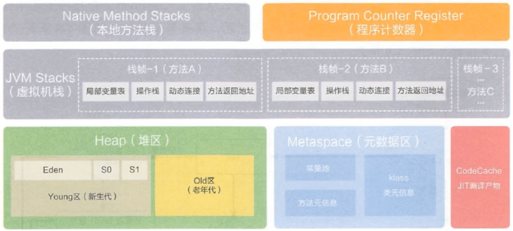
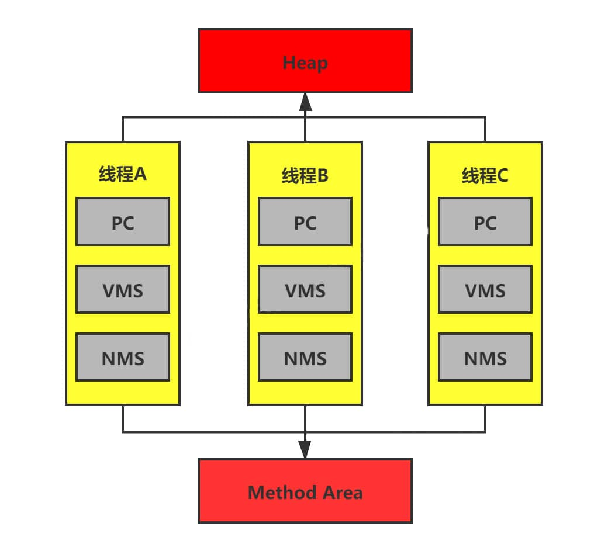
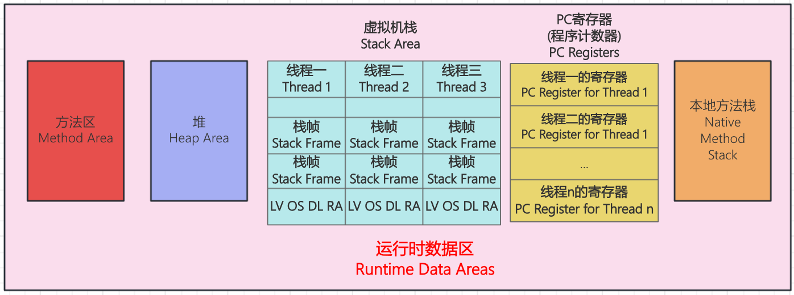
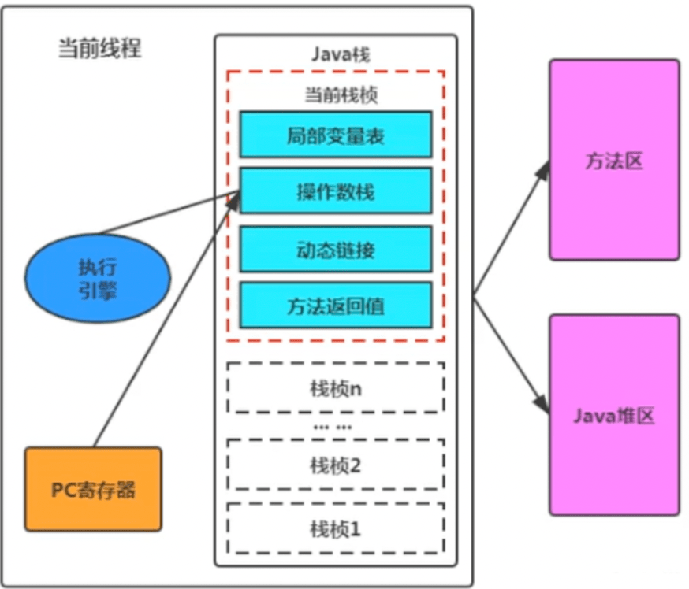
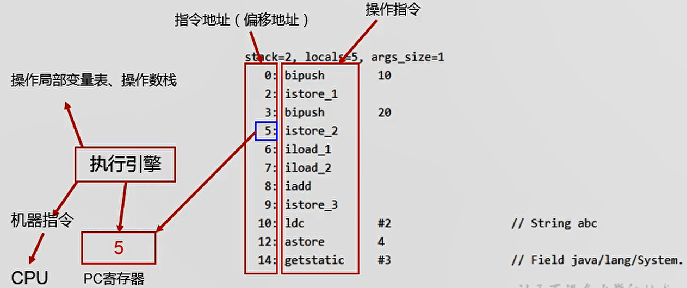

# 运行时数据区

## 运行时数据区概述

内存是非常重要的系统资源，是硬盘和CPU的中间仓库及桥梁，承载着操作系统和应用程序的实时运行。JVM内存布局规定了Java在运行过程中内存申请、分配、管理的策略，保证了JVM的高效稳定运行。不同的JVM对于内存的划分方式和管理机制存在着部分差异。结合JVM虚拟机规范，来探讨一下经典的JVM内存布局。

Java虚拟机定义了若干种程序运行期间会使用到的运行时数据区，其中有一些会随着虚拟机启动而创建，随着虚拟机退出而销毁。另外一些则是与线程一一对应的，这些与线程对应的数据区域会随着线程开始和结束而创建和销毁。

灰色的为单独线程私有的，红色的为多个线程共享的。即：

+ 每个线程：独立包括程序计数器、栈、本地栈。
+ 线程间共享：堆、堆外内存（永久代或元空间、代码缓存）

## 线程

线程是一个程序里的运行单元。JVM允许一个应用有多个线程并行的执行。

在Hotspot JVM里，每个线程都与操作系统的本地线程直接映射。

+ 当一个Java线程准备好执行以后，此时一个操作系统的本地线程也同时创建。Java线程执行终止后，本地线程也会回收。

操作系统负责所有线程的安排调度到任何一个可用的CPU上。一旦本地线程初始化成功，它就会调用Java线程中的`run()`方法。

如果你使用jconsole或者是任何一个调试工具，都能看到在后台有许多线程在运行。这些后台线程不包括调用`public static void main (String[])` 的main线程以及所有这个main线程自己创建的线程。

这些主要的后台系统线程在Hotspot JVM里主要是以下几个：

+ **虚拟机线程**：这种线程的操作是需要JVM达到安全点才会出现。这些操作必须在不同的线程中发生的原因是他们都需要JVM达到安全点，这样堆才不会变化。这种线程的执行类型包括"stop-the-world"的垃圾收集，线程栈收集，线程挂起以及偏向锁撤销。

+ **周期任务线程**：这种线程是时间周期事件的体现（比如中断），他们一般用于周期性操作的调度执行。

+ **GC线程**：这种线程对在JVM里不同种类的垃圾收集行为提供了支持。

+ **编译线程**：这种线程在运行时会将字节码编译成到本地代码。

+ **信号调度线程**：这种线程接收信号并发送给JVM，在它内部通过调用适当的方法进行处理。

## 程序计数器

JVM中的程序计数寄存器(Program Counter Register)中，Register的命名源于CPU的寄存器，寄存器存储指令相关的现场信息。CPU只有把数据装载到寄存器才能够运行。

这里，并非是广义上所指的物理寄存器，或许将其翻译为PC计数器(或指令计数器)会更加贴切(也称为程序钩子)，并且也不容易引起一些不必要的误会。JVM中的PC寄存器是对物理PC寄存器的一种抽象模拟。

::: info 作用

PC寄存器用来存储指向下一条指令的地址，也即将要执行的指令代码。由执行引擎读取下一条指令。 

:::

- 它是一块很小的内存空间，几乎可以忽略不记。也是运行速度最快的存储区域。
- 在JVM规范中，每个线程都有它自己的程序计数器，是线程私有的，生命周期与线程的生命周期保持一致。
- 任何时间一个线程都只有一个方法在执行，也就是所谓的当前方法。程序计数器会存储当前线程正在执行的Java方法的JVM指令地址；或者，如果是在执行native方法，则是未指定值(undefined)。
- 它是程序控制流的指示器，分支、循环、跳转、异常处理、线程恢复等基础功能都需要依赖这个计数器来完成。
- 字节码解释器工作时就是通过改变这个计数器的值来选取下一条需要执行的字节码指令。
- 它是唯一个 在Java 虚拟机规范 中没有规定任何OutOfMemoryError情况的区域。

**为什么使用PC寄存器记录当前线程的执行地址?**

因为CPU需要不停的切换各个线程，这时候切换回来以后，就得知道接着从哪开始继续执行。

JVM的字节码解释器就需要通过改变PC寄存器的值来明确下一条应该执行什么样的字节码指令。

**PC寄存器为什么会被设定为线程私有?**

我们都知道所谓的多线程在一个特定的时间段内只会执行其中某一个线程的方法，CPU会不停地做任务切换，这样必然导致经常中断或恢复，如何保证分毫无差呢?为了能够准确地记录各个线程正在执行的当前字节码指令地址，最好的办法自然是为每一个线程都分配一个PC寄存器，这样一来各个线程之间便可以进行独立计算，从而不会出现相互干扰的情况。

由于CPU时间片轮限制，众多线程在并发执行过程中，任何一个确定的时刻，一个处理器或者多核处理器中的一个内核，只会执行某个线程中的一条指令。

这样必然导致经常中断或恢复，如何保证分毫无差呢?每个线程在创建后，都会产生自己的程序计数器和栈帧，程序计数器在各个线程之间互不影响。

## [虚拟机栈](./03.虚拟机栈)

## 本地方法栈

Java虚拟机栈用于管理Java方法的调用，而本地方法栈用于管理本地方法的调用。

本地方法栈，也是线程私有的。

允许被实现成固定或者是可动态扩展的内存大小。(在内存溢出方面是相同的)

- 如果线程请求分配的栈容量超过本地方法栈允许的最大容量，Java虚拟机将会抛出一个StackOverflowError异常。

- 如果本地方法栈可以动态扩展，并且在尝试扩展的时候无法申请到足够的内存，或者在创建新的线程时没有足够的内存去创建对应的本地方法栈，那么Java虚拟机将会抛出一个OutOfMemoryError异常。

本地方法是使用C语言实现的。

它的具体做法是Native Method Stack中登记native方法，在Execution Engine执行时加载本地方法库。

当某个线程调用一个本地方法时，它就進入了一个全新的并且不再受虚拟机限制的世界。它和虚拟机拥有同样的权限。

+ 本地方法可以通过本地方法接口来访问虚拟机内部的运行时数据区。
+ 它甚至可以直接使用本地处理器中的寄存器
+ 直接从本地内存的堆中分配任意数量的内存。

并不是所有的JVM都支持本地方法。因为Java虚拟机规范并没有明确要求本地方法栈的使用语言、具体实现方式、数据结构等。如果JVM产品不打算支持native方法，也可以无需实现本地方法栈。

在Hotspot JVM中，直接将本地方法栈和虚拟机栈合二一。

## [堆](./04.堆)

## [方法区](./05.方法区)

