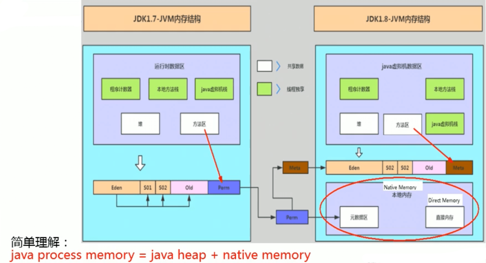
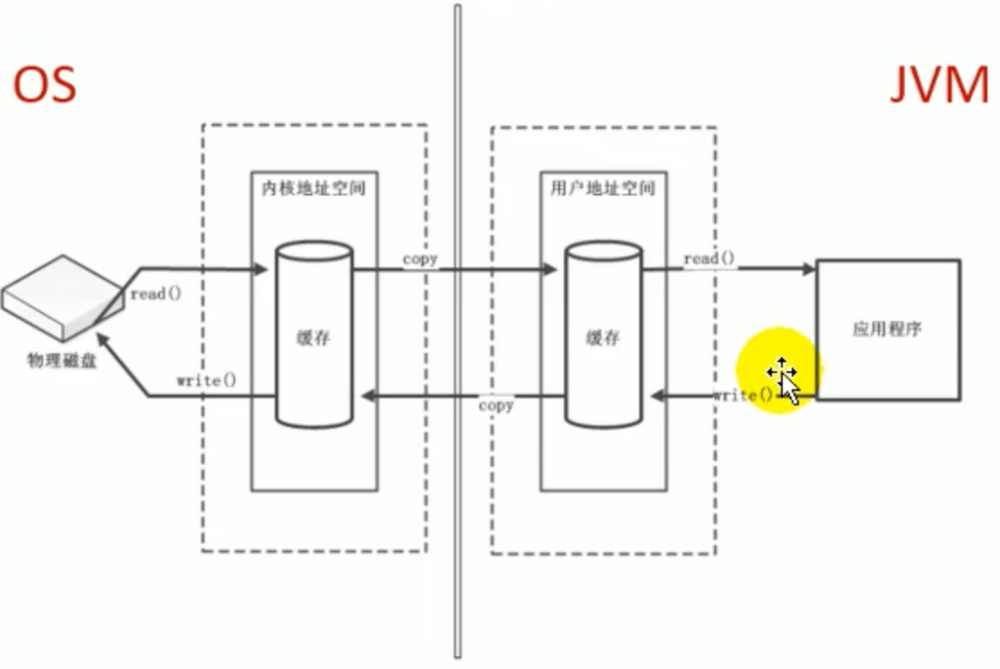
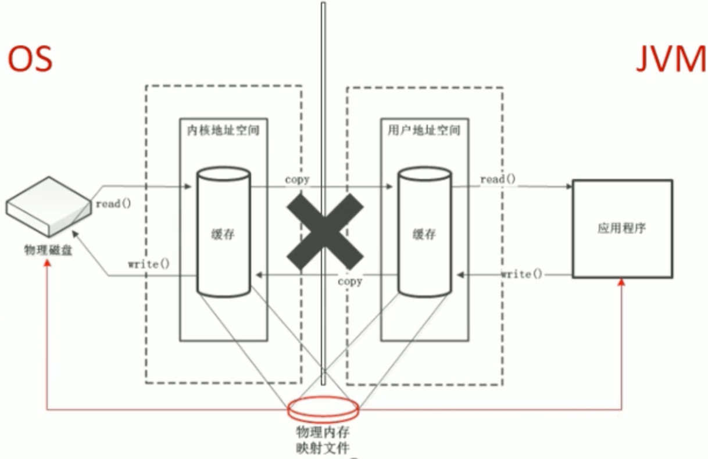

# JVM其他结构

## 本地方法接口

简单地讲，<span style="color:blue">一个Native Method就是一个Java调用非Java代码的接口</span>。一个Native Method是这样一个Java方法,该方法的实现由非Java语言实现，比如C。这个特征并非Java所特有，很多其它的编程语言都有这一机制，比如在C++中，你可以用extern "C" 告知C++编译器去调用一个C的函数。

在定义一个native method时，并不提供实现体(有些像定义一个Java interface)，因为其实现体是由非java语言在外面实现的。

本地接口的作用是融合不同的编程语言为Java所用，它的初衷是融合 C/C++程序。

**为什么要使用Native Method？**

Java使用起来非常方便，然而有些层次的任务用Java实现起来不容易，或者我们对程序的效率很在意时，问题就来了。

**1.与Java环境外交互：**

<span style="color:red">有时Java应用需要与Java外面的环境交互，这是本地方法存在的主要原因。</span>你可以想想Java需要与一些底层系统，如操作系统或某些硬件交换信息时的情况。本地方法正是这样一种交流机制：它为我们提供了一个非常简洁的接口， 而且我们无需去了解Java应用之外的繁琐的细节。

**2.与操作系统交互：**

JVM支持着Java语言本身和运行时库，它是Java程序赖以生存的平台，它由一个解释器（解释字节码）和一些连接到本地代码的库组成。然而不管怎样，它毕竟不是一个完整的系统，它经常依赖于一些底层系统的支持。这些底层系统常常是强大的操作系统。<span style="color:red">通过使用本地方法，我们得以用Java实现了jre的与底层系统的交互，甚至JVM 的一些部分就是用C写的</span>。还有，如果我们要使用一些Java语言本身没有提供封装的操作系统的特性时，我们也需要使用本地方法。

**3.Sun's Java**

Sun的解释器是用C实现的，这使得它能像一些普通的C一样与外部交互。jre大部分是用Java实现的，它也通过一些本地方法与外界交互。例如：类`java.lang.Thread` 的`setPriority()`方法是用Java实现的，但是它实现调用的是该类里的本地方法`setPriority0()`。这个本地方法是用C实现的，并被植入JVM内部，在windows 95 的平台上，这个本地方法最終将调用win32 SetPriority() API。这是一个本地方法的具体实现由JVM直接提供，更多的情况是本地方法由外部的动态链接库(external dynamic link library)提供，然后被JVM调用。

**现状**

<span style="color:red">目前该方法使用的越来越少了，除非是与硬件有关的应用</span>，比如通过Java程序驱动打印机或者Java系统管理生产设备，在企业级应用中己经比较少见。因为现在的异构领域间的通信很发达，比如可以使用Socket通信，也可以使用web service等等，不多做介绍。

## 直接内存(Direct Memory)

### 概述

不是虚拟机运行时数据区的一部分，也不是《Java虚拟机规范》中定义的内存区域。直接内存是在Java堆外的、直接向系统申请的内存区间。来源于NIO，通过存在堆中的DirectByteBuffer操作Native内存。通常，访问直接内存的速度会优于Java堆，即读写性能高。

- 因此出于性能考虑，读写频繁的场合可能会考虑使用直接内存。
- Java的NIO库允许Java程序使用直接内存，用于数据缓冲区

也可能导致OutOfMemoryError异常 `Exception in thread "main" java.lang.OutOfMemoryError: Direct buffer memory `

由于直接内存在Java堆外，因此它的大小不会直接受限于-Xmx指定的最大堆大小，但是系统内存是有限的，Java堆和直接内存的总和依然受限于操作系统能给出的最大内存。

**缺点**

- 分配回收成本较高
- 不受JVM内存回收管理

直接内存大小可以通过`MaxDirectMemorySize`设置。如果不指定，默认与堆的最大值-Xmx参数值一致



### 非直接缓存区

使用IO读写文件，需要与磁盘交互，需要由用户态切换到内核态。在内核态时，需要两份内存存储重复数据，效率低。



### 直接缓存区

使用NIO时，操作系统划出的直接缓存区可以被java代码直接访问，只有一份。NIO适合对大文件的读写操作。



### 使用本地内存读写数据测试

```java
public class BufferTest {
    private static final int _100Mb = 1024 * 1024 * 100;
    private static final String TO = "/Users/manaphy/Movies/1.mp4";

    @SneakyThrows
    public static void main(String[] args) {
        long sum = 0;
        for (int i = 0; i < 3; i++) {
            String dest = "/Users/manaphy/Movies/hoy/1_" + i + ".mp4";
            //sum = io(TO, dest);// 1099
            sum = directBuffer(TO, dest);// 644
        }
        System.out.printf("总花费的时间为:%d", sum);
    }


    private static long directBuffer(String src, String dest) throws Exception {
        long start = System.currentTimeMillis();
        @Cleanup FileChannel inChannel = new FileInputStream(src).getChannel();
        @Cleanup FileChannel outChannel = new FileOutputStream(dest).getChannel();

        ByteBuffer byteBuffer = ByteBuffer.allocateDirect(_100Mb);
        while (inChannel.read(byteBuffer) != -1) {
            byteBuffer.flip(); // 修改为读数据模式
            outChannel.write(byteBuffer);
            byteBuffer.clear(); // 清空
        }
        long end = System.currentTimeMillis();
        return end - start;
    }

    private static long io(String src, String dest) throws IOException {
        long start = System.currentTimeMillis();

        @Cleanup FileInputStream fis = new FileInputStream(src);
        @Cleanup FileOutputStream fos = new FileOutputStream(dest);
        byte[] buffer = new byte[_100Mb];
        while (true) {
            int len = fis.read(buffer);
            if (len == -1) {
                break;
            }
            fos.write(buffer, 0, len);
        }
        long end = System.currentTimeMillis();
        return end - start;
    }
}
```

可以看到使用直接内存所花费的时间比io要少

