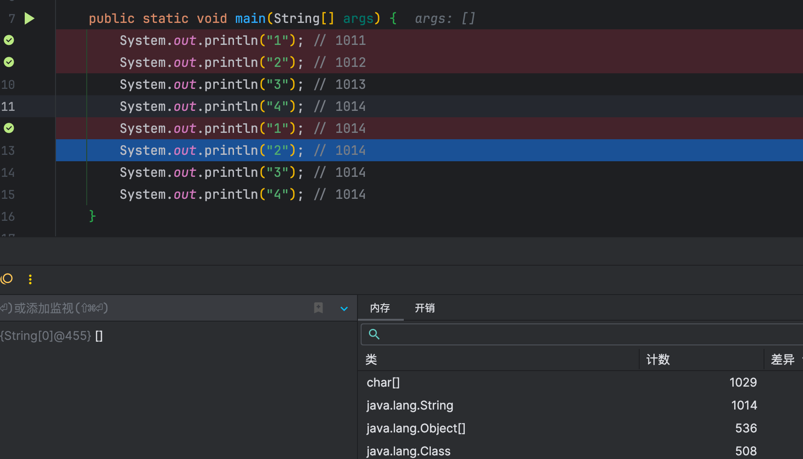
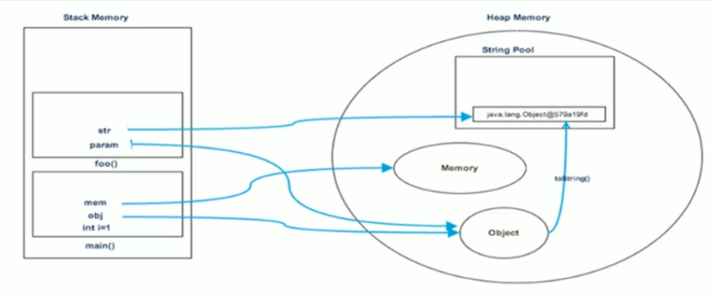
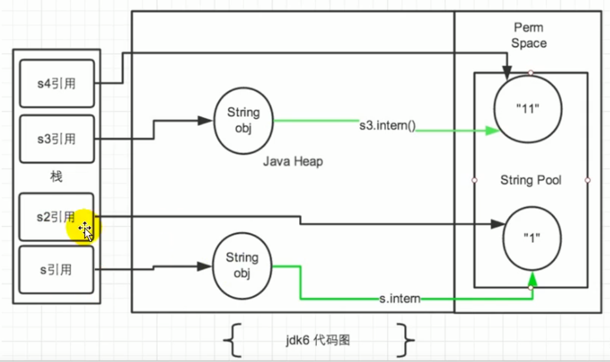

# StringTable

## String的基本特性

String：字符串，使用一对""引起来表示。

```java
String s1 = "hello"; // 字面量定义方式
String s2 = new String("world");
```

1. String声明为final的，不可被继承。
2. String实现了Serializable接口：表示字符串是支持序列化的。
3. String实现了Comparable接口：表示String可以比较大小
4. String在jdk8及以前内部定义了final char[] value用于存储字符串数据。JDK9时改为byte[]
5. String：代表不可变的字符序列。简称：不可变性。
   1. 当对字符串重新赋值时，需要重写指定内存区域赋值，不能使用原有的value进行赋值。
   2. 当对现有的字符串进行连接操作时，也需要重新指定内存区域赋值，不能使用原有的value进行赋值。
   3. 当调用string的replace()方法修改指定字符或字符串时，也需要重新指定内存区域赋值，不能使用原有的value进行赋值。
6. 通过字面量的方式（区别于new）给一个字符串赋值，此时的字符串值声明在字符串常量池中。
7. <span style="color:red;font-weight:bold">字符串常量池是不会存储相同内容的字符串的</span>
8. String的String Pool是一个固定大小的Hashtable，默认值大小长度是1009。如果放进String Pool的String非常多，就会造成Hash冲突严重，从而导致链表会很长，而链表长了后直接会造成的影响就是当调用String.intern时性能会大幅下降。
9. 使用`-XX:StringTablesize`可设置StringTable的长度
   1. 在jdk6中StringTable是固定的，就是1009的长度，所以如果常量池中的字符串过多就会导致效率下降很快。StringTablesize设置没有要求 
   2. 在jdk7中，StringTable的长度默认值是60013，StringTableSize设置没有要求 
   3. 在JDK8中，设置StringTable长度的话，1009是可以设置的最小值 


### String在jdk9中存储结构变更

::: details 原因

**Motivation**

The current implementation of the `String` class stores characters in a `char` array, using two bytes (sixteen bits) for each character. Data gathered from many different applications indicates that strings are a major component of heap usage and, moreover, that most `String` objects contain only Latin-1 characters. Such characters require only one byte of storage, hence half of the space in the internal `char` arrays of such `String` objects is going unused.

**Description**

We propose to change the internal representation of the `String` class from a UTF-16 `char` array to a `byte` array plus an encoding-flag field. The new `String` class will store characters encoded either as ISO-8859-1/Latin-1 (one byte per character), or as UTF-16 (two bytes per character), based upon the contents of the string. The encoding flag will indicate which encoding is used.

String-related classes such as `AbstractStringBuilder`, `StringBuilder`, and `StringBuffer` will be updated to use the same representation, as will the HotSpot VM's intrinsic string operations.

This is purely an implementation change, with no changes to existing public interfaces. There are no plans to add any new public APIs or other interfaces.

The prototyping work done to date confirms the expected reduction in memory footprint, substantial reductions of GC activity, and minor performance regressions in some corner cases.

::: right

[链接](https://openjdk.org/jeps/254)

:::

与字符串相关的类，如`AbstractStringBuilder`、`StringBuilder`和`StringBuffer`将被更新以使用相同的表示方法，HotSpot VM的内在字符串操作也是如此。

这纯粹是一个实现上的变化，对现有的公共接口没有变化。目前没有计划增加任何新的公共API或其他接口。

迄今为止所做的原型设计工作证实了内存占用的预期减少，GC活动的大幅减少，以及在某些角落情况下的轻微性能倒退。

结论：<span style="color:green">String再也不用char[] 来存储了，改成了byte [] 加上编码标记，节约了一些空间。</span>

```java
public final class String implements java.io.Serializable, Comparable<String>, CharSequence {
    @Stable
    private final byte[] value;
}
```

## String的内存分配

在Java语言中有8种基本数据类型和一种比较特殊的类型String。这些类型为了使它们在运行过程中速度更快、更节省内存，都提供了一种常量池的概念。

常量池就类似一个Java系统级别提供的缓存。8种基本数据类型的常量池都是系统协调的，<span style="color:red">String类型的常量池比较特殊。它的主要使用方法有两种</span>。

-  直接使用双引号声明出来的String对象会直接存储在常量池中。
-  如果不是用双引号声明的String对象，可以使用String提供的intern()方法。

Java 6及以前，字符串常量池存放在永久代。

Java 7 中 Oracle 的工程师对字符串池的逻辑做了很大的改变，即将<span style="color:red">字符串常量池的位置调整到Java堆内</span>。

+ 所有的字符串都保存在堆（Heap）中，和其他普通对象一样，这样可以让你在进行调优应用时仅需要调整堆大小就可以了。
+ 字符串常量池概念原本使用得比较多，但是这个改动使得我们有足够的理由让我们重新考虑在Java 7 中使用 `String.intern()`。

Java8元空间，字符串常量在堆。


**StringTable为什么要调整？**

::: details 原因

**Area:** HotSpot

**Synopsis:** In JDK 7, interned strings are no longer allocated in the permanent generation of the Java heap, but are instead allocated in the main part of the Java heap (known as the young and old generations), along with the other objects created by the application. This change will result in more data residing in the main Java heap, and less data in the permanent generation, and thus may require heap sizes to be adjusted. Most applications will see only relatively small differences in heap usage due to this change, but larger applications that load many classes or make heavy use of the `String.intern()` method will see more significant differences.

::: right

[链接](https://www.oracle.com/java/technologies/javase/jdk7-relnotes.html#jdk7changes)

:::

核心: 1.permSize默认比较小 2:永久代垃圾回收频率低


## String的基本操作



Java语言规范里要求完全相同的字符串字面量，应该包含同样的Unicode字符序列（包含同一份码点序列的常量），并且必须是指向同一个String类实例。

```java
class Memory {
    public static void main(String[] args) {//line 1
        int i= 1;//line 2
        Object obj = new Object();//line 3
        Memory mem = new Memory();//Line 4
        mem.foo(obj);//Line 5
    }//Line 9
    private void foo(Object param) {//line 6
        String str = param.toString();//line 7
        System.out.println(str);
    }//Line 8
}
```



## 字符串拼接操作

- 常量与常量的拼接结果在常量池，原理是编译期优化
- 常量池中不会存在相同内容的变量
- 只要其中有一个是变量，结果就在堆中。变量拼接的原理是StringBuilder
- 如果拼接的结果调用intern()方法，则主动将常量池中还没有的字符串对象放入池中，并返回此对象地址

**举例1**

```java
// 都是常量，前端编译期会进行代码优化
// 通过idea直接看对应的反编译的class文件，会显示 String s1 = "abc"; 说明做了代码优化
String s1 = "a" + "b" + "c";  
String s2 = "abc"; 

// true，有上述可知，s1和s2实际上指向字符串常量池中的同一个值
System.out.println(s1 == s2); 
```

**举例2**

```java
String s1 = "javaEE";
String s2 = "hadoop";

String s3 = "javaEEhadoop";
String s4 = "javaEE" + "hadoop";
// 如果拼接符号的前后出现了变量,则相当于在对空间new String(),具体的内容为拼接的结果: javaEEhadoop
String s5 = s1 + "hadoop";
String s6 = "javaEE" + s2;
String s7 = s1 + s2;

System.out.println(s3 == s4); // true 编译期优化
System.out.println(s3 == s5); // false s1是变量，不能编译期优化
System.out.println(s3 == s6); // false s2是变量，不能编译期优化
System.out.println(s3 == s7); // false s1、s2都是变量
System.out.println(s5 == s6); // false s5、s6 不同的对象实例
System.out.println(s5 == s7); // false s5、s7 不同的对象实例
System.out.println(s6 == s7); // false s6、s7 不同的对象实例
// intern():判断字符串常量池中是否存在javaEEhadoop值,如果存在,则返回常量池中javaEEhadoop的地址;
// 如果字符串常量池中不存在javaEEhadoop,则在常量池中加载一份javaEEhadoop,并返回此对象的地址。
String s8 = s6.intern();
System.out.println(s3 == s8); // true intern之后，s8和s3一样，指向字符串常量池中的"javaEEhadoop"
```

**举例3**

```java
String s0 = "beijing";
String s1 = "bei";
String s2 = "jing";
String s3 = s1 + s2;
System.out.println(s0 == s3); // false s3指向对象实例，s0指向字符串常量池中的"beijing"
String s7 = "shanxi";
final String s4 = "shan";
final String s5 = "xi";
String s6 = s4 + s5;
System.out.println(s6 == s7); // true s4和s5是final修饰的，编译期就能确定s6的值了
```

- 不使用final修饰，即为变量。如s3行的s1和s2，会通过new StringBuilder进行拼接
- 使用final修饰，即为常量。会在编译器进行代码优化。在实际开发中，能够使用final的，尽量使用

**举例4**

```java
String s1 = "a";
String s2 = "b";
String s3 = "ab";
String s4 = s1 + s2;
System.out.println(s3==s4);
```

**字节码**

我们拿例4的字节码进行查看，可以发现`s1 + s2`实际上是new了一个StringBuilder对象，并使用了append方法将s1和s2添加进来，最后调用了toString方法赋给s4

```
 0 ldc #2 <a>
 2 astore_1
 3 ldc #3 <b>
 5 astore_2
 6 ldc #4 <ab>
 8 astore_3
 9 new #5 <java/lang/StringBuilder>
12 dup
13 invokespecial #6 <java/lang/StringBuilder.<init>>
16 aload_1
17 invokevirtual #7 <java/lang/StringBuilder.append>
20 aload_2
21 invokevirtual #7 <java/lang/StringBuilder.append>
24 invokevirtual #8 <java/lang/StringBuilder.toString>
27 astore 4
29 getstatic #9 <java/lang/System.out>
32 aload_3
33 aload 4
35 if_acmpne 42 (+7)
38 iconst_1
39 goto 43 (+4)
42 iconst_0
43 invokevirtual #10 <java/io/PrintStream.println>
46 return
```

**字符串拼接操作性能对比**

```java
public class Test{
    public static void main(String[] args) {
        int times = 50000;

        // String
        long start = System.currentTimeMillis();
        testString(times);
        long end = System.currentTimeMillis();
        System.out.println("String: " + (end-start) + "ms");

        // StringBuilder
        start = System.currentTimeMillis();
        testStringBuilder(times);
        end = System.currentTimeMillis();
        System.out.println("StringBuilder: " + (end-start) + "ms");

        // StringBuffer
        start = System.currentTimeMillis();
        testStringBuffer(times);
        end = System.currentTimeMillis();
        System.out.println("StringBuffer: " + (end-start) + "ms");
    }

    public static void testString(int times) {
        String str = "";
        for (int i = 0; i < times; i++) {
            str += "test";
        }
    }

    public static void testStringBuilder(int times) {
        StringBuilder sb = new StringBuilder();
        for (int i = 0; i < times; i++) {
            sb.append("test");
        }
    }

    public static void testStringBuffer(int times) {
        StringBuffer sb = new StringBuffer();
        for (int i = 0; i < times; i++) {
            sb.append("test");
        }
    }
}

// 结果
String: 7963ms
StringBuilder: 1ms
StringBuffer: 4ms
```

本实验进行5万次循环，String拼接方式的时间是StringBuilder.append方式的约8000倍，StringBuffer.append()方式的时间是StringBuilder.append()方式的约4倍

可以看到，通过StringBuilder的append方式的速度，要比直接对String使用“+”拼接的方式快的不是一点半点

那么，在实际开发中，对于需要多次或大量拼接的操作，在不考虑线程安全问题时，我们就应该尽可能使用StringBuilder进行append操作

除此之外，还有那些操作能够帮助我们提高字符串方面的运行效率呢？

StringBuilder空参构造器的初始化大小为16。那么，如果提前知道需要拼接String的个数，就应该直接使用带参构造器指定capacity，以减少扩容的次数（扩容的逻辑可以自行查看源代码）

```java
/**
 * Constructs a string builder with no characters in it and an
 * initial capacity of 16 characters.
 */
public StringBuilder() {
    super(16);
}

/**
 * Constructs a string builder with no characters in it and an
 * initial capacity specified by the {@code capacity} argument.
 *
 * @param      capacity  the initial capacity.
 * @throws     NegativeArraySizeException  if the {@code capacity}
 *               argument is less than {@code 0}.
 */
public StringBuilder(int capacity) {
    super(capacity);
}
```

## intern()的使用

```java
/**
 * Returns a canonical representation for the string object.
 * <p>
 * A pool of strings, initially empty, is maintained privately by the
 * class {@code String}.
 * <p>
 * When the intern method is invoked, if the pool already contains a
 * string equal to this {@code String} object as determined by
 * the {@link #equals(Object)} method, then the string from the pool is
 * returned. Otherwise, this {@code String} object is added to the
 * pool and a reference to this {@code String} object is returned.
 * <p>
 * It follows that for any two strings {@code s} and {@code t},
 * {@code s.intern() == t.intern()} is {@code true}
 * if and only if {@code s.equals(t)} is {@code true}.
 * <p>
 * All literal strings and string-valued constant expressions are
 * interned. String literals are defined in section 3.10.5 of the
 * <cite>The Java&trade; Language Specification</cite>.
 *
 * @return  a string that has the same contents as this string, but is
 *          guaranteed to be from a pool of unique strings.
 */
public native String intern();
```

当调用intern方法时，如果池子里已经包含了一个与这个String对象相等的字符串，正如equals(Object)方法所确定的，那么池子里的字符串会被返回。否则，这个String对象被添加到池中，并返回这个String对象的引用。

由此可见，对于任何两个字符串s和t，当且仅当s.equals(t)为真时，s.intern() == t.intern()为真。

所有字面字符串和以字符串为值的常量表达式都是interned。

返回一个与此字符串内容相同的字符串，但保证是来自一个唯一的字符串池。

intern是一个native方法，调用的是底层C的方法

```java
public native String intern();
```

---

如果不是用双引号声明的String对象，可以使用String提供的intern方法，它会从字符串常量池中查询当前字符串是否存在，若不存在就会将当前字符串放入常量池中。

```java
String myInfo = new String("hello world").intern();
```

也就是说，如果在任意字符串上调用String.intern方法，那么其返回结果所指向的那个类实例，必须和直接以常量形式出现的字符串实例完全相同。因此，下列表达式的值必定是true

```java
("a"+"b"+"c").intern() == "abc"
```

通俗点讲，Interned string就是确保字符串在内存里只有一份拷贝，这样可以节约内存空间，加快字符串操作任务的执行速度。注意，这个值会被存放在字符串内部池（String Intern Pool）

### intern的使用：JDK6 vs JDK7/8

```java
/**
 * ① String s = new String("1")
 * 创建了两个对象
 * 		堆空间中一个new对象
 * 		字符串常量池中一个字符串常量"1"（注意：此时字符串常量池中已有"1"）
 * ② s.intern()由于字符串常量池中已存在"1"
 * 
 * s  指向的是堆空间中的对象地址
 * s2 指向的是堆空间中常量池中"1"的地址
 * 所以不相等
 */
String s = new String("1");
s.intern();
String s2 = "1";
System.out.println(s==s2); // jdk1.6 false jdk7/8 false

/*
 * ① String s3 = new String("1") + new String("1")
 * 等价于new String（"11"），但是，常量池中并不生成字符串"11"；
 *
 * ② s3.intern()
 * 由于此时常量池中并无"11"，所以把s3中记录的对象的地址存入常量池
 * 所以s3 和 s4 指向的都是一个地址
*/
String s3 = new String("1") + new String("1");
s3.intern();
String s4 = "11";
System.out.println(s3==s4); //jdk1.6 false jdk7/8 true
```




总结String的intern()的使用：

JDK1.6中，将这个字符串对象尝试放入串池。

- 如果串池中有，则并不会放入。返回已有的串池中的对象的地址
- 如果没有，会把<span style="color:blue">此对象复制一份</span>，放入串池，并返回串池中的对象地址

JDK1.7起，将这个字符串对象尝试放入串池。

- 如果串池中有，则并不会放入。返回已有的串池中的对象的地址
- 如果没有，则会把<span style="color:blue">对象的引用地址复制一份</span>，放入串池，并返回串池中的引用地址

### intern的效率测试：空间角度

我们通过测试一下，使用了intern和不使用的时候，其实相差还挺多的

```java
public class StringIntern2 {
    static final int MAX_COUNT = 1000 * 10000;
    static final String[] arr = new String[MAX_COUNT];

    public static void main(String[] args) {
        Integer [] data = new Integer[]{1,2,3,4,5,6,7,8,9,10};
        long start = System.currentTimeMillis();
        for (int i = 0; i < MAX_COUNT; i++) {
            // arr[i] = new String(String.valueOf(data[i%data.length]));
            arr[i] = new String(String.valueOf(data[i%data.length])).intern();
        }
        long end = System.currentTimeMillis();
        System.out.println("花费的时间为：" + (end - start));

        try {
            Thread.sleep(1000000);
        } catch (Exception e) {
            e.getStackTrace();
        }
    }
}

// 运行结果
不使用intern：7256ms
使用intern：1395ms
```

**结论**：对于程序中大量使用存在的字符串时，尤其存在很多已经重复的字符串时，使用intern()方法能够节省内存空间。

大的网站平台，需要内存中存储大量的字符串。比如社交网站，很多人都存储：北京市、海淀区等信息。这时候如果字符串都调用intern()方法，就会很明显降低内存的大小。

## StringTable的垃圾回收

```java
public class StringGCTest {
    /**
     * -Xms15m -Xmx15m -XX:+PrintGCDetails
     */
    public static void main(String[] args) {
        
        for (int i = 0; i < 100000; i++) {
            String.valueOf(i).intern();
        }
    }
}
```

```
[GC (Allocation Failure) [PSYoungGen: 4096K->504K(4608K)] 4096K->1689K(15872K), 0.0581583 secs] [Times: user=0.00 sys=0.00, real=0.06 secs] 
[GC (Allocation Failure) [PSYoungGen: 4600K->504K(4608K)] 5785K->2310K(15872K), 0.0015621 secs] [Times: user=0.00 sys=0.00, real=0.00 secs] 
[GC (Allocation Failure) [PSYoungGen: 4600K->504K(4608K)] 6406K->2350K(15872K), 0.0034849 secs] [Times: user=0.00 sys=0.00, real=0.00 secs] 
Heap
 PSYoungGen      total 4608K, used 1919K [0x00000000ffb00000, 0x0000000100000000, 0x0000000100000000)
  eden space 4096K, 34% used [0x00000000ffb00000,0x00000000ffc61d30,0x00000000fff00000)
  from space 512K, 98% used [0x00000000fff00000,0x00000000fff7e010,0x00000000fff80000)
  to   space 512K, 0% used [0x00000000fff80000,0x00000000fff80000,0x0000000100000000)
 ParOldGen       total 11264K, used 1846K [0x00000000ff000000, 0x00000000ffb00000, 0x00000000ffb00000)
  object space 11264K, 16% used [0x00000000ff000000,0x00000000ff1cd9b0,0x00000000ffb00000)
 Metaspace       used 3378K, capacity 4496K, committed 4864K, reserved 1056768K
  class space    used 361K, capacity 388K, committed 512K, reserved 1048576K
```

## G1中的String去重操作

::: details 官方说明

**Motivation**

Many large-scale Java applications are currently bottlenecked on memory. Measurements have shown that roughly 25% of the Java heap live data set in these types of applications is consumed by `String` objects. Further, roughly half of those `String` objects are duplicates, where duplicates means `string1.equals(string2)` is true. Having duplicate `String` objects on the heap is, essentially, just a waste of memory. This project will implement automatic and continuous `String` deduplication in the G1 garbage collector to avoid wasting memory and reduce the memory footprint.

::: right

[链接](https://openjdk.org/jeps/192)

:::

背景：对许多Java应用（有大的也有小的）做的测试得出以下结果：

- 堆存活数据集合里面string对象占了25%
- 堆存活数据集合里面重复的string对象有13.5%
- string对象的平均长度是45

许多大规模的Java应用的瓶颈在于内存，测试表明，在这些类型的应用里面，<span style="color:blue">Java堆中存活的数据集合差不多25%是String对象</span>。更进一步，这里面差不多一半string对象是重复的，重复的意思是说： `string1.equals(string2)=true`。<span style="color:blue">堆上存在重复的String对象必然是一种内存的浪费</span>。这个项目将在G1垃圾收集器中实现自动持续对重复的String对象进行去重，这样就能避免浪费内存。

**实现**

1. 当垃圾收集器工作的时候，会访问堆上存活的对象。<span style="color:blue">对每一个访问的对象都会检查是否是候选的要去重的String对象</span>
2. 如果是，把这个对象的一个引用插入到队列中等待后续的处理。一个去重的线程在后台运行，处理这个队列。处理队列的一个元素意味着从队列删除这个元素，然后尝试去重它引用的string对象。
3. 使用一个hashtable来记录所有的被String对象使用的不重复的char数组。当去重的时候，会查这个hashtable，来看堆上是否已经存在一个一模一样的char数组。
4. 如果存在，String对象会被调整引用那个数组，释放对原来的数组的引用，最终会被垃圾收集器回收掉。
5. 如果查找失败，char数组会被插入到hashtable，这样以后的时候就可以共享这个数组了。

**命令行选项**

```bash
# 开启String去重，默认是不开启的，需要手动开启。 
UseStringDeduplication(bool)  
# 打印详细的去重统计信息 
PrintStringDeduplicationStatistics(bool)  
# 达到这个年龄的String对象被认为是去重的候选对象
StringpeDuplicationAgeThreshold(uintx)
```

