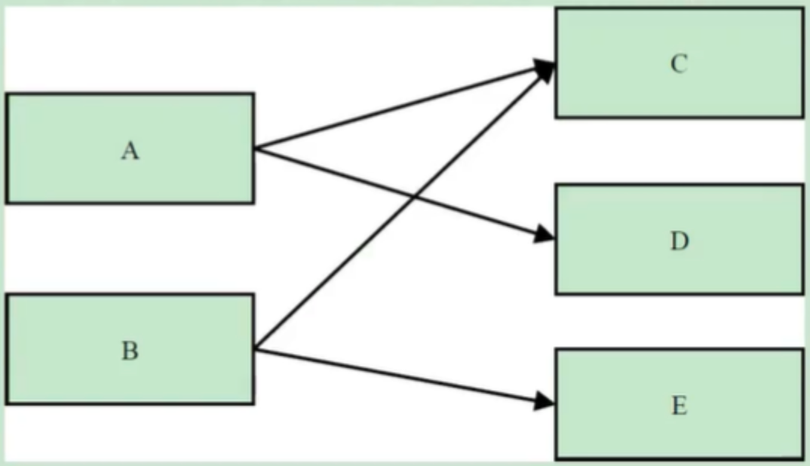
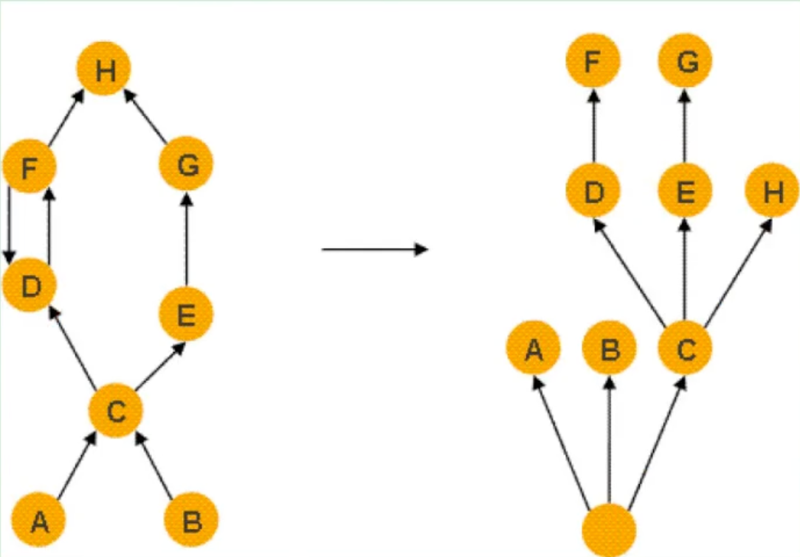
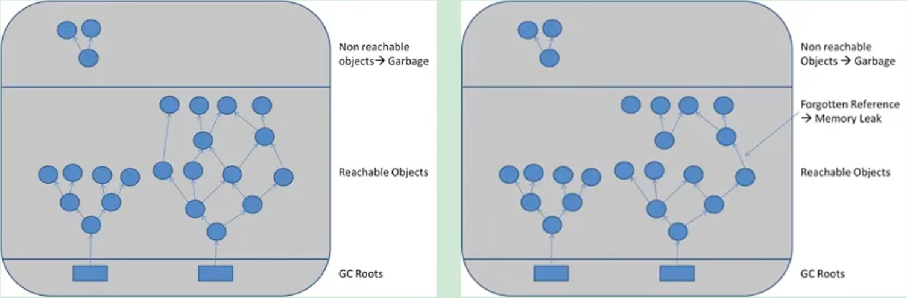
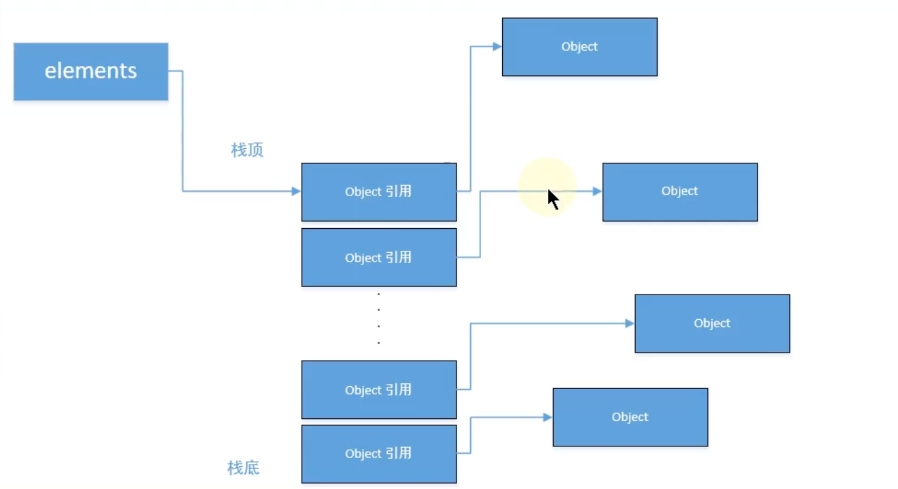
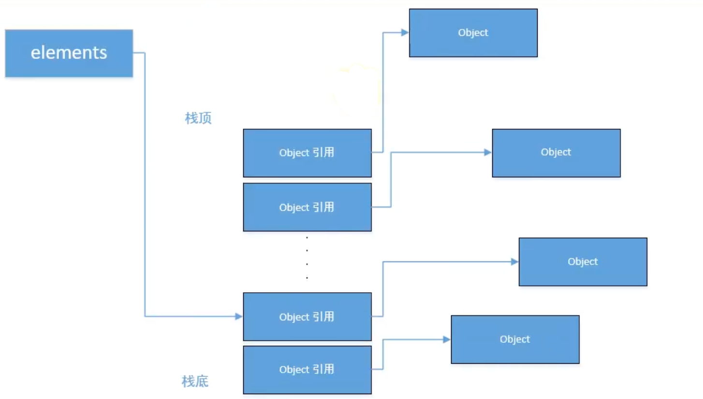

# 浅堆深堆内存泄露与OQL

## 1. 浅堆（Shallow Heap）

浅堆是指一个对象所消耗的内存。在32位系统中，一个对象引用会占据4个字节，一个int类型会占据4个字节，long型变量会占据8个字节，每个对象头需要占用8个字节。根据堆快照格式不同，对象的大小可能会同8字节进行对齐。

以String为例：2个int值共占8字节，对象引用占用4字节，对象头8字节，合计20字节，向8字节对齐，故占24字节。（jdk7中）

| int     | hash32    | 0                        |
| ------- | --------- | ------------------------ |
| **int** | **hash**  | **0**                    |
| **ref** | **value** | **C:\Users\Administrat** |

这24字节为String对象的浅堆大小。它与String的value实际取值无关，无论字符串长度如何，浅堆大小始终是24字节。

## 2. 保留集（Retained Set）

对象A的保留集指当对象A被垃圾回收后，可以被释放的所有的对象集合（包括对象A本身），即对象A的保留集可以被认为是只能通过对象A被直接或间接访问到的所有对象的集合。通俗地说，就是指仅被对象A所持有的对象的集合。

## 3. 深堆（Retained Heap）

深堆是指对象的保留集中所有的对象的浅堆大小之和。

注意：浅堆指对象本身占用的内存，不包括其内部引用对象的大小。一个对象的深堆指只能通过该对象访问到的（直接或间接）所有对象的浅堆之和，即对象被回收后，可以释放的真实空间。

## 4. 对象的实际大小

这里，对象的实际大小定义为一个对象所能触及的所有对象的浅堆大小之和，也就是通常意义上我们说的对象大小。与深堆相比，似乎这个在日常开发中更为直观和被人接受，但实际上，这个概念和垃圾回收无关。

下图显示了一个简单的对象引用关系图，对象A引用了C和D，对象B引用了C和E。那么对象A的浅堆大小只是A本身，不含C和D，而A的实际大小为A、C、D三者之和。而A的深堆大小为A与D之和，由于对象C还可以通过对象B访问到，因此不在对象A的深堆范围内。



## 5. 支配树（Dominator Tree）

> 支配树的概念源自图论。MAT提供了一个称为支配树（Dominator Tree）的对象图。支配树体现了对象实例间的支配关系。在对象引用图中，所有指向对象B的路径都经过对象A，则认为对象A支配对象B。如果对象A是离对象B最近的一个支配对象，则认为对象A为对象B的直接支配者。

支配树是基于对象间的引用图所建立的，它有以下基本性质：

- 对象A的子树（所有被对象A支配的对象集合）表示对象A的保留集（retained set），即深堆。
- 如果对象A支配对象B，那么对象A的直接支配者也支配对象B。
- 支配树的边与对象引用图的边不直接对应。


如下图所示：左图表示对象引用图，右图表示左图所对应的支配树。对象A和B由根对象直接支配，由于在到对象C的路径中，可以经过A，也可以经过B，因此对象C的直接支配者也是根对象。对象F与对象D相互引用，因为到对象F的所有路径必然经过对象D，因此，对象D是对象F的直接支配者。而到对象D的所有路径中，必然经过对象C，即使是从对象F到对象D的引用，从根节点出发，也是经过对象C的，所以，对象D的直接支配者为对象C。同理，对象E支配对象G。到达对象H的可以通过对象D，也可以通过对象E，因此对象D和E都不能支配对象H，而经过对象C既可以到达D也可以到达E，因此对象C为对象H的直接支配者。



## 6. 内存泄漏（memory leak）

可达性分析算法来判断对象是否是不再使用的对象，本质都是判断一个对象是否还被引用。那么对于这种情况下，由于代码的实现不同就会出现很多种内存泄漏问题（让JVM误以为此对象还在引用中，无法回收，造成内存泄漏）。

严格来说，只有对象不会再被程序用到了，但是GC又不能回收他们的情况，才叫内存泄漏。但实际情况很多时候一些不太好的实践（或疏忽）会导致对象的生命周期变得很长甚至导致00M，也可以叫做宽泛意义上的“内存泄漏”。

如下图，当Y生命周期结束的时候，X依然引用着Y，这时候，垃圾回收期是不会回收对象Y的；如果对象X还引用着生命周期比较短的A、B、C，对象A又引用着对象 a、b、c，这样就可能造成大量无用的对象不能被回收，进而占据了内存资源，造成内存泄漏，直到内存溢出。



申请了内存用完了不释放，比如一共有1024M的内存，分配了512M的内存一直不回收，那么可以用的内存只有512M了，仿佛泄露掉了一部分；通俗一点讲的话，内存泄漏就是【占着茅坑不拉shi】

## 7. 内存溢出（out of memory）

申请内存时，没有足够的内存可以使用；通俗一点儿讲，一个厕所就三个坑，有两个站着茅坑不走的（内存泄漏），剩下最后一个坑，厕所表示接待压力很大，这时候一下子来了两个人，坑位（内存）就不够了，内存泄漏变成内存溢出了。可见，内存泄漏和内存溢出的关系：内存泄漏的增多，最终会导致内存溢出。

泄漏的分类

- 经常发生：发生内存泄露的代码会被多次执行，每次执行，泄露一块内存；
- 偶然发生：在某些特定情况下才会发生
- 一次性：发生内存泄露的方法只会执行一次；
- 隐式泄漏：一直占着内存不释放，直到执行结束；严格的说这个不算内存泄漏，因为最终释放掉了，但是如果执行时间特别长，也可能会导致内存耗尽。

## 8. Java中内存泄露的8种情况

### 8.1. 静态集合类

静态集合类，如HashMap、LinkedList等等。如果这些容器为静态的，那么它们的生命周期与JVM程序一致，则容器中的对象在程序结束之前将不能被释放，从而造成内存泄漏。简单而言，长生命周期的对象持有短生命周期对象的引用，尽管短生命周期的对象不再使用，但是因为长生命周期对象持有它的引用而导致不能被回收。

```java
public class MemoryLeak {
    static List list = new ArrayList();
    public void oomTests(){
        Object obj＝new Object();//局部变量
        list.add(obj);
    }
}
```

### 8.2. 单例模式

单例模式，和静态集合导致内存泄露的原因类似，因为单例的静态特性，它的生命周期和 JVM 的生命周期一样长，所以如果单例对象如果持有外部对象的引用，那么这个外部对象也不会被回收，那么就会造成内存泄漏。

### 8.3. 内部类持有外部类

内部类持有外部类，如果一个外部类的实例对象的方法返回了一个内部类的实例对象。这个内部类对象被长期引用了，即使那个外部类实例对象不再被使用，但由于内部类持有外部类的实例对象，这个外部类对象将不会被垃圾回收，这也会造成内存泄漏。

### 8.4. 各种连接，如数据库连接、网络连接和IO连接等

在对数据库进行操作的过程中，首先需要建立与数据库的连接，当不再使用时，需要调用close方法来释放与数据库的连接。只有连接被关闭后，垃圾回收器才会回收对应的对象。否则，如果在访问数据库的过程中，对Connection、Statement或ResultSet不显性地关闭，将会造成大量的对象无法被回收，从而引起内存泄漏。

```java
public static void main(String[] args) {
    try{
        Connection conn =null;
        Class.forName("com.mysql.jdbc.Driver");
        conn =DriverManager.getConnection("url","","");
        Statement stmt =conn.createStatement();
        ResultSet rs =stmt.executeQuery("....");
    } catch（Exception e）{//异常日志
    } finally {
        // 1．关闭结果集 Statement
        // 2．关闭声明的对象 ResultSet
        // 3．关闭连接 Connection
    }
}
```

### 8.5. 变量不合理的作用域

变量不合理的作用域。一般而言，一个变量的定义的作用范围大于其使用范围，很有可能会造成内存泄漏。另一方面，如果没有及时地把对象设置为null，很有可能导致内存泄漏的发生。

```java
public class UsingRandom {
    private String msg;
    public void receiveMsg(){
        readFromNet();//从网络中接受数据保存到msg中
        saveDB();//把msg保存到数据库中
    }
}
```

如上面这个伪代码，通过readFromNet方法把接受的消息保存在变量msg中，然后调用saveDB方法把msg的内容保存到数据库中，此时msg已经就没用了，由于msg的生命周期与对象的生命周期相同，此时msg还不能回收，因此造成了内存泄漏。实际上这个msg变量可以放在receiveMsg方法内部，当方法使用完，那么msg的生命周期也就结束，此时就可以回收了。还有一种方法，在使用完msg后，把msg设置为null，这样垃圾回收器也会回收msg的内存空间。

### 8.6. 改变哈希值

改变哈希值，当一个对象被存储进HashSet集合中以后，就不能修改这个对象中的那些参与计算哈希值的字段了。

否则，对象修改后的哈希值与最初存储进HashSet集合中时的哈希值就不同了，在这种情况下，即使在contains方法使用该对象的当前引用作为的参数去HashSet集合中检索对象，也将返回找不到对象的结果，这也会导致无法从HashSet集合中单独删除当前对象，造成内存泄漏。

这也是 String 为什么被设置成了不可变类型，我们可以放心地把 String 存入 HashSet，或者把String 当做 HashMap 的 key 值；

当我们想把自己定义的类保存到散列表的时候，需要保证对象的 hashCode 不可变。

```java
public class ChangeHashcode {

    public static void main(String[] args) {
        Set<Person> set = new HashSet<>();
        Person p1 = new Person(1, "AA");
        Person p2 = new Person(2, "BB");

        set.add(p1);
        set.add(p2);
        p1.setName("CC");
        set.remove(p1);
        System.out.println(set);
    }
}

@Data
@AllArgsConstructor
class Person {
    private Integer id;
    private String name;
}
```

### 8.7. 缓存泄露

内存泄漏的另一个常见来源是缓存，一旦你把对象引用放入到缓存中，他就很容易遗忘。比如：之前项目在一次上线的时候，应用启动奇慢直到夯死，就是因为代码中会加载一个表中的数据到缓存（内存）中，测试环境只有几百条数据，但是生产环境有几百万的数据。

对于这个问题，可以使用WeakHashMap代表缓存，此种Map的特点是，当除了自身有对key的引用外，此key没有其他引用那么此map会自动丢弃此值。

```java
public class MapTest {
    static Map wMap = new WeakHashMap();
    static Map map = new HashMap();

    public static void main(String[] args) {
        init();
        testWeakHashMap();
        testHashMap();
    }

    public static void init() {
        String ref1 = new String("obejct1");
        String ref2 = new String("obejct2");
        String ref3 = new String("obejct3");
        String ref4 = new String("obejct4");
        wMap.put(ref1, "cacheObject1");
        wMap.put(ref2, "cacheObject2");
        map.put(ref3, "cacheObject3");
        map.put(ref4, "cacheObject4");
        System.out.println("String引用ref1，ref2，ref3，ref4 消失");

    }

    public static void testWeakHashMap() {
        System.out.println("WeakHashMap GC之前");
        for (Object o : wMap.entrySet()) {
            System.out.println(o);
        }
        try {
            System.gc();
            TimeUnit.SECONDS.sleep(5);
        } catch (InterruptedException e) {
            e.printStackTrace();
        }
        System.out.println("WeakHashMap GC之后");
        for (Object o : wMap.entrySet()) {
            System.out.println(o);
        }
    }

    public static void testHashMap() {
        System.out.println("HashMap GC之前");
        for (Object o : map.entrySet()) {
            System.out.println(o);
        }
        try {
            System.gc();
            TimeUnit.SECONDS.sleep(5);
        } catch (InterruptedException e) {
            e.printStackTrace();
        }
        System.out.println("HashMap GC之后");
        for (Object o : map.entrySet()) {
            System.out.println(o);
        }
    }

}
```

上面代码和图示主演演示WeakHashMap如何自动释放缓存对象，当init函数执行完成后，局部变量字符串引用weakd1，weakd2，d1，d2都会消失，此时只有静态map中保存中对字符串对象的引用，可以看到，调用gc之后，HashMap的没有被回收，而WeakHashMap里面的缓存被回收了。

### 8.8. 监听器和其他回调

内存泄漏第三个常见来源是监听器和其他回调，如果客户端在你实现的API中注册回调，却没有显示的取消，那么就会积聚。

需要确保回调立即被当作垃圾回收的最佳方法是只保存它的弱引用，例如将他们保存成为WeakHashMap中的键。

## 9. 内存泄露案例分析

```java
public class Stack {
    private Object[] elements;
    private int size = 0;
    private static final int DEFAULT_INITIAL_CAPACITY = 16;

    public Stack() {
        elements = new Object[DEFAULT_INITIAL_CAPACITY];
    }

    public void push(Object e) { //入栈
        ensureCapacity();
        elements[size++] = e;
    }

    public Object pop() { //出栈
        if (size == 0)
            throw new EmptyStackException();
        return elements[--size];
    }

    private void ensureCapacity() {
        if (elements.length == size)
            elements = Arrays.copyOf(elements, 2 * size + 1);
    }
}
```

上述程序并没有明显的错误，但是这段程序有一个内存泄漏，随着GC活动的增加，或者内存占用的不断增加，程序性能的降低就会表现出来，严重时可导致内存泄漏，但是这种失败情况相对较少。

代码的主要问题在pop函数，下面通过这张图示展现。假设这个栈一直增长，增长后如下图所示



当进行大量的pop操作时，由于引用未进行置空，gc是不会释放的，如下图所示



从上图中看以看出，如果栈先增长，再收缩，那么从栈中弹出的对象将不会被当作垃圾回收，即使程序不再使用栈中的这些队象，他们也不会回收，因为栈中仍然保存这对象的引用，俗称过期引用，这个内存泄露很隐蔽。

将代码中的pop()方法变成如下方法：

```java
public Object pop() {
    if (size == 0)
        throw new EmptyStackException();
    Object result = elements[--size];
    elements[size] = null;
    return result;
}
```

一旦引用过期，清空这些引用，将引用置空。

## 10. 使用OQL语言查询对象信息

MAT支持一种类似于SQL的查询语言OQL（Object Query Language）。OQL使用类SQL语法，可以在堆中进行对象的查找和筛选。

### 1. SELECT子句

在MAT中，Select子句的格式与SQL基本一致，用于指定要显示的列。Select子句中可以使用“＊”，查看结果对象的引用实例（相当于outgoing references）。

```sql
SELECT * FROM java.util.Vector v
```

使用“OBJECTS”关键字，可以将返回结果集中的项以对象的形式显示。

```sql
SELECT objects v.elementData FROM java.util.Vector v

SELECT OBJECTS s.value FROM java.lang.String s
```

在Select子句中，使用“AS RETAINED SET”关键字可以得到所得对象的保留集。

```sql
SELECT AS RETAINED SET * FROM com.atguigu.mat.Student
```

“DISTINCT”关键字用于在结果集中去除重复对象。

```sql
SELECT DISTINCT OBJECTS classof(s) FROM java.lang.String s
```

### 2. FROM子句

From子句用于指定查询范围，它可以指定类名、正则表达式或者对象地址。

```sql
SELECT * FROM java.lang.String s
```

使用正则表达式，限定搜索范围，输出所有com.cgp包下所有类的实例

```sql
SELECT * FROM "com\.cgp\..*"
```

使用类的地址进行搜索。使用类的地址的好处是可以区分被不同ClassLoader加载的同一种类型。

```sql
select * from 0x37a0b4d
```

### 3. WHERE子句


Where子句用于指定OQL的查询条件。OQL查询将只返回满足Where子句指定条件的对象。Where子句的格式与传统SQL极为相似。

返回长度大于10的char数组。

```sql
SELECT *FROM Ichar[] s WHERE s.@length>10
```

返回包含“java”子字符串的所有字符串，使用“LIKE”操作符，“LIKE”操作符的操作参数为正则表达式。

```sql
SELECT * FROM java.lang.String s WHERE toString(s) LIKE ".*java.*"
```

返回所有value域不为null的字符串，使用“＝”操作符。

```sql
SELECT * FROM java.lang.String s where s.value!=null
```

返回数组长度大于15，并且深堆大于1000字节的所有Vector对象。

```sql
SELECT * FROM java.util.Vector v WHERE v.elementData.@length>15 AND v.@retainedHeapSize>1000
```

## 4. 内置对象与方法

OQL中可以访问堆内对象的属性，也可以访问堆内代理对象的属性。访问堆内对象的属性时，格式如下，其中alias为对象名称：

```sql
[ <alias>. ] <field> . <field>. <field>
```

访问java.io.File对象的path属性，并进一步访问path的value属性：

```sql
SELECT toString(f.path.value) FROM java.io.File f
```

显示String对象的内容、objectid和objectAddress。

```sql
SELECT s.toString(),s.@objectId, s.@objectAddress FROM java.lang.String s
```

显示java.util.Vector内部数组的长度。

```sql
SELECT v.elementData.@length FROM java.util.Vector v
```

显示所有的java.util.Vector对象及其子类型

```sql
select * from INSTANCEOF java.util.Vector
```

