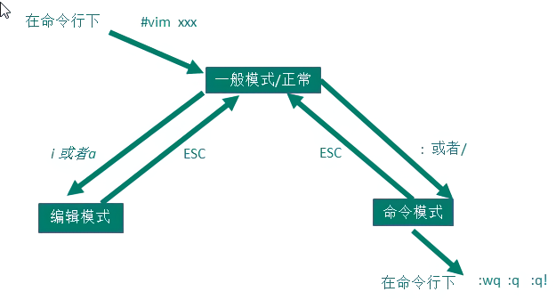

> 所有的 Linux 系统都会内建 vi 文本编辑器。
> Vim 具有程序编辑的能力，可以看做是 Vi 的增强版本，可以主动的以字体颜色辨别语法的正确性，方便程序设计。代码补完、编译及错误跳转等方便编程的功能特别丰富，在程序员中被广泛使用。


# vi 和 vim 的三种常见模式
## 正常模式
在正常模式下，我们可以使用快捷键。

以 vim 打开一个档案就直接进入一般模式了(这是默认的模式)。在这个模式中， 你可以使用『上下左右』按键来移动光标，你可以使用『删除字符』或『删除整行』来处理档案内容， 也可以使用『复制、贴上』来处理你的文件数据。
## 插入模式/编辑模式
在模式下，程序员可以输入内容。

按下 <kbd>i</kbd>, <kbd>I</kbd>, <kbd>o</kbd>, <kbd>O</kbd>, <kbd>a</kbd>, <kbd>A</kbd>, <kbd>r</kbd>, <kbd>R</kbd> 等任何一个字母之后才会进入编辑模式,  一般来说按 i 即可
## 命令行模式
在这个模式当中， 可以提供你相关指令，完成读取、存盘、替换、离开 vim 、显示行号等的动作则是在此模式中达成的！




# 快捷键的使用案例

1. 拷贝当前行`yy` ,  拷贝当前行向下的 5 行 `5yy`，并粘贴（p）。
2. 删除当前行`dd`, 删除当前行向下的 5 行 `5dd`
3. 在文件中查找某个单词  [命令行下`/关键字`， 回车  查找  ,	输入 `n` 就是查找下一个 ]
4. 设置文件的行号，取消文件的行号[命令行下`:set nu`和`:set nonu`]
5. 编辑 /etc/profile 文件，使用快捷键到底文档的最末行[G]和最首行[gg],注意这些都是在正常模式下执行的。
6. 在一个文件中输入"hello" ,然后又撤销这个动作，再正常模式下输入`u`
7. 编辑 /etc/profile 文件，并将光标移动到第 20 行	shift+g
8. 显示行号 :set nu

## 一般模式快捷键
| **移动光标** | **说明** |
| :-- | :-- |
| <kbd>h</kbd> <kbd>j</kbd> <kbd>k</kbd> <kbd>l</kbd> | 对应(←)(↓)(↑)(→)方向键 |
| <kbd>Ctrl</kbd>+<kbd>f</kbd> [<kbd>Page Down</kbd>] | 屏幕向下移动一页 |
| <kbd>Ctrl</kbd>+<kbd>b</kbd> [<kbd>Page up</kbd>] | 屏幕向上移动一页 |
| <kbd>Ctrl</kbd>+<kbd>d</kbd> | 屏幕向下移动半页 |
| <kbd>Ctrl</kbd>+<kbd>u</kbd> | 屏幕向上移动半页 |
| <span style="color:blue">n</span> <kbd>Space</kbd> | n为数字。将光标向右移动 n 格 |
| <kbd>0</kbd> [<kbd>Home</kbd>] | 移动到这一行的最前面字符处 |
| <kbd>$</kbd> [<kbd>End</kbd>] | 移动到这一行的最后面字符处 |
| <kbd>H</kbd> | 光标移动到当前屏幕的最上方那一行的第一个字符 |
| <kbd>M</kbd> | 光标移动到当前屏幕的中间那一行的第一个字符 |
| <kbd>L</kbd> | 光标移动到当前屏幕的最下方那一行的第一个字符 |
| <kbd>G</kbd> | 移动到这个文档的最后一行 |
| <span style="color:blue">n</span><kbd>G</kbd> | n为数字。移动到这个档案的第 n 行(配合:set nu) |
| <kbd>g</kbd><kbd>g</kbd> | 移动到这个档案的第一行，相当于1G |
| <span style="color:blue">n</span> <kbd>Enter</kbd> | n为数字。光标向下移动 n 行 |

| **搜索替换** | **说明** |
| :-- | :-- |
| /word | 向光标之下寻找一个名称为word的字符串 |
| ?word | 向光标之上寻找一个名称为word的字符串 |
| 搜索之后输入 n | 重复前一个搜寻动作 |
| 搜索之后输入 N | 与 n 相反，为反向搜寻 |


| **复制粘贴删除** | **说明** |
| :-- | :-- |
| <kbd>x</kbd> [<kbd>Delete</kbd>]，<kbd>X</kbd> [<kbd>Backspace</kbd>] | 剪切字符 |
| <span style="color:blue">n</span><kbd>x</kbd> | n为数字。连续向后剪切 n 个字符 |
| <kbd>d</kbd><kbd>d</kbd> | 删除整行 |
| <span style="color:blue">n</span><kbd>d</kbd><kbd>d</kbd> | n为数字。删除光标所在的向下 n 行 |
| <kbd>d</kbd><kbd>1</kbd><kbd>G</kbd> | 删除光标所在到第一行的所有数据 |
| <kbd>d</kbd><kbd>G</kbd> | 删除光标所在到最后一行的所有数据 |
| <kbd>d</kbd><kbd>$</kbd> | 删除游标所在处，到该行的最后一个字符 |
| <kbd>d</kbd><kbd>0</kbd> | 那个是数字的 0 ，删除游标所在处，到该行的最前面一个字符 |
| <kbd>y</kbd><kbd>y</kbd> | 复制游标所在的那一行 |
| <span style="color:blue">n</span><kbd>y</kbd><kbd>y</kbd> | n 为数字。复制光标所在的向下 n 行 |
| <kbd>y</kbd><kbd>1</kbd><kbd>G</kbd> | 复制游标所在行到第一行的所有数据 |
| <kbd>y</kbd><kbd>G</kbd> | 复制游标所在行到最后一行的所有数据 |
| <kbd>y</kbd><kbd>0</kbd> | 复制光标所在的那个字符到该行行首的所有数据 |
| <kbd>y</kbd><kbd>$</kbd> | 复制光标所在的那个字符到该行行尾的所有数据 |
| <kbd>p</kbd> ; <kbd>P</kbd> | p 为将已复制的数据在光标下一行贴上，P 则为贴在游标上一行 |
| <kbd>J</kbd> | 将光标所在行与下一行的数据结合成同一行 |
| <kbd>c</kbd> | 重复删除多个数据，例如向下删除 10 行，[ 10cj ] |
| <kbd>u</kbd> | 复原前一个动作。 |
| <kbd>Ctrl</kbd>+<kbd>r</kbd> | 重做上一个动作。 |

## 一般模式切换到编辑模式
| 按键           | 英文    | 说明                                                   |
| :-- | :-- | :-- |
| <kbd>i</kbd> | insert | 在当前光标处之前插入 |
| <kbd>I</kbd> | Insert | 到行首插入 |
| <kbd>a</kbd> | append | 在当前光标处之后附加 |
| <kbd>A</kbd> | Append | 到行尾附加 |
| <kbd>o</kbd> |  | 新增下一行 |
| <kbd>O</kbd> |  | 新增上一行 |
| <kbd>r</kbd> | replace | (取代模式) 只会取代光标所在的那一个字符一次 |
| <kbd>R</kbd> | Replace | (取代模式) 会一直取代光标所在的文字，直到按下 ESC 为止 |
| <kbd>Esc</kbd> |  | 退出编辑模式，回到一般模式中 |

## 一般模式切换到指令行模式
| 命令                     | 说明                                                         |
| :-- | :-- |
| :w | 将编辑的数据写入硬盘档案中 |
| :w! | 若文件属性为『只读』时，强制写入该档案。 |
| :q  | 仅退出 |
| :q! | 不保存退出 |
| :wq | 储存后离开，若为 :wq! 则为强制储存后离开 |
| <kbd>Z</kbd><kbd>Z</kbd> | 保存并退出 |
| :w [filename] | 将编辑的数据储存成另一个档案（类似另存新档） |
| :r [filename] | 在编辑的数据中，读入另一个档案的数据。<br />亦即将『filename』 这个档案内容加到游标所在行后面 |
| :n1,n2 w [filename] | 将 n1 到 n2 的内容储存成 filename 这个档案。 |
| :! command | 暂时离开 vi 到指令行模式下执行 command 的显示结果！<br />例如『:! ls /home』即可在 vi 当中看 /home 底下以 ls 输出的档案信息！ |
| :set nu | 显示行号，设定之后，会在每一行的前缀显示该行的行号 |
| :set nonu | 与 set nu 相反，为取消行号！ |

# Vim配置
```bash
manaphy@ManaphydeMacBook-Pro ~ % vim --version
VIM - Vi IMproved 8.2 (2019 Dec 12, compiled Apr 19 2022 21:42:29)
macOS version - arm64
Included patches: 1-4113
Compiled by root@apple.com
Normal version without GUI.  Features included (+) or not (-):
...
   system vimrc file: "$VIM/vimrc"
     user vimrc file: "$HOME/.vimrc"
 2nd user vimrc file: "~/.vim/vimrc"
      user exrc file: "$HOME/.exrc"
       defaults file: "$VIMRUNTIME/defaults.vim"
  fall-back for $VIM: "/usr/share/vim"
Compilation: gcc -c -I. -Iproto -DHAVE_CONFIG_H   -DMACOS_X_UNIX  -g -O2 -U_FORTIFY_SOURCE -D_FORTIFY_SOURCE=1
Linking: gcc   -L/usr/local/lib -o vim        -lm -lncurses  -liconv -framework Cocoa

manaphy@ManaphydeMacBook-Pro ~ % vim $HOME/.vimrc
set number

```
