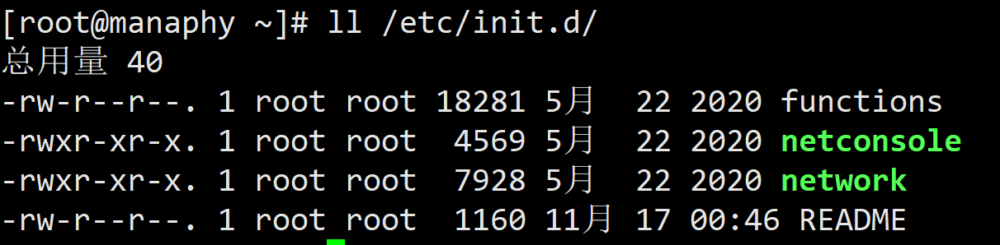

> 在 LINUX 中，每个执行的程序都称为一个进程。每一个进程都分配一个 ID 号(pid，进程号)
>
> 每个进程都可能以两种方式存在的。前台与后台，所谓前台进程就是用户目前的屏幕上可以进行操作的。后台进程则是实际在操作，但由于屏幕上无法看到的进程，通常使用后台方式执行。
>
> 一般系统的服务都是以后台进程的方式存在，而且都会常驻在系统中。直到关机才才结束。

## 相关命令
```bash
ps -ef	#查看所有进程
ps -ef | grep java	#过滤出你需要的进程
ps -e -o "%C : %p : %z : %a"|sort -k5 -nr #查看进程 按内存从大到小排列
ps -e -o "%C : %p : %z : %a"|sort -nr #查看进程 按cpu利用率从大到小排列

kill -s name	#kill指定名称的进程
kill -s pid	#kill指定pid的进程

top	#实时显示进程状态

vmstat 1 20	#每1秒采一次系统状态，采20次
iostat	#查看IO读写/CPU使用情况
sar -u 1 10	#查询CPU使用情况(1秒一次，共10次)
sar -d 1 10	#查询磁盘性能
```
## ps 显示系统执行的进程
ps 命令是用来查看目前系统中，有哪些正在执行，以及它们执行的状况，英文全称为processes。可以不加任何参数
```bash
ps -a #显示所有进程（包括其他用户的进程）
ps -u #用户以及其他详细信息
ps -x #显示没有控制终端的进程
ps -aux #常用,是SYSTEM风格的,内容如下
USER        PID %CPU %MEM    VSZ   RSS TTY      STAT START   TIME COMMAND
root          1  0.0  0.3 193588  6624 ?        Ss   17:46   0:00 /usr/lib/systemd/systemd --switched-root --system --deserialize 22
root          2  0.0  0.0      0     0 ?        S    17:46   0:00 [kthreadd]
root          4  0.0  0.0      0     0 ?        S<   17:46   0:00 [kworker/0:0H]
root          5  0.0  0.0      0     0 ?        S    17:46   0:00 [kworker/u256:0]
root          6  0.0  0.0      0     0 ?        S    17:46   0:00 [ksoftirqd/0]
root          7  0.0  0.0      0     0 ?        S    17:46   0:00 [migration/0]

ps -aux|grep sshd #查看特定的进程
```

| **参数** | **作用** |
| :-- | :-- |
| PID | 进程号 |
| %CPU | 进程占用 CPU 的百分比 |
| %MEM | 进程占用物理内存的百分比 |
| VSZ | 进程占用的虚拟内存大小(单位：KB) |
| RSS | 进程占用的物理内存大小(单位：KB) |
| TTY | 所在终端 |
| STAT | 进程状态  |
| START | 进程的启动时间 |
| TIME | CPU 时间，即进程使用 CPU 的总时间 |
| COMMAND | 启动进程所用的命令和参数，如果过长会被截断显示 |

进程状态5种常见状态

- **R**(运行)：进程正在运行或在运行队列中等待
- **S**(中断)：进程处于休眠中， 当某个条件形成后或者接收到信号时， 则脱离该状态
- **D**(不可中断)：进程不响应系统异步信号，即便用 kill 命令也不能将其中断。
- **Z**(僵死)：进程已经终止，但进程描述符依然存在, 直到父进程调用 wait4()系统函数后将进程释放
- **T**(停止)：进程收到停止信号后停止运行。

进程状态5种补充形式

- <：高优先级
- N：低优先级
- L：被锁进内存
- s：包含子进程
- l：多线程
| **UID** | **用户ID** |
| :-- | :-- |
| PID | 进程ID |
| PPID | 父进程ID |
| C | CPU 用于计算执行优先级的因子。<br />数值越大，表明进程是 CPU 密集型运算，执行优先级会降低；<br />数值越小，表明进程是 I/O 密集型运算，执行优先级会提高 |
| STIME | 进程启动的时间 |
| TTY | 完整的终端名称 |
| TIME | CPU 时间 |
| CMD | 启动进程所用的命令和参数 |

## pstree 查看进程树
```bash
[root@manaphy ~]# pstree
systemd─┬─NetworkManager───2*[{NetworkManager}]
        ├─agetty
        ├─auditd───{auditd}
        ├─crond
        ├─dbus-daemon───{dbus-daemon}
        ├─firewalld───{firewalld}
        ├─irqbalance
        ├─master─┬─pickup
        │        └─qmgr
        ├─polkitd───6*[{polkitd}]
        ├─rsyslogd───2*[{rsyslogd}]
        ├─sshd───sshd───bash───pstree
        ├─systemd-journal
        ├─systemd-logind
        ├─systemd-udevd
        └─tuned───4*[{tuned}]
 pstree -p #显示进程的 PID
 pstree -u #显示进程的所属用户
```
## systemctl 服务管理
> 服务(service) 本质就是进程，但是是运行在后台的，通常都会监听某个端口，等待其它程序的请求，比如(mysqld , sshd防火墙等)，因此我们又称为守护进程，是 Linux 中非常重要的知识点。

**service 管理指令**

1. service 服务名 [start | stop | restart | reload | status]
2. 在 CentOS7.0 后很多服务不再使用 service，而是 systemctl
3. service 指令管理的服务在 /etc/init.d 查看(绿色的)


```bash
service network status #查看状态
service network stop #停止
service network start #开启
```
**服务的运行级别(runlevel)**

Linux 系统有 7 种运行级别(runlevel)：常用的是级别 3 和 5

运行级别 0：系统停机状态，系统默认运行级别不能设为 0，否则不能正常启动

运行级别 1：单用户工作状态，root 权限，用于系统维护，禁止远程登陆

运行级别 2：多用户状态(没有 NFS)，不支持网络

运行级别 3：完全的多用户状态(有 NFS)，无界面，登陆后进入控制台命令行模式运行级别 4：系统未使用，保留

运行级别 5：X11 控制台，登陆后进入图形 GUI 模式

运行级别 6：系统正常关闭并重启，默认运行级别不能设为 6，否则不能正常启动

详见 2.4 实用指令→指定运行级别

开机的流程说明


**chkconfig 指令**
> 通过 chkconfig  命令可以给服务的各个运行级别设置自 启动/关闭
> chkconfig 指令管理的服务在 /etc/init.d  查看
> 注意: Centos7.0  后，很多服务使用 systemctl  管理

```bash
[root@manaphy ~]# chkconfig --list #0~6代表运行级别;开:表示自启动 关:表示没有自启动
netconsole     	0:关	1:关	2:关	3:关	4:关	5:关	6:关
network        	0:关	1:关	2:开	3:开	4:开	5:开	6:关
chkconfig network --list #查看某服务的自启动情况
chkconfig --level 3 network off #对network服务操作自启动,命令需要重启生效
chkconfig --level 3 network on
```
**systemctl 管理指令**
> 基本语法: systemctl [start | stop | restart | status] 服务名
> systemctl 指令管理的服务在 /usr/lib/systemd/system 查看

```bash
systemctl list-unit-files	[ | grep 服务名] (查看服务开机启动状态, grep 可以进行过滤) 
systemctl enable 服务名 (设置服务开机启动)
systemctl disable 服务名 (关闭服务开机启动)
systemctl is-enabled 服务名 (查询某个服务是否是自启动的)

systemctl status firewalld #查看防火墙状态
systemctl stop firewalld #关闭防火墙(临时生效,重启后失效)
systemctl start firewalld #开启防火墙(临时生效,重启后失效)
```
**打开或者关闭指定端口**
```bash
firewall-cmd --permanent --add-port=端口号/协议 #打开端口
firewall-cmd --permanent --remove-port=端口号/协议
firewall-cmd --reload #重新载入才能生效
firewall-cmd --query-port=端口/协议 #查询端口是否开放
```
## top 动态监控进程
> top 与 ps 命令很相似。它们都用来显示正在执行的进程。top 与 ps 最大的不同之处，在于 top 在执行一段时间可以更新正在运行的的进程。

```bash
top -d #指定top命令每隔几秒更新;默认3秒
top -i #使top不显示任何闲置或者僵死的进程
top -p #通过指定监控进程ID来仅仅监控某个进程的状态。
```
**指令内容解析**
```bash
#top-->当前时间 系统运行时间,用户数量,负载均衡(分别是1分钟、5分钟、15分钟的负载情况)
top - 21:10:03 up  3:23,  1 user,  load average: 0.00, 0.01, 0.02

# Tasks:-->总任务数:1个在运行,95个在休眠,0个是停止,0个僵死进程
Tasks:  96 total,   1 running,  95 sleeping,   0 stopped,   0 zombie

#%Cpu(s):-->CPU占用情况(百分比):us 用户,sy 系统,id 空闲,wa IO等待,hi 硬中断(Hardware IRQ),si  软中断(Software Interrupts)
%Cpu(s):  0.0 us,  0.0 sy,  0.0 ni,100.0 id,  0.0 wa,  0.0 hi,  0.0 si,  0.0 st

#KiB Mem :-->内存占用情况:总内存,空闲内存,使用内存,缓存
KiB Mem :  1863032 total,  1381280 free,   204136 used,   277616 buff/cache

#KiB Swap:-->swap分区内存使用情况:总内存,空闲内存,使用内存,可获取的内存
KiB Swap:  2097148 total,  2097148 free,        0 used.  1506700 avail Mem 

# PID — 进程id
# USER — 进程所有者
# PR — 进程优先级
# NI — nice值 负值表示高优先级，正值表示低优先级
# VIRT — 进程使用的虚拟内存总量，单位kb VIRT=SWAP+RES
# RES — 进程使用的、未被换出的物理内存大小，单位kb RES=CODE+DATA
# SHR — 共享内存大小，单位kb
# S — 进程状态  D=不可中断的睡眠状态 R=运行 S=睡眠 T=跟踪/停止 Z=僵尸进程
# %CPU — 上次更新到现在的CPU时间占用百分比
# %MEM — 进程使用的物理内存百分比
# TIME+ — 进程使用的CPU时间总计，单位1/100秒
# COMMAND — 进程名称（命令名/命令行）
   PID USER      PR  NI    VIRT    RES    SHR S  %CPU %MEM     TIME+ COMMAND                                    
  1557 root      20   0  161972   2180   1548 R   0.3  0.1   0:00.16 top                                        
     1 root      20   0  193588   6700   4172 S   0.0  0.4   0:01.01 systemd                                    
     2 root      20   0       0      0      0 S   0.0  0.0   0:00.00 kthreadd  
```
**交互操作说明**

| 交互按键                     | 说明                               |
| :--------------------------- | :--------------------------------- |
| <kbd>q</kbd>                 | 退出`top`命令                      |
| <kbd>h</kbd>                 | 显示帮助信息，列出可用的键盘快捷键 |
| <kbd>P</kbd>                 | 以CPU使用率排序，默认就是此项      |
| <kbd>M</kbd>                 | 以内存的使用率排序                 |
| <kbd>H</kbd>                 | 将线程视图转换为进程视图           |
| <kbd>u</kbd>                 | 以用户为单位来显示进程             |
| <kbd>\<</kbd>和<kbd>\></kbd> | 切换进程排序方式                   |
| <kbd>s</kbd>                 | 修改刷新频率                       |
| <kbd>1</kbd>                 | 显示单个CPU的多核心详细信息        |
| <kbd>k</kbd>                 | 杀死选中的进程                     |
| <kbd>r</kbd>                 | 修改进程的优先级                   |

## nice 调整进程的优先级
```bash
nice -n -20 bash #将 bash 服务的优先级调整到最高
```
## pidof 查询指定服务进程的pid
```bash
pidof sshd
```
## kill 终止进程
> 若是某个进程执行一半需要停止时，或是已消了很大的系统资源时，此时可以考虑停止该进程。使用 kill 命令来完成此项任务。

```bash
kill [选项] 进程号 #通过进程号终止进程
killall 进程名称 #通过进程名称杀死进程，也支持通配符
kill -9 进程号 #强迫进程立即停止
```
