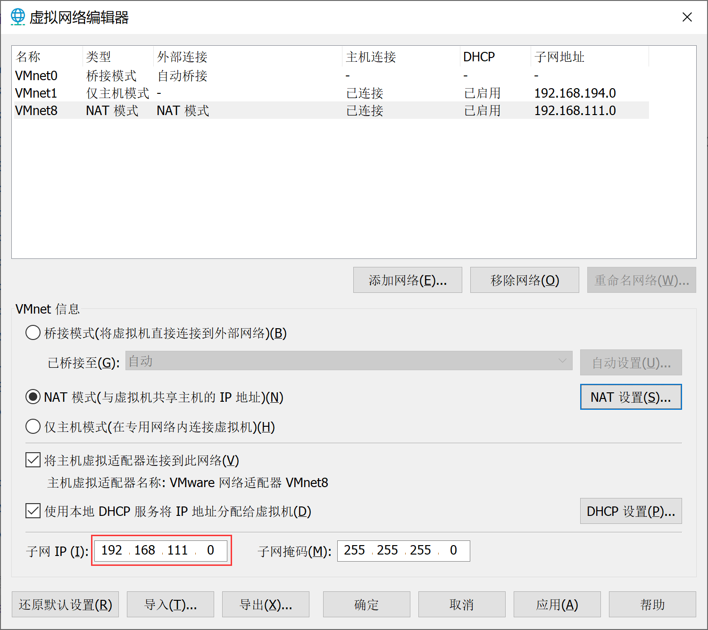

# 相关命令
```bash
ifconfig	#查看网络接口属性
ifconfig eth0	#查看某网卡的配置
route -n	#查看路由表
netstat -lntp	#查看所有监听端口
netstat -antp	#查看已经建立的TCP连接
netstat -lutp	#查看TCP/UDP的状态信息
ifup eth0	#启用eth0网络设备
ifdown eth0	#禁用eth0网络设备
iptables -L	#查看iptables规则
ifconfig eth0 192.168.1.1 netmask 255.255.255.0	#配置ip地址
dhclient eth0	#以dhcp模式启用eth0
route add -net 0/0 gw Gateway_IP	#配置默认网关
route add -net 192.168.0.0 netmask 255.255.0.0 gw 192.168.1.1	#配置静态路由到达网络'192.168.0.0/16'
route del 0/0 gw Gateway_IP	#删除静态路由
hostname	#查看主机名
host www.baidu.com	#解析主机名
nslookup www.baidu.com	#查询DNS记录,查看域名解析是否正常
```
# netstat 监控网络状态
```bash
netstat -an #按一定顺序排列输出
netstat -p #显示哪个进程在调用
netstat -anp | grep sshd #查看服务名为 sshd 的服务的信息
netstat -tulnp # 查看端口占用
:<<!
-a 显示所有连接中的 Socket
-p 显示占用端口的进程名和PID
-t 显示 TCP 协议的连接状态
-u 显示 UDP 协议的连接状态
-n 以数字形式显示 IP 地址和端口号
-l 仅列出正在监听的服务状态
-i 现在网卡列表信息
-r 显示路由表信息
!

[root@manaphy system]# netstat -an |more
Active Internet connections (servers and established)
:<<!
Proto:网络协议;Local Address:本地地址;Foreign Address:外部地址;State状态
State状态类型-->LISTEN:监听;ESTABLISHED:建立连接;TIME_WAIT:超时等待
!
Proto Recv-Q Send-Q Local Address           Foreign Address         State      
tcp        0      0 0.0.0.0:22              0.0.0.0:*               LISTEN     
tcp        0      0 127.0.0.1:25            0.0.0.0:*               LISTEN     
# xshell与centos建立连接
tcp        0     36 192.168.111.111:22      192.168.111.1:61301     ESTABLISHED
# :::22是IPv6的本机ip地址
tcp6       0      0 :::22                   :::*                    LISTEN     
tcp6       0      0 ::1:25                  :::*                    LISTEN     
raw6       0      0 :::58                   :::*                    7          
Active UNIX domain sockets (servers and established)
Proto RefCnt Flags       Type       State         I-Node   Path
unix  2      [ ACC ]     STREAM     LISTENING     19605    public/pickup
unix  2      [ ACC ]     STREAM     LISTENING     19609    public/cleanup
```
# ping 检测主机连接
> 是一种网络检测工具，它主要是用检测远程主机是否正常，或是两部主机间的网线或网卡故障。

```bash
ping baidu.com
:<<!
-c 总共发送次数
-l 指定网卡名称
-I 每次间隔时间(秒)
-W 最长等待时间(秒)
!
[root@Manaphy ~]# tracepath baidu.com #显示数据包到达目的主机时途中经过的所有路由信息
 1?: [LOCALHOST]                                         pmtu 1500
 1:  10.130.64.18                                          1.977ms 
 1:  10.33.244.18                                          1.818ms 
 2:  11.73.1.145                                           2.721ms 
 3:  11.94.147.205                                         1.869ms 
 4:  11.94.128.166                                         4.248ms asymm  5 
 5:  10.102.41.165                                         4.318ms 
 6:  124.160.190.81                                        4.846ms 
 7:  124.160.83.5                                          6.738ms 
 8:  219.158.118.45                                       23.040ms 
 9:  110.242.66.190                                       28.395ms 
10:  221.194.45.134                                       27.958ms
```
查看网络流量
```bash
iftop
nload
atop
```
# 固定ip
### CentOS7的方式
```bash
vim /etc/sysconfig/network-scripts/ifcfg-ens32 #这里ens32每台机器不一定相同
# 内容如下
TYPE="Ethernet" #网络类型(通常是 Ethemet)
PROXY_METHOD="none"
BROWSER_ONLY="no"
BOOTPROTO="dhcp" # IP 的配置方法[none|static|bootp|dhcp](引导时不使用协议|静态分配 IP|BOOTP 协议|DHCP 协议)
DEFROUTE="yes"
IPV4_FAILURE_FATAL="no"
IPV6INIT="yes"
IPV6_AUTOCONF="yes"
IPV6_DEFROUTE="yes"
IPV6_FAILURE_FATAL="no"
IPV6_ADDR_GEN_MODE="stable-privacy"
NAME="ens32"
UUID="c5417639-5138-438b-a986-7b469b037367"
DEVICE="ens32" #接口名(设备,网卡)
ONBOOT="yes" #系统启动的时候网络接口是否有效

# 配置静态ip需要添加以下设置,并修改BOOTPROTO="static"
IPADDR=192.168.111.111 #IP 地址
GATEWAY=192.168.111.2 #网关
DNS1=192.168.111.2 #域名解析器

#配置完后重启网络或重启系统
service	network restart

nmcli connection reload #AlmaLinux使用该命令
```
### CentOS9的方式
```bash
# 方式一
# 首先查看当前网络连接信息
nmcli connection show
# 查看可用的网络接口
nmcli device status
# 修改网络连接配置（假设接口名为eno1）
nmcli connection modify eno1 \
  ipv4.addresses 192.168.0.111/24 \
  ipv4.gateway 192.168.0.1 \
  ipv4.dns 192.168.0.1 \
  ipv4.method manual
# 重启网络连接
nmcli connection down eno1 && sudo nmcli connection up eno1

# 方式二
#手动编辑网络配置文件
cd /etc/NetworkManager/system-connections/
ls #查看用的是哪个配置 可用 nmcli device status确定
vim eno1.nmconnection
# 内容如下
[connection]
id=eno4
uuid=2cad9b00-c475-4948-ad0c-c332ccaee87f
type=ethernet
interface-name=eno4
timestamp=1751857482

[ethernet]

[ipv4]
address1=192.168.0.111/24,192.168.0.1
dns=192.168.0.1;
method=manual

[ipv6]
addr-gen-mode=eui64
method=auto

[proxy]

# 配置完成后重启网络或重启系统
systemctl restart NetworkManager
```

**修改Vmware设置**

子网IP



完成以上步骤后即可修改为静态ip

# 设置主机名和hosts 映射
```bash
vim /etc/hostname #设置主机名,重启后生效
vim /etc/hosts
```
# 主机名解析过程分析(Hosts、DNS)
**Hosts 是什么**
> 一个文本文件，用来记录 IP 和 Hostname(主机名)的映射关系

**DNS**
> DNS，就是 Domain Name System 的缩写，翻译过来就是域名系统
> 是互联网上作为域名和 IP 地址相互映射的一个**分布式数据库**

**应用实例**: 用户在浏览器输入了www.baidu.com

1. 浏览器先检查浏览器缓存中有没有该域名解析 IP 地址，有就先调用这个 IP 完成解析；如果没有，就检查 DNS 解析器缓存，如果有直接返回 IP 完成解析。这两个缓存，可以理解为 本地解析器缓存
2. 一般来说，当电脑第一次成功访问某一网站后，在一定时间内，浏览器或操作系统会缓存他的 IP 地址（DNS 解析记录）如 在 cmd 窗口中输入
```bash
ipconfig /displaydns	#DNS 域名解析缓存
ipconfig /flushdns	#手动清理 dns 缓存
```

3. 如果本地解析器缓存没有找到对应映射，检查系统中 hosts 文件中有没有配置对应的域名 IP 映射，如果有，则完成解析并返回。
4. 如果 本地 DNS 解析器缓存 和 hosts 文件 中均没有找到对应的 IP，则到域名服务 DNS 进行解析域
5. 示意图


