# 1. Gradle入门
## 1.1 Gradle简介
Gradle 是一款 Google 推出的基于 JVM、通用灵活的项目构建工具，支持 Maven，JCenter 多种第三方仓库;支持传递性 依赖管理、废弃了繁杂的 xml 文件，转而使用简洁的、支持多种语言(例如：java、groovy 等)的 build 脚本文件。 

官网地址: [https://gradle.org/](https://gradle.org/)

学习 Gradle 的原因：

1. 目前已经有相当一部分公司在逐渐使用Gradle作为项目构建工具了。
2. 作为Java开发程序员,如果想下载Spring、SpringBoot等Spring家族的源码，基本上基于Gradle构建的。
## 1.2 常见的项目构建工具
Ant: 2000 年 Apache 推出的纯 Java 编写构建工具，通过 xml[build.xml]文件管理项目

- 优点：使用灵活，速度快(快于 gradle 和 maven)， 
- 缺点： Ant 没有强加任何编码约定的项目目录结构,开发人员需编写繁杂 XML 文件构建指令,对开发人员是一个挑战。 

Maven: 2004 年 Apache 组织推出的再次使用 xml 文件[pom.xml]管理项目的构建工具。 

- 优点: 遵循一套约定大于配置的项目目录结构，使用统一的 GAV 坐标进行依赖管理,侧重于包管理。 
- 缺点：项目构建过程僵化,配置文件编写不够灵活、不方便自定义组件,构建速度慢于 gradle。 

Gradle: 2012 年 Google 推出的基于 Groovy 语言的全新项目构建工具，集合了 Ant 和 Maven 各自的优势。 

- 优点：集 Ant 脚本的灵活性+Maven 约定大于配置的项目目录优势,支持多种远程仓库和插件,侧重于大项目构建。 
- 缺点：学习成本高、资料少、脚本灵活、版本兼容性差等。

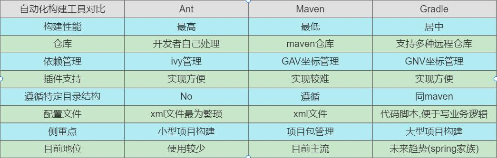
## 1.3 Gradle安装
[https://gradle.org/install/](https://gradle.org/install/)
```bash
export GRADLE_HOME=/Users/manaphy/opt/gradle-7.4.2
export GRADLE_USER_HOME=/Users/manaphy/.m2
export M2_HOME=/Users/manaphy/opt/apache-maven-3.8.6
export MVND_HOME=/Users/manaphy/opt/mvnd-0.8.0
export JAVA_HOME=/Users/manaphy/Library/Java/JavaVirtualMachines/azul-17.0.3/Contents/Home
export PATH=${PATH}:${M2_HOME}/bin:${MVND_HOME}/bin:${JAVA_HOME}/bin:${GRADLE_HOME}/bin
```
使用`gradle -v`查看是否安装成功
## 1.4 Gradle 项目目录结构
Gradle 项目默认目录结构和 Maven 项目的目录结构一致,都是基于约定大于配置【Convention Over Configuration】。

其完整项目目录结构如下所示：

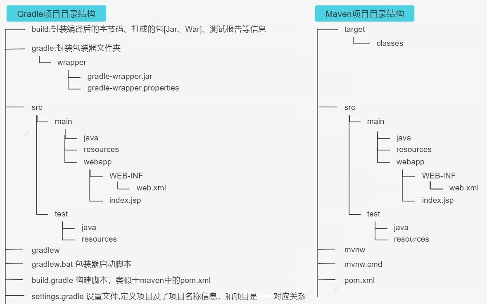
> 1. 只有war工程才有webapp目录，对于普通的jar工程并没有webapp目录
> 2. gradlew与gradlew.bat执行的指定wrapper版本中的gradle指令,不是本地安装的gradle指令哦。

## 1.5 Gradle 创建第一个项目
借助于 spring 脚手架创建 gradle 第一个项目：[https://start.spring.io/](https://start.spring.io/)

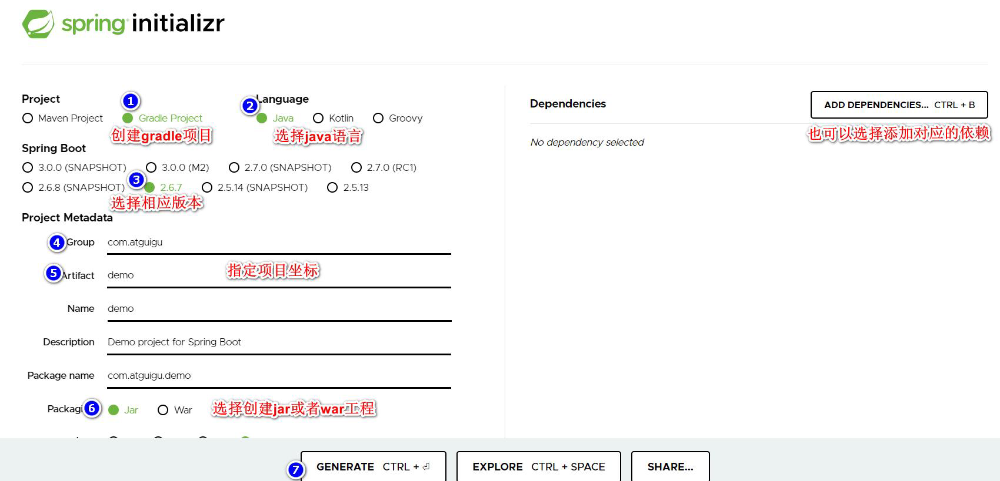

与上图对比会发现：总体的目录结构与上图说明的是一致的。
### 1.5.1 Gradle 中的常用指令
| 常用Gradle指令 | 作用 |
| :-- | :-- |
| gradle clean | 清空build目录 |
| gradle classes | 编译业务代码和配置文件 |
| gradle test | 编译测试代码，生成测试报告 |
| gradle build | 构建项目 |
| gradle build -x test | 跳过测试构建项目 |

**需要注意的是：gradle 的指令要在含有 build.gradle 的目录执行。**
### 1.5.2 修改 maven 下载源
Gradle 自带的 Maven 源地址是国外的，该 Maven 源在国内的访问速度是很慢的，除非使用了特别的手段。一般情况下， 我们建议使用国内的第三方开放的 Maven 源或企业内部自建 Maven 源。

**认识 init.d 文件夹**

我们可以在 gradle 的 init.d 目录下创建以.gradle 结尾的文件， .gradle 文件可以实现在 build 开始之前执行，所以你可以在 这个文件配置一些你想预先加载的操作。
```groovy
allprojects {

	repositories { 
		mavenLocal() 
		maven { name "Alibaba" ; url "https://maven.aliyun.com/repository/public" } 
		maven { name "Bstek" ; url "https://nexus.bsdn.org/content/groups/public/" } 
		mavenCentral() 
	}

	buildscript { 
		repositories { 
			maven { name "Alibaba" ; url 'https://maven.aliyun.com/repository/public' } 
			maven { name "Bstek" ; url 'https://nexus.bsdn.org/content/groups/public/' } 
			maven { name "M2" ; url 'https://plugins.gradle.org/m2/' } 
		} 
	}
}
```
**拓展1**：启用 init.gradle 文件的方法有：
> 1. 在命令行指定文件,例如：gradle --init-script yourdir/init.gradle -q taskName。你可以多次输入此命令来指定多个init文件
> 2. 把init.gradle文件放到 USER_HOME/.gradle/ 目录下
> 3. 把以.gradle结尾的文件放到 USER_HOME/.gradle/init.d/ 目录下
> 4. 把以.gradle结尾的文件放到 GRADLE_HOME/init.d/ 目录下
> 
如果存在上面的4种方式的2种以上，gradle会按上面的1-4序号依次执行这些文件，如果给定目录下存在多个init脚本，会 按拼音a-z顺序执行这些脚本，每个init脚本都存在一个对应的gradle实例,你在这个文件中调用的所有方法和属性，都会 委托给这个gradle实例，每个init脚本都实现了Script接口。

**拓展2**：仓库地址说明

> mavenLocal(): 指定使用maven本地仓库，而本地仓库在配置maven时settings文件指定的仓库位置。如E:/repository，gradle 查找jar包顺序如下：`USER_HOME/.m2/settings.xml` >> `M2_HOME/conf/settings.xml` >> `USER_HOME/.m2/repository`
> maven { url 地址}，指定maven仓库，一般用私有仓库地址或其它的第三方库【比如阿里镜像仓库地址】。 
> mavenCentral()：这是Maven的中央仓库，无需配置，直接声明就可以使用。 
> jcenter():JCenter中央仓库，实际也是是用的maven搭建的，但相比Maven仓库更友好，通过CDN分发，并且支持https访问,在新版本中已经废弃了，替换为了mavenCentral()。
> 总之, gradle可以通过指定仓库地址为本地maven仓库地址和远程仓库地址相结合的方式，避免每次都会去远程仓库下载 依赖库。这种方式也有一定的问题，如果本地maven仓库有这个依赖，就会从直接加载本地依赖，如果本地仓库没有该 依赖，那么还是会从远程下载。但是下载的jar不是存储在本地maven仓库中，而是放在自己的缓存目录中，默认在 `USER_HOME/.gradle/caches`目录,当然如果我们配置过GRADLE_USER_HOME环境变量，则会放在 GRADLE_USER_HOME/caches目录,那么可不可以将gradle caches指向maven repository。我们说这是不行的，caches下载 文件不是按照maven仓库中存放的方式。

### 1.5.3 Wrapper 包装器
Gradle Wrapper 实际上就是对 Gradle 的一层包装，用于解决实际开发中可能会遇到的不同的项目需要不同版本的 Gradle

问题。例如：把自己的代码共享给其他人使用，可能出现如下情况:
> 1. 对方电脑没有安装 gradle
> 2. 对方电脑安装过 gradle， 但是版本太旧了

这时候，我们就可以考虑使用 Gradle Wrapper 了。这也是官方建议使用 Gradle Wrapper 的原因。实际上有了 Gradle Wrapper 之后，我们本地是可以不配置 Gradle 的,下载 Gradle 项目后，使用 gradle 项目自带的 wrapper 操作也是可以的。 

那如何使用 Gradle Wrapper 呢？ 
> 项目中的gradlew、gradlew.cmd脚本用的就是wrapper中规定的gradle版本。
> 而我们上面提到的gradle指令用的是本地gradle,所以gradle指令和gradlew指令所使用的gradle版本**有可能是不一样的**。 gradlew、gradlew.cmd的使用方式与gradle使用方式完全一致，只不过把gradle指令换成了gradlew指令。 

当然,我们也可在终端执行 gradlew 指令时，指定指定一些参数,来控制 Wrapper 的生成，比如依赖的版本等，如下：

| **参数名** | **说明** |
| :-- | :-- |
| --gradle--version | 用于指定使用的Gradle版本 |
| --gradle-distribution-url | 用于指定下载Gradle发行版的url地址 |

具体操作如下所示 ：
```bash
gradle wrapper --gradle-version=4.4 # 升级wrapper版本号,只是修改gradle.properties中wrapper版本，未实际下载 
gradle wrapper --gradle-version 5.2.1 --distribution-type all # 关联源码用
```
**GradleWrapper 的执行流程：**
> 1. 当我们第一次执行 ./gradlew build 命令的时候， gradlew 会读取 gradle-wrapper.properties 文件的配置信息
> 2. 准确的将指定版本的 gradle 下载并解压到指定的位置(GRADLE_USER_HOME目录下的wrapper/dists目录中)
> 3. 并构建本地缓存(GRADLE_USER_HOME目录下的caches目录中),下载再使用相同版本的gradle就不用下载了
> 4. 之后执行的 ./gradlew 所有命令都是使用指定的 gradle 版本。如下图所示：

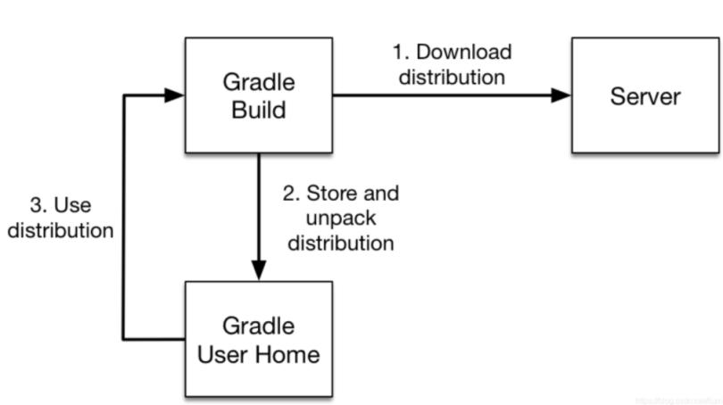

**gradle-wrapper.properties 文件解读**

| **字段名** | **说明** |
| :-- | :-- |
| distributionBase | 下载的Gradle压缩包解压后存储的主目录 |
| distributionPath | 相对于distributionBase的解压后的Gradle压缩包的路径 |
| zipStoreBase | 同distributionBase，只不过是存放zip压缩包的 |
| zipStorePath | 同distributionPath，只不过是存放zip压缩包的 |
| distributionUrl | Gradle发行版压缩包的下载地址 |

注意：前面提到的 **GRALE_USER_HOME 环境变量**用于这里的 Gradle Wrapper 下载的特定版本的 gradle 存储目录。如 果我们**没有配置过 GRALE_USER_HOME 环境变量,默认在当前用户家目录下的.gradle 文件夹中。**

那什么时候选择使用 gradle wrapper、什么时候选择使用本地 gradle?
> 下载别人的项目或者使用操作以前自己写的不同版本的gradle项目时：用Gradle wrapper,也即:gradlew
> 什么时候使用本地gradle?新建一个项目时: 使用gradle指令即可。

# 2. Groovy入门
## 2.1 Groovy 简介
在某种程度上，Groovy 可以被视为 Java 的一种脚本化改良版,Groovy 也是运行在 JVM 上，它可以很好地与 Java 代码及 其相关库进行交互操作。它是一种成熟的面向对象编程语言，既可以面向对象编程，又可以用作纯粹的脚本语言。大多 数有效的 Java 代码也可以转换为有效的 Groovy 代码，Groovy 和 Java 语言的主要区别是：完成同样的任务所需的 Groovy 代码比 Java 代码更少。其特点为： 

- 功能强大，例如提供了动态类型转换、**闭包**和元编程（metaprogramming）支持 
- 支持函数式编程，不需要 main 函数 
- 默认导入常用的包 
- 类不支持 default 作用域,且默认作用域为 public。 
- Groovy 中基本类型也是对象，可以直接调用对象的方法。 
- 支持 DSL（Domain Specific Languages 领域特定语言）和其它简洁的语法，让代码变得易于阅读和维护。 
- Groovy 是基于 Java 语言的，所以完全兼容 Java 语法,所以对于 java 程序员学习成本较低。
## 2.2 Groovy基本语法
### 2.2.1 基本注意点
```groovy
/* ---------------------------------------------------------------
 1.groovy中使用def 定义属性、方法,def支持动态类型声明
 2.单行注释：// 多行注释: /**
 3.gradle语句最后的;(分号)是可以省略的
 4.groovy可以为属性自动生成getter、setter方法
 5.方法声明时： 参数类型、返回值类型、return关键字可以省略,方法调用时,在不引起歧义的地方，可以省略()
 6.变量引用时： 在不引起歧义的前提下{}也可以省略,在容易引起歧义的地方就不能省略{}
 7.对象属性赋值：
 方式1: 对象.属性名=
 方式2: 对象["属性名"]=
 方式3: 对象.属性setter方法()
 方式4: 具名构造器的方式
 读取属性值：
 方式1: 对象.属性名
 方式2: 对象["属性名"]
 方式3: 对象.属性getter方法()
 ---------------------------------------------------------------*/

def  description="描述信息"
def bookname="斗破苍穹"
def sale(price){
    "the book is  $price"
}
def sum(price1,price2){
    "$price1 + $price2 = ${price1+price2}"
}

// 调用
def obj = new Temp(bookname: "斗罗大陆",description: "我是描述");
println(obj.getBookname())
```
### 2.2.3 引号说明
```groovy
def desc = "测试";

def str1 = '单引号,不支持变量引用，不支持换行操作 ${desc}';
println(str1)

def str2 = "双引号,支持变量引用，不支持换行操作 ${desc}";
println(str2)

def str3 = '''模板字符串,不支持变量引用，支持换
                  行操作 ${desc}''';
println(str3)


//基本数据类型也可以作为对象使用,可以调用对象的方法
println(str1.getClass().toString())// class java.lang.String
println(str2.getClass().toString())// class org.codehaus.groovy.runtime.GStringImpl
println(str3.getClass().toString())// class java.lang.String
```
### 2.2.4 类型及权限修饰符
权限修饰符: public、protected、private

Groovy 类与 Java 类之间的主要区别是

1. 没有可见性修饰符的类或方法自动是公共的(可以使用一个特殊的注释来实现包的私有可见性)。
2. 没有可见性修饰符的字段将自动转换为属性，不需要显式的 getter 和 setter 方法。
3. 如果属性声明为 final，则不会生成 setter。
4. 一个源文件可能包含一个或多个类(但是如果一个文件不包含类定义的代码，则将其视为脚本)。脚本只是具有一些特殊 约定的类,它们的名称与源文件相同(所以不要在脚本中包含与脚本源文件名相同的类定义)。
### 2.2.5 集合操作
```groovy
//--------------------list增删改查操作------------------------ 
//--------------------------------增------------------------
//1.增:在集合中添加元素
def list = [5, 6, 7, 8]
assert list instanceof java.util.List
list.add(12)
println list.size()
//2.增:集合与集合相加
def list2 = [1,2,3,4]
println list.plus(list2) //将list2添加在list之后

//--------------------------------删------------------------
//2.删:删除下标为2的元素
list.remove(2)
println(list)

//2.删:删除集合中指定的元素
list.removeElement(12)
println(list)

//2.删:从list集合中移除list3集合中的元素
def list3 = [6,8]
list.removeAll(list3)
println(list)

//2.删：从list表中弹出最后一个元素
println list.pop()
println(list)
//--------------------------------改------------------------


list.putAt(2, 10) //等效于 list[2] = 10
println(list)

//--------------------------------list增删改查操作-----------------------
[1, 2, 3].each({
    println "Item: $it"//it是对应于当前元素的隐式参数
})
//size():获取此列表中的元素数。
//contains(): 如果此列表包含指定的值，则返回 true。

//---------------------------map的增删改查操作---------------------------

// 键 Key 可以不使用引号 , 可以使用单引号 '' , 也可以使用双引号 ""
def map = [J:"Java", "K":"Kotlin", 'G':"Groovy"]
//------------------------------------map的增--------------------------
map.put("P","Python")
//map.putAll():增加一个map
println(map)
//------------------------------------map的删--------------------------
map.remove("P")   //根据某个键做移除
map.remove("J","Java")//移除某个键值对
println "删:"+map
//------------------------------------map的改--------------------------
// "-" "+" 操作符重载
map2 = map - [K:"Kotlin"]
println map2

map3 = map + [G:"Gradle"] //键相同会产生覆盖
println map3
//------------------------------------map的查--------------------------
map.each { key, value ->
    println "key:$key  value:$value"
}

map.each { entry ->
    println "key: $entry.key value: $entry.value"
}
```
### 2.2.6 类导入
Groovy 遵循 Java 允许 import 语句解析类引用的概念。
```groovy
import groovy.xml.MarkupBuilder
import java.text.SimpleDateFormat

def xml = new MarkupBuilder()
assert xml != null


def sdf =new SimpleDateFormat("yyyy-MM-dd");
println(sdf.format(new Date()))
```
Groovy 语言默认提供的导入
```groovy
import java.lang.* 
import java.util.* 
import java.io.* 
import java.net.* 
import groovy.lang.* 
import groovy.util.* 
import java.math.BigInteger 
import java.math.BigDecimal
```
### 2.2.7 闭包
闭包：Groovy 中的闭包是一个开放的、匿名的代码块，它可以接受参数、也可以有返回值。闭包可以引用其周围作用 域中声明的变量。

语法：{ [closureParameters ->] statements }

其中[ closureParameters->]是一个可选的逗号分隔的参数列表,参数后面是 Groovy 语句。参数类似于方法参数列表， 这些参数可以是类型化的,也可以是非类型化的。当指定参数列表时，需要使用-> 字符，用于将参数与闭包体分离。
```groovy
//闭包体完成变量自增操作
{ item++ }
//闭包使用 空参数列表 明确规定这是无参的
{ -> item++ }
//闭包中有一个默认的参数[it]，写不写无所谓
{ println it } 
{ it -> println it }
//如果不想使用默认的闭包参数it,那需要显示自定义参数的名称
{ name -> println name }
//闭包也可以接受多个参数
{ String x, int y ->
    println "hey ${x} the value is ${y}" 
}
//闭包参数也可是一个对象
{ reader ->
    def line = reader.readLine()
    line.trim()
}
```
闭包调用方式： 闭包是`groovy.lang.Closure`的实例。它可以像任何其他变量一样分配给一个变量或字段。

闭包对象(参数) 

闭包对象.call(参数)
```groovy
def isOdd = { int i -> i%2 != 0 } 
assert isOdd(3) == true 
assert isOdd.call(2) == false

def isEven = { it%2 == 0 } 
assert isEven(3) == false 
assert isEven.call(2) == true
```
特殊说明： 可以把闭包当作一个对象，作为参数传递给方法使用
```groovy
//无参闭包 
def run(Closure closure){
    println("run start....")
    closure()
    println("run end....") 
} 

run {
    println "running......"
} 

//有参闭包 
def caculate(Closure closure){
    def num1=1;
    def num2=3;
    println("caculate start....") 
    closure(num1,num2) 
    println("caculate end....") 
}

caculate {x,y -> println " 计算结果为：$x+$y=${x+y}" }
//在build.gradle文件中我们见到的很多都是闭包格式的。
```
# Gradle 进阶
## Gradle 对测试支持
测试任务自动检测并执行测试源集中的所有单元测试。测试执行完成后会生成一个报告。支持 JUnit 和 TestNG 测试。
### 默认测试目录及标准输出
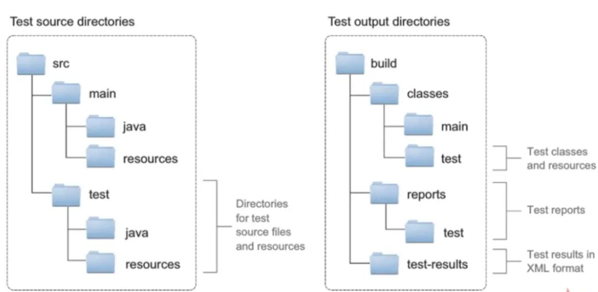
### Junit 使用
Gradle 对于 Junit5.x 版本支持
```groovy
dependencies { 
    testImplementation 'org.junit.jupiter:junit-jupiter-api:5.8.1' 
    testRuntimeOnly 'org.junit.jupiter:junit-jupiter-engine:5.8.1' 
} 

test {
    useJUnitPlatform() 
}
```
注意：无论是 Junt4.x 版本还是 Junit5.x 版本，我们只需在 build.gradle 目录下执行 gradle test 指令，gradle 就会帮我们执 行所有的加了@Test 注解的测试，并生成测试报告。
### 包含和排除特定测试
```groovy
test {
    enabled(false)// 跳过测试
    useJUnitPlatform()
    include('com/cgp/test/**')//只测试该目录下的类
    exclude('com/cgp/run/**')// 排除测试
}
```
## 3.1 项目的生命周期
Gradle 项目的生命周期分为三大阶段: Initialization -> Configuration -> Execution. 每个阶段都有自己的职责,具体如下图所示:

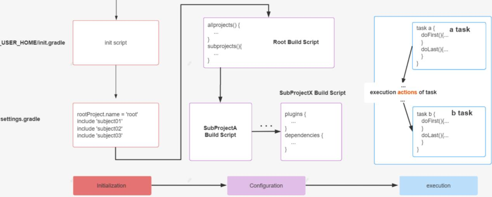

Initialization 阶段主要目的是初始化构建, 它又分为两个子过程,一个是执行 Init Script,另一个是执行 Setting Script。 init.gradle 文件会在每个项目 build 之前被调用，用于做一些初始化的操作，它主要有如下作用：

- 配置内部的仓库信息（如公司的 maven 仓库信息）；
- 配置一些全局属性； 
- 配置用户名及密码信息（如公司仓库的用户名和密码信息）。

Setting Script 则更重要, 它初始化了一次构建所参与的所有模块。

Configuration 阶段：这个阶段开始加载项目中所有模块的 Build Script。所谓 "加载" 就是执行 build.gradle 中的语句, 根据脚本代码创建对应的 task, 最终根据所有 task 生成由 **Task 组成的有向无环图**(Directed Acyclic Graphs)，如下:

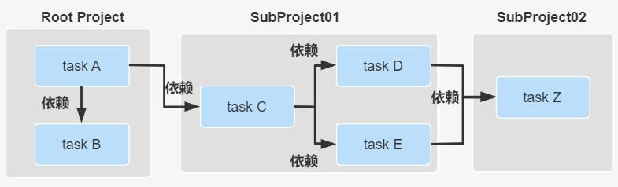

Execution 阶段：这个阶段会根据上个阶段构建好的有向无环图，按着顺序执行 Task【Action 动作】。
## 3.2 settings 文件
首先对 settings 文件的几点说明：

1. 作用：主要是在项目初始化阶段确定一下引入哪些工程需要加入到项目构建中,为构建项目工程树做准备。
2. 工程树：gradle 中有工程树的概念，类似于 maven 中的 project 与 module。

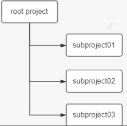

3. 内容：里面主要定义了当前 gradle 项目及子 project 的项目名称
4. 位置：必须放在根工程目录下。
5. 名字：为 settings.gradle 文件，不能发生变化
6. 对应实例：与 org.gradle.api.initialization.Settings 实例是一一对应的关系。每个项目只有一个 settings 文件。
7. 关注：作为开发者我们只需要关注该文件中的 include 方法即可。使用相对路径【 : 】引入子工程。
8. 一个子工程只有在 setting 文件中配置了才会被 gradle 识别,这样在构建的时候才会被包含进去。案例如下所示：
```groovy
//根工程项目名 
rootProject.name = 'root' 
//包含的子工程名称 
include 'subject01' 
include 'subject02' 
include 'subject03' 
//包含的子工程下的子工程名称 
include 'subject01:subproject011' 
include 'subject01:subproject012'
```
项目名称中 ":" 代表项目的分隔符, 类似路径中的 "/". 如果以 ":" 开头则表示相对于 root project 。然后 Gradle 会 为每个带有 build.gradle 脚本文件的工程构建一个与之对应的 Project 对象。
## 3.3 Task
项目实质上是 Task 对象的集合。一个 Task 表示一个逻辑上较为独立的执行过程，比如编译 Java 源代码，拷贝文件， 打包 Jar 文件，甚至可以是执行一个系统命令。另外，一个 Task 可以读取和设置 Project 的 Property 以完成特定的操作。
### 3.3.1 任务入门
让我们来先看一个例子:
```groovy
task A {
    println "root taskA"
    doFirst(){
        println "root taskA doFirst"
    }
    doLast(){
        println "root taskA doLast"
    }
}
```
在文件所在的目录执行命令: gradle A。

提示 1：task 的配置段是在**配置阶段**完成 

提示 2：task 的 doFirst、doLast 方法是**执行阶段**完成，并且 doFirst 在 doLast 执行之前执行。 

提示 3：**区分任务的配置段和任务的行为**,任务的配置段在**配置阶段执行**，任务的行为在**执行阶段执行**
### 3.3.2 任务的行为
案例如下：doFirst、doLast 两个方法可以在任务内部定义，也可以在任务外部定义
```groovy
def map = new HashMap<String, Object>();
//action属性可以设置为闭包，设置task自身的行为
map.put("action", { println "taskD.." })

task(map, "a") {
    description 'taskA description....'
    group "cgp"
    //在task内部定义doFirst、doLast行为
    doFirst {
        def name = 'doFirst...'
        println name
    }
    doLast {
        def name = 'doLast...'
        println name
    }
}
//在task外部定义doFirst、doLast行为
a.doFirst{
    println it.description
}
a.doLast{
    println it.group
}
```
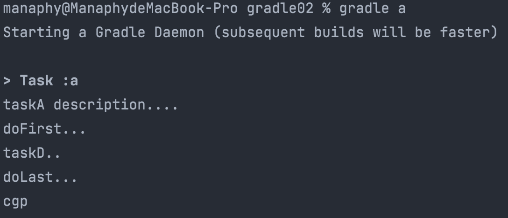

**底层原理分析**：无论是定义任务自身的 action,还是添加的 doLast、doFirst 方法，其实底层都被放入到一个 Action 的 List中了，最初这个 action List 是空的，当我们设置了 action【任务自身的行为】,它先将 action 添加到列表中，此时列表中 只有一个 action,后续执行 doFirst 的时候 doFirst 在 action 前面添加，执行 doLast 的时候 doLast 在 action 后面添加。doFirst 永远添加在 actions List 的第一位，保证添加的 Action 在现有的 action List 元素的最前面；doLast 永远都是在 action List 末尾添加，保证其添加的 Action 在现有的 action List 元素的最后面。一个往前面添加,一个往后面添加，最后这个 action List 就按顺序形成了 doFirst、doSelf、doLast 三部分的 Actions,就达到 doFirst、doSelf、doLast 三部分的 Actions 顺序执 行的目的。
### 3.3.3 任务的依赖方式
Task 之间的依赖关系可以在以下几部分设置：

1. 参数依赖
2. 内部依赖
3. 外部依赖

**方式一：参数方式依赖**
```groovy
task A {
    doLast {
        println "TaskA.."

    }
}
task 'B' {
    doLast {
        println "TaskB.."

    }
} //参数方式依赖: dependsOn后面用冒号
task 'C'(dependsOn: ['A', 'B']) {
    doLast {
        println "TaskC.."
    }
}
```
**方式二:内部依赖**
```groovy
//参数方式依赖 
task 'C' {
    //内部依赖：dependsOn后面用 = 号 
    dependsOn = [A, B]
    doLast {
        println "TaskC.."
    }
}
```
**方式三：外部依赖**
```groovy
//外部依赖:可变参数,引号可加可不加 
C.dependsOn(B,'A')
```
**当然：task 也支持跨项目依赖**

在 subproject01 工程的 build.gradle 文件中定义
```groovy
task A {
    doLast {
        println "TaskA.."
    }
}
```
在 subproject02 工程的 build.gradle 文件中定义
```groovy
task B {
    dependsOn(":subproject01:A") //依赖根工程下的subject01中的任务A ：跨项目依赖。 
    doLast {
        println "TaskB.."
    }
}
```
拓展 1：当一个 Task 依赖多个 Task 的时候，被依赖的 Task 之间如果没有依赖关系，那么它们的执行顺序是随机的，并无影响。

**拓展 2**：重复依赖的任务只会执行一次，比如：

A->B、C 

B->C 

任务 A 依赖任务 B 和任务 C、任务 B 依赖 C 任务。执行任务 A 的时候，显然任务 C 被重复依赖了，C 只会执行一次。
### 3.3.4 任务执行(Gradle相关命令)
任务执行语法：`gradle [taskName...] [--option-name...]`

| **分类** | **命令** | **解释** |
| :-- | :-- | :-- |
| 常见的任务 | gradle build | 构建项目：编译、测试、打包等操作 |
|  | gradle run | 运行一个服务,需要 application 插件支持，并且指定了主启动类才能运行 |
|  | gradle clean | 请求当前项目的 build 目录 |
|  | gradle init | 初始化 gradle 项目使用 |
|  | gradle wrapper | 生成 wrapper 文件夹 |
|  | gradle wrapper --gradle-version=4.4 | 升级 wrapper 版本号 |
|  | gradle wrapper --gradle-version 5.2.1 --distribution-type all  | 关联源码用 |
| 项目报告相关任务 | gradle projects | 列出所选项目及子项目列表，以层次结构的形式显示 |
|  | gradle tasks | 列出所选项目【当前 project,不包含父、子】的已分配给任务组的那些任务 |
|  | gradle tasks --all | 列出所选项目的所有任务 |
|  | gradle tasks --group="build setup" | 列出所选项目中指定分组中的任务 |
|  | gradle help --task someTask | 显示某个任务的详细信息 |
|  | gradle dependencies | 查看整个项目的依赖信息，以依赖树的方式显示 |
|  | gradle properties | 列出所选项目的属性列表 |
| 调试相关选项 | gradle -h (--help) | 查看帮助信息 |
|  | gradle -v (--version) | 打印 Gradle、 Groovy、 Ant、 JVM 和操作系统版本信息 |
|  | gradle -S (--full-stacktrace) | 打印出所有异常的完整(非常详细)堆栈跟踪信息 |
|  | gradle -s (--stacktrace) | 打印出用户异常的堆栈跟踪(例如编译错误) |
|  | gradle -Dorg.gradle.daemon.debug=true | 调试 Gradle 守护进程 |
|  | gradle -Dorg.gradle.debug=true | 调试 Gradle 客户端(非daemon)进程 |
|  | gradle -Dorg.gradle.debug.port=(port) | 指定启用调试时要侦听的端口号。默认值为 5005 |
| 性能选项:【备注:在 gradle.properties 中指定这些选项中的许多选项， 因此不需要命令行标志】 | gradle --build-cache, --no-build-cache | 尝试重用先前版本的输出。默认关闭(off) |
|  | gradle --max-workers | 设置 Gradle 可以使用的 woker 数。默认值是处理器数 |
|  | gradle -parallel, --no-parallel | 并行执行项目。有关此选项的限制，请参阅并行项目执行。 默认设置为关闭(off) |
| 守护进程选项 | gradle --daemon, --no-daemon | 使用 Gradle 守护进程运行构建。默认是 on |
|  | gradle --foreground | 在前台进程中启动 Gradle 守护进程 |
|  | gradle -Dorg.gradle.daemon.idletimeout=(number of milliseconds) | Gradle Daemon 将在这个空闲时间的毫秒数之后停止自己。默认值为 10800000(3 小时)。 |
| 日志选项 | gradle -Dorg.gradle.logging.level=(quiet,warn,lifecycle,info,debug) | 通过 Gradle 属性设置日志记录级别 |
|  | gradle -q (--quiet) | 只能记录错误信息 |
|  | gradle -w (--warn) | 设置日志级别为 warn |
|  | gradle -i (--info) | 将日志级别设置为 info |
|  | gradle -d (--debug) | 登录调试模式(包括正常的堆栈跟踪) |
| 其他 | gradle -x ...(--exclude-task) | 常见 gradle -x test clean build |
|  | gradle --rerun-tasks | 强制执行任务，忽略 up-to-date ,常见 gradle build --rerun-tasks |
|  | gradle --continue | 忽略前面失败的任务,继续执行,而不是在遇到第一个失败时立即停止执行。每 个遇到的故障都将在构建结束时报告，常见：gradle build --continue。 |
|  | gradle init --type pom | 将 maven 项目转换为 gradle 项目(根目录执行) |
|  | gradle [taskName] | 执行自定义任务 |

拓展：gradle 任务名是缩写: 任务名支持驼峰式命名风格的任务名缩写，如： connectTask 简写为： cT,执行任务 gradle cT。 

拓展 1：前面提到的 Gradle 指令本质：一个个的 task[任务]，Gradle 中所有操作都是基于任务完成的。 

拓展 2：gradle 默认各指令之间相互的依赖关系：

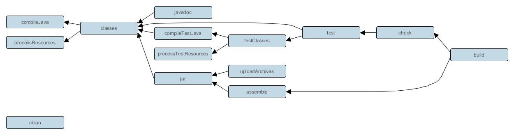
### 3.3.5 任务定义方式
任务定义方式，总体分为两大类:一种是通过 Project 中的 task()方法,另一种是通过 tasks 对象的 create 或者 register 方法。
```groovy
task('A', {//任务名称,闭包都作为参数
    println "taskA..."
})
task('B') {//闭包作为最后一个参数可以直接从括号中拿出来
    println "taskB..."
}
task C {//groovy语法支持省略方法括号:上面三种本质是一种
    println "taskC..."
}
def map = new HashMap<String, Object>();
map.put("action", { println "taskD.." }) //action属性可以设置为闭包 
task(map, "D");
tasks.create('E') {//使用tasks的create方法
    println "taskE.."
}
tasks.register('f') { //注：register执行的是延迟创建。也即只有当task被需要使用的时候才会被创建。
    println "taskF...."
}
```
当然：我们也可以在定义任务的同时指定任务的属性，具体属性有：


**在定义任务时也可以给任务分配属性**：定义任务的时候可以直接指定任务属性，也可以给已有的任务动态分配属性：
```groovy
//①.F是任务名，前面通过具名参数给map的属性赋值,以参数方式指定任务的属性信息
task(group: "chen", description: "this is task B", "F")
//②.H是任务名，定义任务的同时，在内部直接指定属性信息
task("H") {
    group("chen")
    description("this is the task H")
}
//③.Y是任务名，给已有的任务 在外部直接指定属性信息
task "y" {}
y.group = "chen"
clean.group("chen") //案例：给已有的clean任务重新指定组信息
```
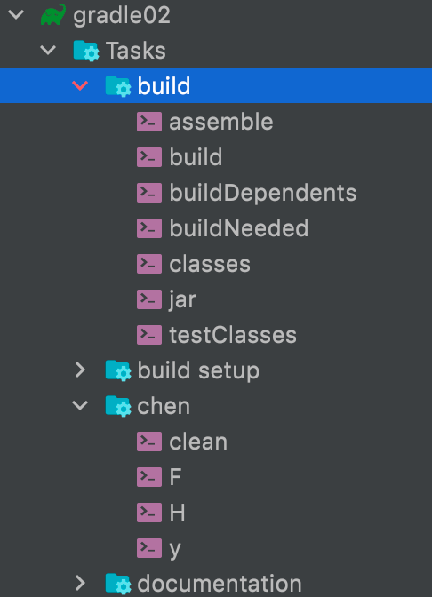
### 3.3.6 任务类型
前面我们定义的 task 都是 DefaultTask 类型的,如果要完成某些具体的操作完全需要我们自己去编写 gradle 脚本，势必有 些麻烦，那有没有一些现成的任务类型可以使用呢？有的， Gradle 官网给出了一些现成的任务类型帮助我们快速完成想 要的任务，我们只需要在创建任务的时候，指定当前任务的类型即可，然后即可使用这种类型中的属性和 API 方法了。

| **常见任务类型** | **该类型任务的作用** |
| :-- | :-- |
| Delete | 删除文件或目录 |
| Copy | 将文件复制到目标目录中。此任务还可以在复制时重命名和筛选文件。 |
| CreateStartScripts | 创建启动脚本 |
| Exec | 执行命令行进程 |
| GenerateMavenPom | 生成Maven模块描述符(POM)文件。 |
| GradleBuild | 执行Gradle构建 |
| Jar | 组装JAR归档文件 |
| JavaCompile | 编译Java源文件 |
| Javadoc | 为Java类生成HTMLAPI文档 |
| PublishToMavenRepository | 将MavenPublication发布到mavenartifactrepostal。 |
| Tar | 组装TAR存档文件 |
| Test | 执行JUnit(3.8.x、4.x或5.x)或TestNG测试。 |
| Upload | 将Configuration的构件上传到一组存储库。 |
| War | 组装WAR档案。 |
| Zip | 组装ZIP归档文件。默认是压缩ZIP的内容。 |

### 3.3.7 任务的执行顺序
在 Gradle 中,有三种方式可以指定 Task 执行顺序：

1. dependsOn 强依赖方式
2. 通过 Task 输入输出
3. 通过 API 指定执行顺序
### 3.3.8 动态分配任务
gradle 的强大功能不仅仅用于定义任务的功能。例如，可以使用它在循环中注册同一类型的多个任务
### 3.3.9 任务的关闭与开启
每个任务都有一个 enabled 默认为的标志 true。将其设置为 false 阻止执行任何任务动作。禁用的任务将标记为“跳过”。 
```groovy
task disableMe {
    doLast {
        println 'This task is Executing...'
    }
    enabled(true)//直接设置任务开启，默认值为true
}
disableMe.enabled = false //设置关闭任务
```
### 3.3.10 任务的超时
每个任务都有一个 timeout 可用于限制其执行时间的属性。当任务达到超时时，其任务执行线程将被中断。该任务将 被标记为失败。终结器任务仍将运行。如果 --continue 使用，其他任务可以在此之后继续运行。不响应中断的任务无法 超时。 Gradle 的所有内置任务均会及时响应超时
```groovy
task a() {
    doLast {
        Thread.sleep(1000)
        println "当前任务a执行了"
    }
    timeout = Duration.ofMillis(500)
}
task b() {
    doLast {
        println "当前任务b执行了"
    }
}
```
在控制台使用: `gradle a b` 测试会发现执行 a 的时候,由于 a 执行超时，抛出异常，所以没有继续往下执行【b 也没执行】。 然后在控制台使用: `gradle a b –continue`，测试会发现 a 虽然执行失败，但是 b 还是执行了。
```groovy
task chen {
    doLast {
        println "chen.last..."
    }
}
//根据任务名查找
tasks.findByName("chen").doFirst({println "1..."})
tasks.getByName("chen").doFirst({println "2..."})
//根据任务路径查找【相对路径】
tasks.findByPath(":chen").doFirst({println "3..."})
tasks.getByPath(":chen").doFirst({println "4..."})
```
### 3.3.12 任务的规则
当我们执行、依赖一个不存在的任务时，Gradle 会执行失败,报错误信息。那我们能否对其进行改进,当执行一个不存在 的任务时，不是报错而是打印提示信息呢？
```groovy
task hello {
    doLast {
        println 'hello world'
    }
}

tasks.addRule(" 对该规则的一个描述，便于调试、查看等") {
    String taskName ->
        task(taskName) {
            doLast {
                println " 该${taskName}任务不存在，请查证后再执行"
            }
        }
}
```
测试: 使用 `gradle abc hello` 进行测试,此时当 abc 任务不存在时，也不会报异常【不中断执行】而是提示自定义的规则信 息，继续执行 hello 任务。此外，它还可以根据不同的规则动态创建需要的任务等情况。
### 3.3.13 任务的 onlyIf 断言
断言就是一个条件表达式。 Task 有一个 onlyIf 方法。它接受一个闭包作为参数，如果该闭包返回 true 则该任务执行， 否则跳过。这有很多用途，比如控制程序哪些情况下打什么包，什么时候执行单元测试，什么情况下执行单元测试的时 候不执行网络测试等。具体案例如下所示：
```groovy
task hello {
    doLast {
        println 'hello world'
    }
}

hello.onlyIf { !project.hasProperty('fensi') }
```
测试：通过-P 为 Project 添加 fensi 属性 `gradle hello -Pfensi`
### 3.3.14 默认任务
Gradle 允许您定义一个或多个在没有指定其他任务时执行的默认任务。

代码如下所示：
```groovy
defaultTasks 'myClean', 'myRun'
tasks.register('myClean') {
    doLast {
        println 'Default Cleaning!'
    }
}
tasks.register('myRun') {
    doLast {
        println 'Default Running!'
    }
}
tasks.register('other') {
    doLast {
        println "I'm not a default task!"
    }
}
```
测试结果如下
```bash
> gradle -q
Default Cleaning!
Default Running!
```
## 3.4 Gradle 中的文件操作
### 3.4.1 本地文件
使用 Project.file(java.lang.Object)方法，通过指定文件的相对路径或绝对路径来对文件的操作,其中相对路径为相对当前 project[根 project 或者子 project]的目录。其实使用 Project.file(java.lang.Object)方法创建的 File 对象就是 Java 中的 File 对象，我们可以使用它就像在 Java 中使用一样。示例代码如下：
```groovy
//使用相对路径
File configFile = file('src/1.txt')
configFile.createNewFile();
// 使用绝对路径
configFile = file('/Users/manaphy/Downloads/2.txt')
println(configFile.createNewFile()) // true
// 使用一个文件对象
configFile = new File('src/1.txt')
println(configFile.exists()) // true
```
### 3.4.2 文件集合
文 件 集 合 就 是 一 组 文 件 的 列 表 , 在 Gradle 中 , 文 件 集 合 用 FileCollection 接 口 表 示 。 我 们 可 以 使 用 Project.files(java.lang.Object[])方法来获得一个文件集合对象， 如下代码创建一个 FileCollection 实例：
```groovy
def collection = files('src/test1.txt', new File('src/test2.txt'), ['src/test3.txt', 'src/test4.txt'])
collection.forEach() { File it ->
    it.createNewFile() //创建该文件
    println it.name //输出文件名
}
Set set1 = collection.files // 把文件集合转换为java中的Set类型
Set set2 = collection as Set
List list = collection as List// 把文件集合转换为java中的List类型
for (item in list) {
    println item.name
}
def union = collection + files('src/test5.txt') // 添加或者删除一个集合
def minus = collection - files('src/test3.txt')
union.forEach() { File it ->
    println it.name
}
```
对于文件集合我们可以遍历它；也可以把它转换成 java 类型；同时还能使用+来添加一个集合，或使用-来删除集合。
### 3.4.3 文件树
文件树是有层级结构的文件集合,一个文件树它可以代表一个目录结构或一 ZIP 压缩包中的内容结构。文件树是从文件集合继承过来的,所以文件树具有文件集合所有的功能。我们可以使用 Project.fileTree(java.util.Map)方法来创建文件树对象， 还可以使用过虑条件来包含或排除相关文件。示例代码如下：
```groovy
test {
//    enabled(false)// 跳过测试
    useJUnitPlatform()
    include('com/cgp/test/**')//只测试该目录下的类
    exclude('com/cgp/run/**')// 排除测试
}

// 第一种方式:使用路径创建文件树对象，同时指定包含的文件
tree = fileTree('src/main').include('**/*.java')
//第二种方式:通过闭包创建文件树:
tree = fileTree('src/main') {
    include '**/*.java'
}
//第三种方式:通过路径和闭包创建文件树：具名参数给map传值
tree = fileTree(dir: 'src/main', include: '**/*.java')

tree = fileTree(dir: 'src/main', includes: ['**/*.java', '**/*.xml', '**/*.txt'], exclude: '**/*test*/**')
// 遍历文件树的所有文件
tree.each { File file ->
    println file println file.name
}
```
### 3.4.4 文件拷贝
我们可以使用 Copy 任务来拷贝文件，通过它可以过虑指定拷贝内容，还能对文件进行重命名操作等。 Copy 任务必须指 定一组需要拷贝的文件和拷贝到的目录，这里使用 `CopySpec.from(java.lang.Object[])`方法指定原文件；使用 `CopySpec.into(java.lang.Object)`方法指定目标目录。 示例代码如下
```groovy
task copyTask(type: Copy) {
    from 'src/main/resources'
    into 'build/config'
}
```
from()方法接受的参数和文件集合时 files()一样。 当参数为一个目录时，该目录下所有的文件都会被拷贝到指定目录下（目录自身不会被拷贝）；当参数为一个文件时，该文件会被拷贝到指定目录；如果参数指定的文件不存在，就会被忽略； 当参数为一个 Zip 压缩文件，该压缩文件的内容会被拷贝到指定目录。 into()方法接受的参数与本地文件时 file()一样。 示例代码如下
```groovy
task copyTask(type: Copy) {
    // 拷贝src/main/webapp目录下所有的文件 
    from 'src/main/webapp' // 拷贝单独的一个文件 
    from 'src/staging/index.html' // 从Zip压缩文件中拷贝内容 
    from zipTree('src/main/assets.zip') // 拷贝到的目标目录 
    into 'build/explodedWar'
}
```
在拷贝文件的时候还可以添加过虑条件来指定包含或排除的文件，示例如下：
```groovy
task copyTaskWithPatterns(type: Copy) {
    from 'src/main/webapp'
    into 'build/explodedWar'
    include '**/*.html'
    include '**/*.jsp'
    exclude { details -> details.file.name.endsWith('.html') }
}
```
在拷贝文件的时候还可以对文件进行重命名操作，示例如下：
```groovy
task rename(type: Copy) {
    from 'src/main/webapp'
    into 'build/explodedWar'
    // 使用一个闭包方式重命名文件 
    rename { String fileName ->
        fileName.replace('-staging-', '')
    }
}
```
在上面的例子中我们都是使用 Copy 任务来完成拷贝功能的，那么有没有另外一种方式呢？答案是肯定的，那就是 `Project.copy(org.gradle.api.Action)`方法。 下面示例展示了 copy()方法的使用方式：
```groovy
task copyMethod {
    doLast {
        copy {
            from 'src/main/webapp'
            into 'build/explodedWar'
            include '**/*.html'
            include '**/*.jsp'	
        }
    }
}
```
或者使用 project 对象的 copy 方法
```groovy
copy {
    //相对路径或者绝对路径
    from file('src/main/resources/ddd.txt') //file也可以换成new File()
    into this.buildDir.absolutePath
}
```
执行 gradle build 指令即可。去 build 目录的本地磁盘查看，就能看到。
### 3.4.5 归档文件
通常一个项目会有很多的 Jar 包，我们希望把项目打包成一个 WAR，ZIP 或 TAR 包进行发布，这时我们就可以使用 Zip，Tar，Jar，War 和 Ear 任务来实现，不过它们的用法都一样，所以在这里我只介绍 Zip 任务的示例。 首先，创建一个 Zip 压缩文件,并指定压缩文件名称，如下代码所示：
```groovy
apply plugin: 'java'
version 1.0
task myZip(type: Zip) {
    from 'src/main'
    into 'build'
    archiveName('myGame.zip')
}
println myZip.archiveName
```
执行命令 `gradle -q myZip`

最后，我们可以使用 Project.zipTree(java.lang.Object)和 Project.tarTree(java.lang.Object)方法来创建访问 Zip 压缩包的文 件树对象，示例代码如下：
```groovy
// 使用zipTree 
FileTree zip = zipTree('someFile.zip')
// 使用tarTree 
FileTree tar = tarTree('someFile.tar')
```
## 3.5 Dependencies
### 3.5.1 依赖的方式
Gradle 中的依赖分别为直接依赖，项目依赖，本地 jar 依赖。
```groovy
dependencies {
    //1.依赖当前项目下的某个模块[子工程]
    implementation project(':subject01')
    //2.直接依赖本地的某个jar文件
    implementation files('libs/foo.jar', 'libs/bar.jar')
    //2.配置某文件夹作为依赖项
    implementation fileTree(dir: 'libs', include: ['*.jar'])
    //3.直接依赖
    implementation 'org.apache.logging.log4j:log4j:2.17.2'
}
```
**直接依赖**：在项目中直接导入的依赖，就是直接依赖

`implementation 'org.apache.logging.log4j:log4j:2.17.2'`

上面是简写法，完整版写法如下：

`implementation group: 'org.apache.logging.log4j', name: 'log4j', version: '2.17.2'`

group/name/version 共同定位一个远程仓库,version 最好写一个固定的版本号，以防构建出问题，implementation 类似 maven 中的依赖的 scope,对比 maven 中的依赖:
```xml
<dependency>
  <groupId>log4j</groupId>
  <artifactId>log4j</artifactId>
  <version>1.2.12</version>
  <scope>compile</scope>
</dependency>
```
**项目依赖**: 从项目的某个模块依赖另一个模块

`implementation project(':subject01')`

这种依赖方式是直接依赖本工程中的 libary module， 这个 libary module 需要在 setting.gradle 中配置。

本地 jar 依赖：本地 jar 文件依赖，一般包含以下两种方式
```groovy
//直接依赖某文件
implementation files('libs/foo.jar', 'libs/bar.jar')
//配置某文件夹作为依赖项
implementation fileTree(dir: 'libs', include: ['*.jar'])
```
### 3.5.2 依赖的下载
当执行 build 命令时，gradle 就会去配置的依赖仓库中下载对应的 Jar，并应用到项目中。
### 3.5.3 依赖的类型
类似于 Maven 的 scope 标签， gradle 也提供了依赖的类型,具体如下所示

| compileOnly | 由java插件提供,曾短暂的叫provided,后续版本已经改成了compileOnly,适用于编译期需要而不需要打包的情况 |
| :-- | :-- |
| runtimeOnly | 由java插件提供,只在运行期有效,编译时不需要,比如mysql驱动包。取代老版本中被移除的runtime |
| implementation | 由java插件提供,针对源码[src/main目录],在编译、运行时都有效,取代老版本中被移除的compile |
| testCompileOnly | 由java插件提供,用于编译测试的依赖项，运行时不需要 |
| testRuntimeOnly | 由java插件提供,只在测试运行时需要，而不是在测试编译时需要,取代老版本中被移除的testRuntime |
| testImplementation | 由java插件提供,针对测试代码[src/test目录]取代老版本中被移除的testCompile |
| providedCompile | war插件提供支持，编译、测试阶段代码需要依赖此类jar包，而运行阶段容器已经提供了相应的支持，所以无需将这些文件打入到war包中了;例如servlet-api.jar、jsp-api.jar |
| compile | 编译范围依赖在所有的classpath中可用，同时它们也会被打包。在gradle7.0已经移除 |
| runtime | runtime依赖在运行和测试系统的时候需要,在编译的时候不需要,比如mysql驱动包。在gradle7.0已经移除 |
| api | java-library插件提供支持,这些依赖项可以传递性地导出给使用者，用于编译时和运行时。取代老版本中被移除的compile |
| compileOnlyApi | java-library插件提供支持,在声明模块和使用者在编译时需要的依赖项，但在运行时不需要。 |

### 3.5.4 api 与 implementation 区别


总之，除非涉及到多模块依赖，为了避免重复依赖，咱们会使用 api,其它情况我们优先选择 implementation， 拥有大量 的 api 依赖项会显著增加构建时间。
### 3.5.5 依赖冲突及解决方案
依赖冲突是指 "在编译过程中, 如果存在某个依赖的多个版本, 构建系统应该选择哪个进行构建的问题",如下所示:

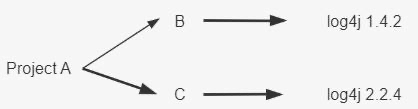

A、B、C 都是本地子项目 module，log4j 是远程依赖。

编译时： B 用 1.4.2 版本的 log4j，C 用 2.2.4 版本的 log4j,B 和 C 之间没有冲突 打包时： 只能有一个版本的代码最终打包进最终的A对应的jar包，对于 Gradle 来说这里就有冲突了

案例演示：我们在 build.gradle 引入依赖库
```groovy
dependencies {
    implementation 'org.hibernate:hibernate-core:3.6.3.Final'
    implementation 'org.slf4j:slf4j-api:1.4.0'
}
```
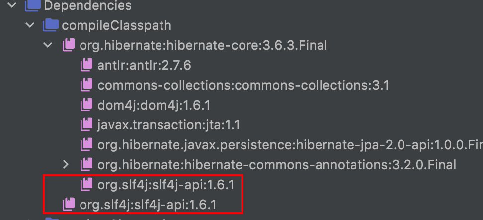

如上所示：默认下，Gradle 会使用最新版本的 jar 包【考虑到新版本的 jar 包一般都是向下兼容的】，实际开发中，还 是建议使用官方自带的这种解决方案。**当然除此之外，Gradle 也为我们提供了一系列的解决依赖冲突的方法**: exclude 移除一个依赖，不允许依赖传递，强制使用某个版本。

- Exclude 排除某个依赖
```groovy
dependencies {
    implementation('org.hibernate:hibernate-core:3.6.3.Final') {
        //排除某一个库(slf4j)依赖:如下三种写法都行
        exclude group: 'org.slf4j' 
        exclude module: 'slf4j-api'
        exclude group: 'org.slf4j', module: 'slf4j-api'
    }
    //排除之后,使用手动的引入即可。
    implementation 'org.slf4j:slf4j-api:1.4.0'
}
```

- 不允许依赖传递
```groovy
dependencies {
    implementation('org.hibernate:hibernate-core:3.6.3.Final') {
        //不允许依赖传递，一般不用
        transitive(false)
    }
    //排除之后,使用手动的引入即可。
    implementation 'org.slf4j:slf4j-api:1.4.0'
}
```
在添加依赖项时,如果设置 transitive 为 false,表示关闭依赖传递。即内部的所有依赖将不会添加到编译和运行时的类路径。

- 强制使用某个版本
```groovy
dependencies {
    implementation('org.hibernate:hibernate-core:3.6.3.Final')
    //强制使用某个版本!!【官方建议使用这种方式】
    implementation('org.slf4j:slf4j-api:1.4.0!!')
    //这种效果和上面那种一样,强制指定某个版本
    implementation('org.slf4j:slf4j-api:1.4.0') {
        version {
            strictly("1.4.0")
        }
    }
}
```
拓展：我们可以先查看当前项目中到底有哪些依赖冲突：
```groovy
//下面我们配置，当 Gradle 构建遇到依赖冲突时，就立即构建失败
configurations.all() {
    Configuration configuration ->
        //当遇到版本冲突时直接构建失败
        configuration.resolutionStrategy.failOnVersionConflict()
}
```
## 3.6 Gradle 插件
### 3.6.1 使用插件的原因
简单的说,通过应用插件我们可以

1. 促进代码重用、减少功能类似代码编写、提升工作效率
2. 促进项目更高程度的模块化、自动化、便捷化
3. 可插拔式的的扩展项目的功能
### 3.6.2 插件的作用
在项目构建过程中做很多事情，把插件应用到项目中，通常可以完成:

1. 可以添加任务【task】到项目中， 从而帮助完成测试、编译、打包等。 
2. 可以添加依赖配置到项目中。 
3. 可以向项目中拓展新的扩展属性、方法等。 
4. 可以对项目进行一些约定， 如应用 Java 插件后，约定 src/main/java 目录是我们的源代码存在位置，编译时编译这个 目录下的 Java 源代码文件。
### 3.6.3 插件的分类和使用
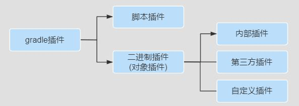
#### 第一种：脚本插件
脚本插件的本质就是一个脚本文件，使用脚本插件时通过 apply from:将脚本加载进来就可以了，后面的脚本文件可以是 本地的也可以是网络上的脚本文件，下面定义一段脚本，我们在 build.gradle 文件中使用它，具体如下：
```groovy
//version.gradle文件
ext {
    company = "Chen"
    cfgs = [
            compileSdkVersion: JavaVersion.VERSION_1_8
    ]
    spring = [
            version: '5.0.0'
    ]
}
```
下面将将在构建文件中使用这个脚本文件，具体如下:
```groovy
//build.gradle文件
//map作为参数
apply from: 'version.gradle'
task taskVersion {
    doLast {
        println "公司名称为：${company},JDK版本是${cfgs.compileSdkVersion},版本号是${spring.version}"
    }
}
```
**意义**：脚本文件模块化的基础，可按功能把我们的脚本进行拆分一个个公用、职责分明的文件，然后在主脚本文件引用， 比如：将很多共有的库版本号一起管理、应用构建版本一起管理等。
#### 第二种：对象插件之内部插件[核心插件]
二进制插件[对象插件]就是实现了 org.gradle.api.Plugin 接口的插件，每个 Java Gradle 插件都有一个 plugin id。

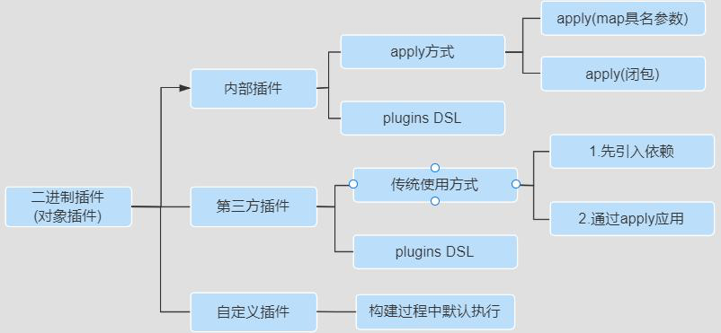

可通过如下方式使用一个 Java 插件：

`apply plugin : 'java' //map具名参数方式`

或者：
```groovy
//也可以使用闭包作为project.apply方法的一个参数
apply {
    plugin 'java'
}
```
通过上述代码就将 Java 插件应用到我们的项目中了，对于 Gradle 自带的核心插件都有唯一的 plugin id，其中 java 是 Java 插件的 plugin id,这个 plugin id 必须是唯一的，可使用应用包名来保证 plugin id 的唯一性。这里的 java 对应的 具体类型是 org.gradle.api.plugins.JavaPlugin，所以可以使用如下方式使用 Java 插件：
```groovy
//使用方式1：Map具名参数,全类名
apply plugin:org.gradle.api.plugins.JavaPlugin
//org.gradle.api.plugins默认导入：使用方式2 apply plugin:JavaPlugin
apply plugin: 'java' //核心插件，无需事先引入，使用方式3:插件的id
```
#### 第三种：对象插件之第三方插件
如果是使用第三方发布的二进制插件，一般需要配置对应的仓库和类路径
```groovy
//使用传统的应用方式
buildscript {
    ext {
        springBootVersion = "2.3.3.RELEASE"
    }
    repositories {
        mavenLocal()
        maven { url 'http://maven.aliyun.com/nexus/content/groups/public' }
    }
    // 此处先引入插件
    dependencies {
        classpath("org.springframework.boot:spring-boot-gradle-plugin:${springBootVersion}")
    }
}
//再应用插件 
apply plugin: 'org.springframework.boot' //社区插件,需要事先引入， 不必写版本号
```
但是如果是第三方插件已经被托管在 [https://plugins.gradle.org/](https://plugins.gradle.org/) 网站上，就可以不用在 buildscript 里配置 classpath依赖了，直接使用新出的 plugins DSL 的方式引用，案例如下：

**使用 plugins DSL 方式**
```groovy
plugins { 
    id 'org.springframework.boot' version '2.4.1' 
}
```
注意：

1. 如果使用老式插件方式 buildscript{}要放在 build.gradle 文件的最前面,而新式 plugins{}没有该限制。
2. 托管在网站 gradle 插件官网的第三方插件有两种使用方式，一是传统的 buildscript 方式，一种是 plugins DSL 方式 。
#### 第四种：对象插件之用户自定义插件
```groovy
interface GreetingPluginExtension {
    Property<String> getMessage()

    Property<String> getGreeter()
}

class GreetingPlugin implements Plugin<Project> {
    void apply(Project project) {
        def extension = project.extensions.create('greeting', GreetingPluginExtension)
        project.task('hello') {
            doLast {
                println "${extension.message.get()} from ${extension.greeter.get()}"
            }
        }
    }
}

apply plugin: GreetingPlugin

// Configure the extension using a DSL block
greeting {
    message = 'Hi'
    greeter = 'Gradle'
}
```
我们直接执行 hello 任务`./gradle hello` 即可,这种方式实现的插件我们一般不使用，因为这种方式局限性太强，只能本 Project，而其他的 Project 不能使用。
### 3.6.4 buildSrc 项目
buildSrc 是 Gradle 默认的插件目录，编译 Gradle 的时候会自动识别这个目录，将其中的代码编译为插件。

1. 首先先建立一个名为 buildSrc 的 java Module,将 buildSrc 从 included modules 移除,重新构建,然后只保留 build.gradle 和 src/main 目录，其他全部删掉,注意名字一定是 buildSrc,不然会找不到插件。
2. 然后修改 Gradle 中的内容
```groovy
apply plugin: 'groovy' // 必 须apply plugin: 'maven-publish'

dependencies {
    implementation gradleApi() //必须
    implementation localGroovy() //必须
}

repositories {
    google()
    mavenCentral() //必须
}

//把项目入口设置为src/main/groovy
sourceSets {
    main {
        groovy {
            srcDir 'src/main/groovy'
        }
    }
}
```

3. 创建入口目录，在 src/main 下创建代码入口目录，如下：

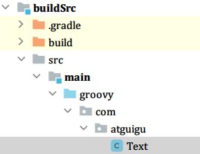

4. 然后实现插件代码 Text.groovy，注意文件后缀为 groovy,文件要引入 package com.cgp
```groovy
package com.cgp
import org.gradle.api.Plugin
import org.gradle.api.Project

class Text implements Plugin<Project> {
    @Override
    void apply(Project project) {
        project.task("atguigu") {
            doLast {
                println("自定义atguigu插件")
            }
        }
    }
}
```

5. 接下来在 main 目录下创建 resources 目录,在 resources 目录下创建 META-INF 目录， 在 META-INF 目录下创建gradle-plugins 目录，在 gradle-plugins 目录下创建 properties 文件
6. properties 文件可以自己命名，但是要以.properties 结尾，比如 com.cgp.plugin.properties,其com.cgp.plugin 就是定义的包名路径


7. 最后需要在 properties 文件中指明我们实现插件的全类名 implementation-class=com.cgp.Text

到目前为止我们的插件项目已经写完了，在 module 引入我们写的插件 apply plugin:'com.cgp.plugin',然后执行插件的 Task`./gradle cgp`

这种形式的写法，在我们整个工程的 module 都可以使用，但也只是限制在本工程，其他工程不能使用。

改进：

第二种写插件的方式他只能在本工程中使用，而其他的项目工程不能使用，有时候我们需要一个插件在多个工程中使用， 这时候我们就需要把插件上传 maven 中。

1. 首先将上述 buildSrc 目录复制一份，修改文件夹名，然后在 settings.gradle 文件中使用 include 引入
2. 修改 build.gradle 文件，发布到 maven 仓库中
```groovy
apply plugin: 'groovy' // 必 须
apply plugin: 'maven-publish'
dependencies {
    implementation gradleApi() //必须
    implementation localGroovy() //必须
}
repositories {
    google()
    mavenCentral() //必须
}
sourceSets { //把项目入口设置为src/main/groovy
    main {
        groovy {
            srcDir 'src/main/groovy'
        }
    }
}
publishing {
    publications {
        myLibrary(MavenPublication) {
            groupId = 'com.cgp.plugin' //指定GAV坐标信息
            artifactId = 'library'
            version = '1.1'
            from components.java//发布jar包
            //from components.web///引入war插件，发布war包
        }
    }
    repositories {
        maven {
            url "$rootDir/lib/release"
        }
        //发布项目到私服中
        maven {
            name = 'myRepo' //name属性可选,表示仓库名称，url必填
            //发布地址:可以是本地仓库或者maven私服
            url = layout.buildDirectory.dir("repo")
            url='http://my.org/repo'
            // change URLs to point to your repos, e.g. http://my.org/repo
            //认证信息:用户名和密码
            credentials {
                username = 'joe'
                password = 'secret'
            }
        }
    }
}
```

3. 执行 publish 指令,发布到根 project 或者 maven 私服仓库。
4. 使用插件,在项目级 build.gradle 文件中将插件添加到 classpath
```groovy
buildscript {
    repositories {
        maven { url "$rootDir/lib/release" }
    }
    dependencies {
        classpath "com.cgp.plugin:library:1.1"
    }
}

apply plugin: 'java'
//是在 atguiguplugin  中定义的插件 ID 
apply plugin: 'com.cgp.plugin'
```

5. 执行 gradle build 指令就会在控制台看到自定义插件的输出，说明自定义插件就已经生效了。

最后，至于如何写一个插件，能帮助项目更加自动化或者便捷化，是值得大家未来需要长期思考、关注、努力的点。
### 3.6.5 插件的关注点
**第一点: 插件的引用**

`apply plugin: '插件名'`

**第二点:主要的功能[任务]**

当我们在工程中引入插件后，插件会自动的为我们的工程添加一些额外的任务来完成相应的功能。以 Java 插件为例，当 我们加入 java 插件之后，就加入了如下功能：


如果要使用某个插件就应该按照它约定的目录结构设置，这样能大大提高我们的效率，当然各目录结构也可以自己定义。

**第四点：依赖管理**

比如前面我们提到的 依赖的类型[依赖管理]部分，不同的插件提供了不同的依赖管理。

**第五点：常用的属性**

例如：Java 插件会为工程添加一些常用的属性,我们可以直接在编译脚本中直接使用。

| 属性名称 | 类型 | 默认值 | 描述 |
| :-- | :-- | :-- | :-- |
| reportsDirName | String | reports | 生成报告的目录名称 |
| reportsDir | File（只读） | buildDir/reportsDirName | 生成报告的目录 |
| testResultsDirName | String | test-results | 生成测试result.xml 文件的目录名称 |
| testResultsDir | File（只读） | reportsDir/testReportDirName | 生成测试报告的目录 |
| libsDirName | String | libs | 生成 lib 库的目录名称 |
| libsDir | File（只读） | buildDir/libsDirName | 生成 lib 库的目录 |
| distsDirName | String | distributions | 生成发布文件的目录名称 |
| distsDir | File（只读） | buildDir/distsDirName | 生成发布文件的目录 |
| docsDirName | String | docs | 生成帮助文档的目录名称 |
| docsDir | File（只读） | buildDir/docsDirName | 生成帮助文档的目录 |
| dependencyCacheDirName | String | dependency-cache | 存储缓存资源依赖信息的目录名称 |
| dependencyCacheDir | File（只读） | buildDir/dependencyCacheDirName | 存储缓存资源依赖信息的目录 |
| 当然，这里还有一些其它属性 |  |  |  |
| sourceSets | SourceSetContainer (只读) | Not null | 包含工程的资源集合（source sets.） |
| sourceCompatibility | JavaVersion | 根据使用的 JVM 定 | 编译java文件时指定使用的java 版本 |
| targetCompatibility | JavaVersion | sourceCompatibility | 生成 classes 的 java 版本 |
| archivesBaseName | String | projectName | 作为归档文件的默认名称，如JAR 或者 ZIP 文件的名称 |

### 3.6.6 Java 插件分析
**第一点：我们要关注插件使用**
```groovy
plugins { 
    id 'java' 
}
```
**第二点：我们要关注插件的功能**

我们可通过官方文档介绍了解某个插件功能或者百度、再或者大家可以通过 gradle tasks 查看加入 java 插件前后的区别。

**第三点：项目布局**

一般加入一个插件之后，插件也会提供相应的目录结构，例如：java 插件的目录结构

当然这个默认的目录结构也是可以改动的例如
```groovy
sourceSets {
    main {
        java {
            srcDirs = ['src/java']
        }
        resources {
            srcDirs = ['src/resources']
        }
    }
}
```
也可设置源集的属性等信息。

**第四点：依赖管理：以 java 插件为例，提供了很多依赖管理项**

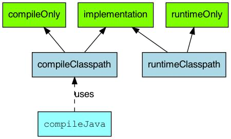

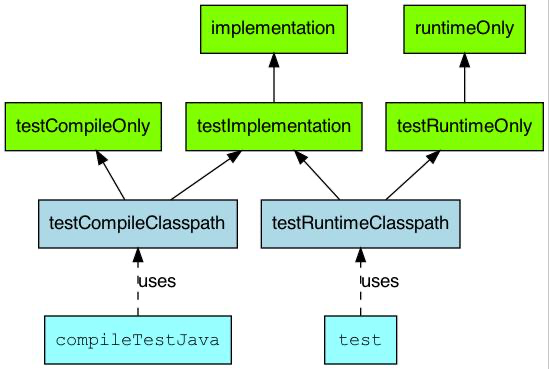
## 3.7 build.gradle 文件

- build.gradle 是一个 gradle 的构建脚本文件,支持 java、groovy 等语言。
- 每个 project 都会有一个 build.gradle 文件,该文件是项目构建的入口,可配置版本、插件、依赖库等信息。
- 每个 build 文件都有一个对应的 Project 实例,对 build.gradle 文件配置，本质就是设置 Project 实例的属性和方法。
- 由于每个 project 都会有一个 build 文件,那么 Root Project 也不列外.Root Project 可以获取到所有 Child Project,所以在Root Project 的 build 文件中我们可以对 Child Project 统一配置,比如应用的插件、依赖的 maven 中心仓库等。
- build 文件中常见的属性和方法如下所示

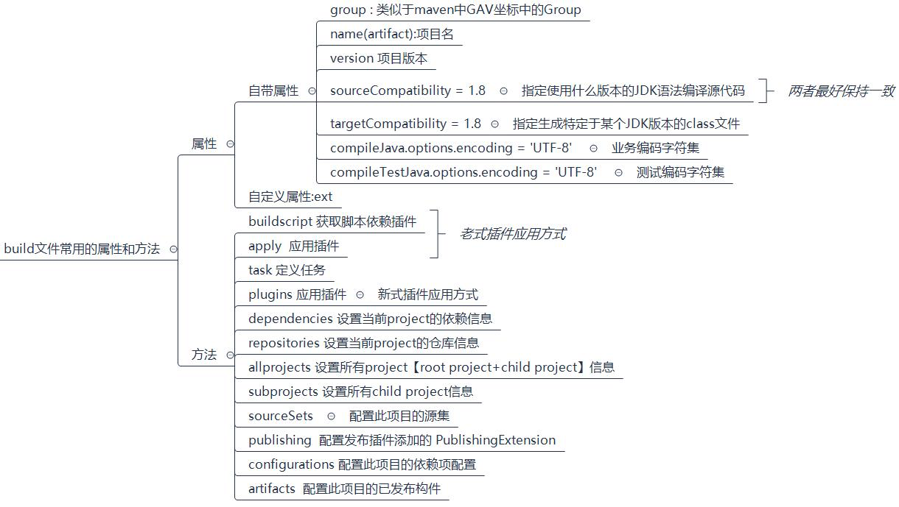
### 3.7.1 常见属性代码
代码参考：
```groovy
//指定使用什么版本的JDK语法编译源代码,跟编译环境有关,在有java插件时才能用
sourceCompatibility = 1.8
//指定生成特定于某个JDK版本的class文件:跟运行环境有关,在有java插件时才能用
targetCompatibility = 1.8
//业务编码字符集,注意这是指定源码解码的字符集[编译器]
compileJava.options.encoding "UTF-8"
//测试编码字符集,注意这是指定源码解码的字符集[编译器]
compileTestJava.options.encoding "UTF-8"
//编译JAVA文件时采用UTF-8:注意这是指定源码编码的字符集【源文件】
tasks.withType(JavaCompile) {
    options.encoding = "UTF-8"
}
//编译JAVA文件时采用UTF-8:注意这是指定文档编码的字符集【源文件】
tasks.withType(Javadoc) {
    options.encoding = "UTF-8"
}
```
提示 1：group+name+version 类似于 maven 的 group+artifactId+version 

提示 2：encoding 解决业务代码与测试代码中文乱码问题
### 3.7.2 Repositories
```groovy
repositories {
    //gradle中会按着仓库配置的顺序，从上往下依次去对应的仓库中找所需要的jar包:
    //如果找到，则停止向下搜索，如果找不到，继续在下面的仓库中查找
    //指定去本地某个磁盘目录中查找:使用本地file文件协议:一般不用这种方式
    maven { url 'file:///D:/repos/mavenrepos3.5.4' }
    maven { url "$rootDir/lib/release" }
    //指定去maven的本地仓库查找
    mavenLocal()
    //指定去maven的私服或者第三方镜像仓库查找
    maven { name "Alibaba"; url "https://maven.aliyun.com/repository/public" }
    maven { name "Bstek"; url "https://nexus.bsdn.org/content/groups/public/" }
    //指定去maven的远程仓库查找:即 https://repo.maven.apache.org/maven2/
    mavenCentral()
    //去google仓库查找
    google()
}
```
因为 Gradle 没有自己的远程仓库，而是使用 Maven、jvy、google 这些远程仓库。
### 3.7.3 Subprojects 与 Allprojects
allprojects 是对所有 project(**包括 Root Project+ child Project[当前工程和所有子工程]**)的进行统一配置， 而 subprojects 是对**所有 Child Project 的进行统一配置**。

测试如下：
```groovy
allprojects {
    tasks.create('hello') {
        doLast {
            task ->
                println "project name is $task.project.name"
        }
    }
}
subprojects {
    hello.doLast { task ->
        println "here is subprojects $task.project.name"
    }
}
```
通常在 subprojects 和 allprojects 中
```groovy
allprojects() { //本质Project中的allprojects方法，传递一个闭包作为参数。
    apply plugin: 'java'
    ext {
        junitVersion = '4.10'
        ...
    }
    task allTask {
        ...
    }
    repositories {
        ...
    }
    dependencies {
        ...
    }
}
subprojects() {
    ...//同上面allprojects中的方法。
}
```
拓展 1: 如果是直接**在根 project 配置** repositories 和 dependencies 则**只针对根工程有效**。

拓展:我们也可以在对单个 Project 进行单独配置
```groovy
project('subject01') {
    task subject01 {
        doLast {
            println 'for subject01'
        }
    }
}
```
执行 gradle build 指令即可查看测试效果。
### 3.7.4 ext 用户自定义属性
Project 和 Task 都允许用户添加额外的自定义属性，要添加额外的属性，通过应用所属对象的 ext 属性即可实现。添加 之后可以通过 ext 属性对自定义属性读取和设置，如果要同时添加多个自定义属性,可以通过 ext 代码块:
```groovy
//自定义一个Project的属性
ext.age = 18
//通过代码块同时自定义多个属性
ext {
    phone = 19292883833
    address = "北京天安门"
}
task extCustomProperty {
    //在task中自定义属性
    ext {
        desc = "奥利给"
    }
    doLast {
        println " 年 龄 是 ：${age}"
        println "电话是：${phone}"
        println "地址是：${address}"
    }
}
```
拓展 1: ext 配置的是用户自定义属性，而 gradle.properties 中一般定义 系统属性、环境变量、项目属性、JVM 相关配置 信息。例如

gradle.properties 文件案例：加快构建速度的，gradle.properties 文件中的属性会自动在项目运行时加载。
```properties
## 设置此参数主要是编译下载包会占用大量的内存，可能会内存溢出
org.gradle.jvmargs=-Xms4096m -Xmx8192m 
## 开启gradle缓存
org.gradle.caching=true 
#开启并行编译
org.gradle.parallel=true 
#启用新的孵化模式
org.gradle.configureondemand=true 
#开启守护进程
org.gradle.daemon=true
```
### 3.7.5 Buildscript
buildscript 里是 gradle 脚本执行所需依赖，分别是对应的 maven 库和插件。

案例如下：
```groovy
import org.apache.commons.codec.binary.Base64

buildscript {
    repositories {
        mavenCentral()
    }
    dependencies {
        classpath group: 'commons-codec', name: 'commons-codec', version: '1.2'
    }
}
tasks.register('encode') {
    doLast {
        def byte[] encodedString = new Base64().encode('hello world\n'.getBytes())
        println new String(encodedString)
    }
}
```
需要注意的是：

1. buildscript{}必须在 build.gradle 文件的最前端。
2. 对于多项目构建，项目的 buildscript ()方法声明的依赖关系可用于其所有子项目的构建脚本。
3. 构建脚本依赖可能是 Gradle 插件。

案例如下所示：
```groovy
//老式apply插件的引用方式,使用apply+buildscript
buildscript {
    ext {
        springBootVersion = "2.3.3.RELEASE"
    }
    repositories {
        mavenLocal()
        maven { url 'http://maven.aliyun.com/nexus/content/groups/public' }
    }
    //此处引入插件
    dependencies {
        classpath("org.springframework.boot:spring-boot-gradle-plugin:${springBootVersion}")
    }
}
apply plugin: 'java' //核心插件，无需事先引入
apply plugin: 'org.springframework.boot' //社区插件，需要事先引入,才能应用，不必写版本号
```
## 3.8 publishing 项目发布
**接下来，将咱们写好的模块发布发布到公司的私服以供别人使用,如下所示：**

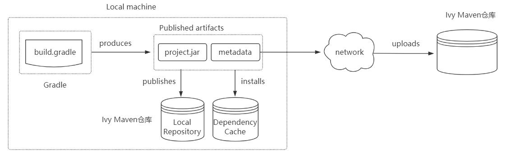
### 3.8.1 引入 maven 发布的插件
```groovy
plugins { 
    id 'java-library' //如果发布war包，需要war插件,java-library支持带源码、文档发布 
    id 'maven-publish' 
}
```
### 3.8.2 设置发布代码
```groovy
//带源码和javadoc的发布:需要'java-library'插件支持:它是java的升级版，java插件的功能java-library都有
//javadoc.options.encoding="UTF-8"
//java {
//	withJavadocJar()
//	withSourcesJar()
//} 
publishing {
    publications {
        myLibrary(MavenPublication) {
            groupId = 'org.gradle.sample' //指定GAV坐标信息
            artifactId = 'library'
            version = '1.1'
            from components.java//发布jar包
            //from components.web///引入war插件，发布war包
        }
    }
    repositories {
        //本地仓库位于USER_HOME/.m2/repository 
        mavenLocal()
        //发布项目到私服中
        maven {
            name = 'myRepo' //name属性可选,表示仓库名称，url必填
            //发布地址:可以是本地仓库或者maven私服
            //url = layout.buildDirectory.dir("repo")
            // change URLs to point to your repos, e.g. http://my.org/repo
            def releasesRepoUrl = layout.buildDirectory.dir('repos/releases')
            def snapshotsRepoUrl = layout.buildDirectory.dir('repos/snapshots')
            url = version.endsWith('SNAPSHOT') ? snapshotsRepoUrl : releasesRepoUrl
            //认证信息:用户名和密码
            credentials {
                username = 'joe'
                password = 'secret'
            }
        }
    }
}
```
### 3.8.3 执行发布指令
执行发布命令，将项目发布到本地仓库或者远程仓库。常见的发布指令有

generatePomFileForPubNamePublication: 生成 pom 文件 

publishPubNamePublicationToRepoNameRepository:发布项目到指定仓库,如果没有仓库名， 默认为 maven publishPubNamePublicationToMavenLocal: 将 PubName 发布复制到本地 Maven 仓库中包括 POM 文件和其他元数据。

publish: 发布到 repositories 中指定的仓库(为比如 Maven 私服)

publishToMavenLocal: 执行所有发布任务中的操作发布到本地 maven 仓库【默认在用户家目录下的.m2/repository】
## 3.9 生命周期中 Hook
生命周期中的这些钩子函数都是由 gradle 自动回调完成的,利用这些钩子函数可以帮助我们实现一些我们想要的功能。

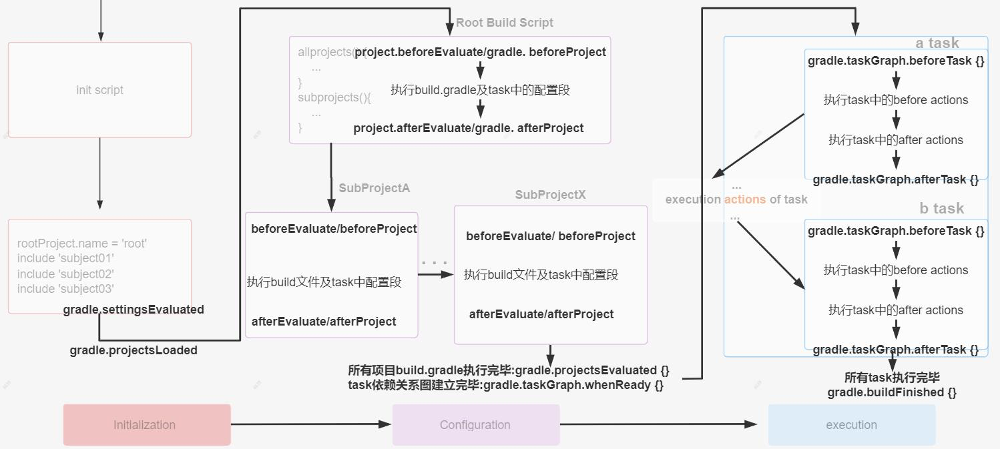

Gradle 在生命周期各个阶段都提供了用于回调的钩子函数:

Gradle 初始化阶段:

- 在 settings.gradle 执行完后,会回调 Gradle 对象的 settingsEvaluated 方法
- 在构建所有工程 build.gradle 对应的Project 对象后,也既初始化阶段完毕,会回调 Gradle 对象的projectsLoaded 方法

Gradle 配置阶段:

- Gradle 会循环执行每个工程的 build.gradle 脚本文件
- 在执行当前工程build.gradle 前,会回调Gradle 对象的 beforeProject 方法和当前Project 对象的 beforeEvaluate 方法, 虽然 beforeEvalute 属于 project 的生命周期, 但是此时 build script 尚未被加载, 所以 beforeEvaluate 的设置依 然要在 init script 或 setting script 中进行,不要在 build script 中使用 project.beforeEvaluate 方法。
- 在执行当前工程 build.gradle 后,会回调 Gradle 对象的afterProject 方法和当前Project 对象的 afterEvaluate 方法
- 在所有工程的 build.gradle 执行完毕后，会回调 Gradle 对象的 projectsEvaluated 方法
- 在构建 Task 依赖有向无环图后,也就是配置阶段完毕,会回调TaskExecutionGraph 对象的 whenReady 方法

Gradle 执行阶段:

- Gradle 会循环执行Task 及其依赖的 Task
- 在当前 Task 执行之前,会回调 TaskExecutionGraph 对象的 beforeTask 方法
- 在当前 Task 执行之后,会回调 TaskExecutionGraph 对象的 afterTask 方法当所有的 Task 执行完毕后，会回调 Gradle 对象的 buildFinish 方法。

提示：Gradle 执行脚本文件的时候会生成对应的实例，主要有如下几种对象：

1. Gradle 对象：在项目初始化时构建，全局单例存在，只有这一个对象
2. Project 对象：**每一个build.gradle文件 **都会转换成一个 Project 对象,类似于maven中的pom.xml文件
3. Settings 对象：settings.gradle 会转变成一个 settings  对象,和整个项目是一对一的关系,一般只用到include方法
4. Task对象: 从前面的有向无环图中，我们也可以看出，gradle最终是基于Task的,一个项目可以有一个或者多个Task

钩子函数代码演示：项目目录结构如下：

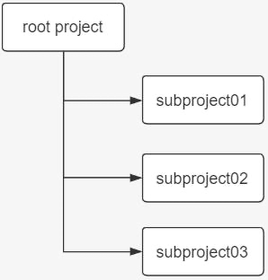

在 root project 的 settings.gradle 文件中添加：
```groovy
gradle.settingsEvaluated { //1.settingsEvaluated钩子函数,在初始化阶段完成
    println "settingsEvaluated"
}
gradle.projectsLoaded { //2.projectsLoaded钩子函数,在初始化阶段完成
    println "projectsLoaded"
}
//声明一个变量：表示当前项目名,在每次执行某个项目的beforeEvaluate方法时先给projectName变量赋值
//这样方便在：gradle.beforeProject和afterProject两个钩子函数使用。
def projectName = ""
gradle.addProjectEvaluationListener(new ProjectEvaluationListener() {
    //3.执行各个project的beforeEvaluate：在配置阶段完成
    @Override
    void beforeEvaluate(Project project) {
        projectName = project.name
        println "${project.name} Project beforeEvaluate"
    }
    //5.执行各个project的afterEvaluate：在配置阶段完成\
    @Override
    void afterEvaluate(Project project, ProjectState projectState) {
        println "${project.name} Project afterEvaluate"
    }
});
gradle.beforeProject {//4.执行各个project的beforeProject：在配置阶段完成
    println "${projectName} beforeProject..."
}
gradle.afterProject {//6.执行各个project的afterProject：在配置阶段完成
    println "${projectName} afterProject..."
}
//7.所有工程的 build.gradle 执行完毕后，回调 Gradle 对象的 projectsEvaluated 方法：在配置阶段完成
def rootProjectName = rootProject.getName()
gradle.projectsEvaluated {
    println "${rootProjectName} projectsEvaluated..."
}
//8.配置阶段完毕后，回调 TaskExecutionGraph 对象的 whenReady 方法：在配置阶段完成
gradle.taskGraph.whenReady {
    println "${rootProjectName} taskGraph whenReady..."
}

//9.在当前Task执行之前,会回调 TaskExecutionGraph 对象的 beforeTask方法：在执行阶段完成
gradle.taskGraph.beforeTask { task ->
    println "this is the task ${task.name} of the project ${task.getProject().name} beforeTask.."
}
//10.在当前Task执行之后,会回调 TaskExecutionGraph 对象的 afterTask方法：在执行阶段完成
gradle.taskGraph.afterTask { task ->
    println "this is the task ${task.name} of the project ${task.getProject().name}  afterTask.."
}
//11.当所有的 Task 执行完毕后，会回调 Gradle 对象的 buildFinish 方法：在执行阶段完成
gradle.buildFinished {
    println "${rootProjectName} buildFinished..."
}
```
在 root 的 build.gradle 文件中添加
```groovy
task A {
    println "root taskA" doFirst() {
        println "root taskA doFirst"
    }
    doLast() {
        println "root taskA doLast"
    }
}
```
在 subject01 的 build.gradle 文件中添加
```groovy
task B {
    println "SubProject01 taskB"
    doFirst() {
        println "SubProject01 taskB doFirst"
    }
    doLast() {
        println "SubProject01 taskB doLast"
    }
}
```
在 subject02 的 build.gradle 文件中添加
```groovy
//task C 在上面
task C {
    // 依赖task D
    dependsOn 'D'
    println "SubProject02 taskC"
    doFirst() {
        println "SubProject02 taskC doFirst"
    }
    doLast() {
        println "SubProject02 taskC doLast"
    }
}
//task D 在下面
task D {
    println "SubProject02 taskD" doFirst() {
        println "SubProject02 taskD doFirst"
    }
    doLast() {
        println "SubProject02 taskD doLast"
    }
}
```
测试：在 root 工程的根目录执行：gradle C .就能看到 gradle 生命周期的三个阶段，及每个阶段执行的钩子函数、还有在 执行阶段有依赖关系的任务的执行顺序问题。 

拓展 1：在 settings.gradle 中添加监听器，**查看 task 有向无环图**:
```groovy
gradle.taskGraph.addTaskExecutionGraphListener(new TaskExecutionGraphListener() {
    @Override
    void graphPopulated(TaskExecutionGraph taskExecutionGraph) {// 生成有向无环图
        taskExecutionGraph.allTasks.forEach(task -> {//核心逻辑:通过taskExecutionGraph获得所有的task
            taskExecutionGraph.allTasks.forEach(releaseTask -> {
                println "Chen:" + releaseTask.getProject().name + ":" + releaseTask.name
            })
        })
    }
})
```
拓展 2: 计算 Gradle 构建过程中各个阶段的耗时:需要注意，这里只是计算了初始化阶段的 settings 文件，并没有计算 init.gradle 初始化的时间。
```groovy
def projectName = rootProject.getName() //定义项目名
long beginOfSetting = System.currentTimeMillis() //初始化阶段开始时间
def beginOfConfig // 配置阶段开始时间
def configHasBegin = false //配置阶段是否开始了，只执行一次
def beginOfProjectConfig = new HashMap() //存放每个build.gradle 执行之前的时间
def beginOfTaskExecute // 执行阶段开始时间
gradle.projectsLoaded { // 初始化阶段执行完毕
    println "${projectName}工程 初始化总耗时  ${System.currentTimeMillis() - beginOfSetting} ms"
}
//build.gradle 执行前
gradle.beforeProject { Project project ->
    if (!configHasBegin) {
        configHasBegin = true
        beginOfConfig = System.currentTimeMillis()
    }
    beginOfProjectConfig.put(project, System.currentTimeMillis())
}
//build.gradle 执行后
gradle.afterProject { Project project ->
    def begin = beginOfProjectConfig.get(project)
    if (project.name == projectName) {
        println "根工程${projectName} 配置阶段耗时：${System.currentTimeMillis() - begin} ms"
    } else {
        println "子工程${project.name} 配置阶段耗时：${System.currentTimeMillis() - begin} ms"
    }
}
gradle.taskGraph.whenReady {//配置阶段完毕
    println "整个${projectName}项目在配置阶段总耗时：${System.currentTimeMillis() - beginOfConfig} ms"
    beginOfTaskExecute = System.currentTimeMillis()
}
//执行阶段开始
gradle.taskGraph.beforeTask { Task task ->
    task.doFirst {
        task.ext.beginOfTask = System.currentTimeMillis()
    }
    task.doLast {
        println "${task.name}在执行阶段耗时：${System.currentTimeMillis() - task.ext.beginOfTask} ms"
    }
}
gradle.buildFinished {//执行阶段完毕
    println " 执行阶段总耗时：${System.currentTimeMillis() - beginOfTaskExecute} ms"
    println " 整个构建过程耗时：${System.currentTimeMillis() - beginOfSetting} ms"
}
```
## 3.10 创建 Springboot 项目
Spring Boot Gradle 插件在 Gradle 提供 Spring Boot 支持。它允许您打包可执行 jar 或 war 归档文件，运行 SpringBoot 应用程序，并使用 Spring-Boot-dependencies 提供的依赖管理。
### 3.10.1 引入 springboot 插件
该插件发布在 Gradle 的插件门户网站上，可以使用插件块来应用:
```groovy
plugins {
    id 'org.springframework.boot' version '2.3.7.RELEASE' //维护springboot版本号,不单独使用,和下面两个插件一起用
    id 'io.spring.dependency-management' version '1.0.10.RELEASE'
    //进行依赖管理,在引入其它boot依赖时省略版本号、解决jar包冲突问题
    id 'java'
}
```
### 3.10.2 引入所需要的依赖
```groovy
dependencies {
    implementation 'org.springframework.boot:spring-boot-starter'
    implementation 'org.springframework.boot:spring-boot-starter-web'//省略版本,原生bom支持,插件management提供
    testImplementation('org.springframework.boot:spring-boot-starter-test') {
        exclude group: 'org.junit.vintage', module: 'junit-vintage-engine'
    }
}

test {
    useJUnitPlatform()
}
```
### 3.10.3 执行 gradle bootRun 指令
要想运行当前 Springboot 项目，直接执行 gradle bootRun 指令或者 idea 右侧按钮即可。

当然如果想让当前项目打成可执行 jar 包，只需执行： gradle bootJar 指令即可。

Cloud 项目创建也可以借助于脚手架创建，与 Boot 项目类似。
### 3.10.4 拓展 spring-boot-gradle-plugin 插件
```groovy
buildscript {
    repositories {
        maven { url 'https://maven.aliyun.com/repository/public' }
    }

    dependencies {
        classpath 'org.springframework.boot:spring-boot-gradle-plugin:2.4.1'
    }
}

apply plugin: 'org.springframework.boot'
apply plugin: 'io.spring.dependency-management'
```
## 3.11 基于 ssm 多模块项目案例
### 3.11.1 多项目模块划分


meinian-mobile-web: 美年旅游项目的用户系统

meinian-web:美年旅游项目的管理员系统

meinian-service:美年旅游项目的业务逻辑层

meinian-dao:美年旅游项目的持久化层

meinian-bean:美年旅游项目的Model 封装
### 3.11.2 项目搭建前配置分析
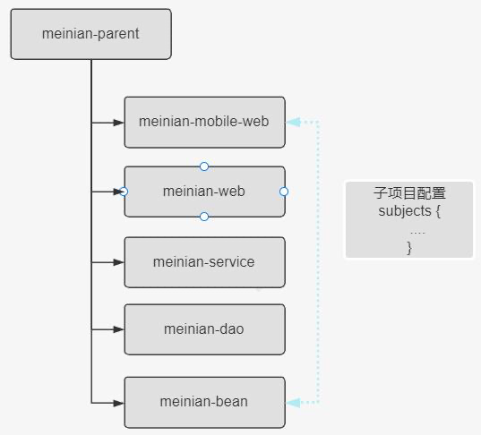
### 3.11.3 代码演示
代码和配置文件同单体 ssm 一样。只不过做了拆分。
### 3.11.4 settings.gradle 文件中
```groovy
rootProject.name = 'meinian-parent' 
include 'meinian-bean'
include 'meinian-dao' 
include 'meinian-service' 
include 'meinian-web'
include 'meinian-mobile-web'
```
### 3.11.5 在根工程 build.gradle 文件中抽取子模块的公共配置
```groovy
group 'com.cgp'
version '1.0-SNAPSHOT'

subprojects {
    //添加插件
    apply plugin: 'java'
    //基本JDK配置
    sourceCompatibility = 1.8
    targetCompatibility = 1.8

    compileJava.options.encoding "UTF-8"
    compileTestJava.options.encoding "UTF-8"

    tasks.withType(JavaCompile) {
        options.encoding = "UTF-8"
    }

    group 'com.cgp'
    version '1.0-SNAPSHOT'

    repositories {
        mavenLocal()
        maven { url "https://maven.aliyun.com/repository/public" }
        maven { url "https://maven.aliyun.com/repository/central" }
        maven { url "https://maven.aliyun.com/repository/google" }
        maven { url "https://maven.aliyun.com/repository/spring" }
        mavenCentral()
    }
    //依赖的配置:设置通用的依赖
    dependencies {
        testImplementation 'org.junit.jupiter:junit-jupiter-api' 
        testRuntimeOnly 'org.junit.jupiter:junit-jupiter-engine' 
        implementation 'log4j:log4j:1.2.17'
    }
    test {
        useJUnitPlatform()
    }
}
```
### 3.11.6 在根工程的 build.gradle 文件中配置各个模块的依赖信息
```groovy
project("meinian-bean") {
    dependencies {
        compileOnly 'org.projectlombok:lombok:1.18.24'
    }
}
project("meinian-dao") {
    apply plugin: 'java-library'//支持api
    dependencies {
        api project(':meinian-bean')
        implementation 'org.mybatis:mybatis-spring:1.2.3'
        implementation 'com.alibaba:druid:1.0.15'
        implementation 'org.mybatis:mybatis:3.3.0'
        implementation 'mysql:mysql-connector-java:5.1.36'
    }
}
project("meinian-service") {
    apply plugin: 'java-library'//支持api 
    dependencies {
        api project(':meinian-dao')
        implementation 'org.springframework:spring-web:4.1.7.RELEASE'
        implementation 'org.springframework:spring-test:4.0.5.RELEASE'
        implementation 'org.springframework:spring-jdbc:4.1.7.RELEASE'
        implementation 'org.aspectj:aspectjweaver:1.8.6'
    }
}
project("meinian-web") {
    apply plugin: 'war'
    dependencies {
        implementation project(':meinian-service')
        implementation 'org.springframework:spring-webmvc:4.1.7.RELEASE'
        implementation "com.fasterxml.jackson.core:jackson-databind:2.2.3"
        implementation "com.fasterxml.jackson.core:jackson-annotations:2.2.3"
        implementation "com.fasterxml.jackson.core:jackson-core:2.2.3"
        compileOnly 'javax.servlet:servlet-api:2.5'
        implementation 'jstl:jstl:1.2'
    }
}
project("meinian-mobile-web") {
    apply plugin: 'war'
    dependencies {
        //implementation project(':meinian-bean') 
        implementation project(':meinian-service')
        implementation 'org.springframework:spring-webmvc:4.1.7.RELEASE' 
        implementation "com.fasterxml.jackson.core:jackson-databind:2.2.3" 
        implementation "com.fasterxml.jackson.core:jackson-annotations:2.2.3" 
        implementation "com.fasterxml.jackson.core:jackson-core:2.2.3" 
        compileOnly 'javax.servlet:servlet-api:2.5'
        implementation 'jstl:jstl:1.2'
    }
}
```
抽取之后，各子模块的 build.gradle 文件就不用配置了。

