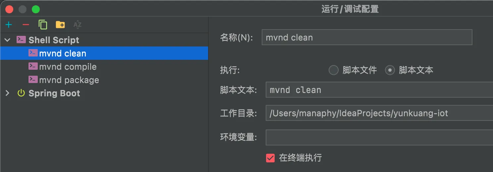
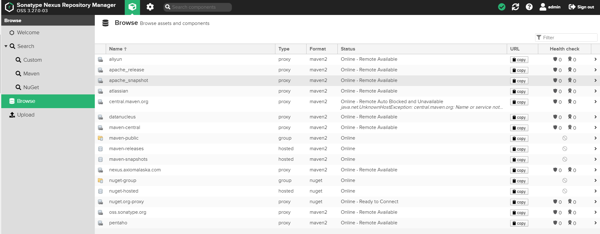
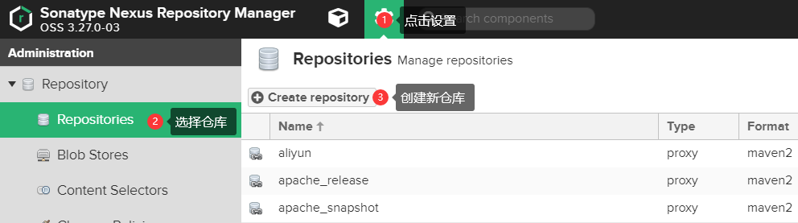
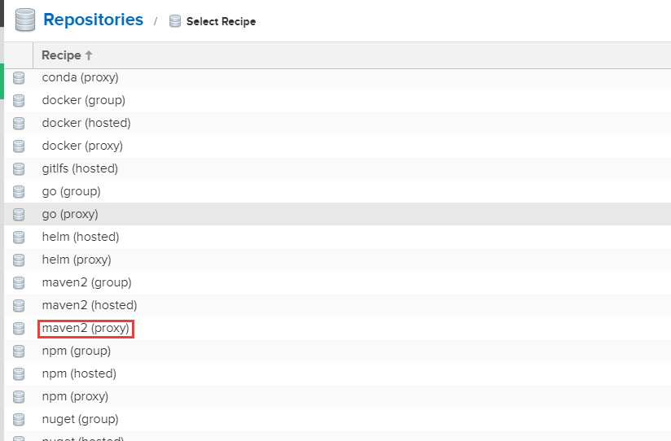
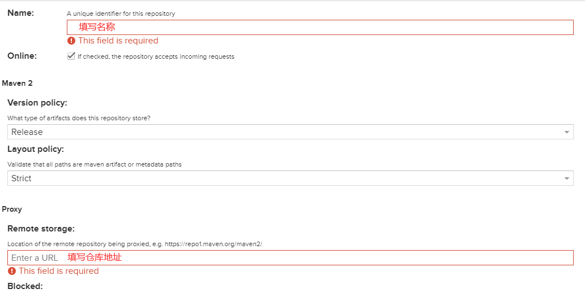
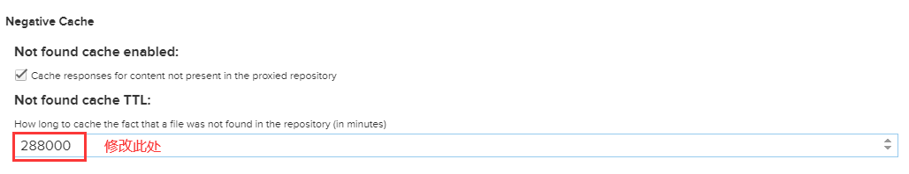
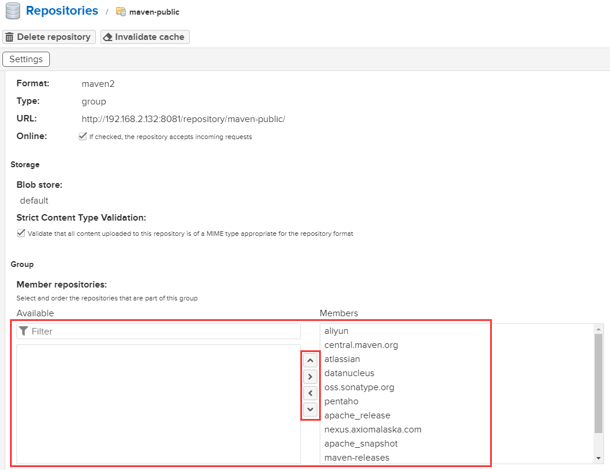
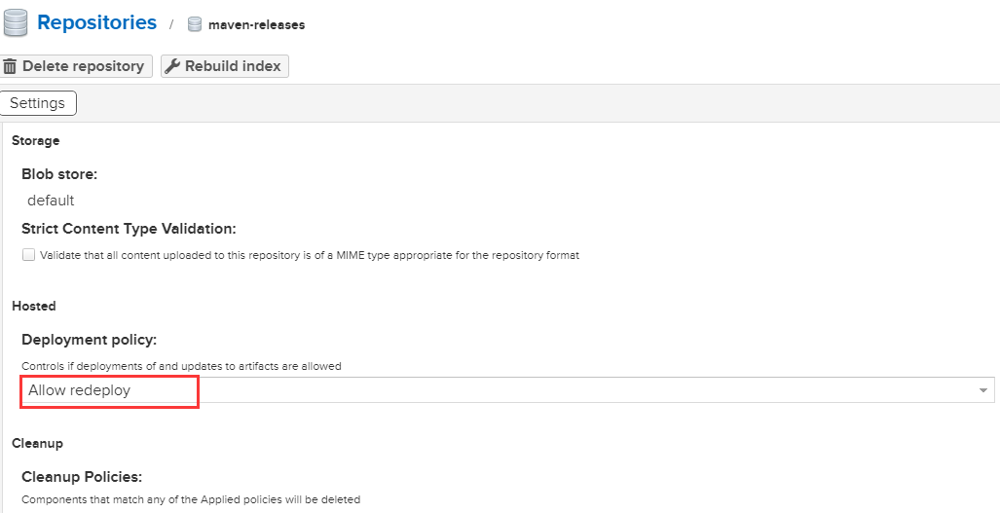
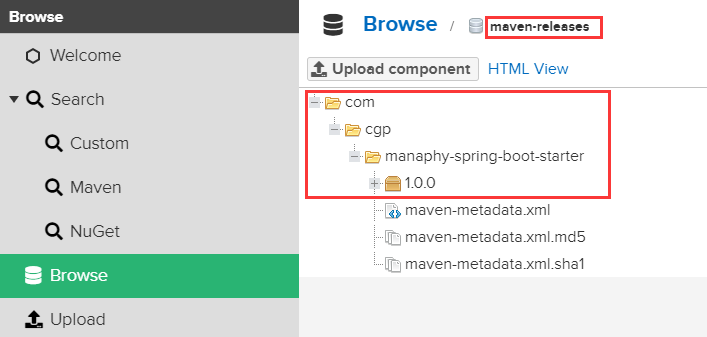

# Maven的使用
## 1. Maven setting.xml的设置
```xml
<?xml version="1.0" encoding="UTF-8"?>

<settings xmlns="http://maven.apache.org/SETTINGS/1.0.0"
          xmlns:xsi="http://www.w3.org/2001/XMLSchema-instance"
          xsi:schemaLocation="http://maven.apache.org/SETTINGS/1.0.0 http://maven.apache.org/xsd/settings-1.0.0.xsd">
  <!-- localRepository
   | 将默认的仓库位置改为想要设置的位置
   | Default: ${user.home}/.m2/repository-->
  <localRepository>D:\maven\repository</localRepository>
  
  <!-- 插件组合 -->
  <pluginGroups> 
    
  </pluginGroups>

  <!-- 代理 -->
  <proxies>
  
  </proxies>
    
  <!-- servers服务器(其中username和password是私服的用户名和密码,后续配置私服说明) -->
  <servers>
    <!-- 
    <server>
      <id>deploymentRepo</id>
      <username>repouser</username>
      <password>repopwd</password>
    </server>
    -->
  </servers>

  <!-- mirrors镜像 -->
  <mirrors>
  <!-- 阿里镜像 -->
    <mirror>
      <id>alimaven</id>
      <name>阿里云公共仓库</name>
      <url>https://maven.aliyun.com/repository/public</url>
      <mirrorOf>*</mirrorOf>        
    </mirror>
  </mirrors>

  <!-- rofiles:服务器配置 -->
  <profiles>
      <!-- java编译插件,配jdk的编译版本-->
		<profile>
		<id>jdk-1.8</id>
		<activation>
			<activeByDefault>true</activeByDefault>
			<jdk>1.8</jdk>
		</activation>
		<properties>
			<maven.compiler.source>1.8</maven.compiler.source>
			<maven.compiler.target>1.8</maven.compiler.target>
			<maven.compiler.compilerVersion>1.8</maven.compiler.compilerVersion>
		</properties>
		</profile>
  </profiles>

  <!-- activeProfiles:激活私服
  <activeProfiles>
    <activeProfile>alwaysActiveProfile</activeProfile>
  </activeProfiles>
  -->
</settings>
```

仓库地址
```bash
# 默认仓库
http://repo1.maven.org/maven2
# 阿里云
https://maven.aliyun.com/mvn/guide
# 网易
https://mirrors.163.com/.help/maven.html
# 腾讯云
https://mirrors.cloud.tencent.com/help/maven.html
```
## 2. Maven仓库说明

1. 本地仓库:储存在本地磁盘,位置由自己设置
2. 远程仓库:一般使用国内镜像或公司自己搭建私服 目的是为了加快下载速度
3. Maven(中央)仓库:Maven团队维护的jar包仓库

检索顺序:先检索本地仓库一-再检索远程仓库--最后检索中央仓库
## 3. Maven项目说明
`src/main/java`:存放项目的.java文件

`src/main/resources`:存放项目资源文件

`src/test/java`:测试资源文件

`src/test/resources`:测试资源文件

`target`:项目输出位置(可以自动生成)

`pom.xml`(maven项目核心配置文件)

pom文件配置说明
```xml
<?xml version="1.0" encoding="UTF-8"?>

<project xmlns="http://maven.apache.org/POM/4.0.0" xmlns:xsi="http://www.w3.org/2001/XMLSchema-instance"
         xsi:schemaLocation="http://maven.apache.org/POM/4.0.0 http://maven.apache.org/xsd/maven-4.0.0.xsd">
    <modelVersion>4.0.0</modelVersion>

    <groupId>com.cgp.test</groupId>
    <artifactId>mvn-test</artifactId>
    <version>1.0-SNAPSHOT</version>
    <packaging>war</packaging>
    <!-- 打包方式:
       war是web项目的打包方式
      jar是jar项目的打包方式
    -->

    <properties>
        <!--使用根路径-->
        <rootpom.basedir>${basedir}/../..</rootpom.basedir>
    </properties>

    <dependencies>
        <!-- dependency 依赖范围 -->
        <!-- scope:声明jar包的存活时间
                1.provided:编译和测试时需要
                2.compile:编译、测试、运行、打包需要
                3.runtime:运行、打包需要,编译、测试时无效
                4.test:仅在测试时有效
                5.system:编译和测试时需要,等同于,显示引用,Maven不会检索
            -->

        <!-- 生命周期 -->
        <!--
            validate - 验证项目是否正确，并提供所有必要信息
            compile - 编译项目的源代码
            test - 使用合适的单元测试框架测试编译的源代码。这些测试不应要求打包或部署代码
            package - 获取已编译的代码并将其打包为可分发的格式，例如JAR。
            verify - 对集成测试结果进行任何检查，以确保满足质量标准
            install - 将软件包安装到本地存储库中，以便在本地用作其他项目的依赖项
            deploy - 在构建环境中完成，将最终包复制到远程存储库以与其他开发人员和项目共享。
            Integration test : 集成测试 , 运行项目的集成测试
        -->

        <dependency>
            <groupId>org.projectlombok</groupId>
            <artifactId>lombok</artifactId>
            <version>1.18.24</version>
            <scope>provided</scope>
            <!--
                可选依赖
                - A->B->C(可选)
                - A依赖B,B依赖于C,当C为可选依赖的时候,并不能传递到A
            -->
            <optional>true</optional>
        </dependency>
    </dependencies>
</project>
```
## 4. Maven依赖传递
依赖一个jar包往往会下载相互关联的jar包这就是依赖传递.

依赖传递岀现的问题:经常岀现jar包冲突,解决方案是直接排除指定的jar包

解决jar包冲突的4种方式

1. 排除原则,一般排除低版本
```xml
<dependency>
    <groupId>com.fasterxml.jackson.core</groupId>
    <artifactId>jackson-databind</artifactId>
    <version>2.9.8</version>
    <!--排除依赖-->
    <!--<exclusions>
      <exclusion>
        <artifactId>jackson-core</artifactId>
        <groupId>com.fasterxml.jackson.core</groupId>
      </exclusion>-->
</dependency>
```

2. 版本号限定原则
```xml
<!-- 1.标记版本号 -->
<properties>
<!--把所有的版本号都定义在这里-->
	<spring.version>4.3.8.RELEASE</spring.version>
</properties>
<!-- 2.锁定版本 -->
<dependencies>
    <dependency>
      <groupId>org.springframework</groupId>
      <artifactId>spring-context</artifactId>
      <version>${spring.version}</version>
    </dependency>
    <dependency>
      <groupId>org.springframework</groupId>
      <artifactId>spring-web</artifactId>
      <version>${spring.version}</version>
    </dependency>
  </dependencies>
```

3. 第一生命原则(基本不用)
4. 路径就近原则(基本不用)

## 5. maven 依赖传递中的依赖范围

- **compile** 是**默认值**，当我们引入依赖时，如果标签没有指定，那么**默认**就是complie。 compile表示被依赖项目需要参与当前项目的编译，包括后续的测试，运行周期也参与其中，同时打包的时候也会包含进去。是最常用的，所以也是默认的。
- **runtime** 表示被依赖项目无需参与项目的编译，不过后期的测试和运行周期需要其参与。与compile相比，跳过编译而已。 数据库的驱动包一般都是runtime，因为在我们在编码时只会使用JDK提供的jdbc接口，而具体的实现是有对应的厂商提供的驱动(如mysql驱动)，实在运行时生效的，所以这类jar包无需参与项目的编译。
- **test** 表示只会在测试阶段使用，在src/main/java里面的代码是无法使用这些api的，并且项目打包时，也不会将"test"标记的打入"jar"包或者"war"包。
- **system** 依赖不是由maven仓库，而是本地的jar包，因此必须配合systemPath标签来指定本地的jar包所在全路径。这类jar包默认会参与编译、测试、运行，但是不会被参与打包阶段。如果也想打包进去的话，需要在插件里做配置`<includeSystemScope>true</includeSystemScope>`
```xml
<plugin>
    <groupId>org.springframework.boot</groupId>
    <artifactId>spring-boot-maven-plugin</artifactId>
    <configuration>
     <!--设置为true，以便把本地的system的jar也包括进来-->
        <includeSystemScope>true</includeSystemScope>
    </configuration>
</plugin>
```

- **provided** 表示的是在编译和测试的时候有效，在执行（mvn package）进行打包成war、jar包的时候不会加入，比如：servlet-api，因为servlet-api，tomcat等web服务器中已经存在，如果在打包进去，那么包之间就会冲突
- **import** 比较特殊，他的作用是将其他模块定义好的 dependencyManagement 导入当前 Maven 项目 pom 的 dependencyManagement 中，都是配合`<type>pom</type>`来进行的。所以import作用的是pom类型，不是jar包。
## 6. maven常用命令
```bash
# 打包
mvn clean install -Dmaven.test.skip=true -Dmaven.javadoc.skip=true
# 修改版本号 : versions:set -DnewVersion=5.0.0.1 clean install -f pom.xml -DskipTests       
    
# 跳过 JavaDoc 
mvn clean install -Dmaven.javadoc.skip=true

# 跳过 CheckStyle
mvn [target] -Dcheckstyle.skip
# --> 跳过 license : mvn clean install -DskipTests license:format
# mvn clean install -Dmaven.test.skip=true -Dmaven.javadoc.skip=true -Dcheckstyle.skip -DskipTests=true

mvn install -Dmaven.test.skip=true -Dmaven.javadoc.skip=true
mvn install -X -Dmaven.test.skip=true -Dmaven.javadoc.skip=true
    
mvn assembly:assembly
    
# 打包打入指定文件
jar -uvf0 test-server-5.2.0.jar BOOT-INF/lib/test-provisioning-java-2.1.2.jar

# 其他生命周期相关命令
mvn clean --> 清空新的项目
mvn compile --> 编译源代码
mvn test-compile --> 编译集成测试
mvn package --> 构建项目
mvn test 

# 打包项目并且部署到本地资源库
mvn install
mvn install:install-file -Dfile=algs4.jar
mvn install:install-file -Dfile=algs4.jar -DgroupId=lib.algs4 -DartifactId=algs4 -Dversion=4.0 -Dpackaging=jar　　  
    
# 打包并且上传到私服
mvn deploy
mvn clean deploy -Dmaven.test.skip=true -Dmaven.javadoc.skip=true -Dcheckstyle.skip -DskipTests=true
    
# 本地加入jar
mvn install:install-file  
-DgroupId=包名  
-DartifactId=项目名  
-Dversion=版本号  
-Dpackaging=jar  
-Dfile=jar文件所在路径  
    
# 下载源码
mvn dependency:sources

# 下载注释 
mvn dependency:resolve -Dclassifier=javadoc

# 部署到Tomcat 
mvn tomcat:redeploy

# 跳过测试阶段
mvn package -DskipTests

# 临时性跳过测试代码的编译
mvn package -Dmaven.test.skip=true
    
# 指定测试类
mvn test -Dtest=RandomGeneratorTest

# 以Random开头，Test结尾的测试类
mvn test -Dtest=Random*Test

# 用逗号分隔指定多个测试用例 
mvn test -Dtest=ATest,BTest

# 运行 checkstyle
mvn checkstyle:checkstyle
    
# 打包本地
mvn install:install-file -Dfile=xxx.jar -DgroupId=aaa -DartifactId=bbb -Dversion=1.0.0 -Dpackaging=jar
    
# 查看依赖树
mvn dependency:tree    
mvn -X dependency:tree>tree.txt

# 查看已解析依赖
mvn dependency:list

# 分析依赖关系
mvn dependency:analyze
    
# 更新版本 
mvn versions:set -DnewVersion=1.0.1-SNAPSHOT  

# 离线模式 (maven-dependency-plugin)
mvn dependency:go-offline
mvn -o verify

# 清空缓存
// 定位缓存的位置 : 
mvn help:evaluate -Dexpression=settings.localRepository -q -DforceStdout

// 方法一 : 直接手动删除
// 方法二 : 通过插件删除
mvn dependency:purge-local-repository
mvn dependency:purge-local-repository -DactTransitively=false
> 只清空缓存 , 不进行预下载和重新解析
mvn dependency:purge-local-repository -DactTransitively=false -DreResolve=false 
```
## 7. maven 命令参数介绍
mvn命令格式：mvn [options] [<goal(s)>] [<phase(s)>]    其中：-U 和 [options] 和 [goals] 位置没有关系 

| 命令          | 说明                                                         |
| :-- |-----------------------------------------------------------------------------------------------------|
| mvn -v | --version 显示版本信息;                                                                                   |
| mvn -V | --show-version 显示版本信息后继续执行Maven其他目标;                                                                |
| mvn -h | --help 显示帮助信息;                                                                                      |
| mvn -e | --errors 控制Maven的日志级别,产生执行错误相关消息;                                                                   |
| mvn -X | --debug 控制Maven的日志级别,产生执行调试信息;                                                                      |
| mvn -q | --quiet 控制Maven的日志级别,仅仅显示错误;                                                                        |
| mvn -Pxxx  | 激活 id 为 xxx的profile (如有多个，用逗号隔开);                                                                   |
| mvn -Dxxx=yyy |  指定Java全局属性;                                                                                        |
| mvn -o | --offline 运行offline模式,不联网更新依赖;                                                                      |
| mvn -N | --non-recursive 仅在当前[项目](http://www.07net01.com/tags-%E9%A1%B9%E7%9B%AE-0.html)<br />模块执行命令,不构建子模块; |
| mvn -pl | --module_name 在指定模块上执行命令;                                                                           |
| mvn -ff | --fail-fast 遇到构建失败就直接退出;                                                                            |
| mvn -fn | --fail-never 无论项目结果如何,构建从不失败;                                                                       |
| mvn -fae | --fail-at-end 仅影响构建结果,允许不受影响的构建继续;                                                                  |
| mvn -C | --strict-checksums 如果校验码不匹配的话,构建失败;                                                                 |
| mvn -c | --lax-checksums 如果校验码不匹配的话,产生告警;                                                                    |
| mvn -U | 强制更新snapshot类型的插件或依赖库(否则maven一天只会更新一次snapshot依赖);                                                   |
| mvn -npu | --no-plugin-s 对任何相关的注册插件,不进行最新检查(使用该选项使Maven表现出稳定行为，该稳定行为基于本地仓库当前可用的所有插件版本);                        |
| mvn -cpu | --check-plugin-updates 对任何相关的注册插件,强制进行最新检查(即使项目POM里明确规定了Maven插件版本,还是会强制更新);                         |
| mvn -up | --update-plugins [mvn -cpu]的同义词;                                                                    |
| mvn -B | --batch-mode 在非交互（批处理）模式下运行(该模式下,当Mven需要输入时,它不会停下来接受用户的输入,而是使用合理的默认值);                              |
| mvn -f | --file \<file\> 强制使用备用的POM文件;                                                                       |
| mvn -s | --settings \<arg\> 用户配置文件的备用路径;                                                                     |
| mvn -gs | --global-settings \<file\> 全局配置文件的备用路径;                                                             |
| mvn -emp | --encrypt-master-password \<password\> 加密主安全密码,存储到Maven settings文件里;                                |
| mvn -ep | --encrypt-password \<password\> 加密服务器密码,存储到Maven settings文件里;                                       |
| mvn -npr | --no-plugin-registry 对插件版本不使用~/.m2/plugin-registry.xml(插件注册表)里的配置;                                  |

## 8.mvnd

> mvnd 是一种用于加速 Maven 构建的工具，它全称是 Maven Daemon。它通过减少 JVM 启动时间和在后台运行 Maven 进程来提高构建效率。mvnd 基本上是 Maven 和 Gradle Daemon 概念的结合，旨在优化 Maven 构建性能，尤其是在大型项目或频繁构建时。
>
> **主要特点：**
>
> 1. **构建加速**：mvnd 会在后台守护进程中运行，并且在每次构建时不必重新启动 JVM，大大减少了启动时间。
> 2. **多线程支持**：支持并行执行构建任务，利用多核 CPU 来加快构建速度。
> 3. **缓存和复用**：可以缓存部分构建数据，以便在后续构建中复用，进一步提升构建效率。
> 4. **与原生 Maven 兼容**：mvnd 完全兼容现有的 Maven 项目和插件，你不需要修改项目的 POM 文件即可使用。

### 下载及安装

下载地址 https://downloads.apache.org/maven/mvnd/

选择对应的平台下载,并解压至自定文件夹下

将 conf 目录下的`mvnd.properties`文件复制到 maven 对应的`.m2`目录下

打开该文件，配置如下

```properties
# MVND_HOME
# The daemon installation directory. The client normally sets this according to where its mvnd executable is located
#
mvnd.home=${MVND_HOME}/bin

# JAVA_HOME
# Java home for starting the daemon. The client normally sets this as environment variable: JAVA_HOME
#
java.home=${JAVA_HOME}

# Maven的配置文件位置
# The location of the maven settings file. The client normally uses default settings in {@code ~/.m2/settings.xml}.
maven.settings=~/.m2/settings.xml
```

### 配置环境变量

**Windows 端配置方式:** 

类似 Java ，在 path 中配置相应路径

**Mac 端及 Linux 端:** 

类似于 Java 环境在 Linux 中的配置

```bash
export M2_HOME=/Users/manaphy/opt/apache-maven-3.9.1
export MVND_HOME=/Users/manaphy/opt/mvnd-1.0-m7
export JAVA_HOME=/Users/manaphy/Library/Java/JavaVirtualMachines/azul-17.0.9/Contents/Home
export PATH=${PATH}:${MAVEN_HOME}/bin:${MVND_HOME}/bin:${JAVA_HOME}/bin
```

配置完 `source 对应的文件`使配置生效

**测试是否配置完成**

在终端中输入 `mvnd -v`

```bash
manaphy@ManaphydeMacBook-Pro ~ % mvnd -v
Apache Maven Daemon (mvnd) 1.0-m7 darwin-aarch64 native client (b2ef5d81997adbcdb72dc8c5603722538fa641fe)
Terminal: org.jline.terminal.impl.PosixSysTerminal with pty org.jline.terminal.impl.jansi.osx.OsXNativePty
Apache Maven 3.9.3 (21122926829f1ead511c958d89bd2f672198ae9f)
Maven home: /Users/manaphy/opt/mvnd-1.0-m7/mvn
Java version: 17.0.9, vendor: Azul Systems, Inc., runtime: /Users/manaphy/Library/Java/JavaVirtualMachines/azul-17.0.9/Contents/Home
Default locale: zh_CN_#Hans, platform encoding: UTF-8
OS name: "mac os x", version: "14.1", arch: "aarch64", family: "mac"
```

### 配置环境变量

在 idea 中打开运行/调试配置，配置如下图所示



## 9. 其他

### 9.1 Maven打包本地依赖
需要在文件目录下执行该命令
```bash
mvn install:install-file \
  -Dfile=alipay-trade-sdk-20161215.jar \
  -DgroupId=com.alipay \
  -DartifactId=alipay-sdk-java \
  -Dversion=20161215 -Dpackaging=jar
```
### 9.2 SpringBoot打成jar包引入本地jar包

1. 在项目的`resource`目录下新建`lib`文件夹,将本地jar包放入其中
2. pom文件引入依赖方式修改
```xml
<dependency>
  <groupId>com.alipay</groupId>
  <artifactId>alipay-trade-sdk</artifactId>
  <version>20161215</version>
  <scope>system</scope>
  <systemPath>${project.basedir}/src/main/resources/lib/alipay-trade-sdk-20161215.jar</systemPath>
</dependency>
```

3. 在build节点中的builds添加build
```xml
<plugin>
	<groupId>org.springframework.boot</groupId>
	<artifactId>spring-boot-maven-plugin</artifactId>
	<configuration>
		<includeSystemScope>true</includeSystemScope>
	</configuration>
</plugin>
```
### 9.3 Maven dependency全局排除
**方式一**

案例: 把springboot项目的日志实现改为log4j2

```xml
<!-- 全局排除spring-boot-starter-logging的依赖 -->
<dependency>
    <groupId>org.springframework.boot</groupId>
    <artifactId>spring-boot-starter-logging</artifactId>
    <exclusions>
        <exclusion>
            <groupId>*</groupId>
            <artifactId>*</artifactId>
        </exclusion>
    </exclusions>
</dependency>

<dependency>
    <groupId>org.springframework.boot</groupId>
    <artifactId>spring-boot-starter-log4j2</artifactId>
</dependency>
```
**方式二**

使用 [maven-enforcer-plugin](http://maven.apache.org/plugins/maven-enforcer-plugin/) 加排除黑名单

```xml
<plugin>  
    <groupId>org.apache.maven.plugins</groupId>  
    <artifactId>maven-enforcer-plugin</artifactId>  
    <executions>  
      <execution>  
        <id>enforce-versions</id>  
        <goals>  
          <goal>enforce</goal>  
        </goals>  
        <configuration>  
          <rules>  
            <requireMavenVersion>  
              <version>2.1.0</version>  
            </requireMavenVersion>  
            <requireJavaVersion>  
              <version>1.6</version>  
            </requireJavaVersion>  
          </rules>  
        </configuration>  
      </execution>  
      <execution>  
        <id>enforce-banned-dependencies</id>  
        <goals>  
          <goal>enforce</goal>  
        </goals>  
        <configuration>  
          <rules>  
            <bannedDependencies>  
              <excludes>  
                <exclude>junit:junit</exclude>  
                <exclude>org.testng:testng</exclude>                              
                <exclude>com.google.collections:google-collections</exclude>  
                <exclude>commons-logging:commons-logging</exclude>  
              </excludes>  
              <includes>  
                <include>junit:junit:4.8.2:jar:test</include>  
                <include>cglib:cglib-nodep:jar:2.2</include>  
              </includes>  
            </bannedDependencies>  
          </rules>  
          <fail>true</fail>  
        </configuration>  
      </execution>  
    </executions>  
</plugin>
```
# Maven私有仓库搭建及使用
## 使用Docker-compose安装Nexus
```yaml
version: '3'

services:
  nexus:
    image: sonatype/nexus3
    container_name: nexus
    restart: always
    ports:
    - "8081:8081"
    volumes:
      - ./nexus-data:/nexus-data3
```
使用`docker-compose up -d`启动

查看密码文件
```shell
cat nexus-data/admin.password
```
## 登录Nexus进行配置
### 1、登录nexus
访问 [http://192.168.2.132:8081](http://192.168.2.132:8081) 进入登录界面 使用默认管理员身份登录，帐号：admin，密码：上一步得到的密码
### 2、进入管理界面


- Browse可以查看当前有多少仓库，搭建好的Nexus，默认会带有一些maven仓库，一般使用这些仓库就足够了。
- 默认仓库说明
   - maven-central：maven中央库，默认从[https://repo1.maven.org/maven2/](https://repo1.maven.org/maven2/)拉取jar
   - maven-releases：私库发行版jar，初次安装请将Deployment policy设置为Allow redeploy
   - maven-snapshots：私库快照（调试版本）jar
   - maven-public：仓库分组，把上面三个仓库组合在一起对外提供服务，在本地maven基础配置settings.xml或项目pom.xml中使用
- 仓库类型
   - Group：这是一个仓库聚合的概念，用户仓库地址选择Group的地址，即可访问Group中配置的，用于方便开发人员自己设定的仓库。maven-public就是一个Group类型的仓库，内部设置了多个仓库，访问顺序取决于配置顺序，3.x默认Releases，Snapshots，Central，当然你也可以自己设置。
   - Hosted：私有仓库，内部项目的发布仓库，专门用来存储我们自己生成的jar文件
   - Snapshots：本地项目的快照仓库
   - Releases： 本地项目发布的正式版本
   - Proxy：代理类型，从远程中央仓库中寻找数据的仓库（可以点击对应的仓库的Configuration页签下Remote Storage属性的值即被代理的远程仓库的路径），如可配置阿里云maven仓库
   - Central：中央仓库
### 3、增加新的代理源

1. 按照步骤添加新的代理源



2. 选择添加maven2的代理



3. 添加代理 (名称和地址在下一步;Cache统一设置为200天 288000 )





4. 逐个增加常用代理
```shell
1. aliyun
http://maven.aliyun.com/nexus/content/groups/public
2. apache_snapshot
https://repository.apache.org/content/repositories/snapshots/
3. apache_release
https://repository.apache.org/content/repositories/releases/
4. atlassian
https://maven.atlassian.com/content/repositories/atlassian-public/
5. central.maven.org
http://central.maven.org/maven2/
6. datanucleus
http://www.datanucleus.org/downloads/maven2
7. maven-central （安装后自带，仅需设置Cache有效期即可）
https://repo1.maven.org/maven2/
8. nexus.axiomalaska.com
http://nexus.axiomalaska.com/nexus/content/repositories/public
9. oss.sonatype.org
https://oss.sonatype.org/content/repositories/snapshots
10.pentaho
https://public.nexus.pentaho.org/content/groups/omni/
```

5. 设置maven-public 将这些代理加入Group，最好将默认的maven库放到最底下，下载顺序是从上到下依次查找，所以把下载最快的放到最上面



6. 设置私用仓库可重复发布

Nexus安装后自带maven-releases，maven-snapshots两个仓库，用于将生成的jar包发布在这两个仓库中，在实际开发中需要将maven-releases设置为可以重复发布

   
### 4、Maven配置使用Nexus
修改Maven的`settings.xml`文件
```xml
<settings xmlns="http://maven.apache.org/SETTINGS/1.0.0"
          xmlns:xsi="http://www.w3.org/2001/XMLSchema-instance"
          xsi:schemaLocation="http://maven.apache.org/SETTINGS/1.0.0 http://maven.apache.org/xsd/settings-1.0.0.xsd">
    <!-- localRepository
     | 将默认的仓库位置改为想要设置的位置
     |
     | Default: ${user.home}/.m2/repository
     -->
    <localRepository>D:\maven\repository</localRepository>

    <!-- 插件组 -->
    <pluginGroups/>

    <!-- 代理 -->
    <proxies/>

    <!-- servers服务器(其中username和password是私服的用户名和密码) -->
    <servers>
        <server>
            <id>maven-releases</id>
            <username>admin</username>
            <password>admin111</password>
        </server>

        <server>
            <id>maven-snapshots</id>
            <username>admin</username>
            <password>admin111</password>
        </server>
    </servers>

    <!-- 镜像
     | 这是从远程存储库下载依赖时使用的镜像列表。
     |-->
    <mirrors>
        <!--<mirror>
            <id>alimaven</id>
            <mirrorOf>central</mirrorOf>
            <name>aliyun maven</name>
            <url>http://maven.aliyun.com/nexus/content/groups/public/</url>
        </mirror>-->
        <mirror>
            <id>ManaphyMirror</id>
            <mirrorOf>*</mirrorOf>
            <name>Manaphy Repository Mirror.</name>
            <url>http://192.168.2.132:8081/repository/maven-public/</url>
        </mirror>
    </mirrors>

    <!-- 服务器配置 -->
    <profiles>
        <!-- java编译插件,配jdk的编译版本-->
        <profile>
            <id>jdk-1.8</id>
            <activation>
                <activeByDefault>true</activeByDefault>
                <jdk>1.8</jdk>
            </activation>
            <properties>
                <maven.compiler.source>1.8</maven.compiler.source>
                <maven.compiler.target>1.8</maven.compiler.target>
                <maven.compiler.compilerVersion>1.8</maven.compiler.compilerVersion>
            </properties>
        </profile>
        <!-- 自定义私服的配置 -->
        <profile>
            <id>Manaphy</id>
            <repositories>
                <repository>
                    <id>nexus</id>
                    <name>Public Repositories</name>
                    <url>http://192.168.2.132:8081/repository/maven-public/</url>
                    <releases>
                        <enabled>true</enabled>
                    </releases>
                </repository>
                <repository>
                    <id>maven-central</id>
                    <name>Central Repositories</name>
                    <url>http://192.168.2.132:8082/repository/maven-central/</url>
                    <releases>
                        <enabled>true</enabled>
                    </releases>
                    <snapshots>
                        <enabled>false</enabled>
                    </snapshots>
                </repository>
                <repository>
                    <id>maven-releases</id>
                    <name>Release Repositories</name>
                    <url>http://192.168.2.132:8081/repository/maven-releases/</url>
                    <releases>
                        <enabled>true</enabled>
                    </releases>
                    <snapshots>
                        <enabled>false</enabled>
                    </snapshots>
                </repository>
                <repository>
                    <id>maven-snapshots</id>
                    <name>Snapshot Repositories</name>
                    <url>http://192.168.2.132:8081/repository/maven-snapshots/</url>
                    <releases>
                        <enabled>true</enabled>
                    </releases>
                    <snapshots>
                        <enabled>true</enabled>
                    </snapshots>
                </repository>
            </repositories>

            <pluginRepositories>
                <pluginRepository>
                    <id>plugins</id>
                    <name>Plugin Repositories</name>
                    <url>http://192.168.2.132:8081/repository/maven-public/</url>
                </pluginRepository>
            </pluginRepositories>
        </profile>
    </profiles>

    <!-- 激活Profiles
     | 为所有生成激活的配置文件的列表。
     |-->
    <activeProfiles>
        <activeProfile>jdk-1.8</activeProfile>
        <activeProfile>Manaphy</activeProfile>
    </activeProfiles>

</settings>
```
## 创建私有公库
### 1、打开要发布的maven项目
### 2、修改项目的pom.xml
```xml
<distributionManagement>
    <repository>
        <id>maven-releases</id><!--此处的id要和settings.xml中repository的id保持一致-->
        <name>Nexus Release Repository</name>
        <url>http://192.168.2.132:8081/repository/maven-releases/</url>
    </repository>
    <snapshotRepository>
        <id>maven-snapshots</id><!--此处的id要和settings.xml中repository的id保持一致-->
        <name>Nexus Snapshot Repository</name>
        <url>http://192.168.2.132:8081/repository/maven-snapshots/</url>
    </snapshotRepository>
</distributionManagement>
```
### 3、发布私有公库
```shell
mvn clean deploy
```
登录Nexus，查看对应的仓库已经有相关的依赖包了



注意以下几点：

- 若项目版本号末尾带有 -SNAPSHOT，则会发布到snapshots快照版本仓库
- 若项目版本号末尾带有 -RELEASES 或什么都不带，则会发布到releases正式版本仓库
