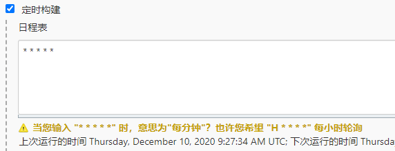

## 1. 持续集成及Jenkins介绍

### 1.1 软件开发生命周期
软件开发生命周期又叫做**SDLC** ( Software Development Life Cycle )，它是集合了计划、开发、测试和部署过程的集合。如下图所示:<br />

- 需求分析<br />这是生命周期的第一阶段，根据项目需求，团队执行一个可行性计划的分析。项目需求可能是公司内部或者客户提出的。这阶段主要是对信息的收集，也有可能是对现有项目的改善和重新做一个新的项目。还要分析项目的预算多长，可以从哪方面受益及布局，这也是项目创建的目标。
- 设计<br />第二阶段就是设计阶段，系统架构和满意状态（就是要做成什么样子，有什么功能），和创建一个项目计划。计划可以使用图表，布局设计或者文者的方式呈现。
- 实现<br />第三阶段就是实现阶段，项目经理创建和分配工作给开者，开发者根据任务和在设计阶段定义的目标进行开发代码。依据项目的大小和复杂程度，可以需要数月或更长时间才能完成。
- 测试<br />测试人员进行代码测试，包括功能测试、代码测试、压力测试等。
- 进化<br />最后进阶段就是对产品不断的进化改进和维护阶段，根据用户的使用情况，可能需要对某功能进行修改，bug修复，功能增加等。

### 1.2 软件的敏捷开发
> 敏捷开发(Agile Development)的核心是迭代开发( lterative Development)与增量开发( lncremental Development ) .

**何为迭代开发?**<br />对于大型软件项目，传统的开发方式是采用一个大周期(比如一年)进行开发，整个过程就是一次"大开发"; 迭代开发的方式则不一样，它将开发过程拆分成多个小周期，即一次"大开发"变成多次"小开发"，每次小开发都是同样的流程，所以看上去就好像重复在做同样的步骤。<br />举例来说，SpaceX公司想造一个大推力火箭，将人类送到火星。但是，它不是一开始就造大火箭，而是先造一个最简陋的小火箭Falcon 1。结果，第一次发射就爆炸了，直到第四次发射，才成功进入轨道。然后，开发了中型火箭Falcon 9，九年中发射了70次。最后，才开发Falcon重型火箭。如果SpaceX不采用迭代开发，它可能直到现在还无法上天。

**何为增量开发?**<br />软件的每个版本，都会新增一个用户可以感知的完整功能。也就是说，按照新增功能来划分迭代。<br />举例来说，房产公司开发一个10栋楼的小区。如果采用增量开发的模式，该公司第一个迭代就是交付一号楼，第二个迭代交付二号楼......每个迭代都是完成一栋完整的楼。而不是第一个迭代挖好10栋楼的地基，第二个迭代建好每栋楼的骨架，第三个迭代架设屋顶…..

**敏捷开发如何迭代?**<br />虽然敏捷开发将软件开发分成多个迭代，但是也要求，每次迭代都是一个完整的软件开发周期，必须按照软件工程的方法论，进行正规的流程管理。


### 1.3 什么是持续集成

> 持续集成(Continuous integration，简称CI)指的是，频繁地(一天多次）将代码集成到主干。
> **持续集成的目的，就是让产品可以快速迭代，同时还能保持高质量。**它的核心措施是，代码集成到主干之前，必须通过自动化测试。只要有一个测试用例失败，就不能集成。<br />通过持续集成，团队可以快速的从一个功能到另一个功能，简而言之，敏捷软件开发很大一部分都要归功于持续集成。


持续集成的流程


根据持续集成的设计，代码从提交到生产，整个过程有以下几步

- 提交<br />流程的第一步，是开发者向代码仓库提交代码。所有后面的步骤都始于本地代码的一次提交( commit )。
- 测试（第一轮)<br />代码仓库对commit操作配置了钩子( hook )，只要提交代码或者合并进主干，就会跑自动化测试。
- 构建<br />通过第一轮测试，代码就可以合并进主干，就算可以交付了。<br />交付后，就先进行构建( build )，再进入第二轮测试。所谓构建，指的是将源码转换为可以运行的实际代码，比如安装依赖，配置各种资源（样式表、JS脚本、图片)等等。
- 测试（第二轮)<br />构建完成，就要进行第二轮测试。如果第一轮已经涵盖了所有测试内容，第二轮可以省略，当然，这时构建步骤也要移到第一轮测试前面。
- 部署<br />过了第二轮测试，当前代码就是一个可以直接部署的版本( artifact )。将这个版本的所有文件打包(tar filename.tar *)存档，发到生产服务器。
- 回滚<br />一旦当前版本发生问题，就要回滚到上一个版本的构建结果。最简单的做法就是修改一下符号链接，指向上一个版本的目录。

### 1.4 持续集成的组成要素

- 一个自动构建过程，从检出代码、编译构建、运行测试、结果记录、测试统计等都是自动完成的，无需人工干预。
- 一个代码存储库，即需要版本控制软件来保障代码的可维护性，同时作为构建过程的素材库，一般使用SVN或Git。
- 一个持续集成服务器，Jenkins就是一个配置简单和使用方便的持续集成服务器。


### 1.5 持续集成的好处

1. 降低风险，由于持续集成不断去构建，编译和测试，可以很早期发现问题，所以修复的代价就少
2. 对系统健康持续检查，减少发布风险带来的问题
3. 减少重复性工作
4. 持续部署，提供可部署单元包
5. 持续交付可供使用的版本
6. 增强团队信心

### 1.6 Jenkins介绍


> Jenkins 是一款流行的开源持续集成(Continuous Integration )工具，广泛用于项目开发，具有自动化构建、测试和部署等功能。官网: [http://jenkins-ci.org/](http://jenkins-ci.org/)


Jenkins的特征︰

- 开源的Java语言开发持续集成工具，支持持续集成，持续部署。
- 易于安装部署配置∶可通过yum安装,或下载war包以及通过docker容器等快速实现安装部署，可方便web界面配置管理。
- 消息通知及测试报告︰集成RSS/E-mail通过RSS发布构建结果或当构建完成时通过e-mail通知，生成JUnit/TestNG测试报告。
- 分布式构建:支持Jenkins能够让多台计算机一起构建/测试。
- 文件识别:Jenkins能够跟踪哪次构建生成哪些jar，哪次构建使用哪个版本的jar等。
- 丰富的插件支持∶支持扩展插件，你可以开发适合自己团队使用的工具，如git , svn , maven ,docker等。

## 2. Jenkins安装和持续集成环境配置
### 2.1 持续集成流程说明


1. 首先，开发人员每天进行代码提交，提交到Git仓库
2. 然后，Jenkins作为持续集成工具，使用Git工具到Git仓库拉取代码到集成服务器，再配合JDK，Maven等软件完成代码编译，代码测试与审查，测试，打包等工作，在这个过程中每一步出错，都重新再执行一次整个流程。
3. 最后，Jenkins把生成的jar或war包分发到测试服务器或者生产服务器，测试人员或用户就可以访问应用。

### 2.2 GitLab代码托管服务器安装


官网: [https://about.gitlab.com/](https://about.gitlab.com/)

GitLab是一个用于仓库管理系统的开源项目，使用Git作为代码管理工具，并在此基础上搭建起来的web服务。

GitLab和GitHub一样属于第三方基于Git开发的作品，免费且开源（基于MIT协议），与Github类似，可以注册用户，任意提交你的代码，添加SSHKey等等。不同的是，**GitLab是可以部署到自己的服务器上，数据库等一切信息都掌握在自己手上，适合团队内部协作开发**，你总不可能把团队内部的智慧总放在别人的服务器上吧?简单来说可把GitLab看作个人版的GitHub。

#### 2.2.1 Gitlab安装
**docker-compose.yml 文件**
```shell
version: '3'
services:
  gitlab:
    image: 'gitlab/gitlab-ce'
    restart: always
    container_name: gitlab
    hostname: '192.168.2.136:8880'
    environment:
      TZ: 'Asia/Shanghai'
      GITLAB_OMNIBUS_CONFIG: |
        external_url 'http://192.168.2.136:8880'
        gitlab_rails['gitlab_shell_ssh_port'] = 2222
        # unicorn['port'] = 8888
        nginx['listen_port'] = 80
    ports:
      - '8880:80'
      - '4443:443'
      - '2222:22'
    volumes:
      - /etc/localtime:/etc/localtime
      - ./config:/etc/gitlab
      - ./data:/var/opt/gitlab
      - ./logs:/var/log/gitlab
```

执行`docker-compose up -d`运行容器

需要一定的部署时间请耐心等待

#### 2.2.2 配置Gitlab帐号密码
访问http://192.168.2.136:8880 并设置好密码<br />

使用 root 帐号加刚才设置的密码登录<br />

#### 2.2.3 Gitlab添加组、创建用户、创建项目

1. 创建组<br />使用管理员root创建组，一个组里面可以有多个项目分支，可以将开发添加到组里面进行设置权限，不同的组就是公司不同的开发项目或者服务模块，不同的组添加不同的开发即可实现对开发设置权限的管理


2. 创建用户


3. 将用户添加到组中


4. 在用户组中创建项目<br />以刚才创建的新用户身份登录到Gitlab，然后在用户组中创建新的项目<br />

### 2.3 源码上传到Gitlab仓库

1. 准备要上传的springboot项目
2. 开启版本控制 选择`Git`


3. 提交代码到本地仓库 `Git→提交`


4. 推送到Gitlab项目仓库中 `Git→推送`


### 2.4 Jenkins安装
**docker-compose.yml 文件**
```yaml
version: '3.1'
services:
  jenkins:
    image: jenkins/jenkins:lts
    volumes:
      - /root/docker/jenkins/data/:/var/jenkins_home #此处的/root/docker/jenkins/data/ 可自定义
      - /var/run/docker.sock:/var/run/docker.sock
      - /usr/bin/docker:/usr/bin/docker
      - /usr/lib/x86_64-linux-gnu/libltdl.so.7:/usr/lib/x86_64-linux-gnu/libltdl.so.7
    ports:
      - "8080:8080"
    expose:
      - "8080"
      - "50000"
    privileged: true
    user: root
    restart: always
    container_name: jenkins
```
访问http://192.168.2.136:8080<br />获取并输入admin账户密码
```shell
cat /root/docker/jenkins/data/secrets/initialAdminPassword
```

输入后点`安装推荐的插件`<br />按照提示添加管理员帐户并进入Jenkins后台
### 2.5 全局工具配置
在`系统管理→全局工具配置`<br />**配置JDK**<br />

**配置Git**<br />

### 2.6 用户权限管理
> 利用Role-based Authorization Strategy插件来管理Jenkins用户权限

**安装 Role-based Authorization Strategy 插件**<br />

**开启权限全局安全配置**<br />进入`系统管理→全局安全配置` 授权策略切换为 `Role_Based Strategy` 保存<br />

#### 2.6.1 创建角色
在`系统管理→Manage and Assign Roles`<br />


- Global roles(全局角色）︰管理员等高级用户可以创建基于全局的角色
- Item roles (项目角色）∶针对某个或者某些项目的角色
- Node roles(节点角色)︰节点相关的权限

我们添加以下三个角色

- baseRole : 该角色为全局角色。这个角色需要绑定 Overall 下面的`Read`权限，是为了给所有用户绑定最基本的Jenkins访问权限。注意:如果不给后续用户绑定这个角色，会报错误∶用户名is missing the Overall/Read permission
- role1:该角色为项目角色。使用正则表达式绑定`chen.*`，意思是只能操作`chen`开头的项目。
- role2:该角色也为项目角色。绑定`chengp.*`，意思是只能操作`chengp`开头的项目。

<br />保存
#### 2.6.2 创建用户
在`系统管理→管理用户`<br />
#### 2.6.3 给用户分配角色
在`系统管理→Manage and Assign Roles` 点击`Assign Roles`<br />绑定规则如下:

- jack用户分别绑定baseRole和role1角色
- smith用户分别绑定baseRole和role2角色

<br />保存
#### 2.6.4 创建项目测试权限
待定

### 2.7 凭证管理
凭据可以用来存储需要密文保护的数据库密码、Gitlab密码信息、Docker私有仓库密码等，以便Jenkins可以和这些第三方的应用进行交互。<br />**安装Credentials Binding Plugin插件(已在推荐的插件列表中)**<br />在`系统管理→Manage Credentials`<br />

- Username with password: 用户名和密码
- GitHub App: 新加的凭证，具体功能我也不知道
- SSH Username with private key: 使用SSH用户和密钥
- Secret file :需要保密的文本文件，使用时Jenkins会将文件复制到一个临时目录中，再将文件路径设置到一个变量中，等构建结束后，所复制的Secret file就会被删除。
- Secret text:需要保存的一个加密的文本串，如钉钉机器人或Github的api token
- Certificate :通过上传证书文件的方式

常用的凭证类型有: Username with password(用户密码）和 SSH Username with private key ( SSH密钥)<br />接下来以使用Git工具到Gitlab拉取项目源码为例，演示Jenkins如何管理Gitlab的凭证<br />前置: 需要有Git插件
#### 2.7.1 用户密码类型

1. 创建凭证<br />`全局凭据 (unrestricted)→添加凭据`<br />选择"Username with password"，输入Gitlab的用户名和密码，点击"确定"。


2. 测试凭证是否可用<br />构建一个自由风格的软件项目<br /><br />查看`/root/docker/jenkins/data/workspace/test01/`目录<br />发现已经从Gitlab成功拉取了代码到Jenkins中

#### 2.7.2 SSH密钥类型

1. 使用root账户生成公钥和私钥
```shell
[root@localhost ~]# ssh-keygen -t rsa
Generating public/private rsa key pair.
Enter file in which to save the key (/root/.ssh/id_rsa):
Created directory '/root/.ssh'.
Enter passphrase (empty for no passphrase):
Enter same passphrase again:
Your identification has been saved in /root/.ssh/id_rsa.
Your public key has been saved in /root/.ssh/id_rsa.pub.
The key fingerprint is:
SHA256:3Iwb4dFvwZ2Dc+q3vrvVu49ks3mdkesDZgiiimJMT+A root@localhost.localdomain
The key's randomart image is:
+---[RSA 2048]----+
|                 |
|         . . o . |
|        o . = =  |
| .     + B . = . |
|. .   . S + =   .|
| E . .   o + + o.|
|o + .   .   + * B|
|.+ o         + @+|
|o            .@O=|
+----[SHA256]-----+
[root@localhost ~]# cd /root/.ssh
[root@localhost .ssh]# ll
total 8
-rw-------. 1 root root 1675 Dec  9 11:51 id_rsa
-rw-r--r--. 1 root root  408 Dec  9 11:51 id_rsa.pub
```

   - id_rsa: 私钥文件
   - id_rsa.pub: 公钥文件
2. 把生成的公钥放在Gitlab中<br />以root账户登录→点击头像→设置→SSH密钥<br />复制`id_rsa.pub`文件的内容到这里，点击添加密钥<br />
3. 在Jenkins中添加凭证，配置私钥<br />在Jenkins添加一个新的凭证，类型为`SSH Username with private key`，并复制私钥文件内容到此处<br />

      

4. 测试凭证是否可用<br />新建test02项目→源码管理→Git，这次使用Gitlab的SSH连接，并且选择SSH凭证<br /><br />同样尝试构建项目，如果代码可以正常拉取，代表凭证配置成功

### 2.8 Maven安装和配置一(自动安装)
在Jenkins集成服务器上，我们需要安装Maven来编译和打包项目。<br />在**插件管理**安装`Maven Integration`插件<br />

在`系统管理→全局工具配置`中配置Maven<br />

**测试Maven是否可用**<br />修改test02项目，在构建中选`调用顶层Maven目标`<br />

<br />执行构建后查看控制台信息就能看到Jenkins自动下载Maven，进行构建

**Maven配置阿里镜像**<br />进入`/root/docker/jenkins/data/tools/hudson.tasks.Maven_MavenInstallation/maven/conf/`目录，编辑`settings.xml`文件<br />在`pluginGroups`和`mirrors`标签中添加
```xml
<pluginGroups>
    <pluginGroup>com.spotify</pluginGroup>
</pluginGroups>
<mirror>
    <id>alimaven</id>
    <name>aliyun maven</name>
    <url>https://maven.aliyun.com/nexus/content/groups/public</url>
    <mirrorOf>central</mirrorOf>
</mirror>
```

### 2.9 Maven安装和配置二(手动安装)
> 该方式可直接执行Shell命令

#### 2.9.1 安装Maven
```shell
# 进入Jenkins容器
docker exec -it jenkins bash
# 将自动安装的maven复制到 /usr/local 目录
cp -r /var/jenkins_home/tools/hudson.tasks.Maven_MavenInstallation/Maven /usr/local/
# Ctrl+D退出容器 将容器内的profile文件复制到本机
docker cp jenkins:/etc/profile ./
# 编辑profile文件,添加环境变量
export JAVA_HOME=/var/jenkins_home/tools/hudson.model.JDK/jdk8
export MAVEN_HOME=/usr/local/maven
export PATH=$PATH:$JAVA_HOME/bin:$MAVEN_HOME/bin
# 将文件复制回容器
docker cp profile jenkins:/etc/
# 重新进入容器
docker exec -it jenkins bash
# 使配置生效
source /etc/profile
# 查看maven版本
mvn -v
# 出现如下内容
Apache Maven 3.6.3 (cecedd343002696d0abb50b32b541b8a6ba2883f)
Maven home: /usr/local/maven
Java version: 1.8.0_242, vendor: Oracle Corporation, runtime: /usr/local/openjdk-8/jre
Default locale: en, platform encoding: UTF-8
OS name: "linux", version: "3.10.0-1160.6.1.el7.x86_64", arch: "amd64", family: "unix"
```
#### 2.9.2 全局工具配置关联Maven
在`全局工具中配置`中新增Maven配置<br />

#### 2.9.3 添加Jenkins全局变量
在`系统管理→系统配置→全局属性`中，添加**M2_HOME**和**PATH+EXTRA**两个属性<br />		
#### 2.9.4 测试是否配置成功
新建`test-mvn`项目 在`配置→构建`的`执行Shell`中添加`mvn -v` 保存后点构建<br />

### 2.10 Tomcat安装和配置
在生产部署服务器部署Tomcat 部署完后访问主页<br />[http://192.168.2.137:8080/](http://192.168.2.137:8080/)
#### 2.10.1 配置Tomcat用户角色权限
后续Jenkins部署项目到Tomcat服务器需要用到Tomcat的用户<br />编辑tomcat目录下`conf/tomcat-users.xml`文件，添加用户及权限 在`tomcat-users`标签中添加
```xml
<role rolename="tomcat"/>
<role rolename="role1"/>
<role rolename="manager-script"/>
<role rolename="manager-gui"/>
<role rolename="manager-status"/>
<role rolename="admin-gui"/>
<role rolename="admin-script"/>
<user username="tomcat" password="tomcat" roles="manager-gui,manager-script,tomcat,admin-gui,admin-script"/>
```
用户名和密码都是:tomcat<br />为了能够刚才配置的用户登录到Tomcat，还需要修改以下配置<br />修改tomcat目录下`/webapps/manager/META-INF/context.xml`文件<br />注释掉以下代码
```xml
<!--
  <Valve className="org.apache.catalina.valves.RemoteAddrValve"
         allow="127\.\d+\.\d+\.\d+|::1|0:0:0:0:0:0:0:1" />
  -->
```

重启Tomcat 访问测试<br />

#### 2.10.2 Jenkins构建Maven项目

1. 需要`Maven Integration`插件，已在前文安装
2. 创建Maven项目<br />
3. 配置项目<br />拉取代码和前文自由风格项目一样，只是**构建**部分不同


#### 2.10.3 将项目部署到远程Tomcat

1. 安装`Deploy to container`插件<br />Jenkins本身无法实现远程部署到Tomcat的功能，需要安装Deploy to container插件实现  (过程略...)
2. 添加Tomcat用户凭证<br />
3. 添加构建后操作


4. 部署成功后访问项目<br />[http://192.168.2.137:8080/springboot_jenkins-1.0/](http://192.168.2.137:8080/springboot_jenkins-1.0/)<br />
5. 改动代码后的持续集成
   1. IDEA中源码修改并提交到gitlab
   2. 在Jenkins中项目重新构建
   3. 访问Tomcat

## 3. Jenkins构建项目
### 3.1 构建的项目类型介绍
Jenkins中自动构建项目的类型有很多，常用的有以下三种:

- 构建一个自由风格的软件项目
- 构建一个maven项目
- 流水线

每种类型的构建其实都可以完成一样的构建过程与结果，只是在操作方式、灵活度等方面有所区别，在实际开发中可以根据自己的需求和习惯来选择。( 推荐使用流水线类型，因为灵活度非常高)
### 3.2 构建流水线项目
#### 3.2.1 Pipeline简介
> Pipeline，简单来说，就是一套运行在Jenkins上的工作流框架，将原来独立运行于单个或者多个节点的任务连接起来，实现单个任务难以完成的复杂流程编排和可视化的工作。

**使用Pipeline有以下好处**(来自翻译自官方文档)︰

- 代码︰Pipeline以代码的形式实现，通常被检入源代码控制，使团队能够编辑，审查和迭代其传送流程。
- 持久︰无论是计划内的还是计划外的服务器重启，Pipeline都是可恢复的。
- 可停止 : Pipeline可接收交互式输入，以确定是否继续执行Pipeline。
- 多功能:Pipeline支持现实世界中复杂的持续交付要求。它支持forkljoin、循环执行，并行执行任务的功能。
- 可扩展:Pipeline插件支持其DSL的自定义扩展，以及与其他插件集成的多个选项。

**如何创建Jenkins Pipeline呢?**

- Pipeline脚本是由Groovy语言实现的，但是我们没必要单独去学习GroovyPipe
- line支持两种语法:**Declarative**(声明式)和**Scripted Pipeline**(脚本式)语法
- Pipeline也有两种创建方法∶可以直接在Jenkins 的Web UI界面中输入脚本;也可以通过创建一个Jenkinsfile脚本文件放入项目源码库中(一般我们都推荐在Jenkins 中直接从源代码控制(SCM)中直接载入Jenkinsfile Pipeline 这种方法)。

如果创建项目没有流水线，则去插件管理搜索安装`Pipeline`
#### 3.2.2 Pipeline语法快速入门
**Declarative声明式-Pipeline**<br />创建名为`pipeline01`的流水线项目<br />流水线→选择Hello World模板<br />

会自动生成如下内容
```java
pipeline {
    agent any

    stages {
        stage('Hello') {
            steps {
                echo 'Hello World'
            }
        }
    }
}
```

- stages:代表整个流水线的所有执行阶段。通常stages只有1个，里面包含多个stage
- stage :代表流水线中的某个阶段，可能出现n个。一般分为拉取代码，编译构建，部署等阶段。
- steps:代表一个阶段内需要执行的逻辑。steps里面是shell脚本，git拉取代码，ssh远程发布等任意内容。

编写一个简单声明式Pipeline :
```java
pipeline {
    agent any

    stages {
        stage('拉取代码') {
            steps {
                echo '拉取代码'
            }
        }
        stage('编译构建') {
            steps {
                echo '编译构建'
            }
        }
        stage('项目部署') {
            steps {
                echo '项目部署'
            }
        }
    }
}
```
点击构建，可以看到整个构建过程<br />

```java
node {
    def mvnHome
    stage('Preparation') { // for display purposes
        // Get some code from a GitHub repository
        git 'https://github.com/jglick/simple-maven-project-with-tests.git'
        // Get the Maven tool.
        // ** NOTE: This 'M3' Maven tool must be configured
        // **       in the global configuration.
        mvnHome = tool 'M3'
    }
    stage('Build') {
        // Run the maven build
        withEnv(["MVN_HOME=$mvnHome"]) {
            if (isUnix()) {
                sh '"$MVN_HOME/bin/mvn" -Dmaven.test.failure.ignore clean package'
            } else {
                bat(/"%MVN_HOME%\bin\mvn" -Dmaven.test.failure.ignore clean package/)
            }
        }
    }
    stage('Results') {
        junit '**/target/surefire-reports/TEST-*.xml'
        archiveArtifacts 'target/*.jar'
    }
}
```

- Node :节点，一个Node就是一个Jenkins 节点，Master或者Agent，是执行Step的具体运行环境，后续讲到Jenkins的Master-Slave架构的时候用到。
- Stage :阶段，一个Pipeline 可以划分为若干个Stage，每个Stage代表一组操作，比如︰Build、Test、Deploy , Stage是一个逻辑分组的概念。
- Step:步骤，Step是最基本的操作单元，可以是打印一句话，也可以是构建一个Docker镜像，由各类Jenkins 插件提供，比如命令: sh 'make'，就相当于我们平时shell终端中执行make命令一样。

编写一个简单脚本式Pipeline :
```java
node {
    def mvnHome
    stage('拉取代码') { // for display purposes
        echo '拉取代码'
    }
    stage('编译构建') {
		echo '编译构建'
    }
    stage('项目部署') {
		echo '项目部署'
    }
}
```
构建结果和声明式一样
#### 3.2.3 拉取代码
新建`pipeline_demo01`流水线项目<br />点击流水线语法<br /><br />点击`生成流水线脚本` 就会出现以下内容
```
checkout([$class: 'GitSCM', branches: [[name: '*/master']], doGenerateSubmoduleConfigurations: false, extensions: [], submoduleCfg: [], userRemoteConfigs: [[credentialsId: '6268be95-a137-4dd7-a33b-e46579610285', url: 'ssh://git@192.168.2.136:2222/chen_group/jenkins_demo.git']]])
```
在流水线的steps中添加上一步生成的内容
```java
pipeline {
    agent any

    stages {
        stage('拉取代码') {
            steps {
                checkout([$class: 'GitSCM', branches: [[name: '*/master']], doGenerateSubmoduleConfigurations: false, extensions: [], submoduleCfg: [], userRemoteConfigs: [[credentialsId: '6268be95-a137-4dd7-a33b-e46579610285', url: 'ssh://git@192.168.2.136:2222/chen_group/jenkins_demo.git']]])
            }
        }
    }
}
```
点击`立即构建`就能拉取成功
#### 3.2.4 编译打包
流水线语法选`sh: Shell Script`
```java
pipeline {
    agent any

    stages {
        stage('拉取代码') {
            steps {
                checkout([$class: 'GitSCM', branches: [[name: '*/master']], doGenerateSubmoduleConfigurations: false, extensions: [], submoduleCfg: [], userRemoteConfigs: [[credentialsId: '6268be95-a137-4dd7-a33b-e46579610285', url: 'ssh://git@192.168.2.136:2222/chen_group/jenkins_demo.git']]])
            }
        }
        stage('编译构建') {
            steps {
                sh 'mvn clean package'
            }
        }
    }
}
```
#### 3.2.5 部署
以下语法通过流水线语法 `deploy: Deploy war/ear to a container`生成
```java
pipeline {
    agent any

    stages {
        stage('拉取代码') {
            steps {
                checkout([$class: 'GitSCM', branches: [[name: '*/master']], doGenerateSubmoduleConfigurations: false, extensions: [], submoduleCfg: [], userRemoteConfigs: [[credentialsId: '6268be95-a137-4dd7-a33b-e46579610285', url: 'ssh://git@192.168.2.136:2222/chen_group/jenkins_demo.git']]])
            }
        }
        stage('编译构建') {
            steps {
                sh 'mvn clean package'
            }
        }
        stage('项目部署') {
            steps {
                deploy adapters: [tomcat9(credentialsId: 'fc219024-67b1-467f-9e54-1e4273547c6c', path: '', url: 'http://192.168.2.137:8080/')], contextPath: null, war: 'target/*.war'
            }
        }
    }
}
```
#### 3.2.6 Pipeline Script from SCM
刚才我们都是直接在Jenkins的Ul界面编写Pipeline代码，这样不方便脚本维护，建议把Pipeline脚本放在项目中(一起进行版本控制)

1. 在项目根目录建立Jenkinsfile文件，把内容复制到该文件中，然后上传到Gitlab<br />

2. 在项目中引用该文件


### 3.3 常用的构建触发器
Jenkins内置的构建触发器<br />
#### 3.3.1 触发远程构建

#### 3.3.2 其他工程构建后触发

1. 创建`pre_job`流水线工程


2. 配置需要触发的工程


#### 3.3.3 定时构建
<br />定时字符串从左往右分别为︰分时日月周<br />一些定时表达式的例子
> 每30分钟构建一次: H代表形参 H/30 _ _ _ _
> 每2个小时构建一次: H H/2 _ _ *
> 每天的8点，12点，22点，一天构建3次∶(多个时间点中间用逗号隔开) 0 8,12,22 _ _ *
> 每天中午12点定时构建一次 H 12 _ _ *
> 在每个小时的前半个小时内的每10分钟 H(0-29)/10 _ _ _ _
> 每两小时一次，每个工作日上午9点到下午5点(也许是上午10:38，下午12:38，下午2:38，下午4:38) H H(9-16)/2 _ _ 1-5

#### 3.3.4 轮询 SCM
> 轮询SCM，是指定时扫描本地代码仓库的代码是否有变更，如果代码有变更就触发项目构建。

注意: 这次构建触发器，Jenkins会定时扫描本地整个项目的代码，增大系统的开销，不建议使用。
### 3.4 Git hook自动构件触发
刚才我们看到在Jenkins的内置构建触发器中，轮询SCM可以实现Gitlab代码更新，项目自动构建，但是该方案的性能不佳。那有没有更好的方案呢? 有的。就是利用Gitlab的webhook实现代码push到仓库，立即触发项目自动构建。


#### 3.4.1 安装 Gitlab Hook 插件
需要安装`GitLab`和`Gitlab Hook`两个插件
#### 3.4.2 设置自动构建
<br />等会需要把生成的webhook URL配置到Gitlab中。<br />**Gitlab配置webhook**

1. 开启Webhook功能<br />使用root账户登录到后台，如下图所示勾选


2. 在项目添加webhook<br />在项目设置的`Webhooks`中<br /><br />注意: 以下设置必须完成，否则会报错<br />在`系统管理→系统配置`中


3. 测试<br />提交一次代码，就会发现自动构件代码


#### 3.4.3 参数化构建
> 有时在项目构建的过程中，我们需要根据用户的输入动态传入一些参数，从而影响整个构建结果，这时我们可以使用参数化构建。

Jenkins支持非常丰富的参数类型<br />

接下来演示通过输入gitlab项目的分支名称来部署不同分支项目。<br />新建分支 v1 ，然后改动代码提交到GitLab上；此时Gitlab上就会有两个分支

**在 Jenkins 添加文本类型参数**<br />

改动`pipeline`流水线代码


**点击Build with Parameters**


输入分支名称，构建即可！构建完成后访问Tomcat查看结果

#### 3.4.4 配置邮箱服务器发送构建结果

**安装 Email Extension Template 插件**<br />**Jenkins设置邮箱相关参数**<br />在`系统管理`中配置<br />

设置邮件参数


设置邮件通知


点击`Test configuration`测试邮件是否发送成功<br />**准备邮件内容**<br />在项目根目录编写`email.html`，并把文件推送到Gitlab，内容如下
```html
<!DOCTYPE html>
<html>
<head>
  <meta charset="UTF-8">
  <title>${ENV, var="JOB_NAME"}-第${BUILD_NUMBER}次构建日志</title>
</head>

<body leftmargin="8" marginwidth="0" topmargin="8" marginheight="4"
      offset="0">
<table width="95%" cellpadding="0" cellspacing="0"  style="font-size: 11pt; font-family: Tahoma, Arial, Helvetica, sans-serif">
  <tr>
    <td>以下为${PROJECT_NAME }项目构建信息</td>
  </tr>
  <tr>
    <td><br />
      <b><span style="color: #0B610B; ">构建信息</span></b>
      <hr size="2" width="100%" align="center" /></td>
  </tr>
  <tr>
    <td>
      <ul>
        <li>项目名称：${PROJECT_NAME}</li>
        <li>构建编号：第${BUILD_NUMBER}次构建</li>
        <li>触发原因：${CAUSE}</li>
        <li>构建状态：${BUILD_STATUS}</li>
        <li>构建日志：<a href="${BUILD_URL}console">${BUILD_URL}console</a></li>
        <li>构建Url：<a href="${BUILD_URL}">${BUILD_URL}</a></li>
        <li>工作目录：<a href="${PROJECT_URL}ws">${PROJECT_URL}ws</a></li>
        <li>项目Url：<a href="${PROJECT_URL}">${PROJECT_URL}</a></li>
        <li>SonarQube结果：http://sonar****** </li>
        <li>代码覆盖率结果：http://**/job/${PROJECT_NAME}/${BUILD_NUMBER}/jacoco/  </li>
      </ul>
    </td>
  </tr>
  <tr>
    <td><b><span style="color: #0B610B; ">历史变更记录:</span></b>
      <hr size="2" width="100%" align="center" /></td>
  </tr>
  <tr>
    <td>
      ${CHANGES_SINCE_LAST_SUCCESS,reverse=true, format="Changes for Build #%n:<br />%c<br />",showPaths=true,changesFormat="
<pre>[%a]<br />%m</pre>",pathFormat="&nbsp;&nbsp;&nbsp;&nbsp;%p"}
    </td>
  </tr>
</table>
</body>
</html>
```
**编写Jenkinsfile添加构建后发送邮件**
```java
pipeline {
    agent any

    stages {
        stage('拉取代码') {
            steps {
                checkout([$class: 'GitSCM', branches: [[name: '${branch}']], doGenerateSubmoduleConfigurations: false, extensions: [], submoduleCfg: [], userRemoteConfigs: [[credentialsId: '6268be95-a137-4dd7-a33b-e46579610285', url: 'ssh://git@192.168.2.136:2222/chen_group/jenkins_demo.git']]])
            }
        }
        stage('编译构建') {
            steps {
                sh 'mvn clean package'
            }
        }
        stage('项目部署') {
            steps {
                deploy adapters: [tomcat9(credentialsId: 'fc219024-67b1-467f-9e54-1e4273547c6c', path: '', url: 'http://192.168.2.137:8080/')], contextPath: null, war: 'target/*.war'
            }
        }
    }
    post {
        always {
            emailext( subject: '构建通知：${PROJECT_NAME} - Build # ${BUILD_NUMBER} - ${BUILD_STATUS}!',
            body: '${FILE,path="email.html"}',
            to: '535395726@qq.com'
            )
        }
    }
}
```
**测试**<br />

### 3.5 安装SonarQube


#### 1. 使用docker的方式安装
这里只是简单的拉取部署，使用内嵌数据库，只能用于测试场景
```shell
# 拉取镜像
docker pull sonarqube
# 运行
docker run -d -p 9000:9000  --name sonarqube sonarqube
```
访问 [http://192.168.2.137:9000/](http://192.168.2.137:9000/)<br />
#### 2. 安装汉化包
<br />安装完后重新启动服务
#### 3. 生成token
点击头像→我的帐号→安全→生成令牌<br />
#### 4. 测试使用
到 idea 的 Terminal 执行
```shell
mvn sonar:sonar  \
  -Dsonar.host.url=http://192.168.2.137:9000  \
  -Dsonar.login=5952d0bdb9b2607901c5e2d7e73807354bc7763a  \
  -Dsonar.java.binaries=target/sonar
```


#### 5. 安装 SonarQube Scanner 插件
过程略。。。
#### 6. 添加 SonarQube 凭证

#### 7. 在系统配置中的 SonarQube servers 中配置

#### 8.  SonaQube关闭审查结果上传到SCM功能

#### 9.  在项目添加SonaQube代码审查（非流水线项目）
在项目构件里添加构建步骤，选择Execute SonarQube Scanner<br />在 Analysis properties 中输入以下内容
```properties
# must be unique in a given SonarQube instance
sonar.projectKey=Jenkins_demo
# this is the name and version displayed in the SonarQube UI. Was mandatory prior to SonarQube 6.1.
sonar.projectName=Jenkins_demo
sonar.projectVersion=1.0
# Path is relative to the sonar-project.properties file. Replace "\" by "/" on Windows.
# This property is optional if sonar.modules is set.
sonar.sources=.
sonar.exclusions=**/test/**,**/target/**
sonar.java.source=1.8
sonar.java.target=1.8
sonar.java.binaries=target/classes
# Encoding of the source code. Default is default system encoding
sonar.sourceEncoding=UTF-8
```
执行构建后，回到 SonaQube 就能看到相应的项目
#### 10. 在项目添加SonaQube代码审查（流水线项目）

1. 在项目根目录下，创建sonar-project.properties文件，内容同上
2. 修改Jenkinsfile，加入SonarQube代码审查阶段
```java
pipeline {
    agent any

    stages {
        stage('拉取代码') {
            steps {
                checkout([$class: 'GitSCM', branches: [[name: '${branch}']], doGenerateSubmoduleConfigurations: false, extensions: [], submoduleCfg: [], userRemoteConfigs: [[credentialsId: '6268be95-a137-4dd7-a33b-e46579610285', url: 'ssh://git@192.168.2.136:2222/chen_group/jenkins_demo.git']]])
            }
        }
        stage('代码审查') {
            steps {
                // 引入SonarQube的服务器环境,名称对应`系统配置`里的名称
                withSonarQubeEnv('SonarQube 8.6') {
                    sh "mvn sonar:sonar -Dproject.settings=sonar-project.properties"
                }
            }
        }
        stage('编译构建') {
            steps {
                sh 'mvn clean package'
            }
        }
        stage('项目部署') {
            steps {
                deploy adapters: [tomcat9(credentialsId: 'fc219024-67b1-467f-9e54-1e4273547c6c', path: '', url: 'http://192.168.2.137:8080/')], contextPath: null, war: 'target/*.war'
            }
        }
    }
    post {
        always {
            emailext( subject: '构建通知：${PROJECT_NAME} - Build # ${BUILD_NUMBER} - ${BUILD_STATUS}!',
            body: '${FILE,path="email.html"}',
            to: '535395726@qq.com'
            )
        }
    }
}
```

3. 到SonarQube的UI界面查看审查结果
## 4. Jenkins+Docker+SpringCloud微服务持续集成
### 4.1 持续集成流程说明
<br />大致流程说明︰

1. 开发人员每天把代码提交到Gitlab代码仓库
2. Jenkins从Gitlab中拉取项目源码，编译并打成jar包，然后构建成Docker镜像，将镜像上传到Harbor私有仓库。
3. Jenkins发送SSH远程命令，让生产部署服务器到Harbor私有仓库拉取镜像到本地，然后创建容器。
4. 最后，用户可以访问到容器

**服务列表**

| 服务器名称 | IP地址 | 端口 | 安装的软件 |
| :-- | :-- | :-- | :-- |
| 代码托管服务器 | 192.168.2.136 | 8880 | Gitlab |
| 持续集成服务器 | 192.168.2.136 | 8080 | Jenkins，Maven |
| Docker仓库服务器 | 192.168.2.138 | 80 | Harbor |
| 生产部署服务器 | 192.168.2.137 |  |  |


注:本人案例代码托管和持续集成服务用同一台服务器
### 4.2 Docker、Dockerfile、docker-compose的安装及使用
**使用Dockerfile制作微服务镜像**
```bash
FROM openjdk:11.0.8-slim
VOLUME /tmp
ADD gateway-server-1.0.0.jar /gateway-server-1.0.0.jar
EXPOSE 9527
ENTRYPOINT ["java","-Djava.security.egd=file:/dev/./urandom", "-jar","/gateway-server-1.0.0.jar","--spring.profiles.active=prod"]
MAINTAINER manaphy
```
构建镜像
```shell
docker build -t gateway-server:v1 .
```
### 4.3 Harbor镜像仓库安装及使用


Harbor(港口，港湾)是一个用于存储和分发Docker镜像的企业级Registry服务器。<br />除了Harbor这个私有镜像仓库之外，还有Docker官方提供的Registry。相对Registry，Harbor具有很多优势∶

1. 提供分层传输机制，优化网络传输Docker镜像是是分层的，而如果每次传输都使用全量文件(所以用FTP的方式并不适合)，显然不经济。必须提供识别分层传输的机制，以层的UUID为标识，确定传输的对象。
2. 提供WEB界面，优化用户体验只用镜像的名字来进行上传下载显然很不方便，需要有一个用户界面可以支持登陆、搜索功能，包括区分公有、私有镜像。
3. 支持水平扩展集群当有用户对镜像的上传下载操作集中在某服务器，需要对相应的访问压力作分解。
4. 良好的安全机制企业中的开发团队有很多不同的职位，对于不同的职位人员，分配不同的权限，具有更好的安全性。
#### 4.3.1 Harbor安装
从 github 上下载 Harbor 的压缩包 [https://github.com/goharbor/harbor](https://github.com/goharbor/harbor)<br />上传压缩包到目标服务器，并解压
```shell
# 解压
tar -zxvf harbor-offline-installer-v2.1.3.tgz
# 修改 Harbor 的配置
vim harbor.yml
# 修改 hostname 和 port(如果有需要)
hostname: 192.168.2.138 #修改为本机ip地址
http:
  port: 80
```
如果不是https环境,则注释以下代码
```yaml
# https related config
#https:
  # https port for harbor, default is 443
#  port: 443
  # The path of cert and key files for nginx
#  certificate: /your/certificate/path
#  private_key: /your/private/key/path
```
安装并启动 Harbor
```shell
./prepare
./install.sh
# 安装完后会生成一个 docker-compose.yml 文件
docker-compose up -d
```
访问 Harbor [http://192.168.2.138/](http://192.168.2.138/)<br />默认账户密码: admin/Harbor12345 (可在harbor.yml中进行查看修改)
#### 4.3.2 在 Harbor 创建用户和项目
**创建项目**<br />Harbor的项目分为公开和私有的:<br />公开项目︰所有用户都可以访问，通常存放公共的镜像，默认有一个library公开项目。<br />私有项目∶只有授权用户才可以访问，通常存放项目本身的镜像。<br />我们可以为微服务项目创建一个新的项目∶<br />

| 角色 | 权限说明 |
| :-- | :-- |
| 访客 | 对于指定项目拥有只读权限 |
| 开发人员 | 对于指定项目拥有读写权限 |
| 维护人员 | 对于指定项目拥有读写权限，创建 Webhooks |
| 项目管理员 | 除了读写权限，同时拥有用户管理/镜像扫描等管理权限 |

用新用户登录 Harbor
#### 4.3.3 把镜像上传到Harbor

1. 给镜像打上标签
```shell
docker tag gateway-server:v1 192.168.2.138:80/jenkins/gateway-server:v1
```

2. 推送镜像
```shell
docker push 192.168.2.138:80/jenkins/gateway-server:v1
```
这时会出现以下报错，是因为Docker没有把Harbor加入信任列表中

3. 把Harbor地址加入到Docker信任列表<br />编辑`/etc/docker/daemon.json`
```shell
{
"registry-mirrors": ["https://docker.mirrors.ustc.edu.cn"],
"insecure-registries":["192.168.2.138:80"]
}
```
需要重启docker

4. 再次执行推送命令，会提示权限不足

`denied: requested access to the resource is denied`<br />需要先登录Harbor，再推送镜像

5. 登录Harbor
```shell
docker login -u manaphy -p 你的密码 192.168.2.138:80
```
再次推送镜像<br />
#### 4.3.4 从Harbor下载镜像
在安装部署服务器上完成从 Harbor 下载镜像

1. 安装Docker，并启动Docker
2. 修改Docker配置<br />编辑`/etc/docker/daemon.json`
```shell
{
"registry-mirrors": ["https://docker.mirrors.ustc.edu.cn"],
"insecure-registries":["192.168.2.138:80"]
}
```
<br />重启Docker

3. 先登录，在从Harbor上下载
```shell
docker login -u manaphy -p 你的密码 192.168.2.138:80
docker pull 192.168.2.138:80/jenkins/gateway-server:v1
```

### 4.4 项目代码上传到GitLib
过程略...
### 4.5 从GitLib拉取项目源码
**创建Jenkinsfile文件**
```java
// gitlab 凭证
def git_auth = "6268be95-a137-4dd7-a33b-e46579610285"

node {
    stage('拉取代码') {
        checkout([$class: 'GitSCM', branches: [[name: '*/master']], doGenerateSubmoduleConfigurations: false, extensions: [], submoduleCfg: [], userRemoteConfigs: [[credentialsId: '6268be95-a137-4dd7-a33b-e46579610285', url: 'ssh://git@192.168.2.136:2222/chen_group/springcloud.git']]])
    }
}
```
**拉取Jenkinsfile文件**<br />创建新项目<br />

### 4.6 提交到SonarQube代码审查

1. 在项目配置中的`参数化构建过程`中添加两个参数


2. 在每个项目的根的目录下添加`sonar-project.properties`
```shell
# must be unique in a given SonarQube instance
sonar.projectKey=manaphy-bms
# this is the name and version displayed in the SonarQube UI. Was mandatory prior to SonarQube 6.1.
sonar.projectName=manaphy-bms
sonar.projectVersion=1.0
# Path is relative to the sonar-project.properties file. Replace "\" by "/" on Windows.
# This property is optional if sonar.modules is set.
sonar.sources=.
sonar.exclusions=**/test/**,**/target/**
sonar.java.source=1.8
sonar.java.target=1.8
sonar.java.binaries=./target/classes
# Encoding of the source code. Default is default system encoding
sonar.sourceEncoding=UTF-8
```
注意修改`sonar.projectKey`和`sonar.projectName`

3. 修改Jenkinsfile构建脚本
```java
// gitlab 凭证
def git_auth = "6268be95-a137-4dd7-a33b-e46579610285"

node {
    stage('拉取代码') {
        checkout([$class: 'GitSCM', branches: [[name: '*/${branch}']], doGenerateSubmoduleConfigurations: false, extensions: [], submoduleCfg: [], userRemoteConfigs: [[credentialsId: '6268be95-a137-4dd7-a33b-e46579610285', url: 'ssh://git@192.168.2.136:2222/chen_group/springcloud.git']]])
    }
    stage('代码审查') {
        steps {
            // 引入SonarQube的服务器环境,名称对应`系统配置`里的名称
            withSonarQubeEnv('SonarQube 8.6') {
                sh "mvn sonar:sonar -Dproject.settings=sonar-project.properties"
            }
        }
    }
}
```

### 4.7 使用Dockerfile编译、生成镜像
利用`dockerfile-maven-plugin`插件构建Docker镜像

1. 在每个微服务项目的pom.xml加入dockerfile-maven-plugin插件
```xml
<build>
    <plugins>
        <plugin>
            <groupId>com.spotify</groupId>
            <artifactId>dockerfile-maven-plugin</artifactId>
            <version>1.4.9</version>
            <configuration>
                <repository>${project.artifactId}</repository>
                <buildArgs>
                    <JAR_FILE>target/${project.build.finalName}.jar</JAR_FILE>
                </buildArgs>
            </configuration>
        </plugin>
    </plugins>
</build>
```

2. 在每个微服务项目根目录下建立Dockerfile文件
```dockerfile
FROM openjdk:8-jdk-alpine
ARG JAR_FILE
COPY ${JAR_FILE} app.jar
EXPOSE 8080
ENTRYPOINT ["java","-jar","/app.jar"]
```
注意: 每个项目的公开端口不一样

3. 修改Jenkinsfile构建脚本
```java
// gitlab 凭证
def git_auth = "6268be95-a137-4dd7-a33b-e46579610285"
// 构建版本的名称
def tag = "latest"
// Harbor私服的地址
def harbor_url = "192.168.2.138:80/jenkins/"

node {
    stage('拉取代码') {
        checkout([$class: 'GitSCM', branches: [[name: '*/${branch}']], doGenerateSubmoduleConfigurations: false, extensions: [], submoduleCfg: [], userRemoteConfigs: [[credentialsId: '6268be95-a137-4dd7-a33b-e46579610285', url: 'ssh://git@192.168.2.136:2222/chen_group/springcloud.git']]])
    }
    stage('代码审查') {
        steps {
            // 引入SonarQube的服务器环境,名称对应`系统配置`里的名称
            withSonarQubeEnv('SonarQube 8.6') {
                sh "mvn sonar:sonar -Dproject.settings=sonar-project.properties"
            }
        }
    }
    stage('编译,构建镜像') {
        // 定义镜像名称
        def imageName = "${project_name}:${tag}"
        // 编译,安装公共工程
        sh "mvn -f manaphy-common clean install"
        //编译,构建本地镜像
        sh "mvn -f ${project_name} clean package dockerfile:build"
    }
}
```
注意：如果出现找不到父工程依赖，需要手动把父工程的依赖上传到仓库中
### 4.8 上传到Harbor镜像仓库

1. 修改Jenkinsfile构建脚本
```java
// gitlab 凭证
def git_auth = "6268be95-a137-4dd7-a33b-e46579610285"
// 构建版本的名称
def tag = "latest"
// Harbor私服的地址
def harbor_url = "192.168.2.138:80"
// Harbor的项目名称
def harbor_project_name = "jenkins"
// Harbor的凭证
def harbor_auth = "	51621e44-da6e-422b-9522-3ddae4fd1975"

node {
    stage('拉取代码') {
        checkout([$class: 'GitSCM', branches: [[name: '*/${branch}']], doGenerateSubmoduleConfigurations: false, extensions: [], submoduleCfg: [], userRemoteConfigs: [[credentialsId: '6268be95-a137-4dd7-a33b-e46579610285', url: 'ssh://git@192.168.2.136:2222/chen_group/springcloud.git']]])
    }
    stage('代码审查') {
        steps {
            // 引入SonarQube的服务器环境,名称对应`系统配置`里的名称
            withSonarQubeEnv('SonarQube 8.6') {
                sh "mvn sonar:sonar -Dproject.settings=sonar-project.properties"
            }
        }
    }
    stage('编译,构建镜像') {
        // 定义镜像名称
        def imageName = "${project_name}:${tag}"
        // 编译,安装公共工程
        sh "mvn -f manaphy-common clean install"
        // 编译,构建本地镜像
        sh "mvn -f ${project_name} clean package dockerfile:build"
        // 给镜像打标签
        sh "docker tag ${imageName}#{harbor_url}/${harbor_project_name}/${imageName}"
        //登录Harbor,并上传镜像
        withCredentials([usernamePassword(credentialsId: '${harbor_auth}', passwordVariable: 'password', usernameVariable: 'username')]) {
            // 登录
            sh "docker login -u ${username} -p {password} ${harbor_url}"
            // 上传镜像
            sh "docker push ${harbor_url}/${harbor_project_name}/${imageName}"
        }
        // 删除本地镜像
        sh "docker rmi -f ${imageName}"
        sh "docker rmi -f ${harbor_url}/${harbor_project_name}/${imageName}"
    }
}
```

2. 使用凭证管理Harbor私服账户和密码


### 4.9 拉取镜像和发布应用
#### 4.9.1 安装 Publish Over SSH 插件
> 该插件可以实现远程发送Shell命令

过程略...
#### 4.9.2 配置远程部署服务器

1. 复制公钥到远程服务器(密钥生成方式在 2.7.2)<br />将**持续集成服务器**上生成过密钥复制到**生产部署服务器**
```shell
ssh-copy-id 192.168.2.137
# 以上方式使用默认的22端口,如指定端口号则使用
ssh-copy-id -p 22 192.168.2.137
```

2. 将持续集成服务器上的密钥复制到Jenkins容器中
```shell
docker cp /root/.ssh/ jenkins:/root/
```

3. 在`系统配置→Publish over SSH`


#### 4.9.3 修改Jenkinsfile构建脚本
生成远程调用模板代码<br />

添加一个`port`参数<br />

```java
// gitlab 凭证
def GIT_AUTH = '6268be95-a137-4dd7-a33b-e46579610285'
// gitlab的ssh地址
def SSH_URL = 'ssh://git@192.168.2.136:2222/chen_group/springcloud.git'

// 构建版本的名称
def TAG = 'latest'
// Harbor私服的地址
def HARBOR_URL = '192.168.2.138:80'
// Harbor的项目名称
def HARBOR_PROJECT_NAME = 'jenkins'
// Harbor的凭证
def HARBOR_AUTH = '	51621e44-da6e-422b-9522-3ddae4fd1975'

node {
    stage('拉取代码') {
        checkout([$class: 'GitSCM', branches: [[name: '*/${branch}']], doGenerateSubmoduleConfigurations: false, extensions: [], submoduleCfg: [], userRemoteConfigs: [[credentialsId: "${GIT_AUTH}", url: "${SSH_URL}"]]])
    }
    stage('代码审查') {
        // 引入SonarQube的服务器环境,名称对应`系统配置`里的名称
        withSonarQubeEnv('SonarQube 8.6') {
            sh """
            cd ${project_name}
            mvn sonar:sonar -Dproject.settings=sonar-project.properties
            """
        }
    }
    stage('编译,构建镜像') {
        // 定义镜像名称
        def imageName = "${project_name}:${TAG}"
        // 编译,安装公共工程
        // sh "mvn -f manaphy-common clean install"
        // 编译,构建本地镜像
        sh "mvn -f ${project_name} clean package  -DskipTests dockerfile:build"
        // 给镜像打标签
        sh "docker tag ${imageName} ${HARBOR_URL}/${HARBOR_PROJECT_NAME}/${imageName}"
        //登录Harbor,并上传镜像
        withCredentials([usernamePassword(credentialsId: "${HARBOR_AUTH}", passwordVariable: 'password', usernameVariable: 'username')]) {
            // 登录
            sh "docker login -u ${username} -p ${password} ${HARBOR_URL}"
            // 上传镜像
            sh "docker push ${HARBOR_URL}/${HARBOR_PROJECT_NAME}/${imageName}"
        }
        // 删除本地镜像
        sh "docker rmi -f ${imageName}"
        sh "docker rmi -f ${HARBOR_URL}/${HARBOR_PROJECT_NAME}/${imageName}"
        // =====> 以下为远程调用进行项目部署 <=====
        sshPublisher(publishers: [sshPublisherDesc(configName: "prod-server", transfers: [sshTransfer(cleanRemote: false,excludes: '',execCommand: "/root/deploy/deploy.sh $HARBOR_URL $HARBOR_PROJECT_NAME $PROJECT_NAME $TAG $PORT",execTimeout: 120000,flatten: false,makeEmptyDirs: false,noDefaultExcludes: false, patternSeparator: '[, ]+', remoteDirectory: '',remoteDirectorySDF: false, removePrefix: '', sourceFiles: '')], usePromotionTimestamp: false, useWorkspaceInPromotion: false, verbose: false)])
    }
}
```
#### 4.9.4 编写deploy.sh部署脚本
```shell
#!/bin/sh
# 接收外部参数
harbor_url=$1
harbor_project_name=$2
project_name=$3
tag=$4
port=$5

imageName=$harbor_url/$harbor_project_name/$project_name:$tag

echo "$imageName"

# 查询容器是否存在,存在则删除
containerId=$(docker ps -a | grep -w "${project_name}":"${tag}" | awk '{print $1}')
if [ "$containerId" != "" ]; then
  # 停掉容器
  docker stop "$containerId"
  # 删除容器
  docker rm "$containerId"
  echo "成功删除容器"
fi

# 查询镜像是否存在,存在则删除
imageId=$(docker images | grep -w "${project_name}" | awk '{print $3}')
if [ "$imageId" != "" ]; then
  # 删除镜像
  docker rmi -f "$imageId"
  echo "成功删除镜像"
fi

# 登录Harbor私服
docker login -u manaphy -p Chen1111 "$harbor_url"

# 下载镜像
docker pull "$imageName"
echo "成功下载镜像"

# 启动容器
docker run -id -p "$port":"$port" --name "$project_name" "$imageName"
echo "容器启动成功"
```

上传deploy.sh文件到生产部署服务器的`/root/deploy`目录下，给文件执行权限

```shell
chmod +x deploy.sh
```

**执行构建测试**

### 4.10 部署前端静态web网站


#### 4.10.1 生产服务器安装Nginx
过程略...
#### 4.10.2 安装 NodeJS 插件
过程略...
#### 4.10.3 Jenkins配置NodeJS


#### 4.10.4 创建前端流水线项目
参数化构建分支master<br />过程略...
#### 4.10.5 建立Jenkinsfile构建脚本
```yaml
//gitlab的凭证
def GIT_AUTH = "6268be95-a137-4dd7-a33b-e46579610285"
// gitlab的ssh地址
def SSH_URL = 'ssh://git@192.168.2.136:2222/chen_group/springcloud-front.git'

node {
    stage('拉取代码') {
        checkout(
            [$class: 'GitSCM',
            branches: [[name: '*/${branch}']],
            doGenerateSubmoduleConfigurations: false,
            extensions: [],
            submoduleCfg: [],
            userRemoteConfigs: [[
                credentialsId: "${GIT_AUTH}",
                url: "${SSH_URL}"
                ]]
            ]
        )
    }
    stage('打包,部署网站') {
        // 使用NodeJS的npm进行打包
        nodejs('nodejs'){
            sh '''
                npm install
                npm run build
            '''
        }
        // =====> 以下为远程调用进行项目部署 <=====
        sshPublisher(
            publishers: [
                sshPublisherDesc(
                    configName: "prod-server",
                    transfers: [sshTransfer(cleanRemote: false,
                        excludes: '',
                        execCommand: "",
                        execTimeout: 120000,
                        flatten: false,
                        makeEmptyDirs: false,
                        noDefaultExcludes: false,
                        patternSeparator: '[, ]+',
                        remoteDirectory: '/root/docker/nginx/html/',
                        remoteDirectorySDF: false,
                        removePrefix: 'dist',
                        sourceFiles: 'dist/**',
                        usePty: true)],
                    usePromotionTimestamp: false,
                    useWorkspaceInPromotion: false,
                    verbose: false
                )
            ]
        )
    }
}
```
