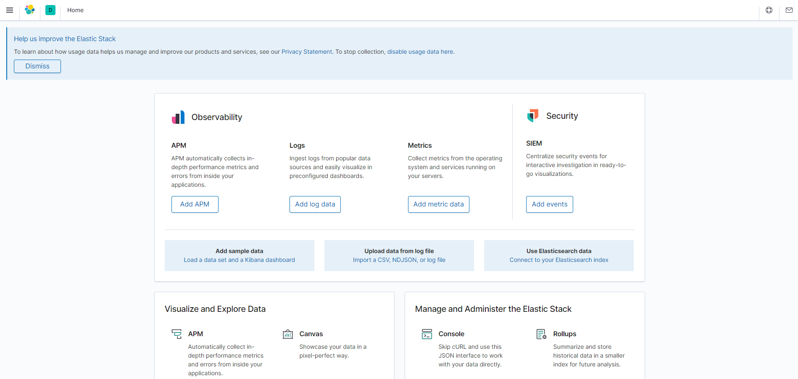
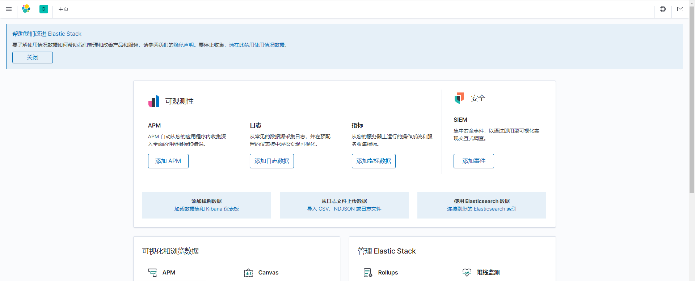
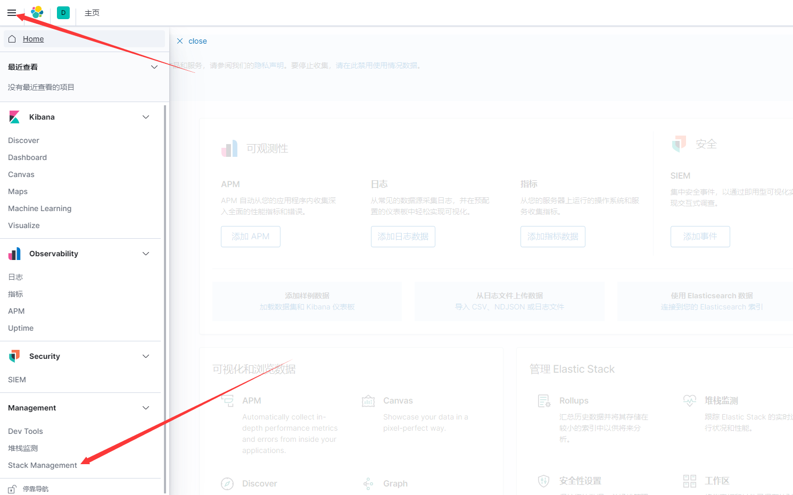
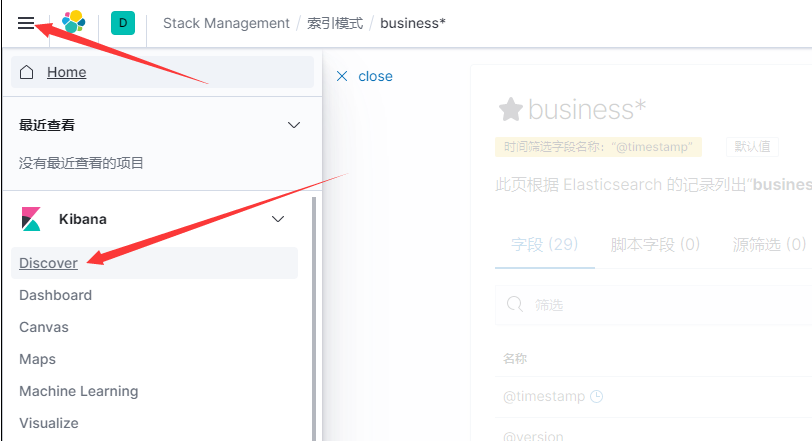
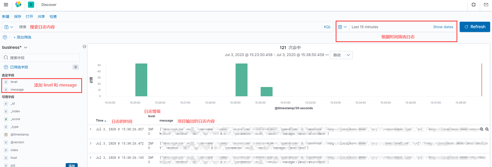

> ELK Stack 是Elasticsearch、Logstash、Kiban三个开源软件的组合。在实时数据检索和分析场合，三者通常是配合共用，而且又都先后归于 Elastic.co 公司名下，故有此简称。

## 基本组成软件

- Elasticsearch是实时全文搜索和分析引擎，提供搜集、分析、存储数据三大功能；是一套开放REST和JAVA API等结构提供高效搜索功能，可扩展的分布式系统。它构建于Apache Lucene搜索引擎库之上。
- Logstash是一个用来搜集、分析、过滤日志的工具。它支持几乎任何类型的日志，包括系统日志、错误日志和自定义应用程序日志。它可以从许多来源接收日志，这些来源包括 syslog、消息传递（例如 RabbitMQ）和JMX，它能够以多种方式输出数据，包括电子邮件、websockets和Elasticsearch。
- Kibana是一个基于Web的图形界面，用于搜索、分析和可视化存储在 Elasticsearch指标中的日志数据。它利用Elasticsearch的REST接口来检索数据，不仅允许用户创建他们自己的数据的定制仪表板视图，还允许他们以特殊的方式查询和过滤数据。
## ELK的基于docker compose的搭建
注:会消耗2G+服务器内存
```bash
#1.新建elk文件夹
mkdir elk
#2.进入文件夹
cd elk
#3.创建 docker-compose.yml 文件并填入下文内容
vim docker-compose.yml
#4.新建文件及文件夹对应 docker-compose 的挂载目录
mkdir es
cd es
mkdir plugins
mkdir data
#5.给设置data文件夹设置777权限 不然es启动会报错
chmod 777 data/
cd ..
mkdir logstash
cd logstash/
#6.创建 logstash.conf 文件并填入下文内容
vim logstash.conf
#7.通过命令启动docker容器
docker-compose up -d
#通过命令查看elk的状态
docker ps
```
docker ps内容
```bash
CONTAINER ID        IMAGE                  COMMAND                  CREATED             STATUS              PORTS                                            NAMES
d0784ecdcc5d        logstash:7.8.0         "/usr/local/bin/dock…"   22 seconds ago      Up 21 seconds       5044/tcp, 0.0.0.0:4560->4560/tcp, 9600/tcp       logstash
8eb6c197b6f4        kibana:7.8.0           "/usr/local/bin/dumb…"   22 seconds ago      Up 21 seconds       0.0.0.0:5601->5601/tcp                           kibana
f266b48803a9        elasticsearch:7.8.0    "/tini -- /usr/local…"   22 seconds ago      Up 21 seconds       0.0.0.0:9200->9200/tcp, 0.0.0.0:9300->9300/tcp   elasticsearch
```
可以看到三个都已启动
### docker-compose.yml
```yaml
version: '3'
services:
  elasticsearch:
    image: elasticsearch:7.8.0
    container_name: elasticsearch
    restart: always
    environment:
      - "cluster.name=elasticsearch" #设置集群名称为elasticsearch
      - "discovery.type=single-node" #以单一节点模式启动
      - "ES_JAVA_OPTS=-Xms512m -Xmx512m" #设置使用jvm内存大小
      - TZ=Asia/Shanghai
    volumes:
      - ./es/plugins:/usr/share/elasticsearch/plugins #插件文件挂载
      - ./es/data:/usr/share/elasticsearch/data #数据文件挂载
    ports:
      - 9200:9200
      - 9300:9300
  kibana:
    image: kibana:7.8.0
    container_name: kibana
    restart: always
    links:
      - elasticsearch:es #可以用es这个域名访问elasticsearch服务
    depends_on:
      - elasticsearch #kibana在elasticsearch启动之后再启动
    environment:
      - SERVER_NAME=kibana
      - "elasticsearch.hosts=http://es:9200" #设置访问elasticsearch的地址
      - XPACK_MONITORING_ENABLED=true
      - TZ=Asia/Shanghai
    ports:
      - 5601:5601
  logstash:
    image: logstash:7.8.0
    container_name: logstash
    restart: always
    environment:
      - TZ=Asia/Shanghai
    volumes:
      - ./logstash/logstash.conf:/usr/share/logstash/pipeline/logstash.conf #挂载logstash的配置文件
    depends_on:
      - elasticsearch #kibana在elasticsearch启动之后再启动
    links:
      - elasticsearch:es #可以用es这个域名访问elasticsearch服务
    ports:
      - 4560:4560
```
### logstash.conf
```json
input {
  tcp {
    mode => "server"
    host => "0.0.0.0"
    port => 4560
    codec => json_lines
    type => "business"
  }
}
output {
  elasticsearch {
    hosts => ["es:9200"]
    action => "index"
    codec => json
    index => "%{type}-%{+YYYY.MM.dd}"
    template_name => "business"
  }
}
```
访问`http://服务器ip:9200/`可以看到以下 json 字符串
```json
{
    "name": "f266b48803a9",
    "cluster_name": "elasticsearch",
    "cluster_uuid": "yWdlWaN8RbOTuMZBJ7RRMg",
    "version": {
        "number": "7.8.0",
        "build_flavor": "default",
        "build_type": "docker",
        "build_hash": "757314695644ea9a1dc2fecd26d1a43856725e65",
        "build_date": "2020-06-14T19:35:50.234439Z",
        "build_snapshot": false,
        "lucene_version": "8.5.1",
        "minimum_wire_compatibility_version": "6.8.0",
        "minimum_index_compatibility_version": "6.0.0-beta1"
    },
    "tagline": "You Know, for Search"
}
```
访问`http://服务器ip:5601/`查看Kibana状况



如需修改Kibana为中文,则执行以下命令
```bash
#进入kibana容器
docker exec -it kibana bash
#切换进入 config 目录
cd config/
#编辑 kibana.yml 文件
vi kibana.yml
#在文件的最后添加一行
i18n.locale: "zh-CN"
#退出容器
exit
#重启kibana容器
docker restart kibana
```
再次访问`http://服务器ip:5601/`就可以看到界面变中文了



至此 ELK基于docker搭建完成
## Springboot整合ELK实现日志收集
在spring boot 项目中引入依赖
```xml
<dependency>
    <groupId>net.logstash.logback</groupId>
    <artifactId>logstash-logback-encoder</artifactId>
    <version>5.3</version>
</dependency>
```
在resource目录中新建`logback-spring`文件 用于收集日志并将日志转发到logstash

注:要修改服务器ip
```xml
<?xml version="1.0" encoding="UTF-8" ?>
<configuration>
    <!--应用名称-->
    <springProperty scope="context" name="APP_NAME" source="spring.application.name" defaultValue="springBoot"/>
    <!--LogStash访问host-->
    <springProperty name="LOG_STASH_HOST" scope="context" source="logstash.host" defaultValue="服务器ip"/>
    <!-- 控制台输出日志 -->
    <appender name="STDOUT" class="ch.qos.logback.core.ConsoleAppender">
        <encoder>
            <pattern>%d{yyyy-MM-dd HH:mm:ss.SSS} [%X{traceId}] [%level] [%c:%L] - %msg%n</pattern>
        </encoder>
    </appender>
    <!--每天生成一个日志文件，保存30天的日志文件。-->
    <appender name="DayFile" class="ch.qos.logback.core.rolling.RollingFileAppender">
        <File>logs/log.log</File>
        <rollingPolicy class="ch.qos.logback.core.rolling.TimeBasedRollingPolicy">
            <fileNamePattern>logs/log.%d{yyyy-MM-dd}.log</fileNamePattern>
            <maxHistory>30</maxHistory>
        </rollingPolicy>
        <encoder>
            <pattern>%d{yyyy-MM-dd HH:mm:ss.SSS} [%X{traceId}] [%level] [%thread] [%c:%L] - %msg%n</pattern>
        </encoder>
    </appender>

    <!--业务日志输出到LogStash-->
    <appender name="LOG_STASH_BUSINESS" class="net.logstash.logback.appender.LogstashTcpSocketAppender">
        <destination>${LOG_STASH_HOST}:4560</destination>
        <encoder charset="UTF-8" class="net.logstash.logback.encoder.LoggingEventCompositeJsonEncoder">
            <providers>
                <timestamp>
                    <timeZone>Asia/Shanghai</timeZone>
                </timestamp>
                <!--自定义日志输出格式-->
                <pattern>
                    <pattern>
                        {
                        "service": "${APP_NAME:-}",
                        "level": "%level",
                        "pid": "${PID:-}",
                        "thread": "%thread",
                        "class": "%logger",
                        "traceId": "%X{traceId:-}",
                        "message": "%message",
                        "stack_trace": "%exception"
                        }
                    </pattern>
                </pattern>
            </providers>
        </encoder>
    </appender>

    <!--指定logger name为包名或类全名 指定级别 additivity设置是否传递到root logger -->
    <logger name="slf4j" level="INFO" additivity="false">
        <appender-ref ref="STDOUT"/>
        <appender-ref ref="DayFile"/>
        <appender-ref ref="LOG_STASH_BUSINESS"/>
    </logger>
    <!--slf4j2包下的类在ERROR级别时候传递到root logger中-->
    <logger name="slf4j2" level="ERROR"/>
    <!--根logger控制-->
    <root level="INFO">
        <appender-ref ref="STDOUT"/>
        <appender-ref ref="DayFile"/>
        <appender-ref ref="LOG_STASH_BUSINESS"/>
    </root>
</configuration>
```
启动项目输出日志后,logstash就会收集日志

访问`http://服务器ip:5601`并按如下设置

1.进入Stack Management



6.查看日志




7.可以根据各种条件筛选日志


