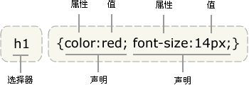
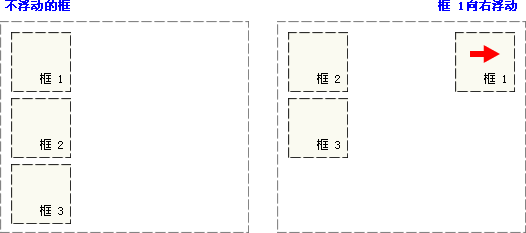
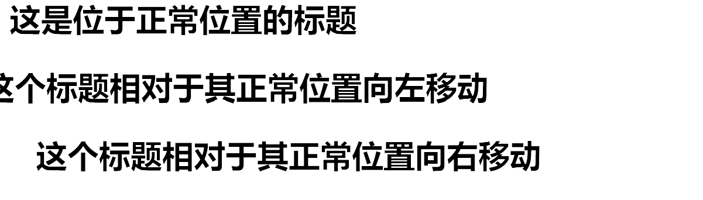
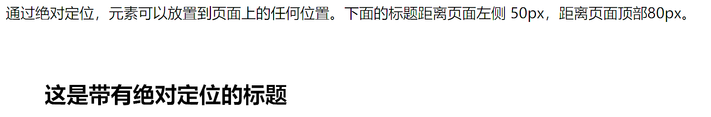
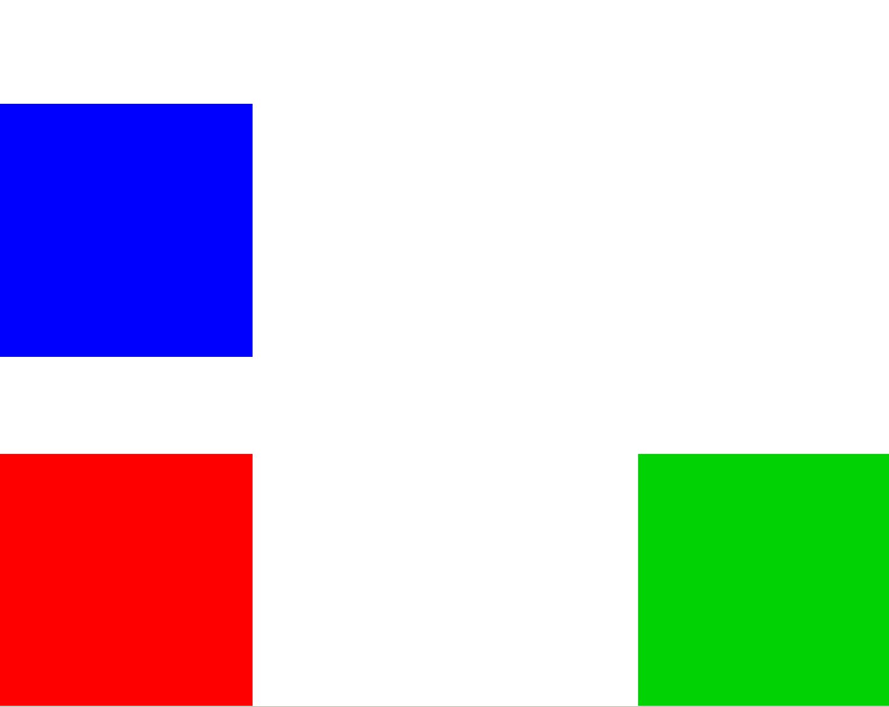
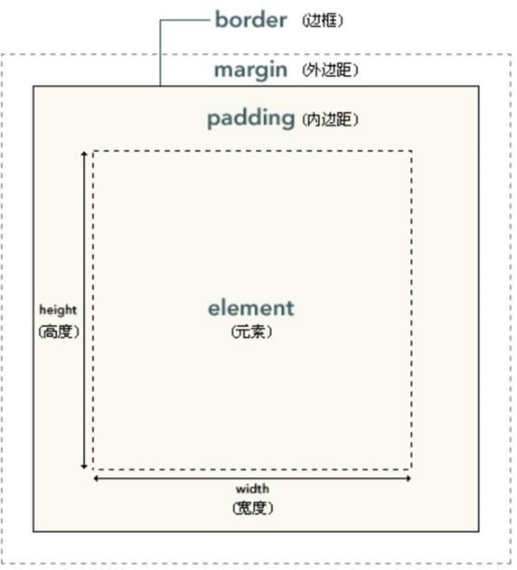

# 第一章 CSS简介
## 1.1 CSS概念
> CSS :层叠样式表(英文全称：Cascading Style Sheets)是一种用来表现HTML（标准通用标记语言的一个应用）或XML（标准通用标记语言的一个子集）等文件样式的计算机语言。CSS不仅可以静态地修饰网页，还可以配合各种脚本语     言动态地对网页各元素进行格式化
> 多个样式可以层层覆盖叠加，如果不同的css样式对同一html标签进行修饰，样式有冲突的应用优先级高的，不冲突的共同作用

## 1.2 CSS特点
:::info
丰富的样式定义<br />CSS提供了丰富的文档样式外观，以及设置文本和背景属性的能力；允许为任何元素创建边框，以及元素边框与其他元素间的距离，以及元素边框与元素内容间的距离；允许随意改变文本的大小写方式、修饰方式以及其他页面效果。

易于使用和修改<br />CSS可以将样式定义在HTML元素的style属性中，也可以将其定义在HTML文档的header部分，也可以将样式声明在一个专门的CSS文件中，以供HTML页面引用。总之，CSS样式表可以将所有的样式声明统一存放，进行统一管理。<br />另外，可以将相同样式的元素进行归类，使用同一个样式进行定义，也可以将某个样式应用到所有同名的HTML标签中，也可以将一个CSS样式指定到某个页面元素中。如果要修改样式，我们只需要在样式列表中找到相应的样式声明进行修改。

多页面应用<br />CSS样式表可以单独存放在一个CSS文件中，这样我们就可以在多个页面中使用同一个CSS样式表。CSS样式表理论上不属于任何页面文件，在任何页面文件中都可以将其引用。这样就可以实现多个页面风格的统一。

层叠<br />简单的说，层叠就是对一个元素多次设置同一个样式，这将使用最后一次设置的属性值。例如对一个站点中的多个页面使用了同一套CSS样式表，而某些页面中的某些元素想使用其他样式，就可以针对这些样式单独定义一个样式表应用到页面中。这些后来定义的样式将对前面的样式设置进行重写，在浏览器中看到的将是最后面设置的样式效果。

页面压缩<br />在使用HTML定义页面效果的网站中，往往需要大量或重复的表格和font元素形成各种规格的文字样式，这样做的后果就是会产生大量的HTML标签，从而使页面文件的大小增加。而将样式的声明单独放到CSS样式表中，可以大大的减小页面的体积，这样在加载页面时使用的时间也会大大的减少。另外，CSS样式表的复用更大程序的缩减了页面的体积，减少下载的时间。
:::
## 1.3 CSS语法规则
<br />注意事项:

- 如果值为若干单词，则要给值加引号;
- 多个声明之间使用分号`;`分开;
- css对大小不敏感，如果涉及到与html文档一起使用时，class与id名称对大小写敏感
# 第二章 CSS导入方式
## 2.1 内嵌方式(内联方式)
把CSS样式嵌入到html标签当中，类似属性的用法，示例如下：
```html
<div style="color:blue;font-size:50px">This is my HTML page. </div>
```
## 2.2 内部方式
在head标签中使用style标签引入css,示例如下:
```html
<style type=“text/css”> //告诉浏览器使用css解析器去解析
div{color:red;font-size:50px}
</style>
```
## 2.3 外部方式
将css样式抽成一个单独文件，谁用谁就引用，示例如下：<br />单独文件div.css
```css
div{color:green;font-size:50px}
```

引用语句写在head标签内部
```html
<link rel="stylesheet" type="text/css" href=“div.css"></link>
    rel:代表当前页面与href所指定文档的关系
    type:文件类型，告诉浏览器使用css解析器去解析
    href:css文件地址
```
#### 2.4 @import方式
```html
<style type="text/css"> 
    @import url("div.css")
</style>
该内容放在head标签中
备注:link和@import区别：
1.link所有浏览器都支持，@import某些版本低的IE不支持
2.@import是等待html加载完成才加载
3.@import不支持js动态修改
```
# 第三章 CSS选择器
> 主要用于选择需要添加样式的html元素

## 3.1 基本选择器
```html
<style type="text/css">
/* 元素选择器 */
span {
    color: red;
    font-size: 100px
}
/* id选择器 */
#id {
    color: green;
    font-size: 100px
}
/* class选择器 */
.class {
    color: purple;
    font-size: 100px
}
/* 以上基本选择器的优先级从高到低:id ,class ,元素 */
</style>
<span class="class" id="id">内容</span>
```
## 3.2 属性选择器
根据元素的属性及属性值来选择元素。<br />格式为 `htm标签[属性=‘属性值']{css属性:css属性值;}`或`html标签[属性]{css属性:css属性值;}`
```html
<style type="text/css">
    input[type='text'] {
        background-color: pink
    }
    input[type='password'] {
        background-color: yellow
    }
    font[size] {
        color: green
    }
    a[href] {
        color: blue;
    }
</style>
<form name="login" action="#" method="post">
    <font size="3">用户名：<font><input type=“text" name="username" /></br>
    密码： <input type="password" name="password" value="123456"/></br>
     <input type="submit" value="登录"></input>
</form>
```
## 3.3 伪元素选择器
主要是针对a标签
```html
<style type="text/css">
    < !-- 静 止 状 态 -->
    a:link {color: red;}
    < !--悬浮状态 -->
    a:hover {color: green;}
    < !--触发状态 -->
    a:active {color: yellow;}
    < !-- 完 成 状 态 -->
    a:visited {color: blue;}
</style>
```
## 3.4层级选择器
```html
<style type="text/css">
    #div1 .div11 {
        color: red;
    }
    #div1 .div12 {
        color: purple;
    }
    .div2 #div22 {
        color: green;
    }
    .div2 #div23 {
        color: blue;
    }
</style>

<div id="div1">
    <div class="div11">
        <span>span1-1</span>
    </div>
    <div class="div12">
        <span>span1-2</span>
    </div>
</div>
<div class="div2">
    <div id="div22">
        <span>span2-1</span>
    </div>
    <div id="div23">
        <span>span2-2</span>
    </div>
</div>
```
# 第四章 CSS属性
## 4.1 文字和文本属性
文字属性
```html
<style type="text/css">
    span {
        font-size: 20mm;/* 字体大小 */
        font-family: 楷体;/* 字体 */
        font-style: normal;/* 规定斜体字 */
        font-weight: 900;/* 文本的粗细 */
        /* 
        斜体（italic）是对每个字母的结构有一些小改动，来反映变化的外观。 
        倾斜（oblique）文本则是正常竖直文本的一个倾斜版本。
        通常情况下，italic 和 oblique 文本在 web 浏览器中看上去完全一样
        文本的粗细范围在100~900
        100 对应最细的字体变形
        900 对应最粗的字体变形
        数字 400 等价于 normal，而 700 等价于 bold
        */
    }
</style>
```
文本属性
```html
<style type="text/css">
    span {
        color: green;/* 文本颜色 */
        text-indent: 5em;/* 缩进元素中文本的首行 */
        text-decoration: underline;/* 设置文字修饰 */
        text-align: center;/* 对齐方式 */
        word-spacing: 10px;/* 字符之间的间隔 */
        letter-spacing:10px;/* 单词或者字母之间的间隔 */
        line-height:25px-32px
            /* 
            text-decoration:
            none:会关闭原本应用到一个元素上的所有装饰
            underline: 添加下划线
            overline:在文本的顶端画一个上划线
            line-through:在文本中间画一个贯穿线
            blink:让文本闪烁
            */
    }
</style>
```
## 4.2 背景属性
```html
<style type="text/css">
    div {
        background-color: red;/* 设置背景颜色，默认透明 */
        background-image: url(img/Leafa.jpg);/* 设置背景图片 */
        background-repeat:no-repeat;/* 设置平铺 */
        background-position:center;/* 改变图像在背景中的位置。top、bottom、left、right 和 center */
        /* 
        background-repeat:
        repeat-x:只在水平方向都平铺
        repeat-y:只在垂直方向都平铺
        repeat:在水平垂直方向都平铺
        no-repeat:任何方向都不平铺
        */
    }
</style>
```
## 4.3 列表属性
```html
<style type="text/css">
    li{
        list-style-type:decimal;/* 改变列表的标志类型 */
        list-style-image: url(img/wjx.jpg);/* 用图像表示标志 */
        list-style-position: inside;/* 确定标志出现在列表项内容之外还是内容内部 */
    }
</style>
```
## 4.4 尺寸显示轮廓属性
```html
<style type="text/css">
    img {
        width: 500px;
        height: 380px;
        display: inline;/* 显示属性 none:不显示 block:块级显示 inline:行级显示 */
        /* 绘制于元素周围的一条线，位于边框边缘的外围，可起到突出元素的作用。 */
        outline-style: double;/*轮廓样式 solid:实线/dotted:虚线/dashed:长虚线/double:空心框*/
        outline-color:red;/* 设置轮廓的颜色 */
        outline-width:10px;/* 设置轮廓的宽度 */
    }
</style>
```
## 4.5 浮动属性
浮动的框可以向左或向右移动，直到它的外边缘碰到包含框或另一个浮动框的边框为止。由于浮动框不在文档的普   通流中，所以文档的普通流中的块框表现得就像浮动框不存在一样。<br />请看下图，当把框 1 向右浮动时，它脱离文档流并且向右移动，直到它的右边缘碰到包含框的右边缘：<br /><br />**clear属性**<br />规定元素的哪一侧不允许其他浮动元素。

| **值** | **描述** |
| :-- | :-- |
| left | 在左侧不允许浮动元素。 |
| right | 在右侧不允许浮动元素。 |
| both | 在左右两侧均不允许浮动元素。 |
| none | 默认值。允许浮动元素出现在两侧。 |
| inherit | 规定应该从父元素继承 clear 属性的值。 |

## 4.6 定位属性
浮动元素。

| **值** | **描述** |
| :-- | :-- |
| left | 在左侧不允许浮动元素。 |
| right | 在右侧不允许浮动元素。 |
| both | 在左右两侧均不允许浮动元素。 |
| none | 默认值。允许浮动元素出现在两侧。 |
| inherit | 规定应该从父元素继承 clear 属性的值。 |

## 4.6 定位属性
**相对定位(relative)**
```html
<html>
	<head>
		<style type="text/css">
			h2.pos_left {
				position: relative;
				left: -20px
			}

			h2.pos_right {
				position: relative;
				left: 20px
			}
		</style>
	</head>
	<body>
		<h2>这是位于正常位置的标题</h2>
		<h2 class="pos_left">这个标题相对于其正常位置向左移动</h2>
		<h2 class="pos_right">这个标题相对于其正常位置向右移动</h2>
	</body>
</html>
```

**
```html
<html>
	<head>
		<meta charset="utf-8" />
		<style type="text/css">
			h2.pos_abs {
				position: absolute;
				left: 50px;
				top: 80px
			}
		</style>
	</head>
	<body>
		<h2 class="pos_abs">这是带有绝对定位的标题</h2>
		<p>通过绝对定位，元素可以放置到页面上的任何位置。下面的标题距离页面左侧 50px，距离页面顶部80px。</p>
	</body>
</html>
```



**固定定位(fixed)**

```html
<!DOCTYPE html>
<html>
	<head>
		<meta charset="UTF-8">
		<title></title>
		<style>
			#left {
				width: 200px;
				height: 200px;
				background-color: red;
				position: fixed;
				left: 0;
				bottom: 0;
			}

			#right {
				width: 200px;
				height: 200px;
				background-color: green;
				position: fixed;
				right: 0;
				bottom: 0;
			}

			#middle {
				width: 200px;
				height: 200px;
				background-color: blue;
				position: fixed;
				left: 0;

				bottom: 50%;
			}
		</style>
	</head>
	<body>
		<div id="left">
		</div>
		<div id="right">
		</div>
		<div id="middle">
		</div>
	</body>
</html>
```



# 第五章 CSS盒子模型


## 5.1 边框属性
border-style:边框样式，值有以下情况：

+ solid:实线
+ double:空心线
+ dashed:圆点组成的边框
+ dotted:虚线组成的边框

border-color:边框颜色<br />border-width:边框宽度

## 5.2外边距属性
margin:外间距,边框和边框外层的元素的距离 四个方向的距离(top right bottom left)

margin-top:<br />margin-bottom: <br />margin-left: <br />margin-right:


## 5.3 内边距属性
padding:内间距,元素内容和边框之间的距离((top right bottom left))

padding-left:<br />padding-right: <br />padding-top: <br />padding-bottom:

# 第六章 CSS3扩展属性
```html
<html>
	<head>
		<meta charset="utf-8">
		<title></title>
	</head>
	<style type="text/css">
		div{
			border-radius: 25px;/* 圆角属性 */
			box-shadow: 10px 10px 5px #888888;/* 添加阴影 */
			background-size: 200px 300px;
			text-shadow: 5px 5px 5px #ffff00;/* 可向文本应用阴影。 */
		}
	</style>
	<body>
		<div>
			
		</div>
	</body>
</html>
```
