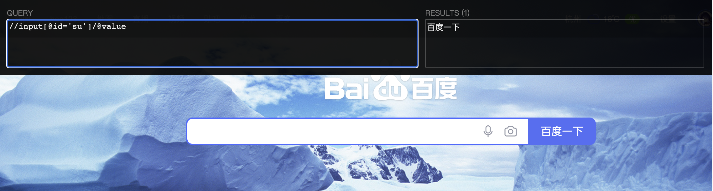

## 爬取页面-urllib

### 1. 爬虫入门案例

```python
import urllib.request

# 1. 定义一个url 就是你要访问的地址
url = "http://www.baidu.com"
# 2. 模拟浏览器向服务器发送请求
response = urllib.request.urlopen(url)
# 3. 获取响应中的页面的源码
# read 返回的是字节形式的二进制数据
# 我们要将二进制的数据转换成字符串 解码 decode('编码格式')
content = response.read().decode('utf-8')
# 4. 打印数据
print(content)
```

### 2. response类型和方法

```python
import urllib.request

url = "http://www.baidu.com"
response = urllib.request.urlopen(url)

# 一个类型和六个方法
print(type(response))  # <class 'http.client.HTTPResponse'>

# 按照一个个字节去读
# response.read()
# 读取5个字节
# response.read(5)
# 读取一行
# response.readline()
# 一行一行读取 直至结束
# response.readlines()
# 返回状态码
print(response.getcode())  # 200
# 返回url地址
print(response.geturl())  # http://www.baidu.com
# 返回状态信息
print(response.getheaders())
```

### 3. 下载

```python
import urllib.request

# 下载网页
urlPage = 'http://www.baidu.com'
urllib.request.urlretrieve(urlPage, 'baidu.html')

# 下载图片
urlImage = 'https://www.baidu.com/img/PCfb_5bf082d29588c07f842ccde3f97243ea.png'
urllib.request.urlretrieve(url=urlImage, filename='baidu.png')

# 下载视频
urlVideo = 'https://v26-web.douyinvod.com/292f85a76f31ffe20e01235454365fac/617466e1/video/tos/cn/tos-cn-ve-15-alinc2/6cd077b916284e6b92f50ac171c9689d/?a=6383&br=1467&bt=1467&cd=0%7C0%7C0&ch=5&cr=0&cs=0&cv=1&dr=0&ds=3&er=&ft=.6JO5.yygZeu0cA-7nzjaFZqUxO~rRzH&l=202110240240400101280820535E172F45&lr=all&mime_type=video_mp4&net=0&pl=0&qs=0&rc=amxqZTY6Zm01ODMzNGkzM0ApNzw8O2ZkaDw6NztpNDRpNWdjZHFvcjQwYm5gLS1kLTBzczBjMjQuX2JiNV8yNjBhXy46Yw%3D%3D&vl=&vr='
urllib.request.urlretrieve(urlVideo,'test.mp4')
```

### 4. 请求对象的定制

```python
import urllib.request

url = 'https://www.baidu.com'

# response = urllib.request.urlopen(url)
# content = response.read().decode('utf8')
# print(content)  # 会遇到反爬

headers = {
    'User-Agent': 'Mozilla/5.0 (Macintosh; Intel Mac OS X 10_15_7) AppleWebKit/537.36 (KHTML, like Gecko) Chrome/94.0.4606.81 Safari/537.36'
}
request = urllib.request.Request(url=url, headers=headers)
response = urllib.request.urlopen(request)
print(response.read().decode('utf8'))
```

### 5. 编解码

get请求方式：`urllib.parse.quote()`

```python
import urllib.request

# url = 'https://www.baidu.com/s?wd=周杰伦'  # 该链接会报错 UnicodeEncodeError: 'ascii' codec
url = 'https://www.baidu.com/s?wd='
# 我们需要将周杰伦三个字变成 Unicode 编码格式
name = urllib.parse.quote('周杰伦')
url = url + name

headers = {
    'User-Agent': 'Mozilla/5.0 (Macintosh; Intel Mac OS X 10_15_7) AppleWebKit/537.36 (KHTML, like Gecko) Chrome/94.0.4606.81 Safari/537.36'
}
request = urllib.request.Request(url=url, headers=headers)
response = urllib.request.urlopen(request)
print(response.read().decode('utf-8'))
```

get请求方式：`urllib.parse.urlencode()`

```python
import urllib.parse
import urllib.request

# 构建以下类型的url时使用 urlencode
# 'https://www.baidu.com/s?wd=周杰伦&sex=男'

data = {
    'wd': '周杰伦',
    'sex': '男'
}

newDate = urllib.parse.urlencode(data)
print(newDate)  # wd=%E5%91%A8%E6%9D%B0%E4%BC%A6&sex=%E7%94%B7

baseUrl = "https://www.baidu.com/s?"

url = baseUrl + newDate

headers = {
    'User-Agent': 'Mozilla/5.0 (Macintosh; Intel Mac OS X 10_15_7) AppleWebKit/537.36 (KHTML, like Gecko) Chrome/94.0.4606.81 Safari/537.36'
}
request = urllib.request.Request(url=url, headers=headers)
response = urllib.request.urlopen(request)
print(response.read().decode('utf-8'))
```

post请求方式

```python
import json
import urllib.parse
import urllib.request

url = "https://fanyi.baidu.com/sug"

headers = {
    'User-Agent': 'Mozilla/5.0 (Macintosh; Intel Mac OS X 10_15_7) AppleWebKit/537.36 (KHTML, like Gecko) Chrome/94.0.4606.81 Safari/537.36'
}

data = {
    'kw': 'spider'
}
# post 请求的参数 必须要进行编码 并要调用 encode 方法
data = urllib.parse.urlencode(data).encode('utf8')

request = urllib.request.Request(url=url, data=data, headers=headers)
response = urllib.request.urlopen(request)
content = response.read().decode('utf-8')
print(content)

# 字符串 转 json 对象 (字典类型)
obj = json.loads(content)
print(obj)
```

百度详细翻译(反爬)

```python
import json
import urllib.parse
import urllib.request

# 百度详细翻译接口
url = "https://fanyi.baidu.com/v2transapi?from=en&to=zh"

# 有反爬措施,必须在请求头中添加 Cookie: BAIDUID=15F9F7B5B390285BF82F97BCE8A96BE6:FG=1
headers = {
    'Cookie': 'BAIDUID=15F9F7B5B390285BF82F97BCE8A96BE6:FG=1'
}

data = {
    'from': 'en',
    'to': 'zh',
    'query': 'spider',
    'transtype': 'realtime',
    'simple_means_flag': '3',
    'sign': '63766.268839',
    'token': 'c8929530176ff57b392953383bdb434b',
    'domain': 'common'
}
# 参数的编码
data = urllib.parse.urlencode(data).encode('utf8')
# 请求对象的定制
request = urllib.request.Request(url=url, data=data, headers=headers)
response = urllib.request.urlopen(request)
# 请求之后返回的所有的数据
content = response.read().decode('utf-8')
# loads将字符串转换为python对象
obj = json.loads(content)
# python对象转换为json字符串 ensure_ascii=False 忽略字符集编码
s = json.dumps(obj, ensure_ascii=False)
print(s)
```

### 6. ajax的get请求

```python
import urllib.parse
import urllib.request


# 下载豆瓣前10页数据
# 下载步骤
# 1.请求对象的定制
# 2.获取响应的数据
# 3.数据下载到本地

# 每执行一次返回一个request对象
def create_request(page):
    base_url = "https://movie.douban.com/j/chart/top_list?type=5&interval_id=100%3A90&action=&"
    headers = {
        'User-Agent': 'Mozilla/5.0 (Macintosh; Intel Mac OS X 10_15_7) AppleWebKit/537.36 (KHTML, like Gecko) Chrome/94.0.4606.81 Safari/537.36 '
    }
    data = {
        "start": (page - 1) * 20,
        "limit": 20
    }
    data = urllib.parse.urlencode(data)
    url = base_url + data
    return urllib.request.Request(url=url, headers=headers)


# 获取网页源码
def get_content(request):
    response = urllib.request.urlopen(request)
    return response.read().decode('utf8')


def download(page, content):
    # open方法默认情况下使用的是gbk的编码  如果我们要想保存汉字 那么需要在open方法中指定编码格式为utf-8
    # fp = open('douban.json', 'w', encoding='utf-8')
    # fp.write(content)

    # 以上两个方法的另一种写法
    with open('douban_%d.json' % page, 'w', encoding='utf-8') as fp:
        fp.write(content)


# 程序的入口
if __name__ == '__main__':
    start_page = int(input('请输入起始的页码:'))
    end_page = int(input('请输入结束的页码:'))
    for page in range(start_page, end_page + 1):
        request = create_request(page)
        content = get_content(request)
        download(page, content)
```

### 7. ajax的post请求

```python
import urllib.parse
import urllib.request


def create_request(page):
    base_url = "http://www.kfc.com.cn/kfccda/ashx/GetStoreList.ashx?op=cname"
    headers = {
        'User-Agent': 'Mozilla/5.0 (Macintosh; Intel Mac OS X 10_15_7) AppleWebKit/537.36 (KHTML, like Gecko) Chrome/94.0.4606.81 Safari/537.36 '
    }
    data = {
        "cname": "北京",
        "pageIndex": page,
        "pageSize": "10"
    }
    data = urllib.parse.urlencode(data).encode("utf8")
    return urllib.request.Request(url=base_url, headers=headers, data=data)


def get_content(request):
    response = urllib.request.urlopen(request)
    return response.read().decode("utf-8")


def download(page, content):
    with open("kfc_%d.json" % page, "w", encoding="utf-8") as fp:
        fp.write(content)


if __name__ == '__main__':
    start_page = int(input("请输入起始页码:"))
    end_page = int(input("请输入结束页码:"))
    for page in range(start_page, end_page + 1):
        request = create_request(page)
        content = get_content(request)
        download(page, content)
```

### 8. URLError/HTTPError

1. HTTPError类是URLError类的子类
2. 导入的包urllib.error.HTTPError urllib.error.URLError
3. http错误：http错误是针对浏览器无法连接到服务器而增加出来的错误提示。引导并告诉浏览者该页是哪里出了问题。
4. 通过urllib发送请求的时候，有可能会发送失败，这个时候如果想让你的代码更加的健壮，可以通过try‐except进行捕获异常，异常有两类，URLError\HTTPError

```python
import urllib.error
import urllib.request

url = 'https://www.baidu11.com'

headers = {
    'User-Agent': 'Mozilla/5.0 (Macintosh; Intel Mac OS X 10_15_7) AppleWebKit/537.36 (KHTML, like Gecko) Chrome/94.0.4606.81 Safari/537.36'
}
try:
    request = urllib.request.Request(url=url, headers=headers)
    response = urllib.request.urlopen(request)
    print(response.read().decode('utf8'))
except urllib.error.HTTPError:
    print("请求出错")
except urllib.error.URLError:
    print("域名出错")
```

### 9. cookie 登录

```python
import urllib.request

# 个人信息页面是utf-8  但是还报错了编码错误  因为并没有进入到个人信息页面 而是跳转到了登陆页面
# 那么登陆页面不是utf-8  所以报错

url = 'https://weibo.cn/5909970067/info'

headers = {
    'User-Agent': 'Mozilla/5.0 (Macintosh; Intel Mac OS X 10_15_7) AppleWebKit/537.36 (KHTML, like Gecko) Chrome/94.0.4606.81 Safari/537.36',
    "cookie": "SUB=_2A25McXdBDeRhGeNH61sY9y7MzTuIHXVvmhkJrDV6PUJbktCOLRbEkW1NSsq63F2ZFTgN7rl6zmpf4ul9u1CB7E_u",
    # referer  判断当前路径是不是由上一个路径进来的  一般情况下 是做图片防盗链
    'referer': "https://weibo.cn/"

}

request = urllib.request.Request(url=url, headers=headers)
response = urllib.request.urlopen(request)
print(response.read().decode('utf-8'))
```

### 10. Handler 处理器

**为什么要学习handler？ **

urllib.request.urlopen(url) 不能定制请求头 

urllib.request.Request(url,headers,data) 可以定制请求头 

Handler 定制更高级的请求头

随着业务逻辑的复杂 请求对象的定制已经满足不了我们的需求（动态cookie和代理 不能使用请求对象的定制）

```python
import urllib.request

url = 'http://www.baidu.com'

headers = {
    'User-Agent': 'Mozilla/5.0 (Macintosh; Intel Mac OS X 10_15_7) AppleWebKit/537.36 (KHTML, like Gecko) Chrome/94.0.4606.81 Safari/537.36',
}

request = urllib.request.Request(url=url, headers=headers)

# 1.获取 handler 对象
handler = urllib.request.HTTPSHandler()
# 2. 获取 opener 对象
opener = urllib.request.build_opener(handler)
# 3. 获取 open 对象
response = opener.open(request)

print(response.read().decode('utf-8'))
```

### 11. 代理服务器

代理的常用功能? 

1. 突破自身IP访问限制，访问国外站点。 
2. 访问一些单位或团体内部资源
   1. 扩展：某大学FTP(前提是该代理地址在该资源的允许访问范围之内)，使用教育网内地址段免费代理服务 器，就可以用于对教育网开放的各类FTP下载上传，以及各类资料查询共享等服务。 
3. 提高访问速度
   1. 扩展：通常代理服务器都设置一个较大的硬盘缓冲区，当有外界的信息通过时，同时也将其保存到缓冲 区中，当其他用户再访问相同的信息时， 则直接由缓冲区中取出信息，传给用户，以提高访问速度。
4. 隐藏真实IP
   1. 扩展：上网者也可以通过这种方法隐藏自己的IP，免受攻击。

```python
import urllib.request

url = 'http://www.baidu.com/s?wd=ip'

headers = {
    'User-Agent': 'Mozilla/5.0 (Macintosh; Intel Mac OS X 10_15_7) AppleWebKit/537.36 (KHTML, like Gecko) Chrome/94.0.4606.81 Safari/537.36',
}
# 请求对象的定制
request = urllib.request.Request(url=url, headers=headers)

proxies = {
    # ip:port 是通过 快代理 网站获取
    "http": "58.247.127.145:53281"
}

handler = urllib.request.ProxyHandler(proxies=proxies)
opener = urllib.request.build_opener(handler)
response = opener.open(request)

content = response.read().decode('utf-8')

with open("ip.html", "w", encoding="utf8") as fp:
    fp.write(content)
```

代理池

```python
import random

proxies_pool = [
    {"http": "117.157.197.18:3128"},
    {"http": "113.100.209.171:3128"},
    {"http": "124.70.46.14:3128"},
    {"http": "118.190.244.234:3128"}
]
proxies = random.choice(proxies_pool)
print(proxies)
```

## 爬取页面-requests

安装 `pip install requests -i https://mirrors.aliyun.com/pypi/simple/`

**response的属性以及类型**

```python
import requests

url = 'http://www.baidu.com'

response = requests.get(url=url)

# 一个类型和六个属性
# Response类型
print(type(response))  # <class 'requests.models.Response'>

# 设置响应的编码格式
response.encoding = 'utf-8'

# 以字符串的形式来返回了网页的源码
print(response.text)

# 返回一个url地址
print(response.url)  # http://www.baidu.com/

# 返回的是二进制的数据
print(response.content)

# 返回响应的状态码
print(response.status_code)  # 200

# 返回的是响应头
print(response.headers)
```

**requests_get请求**

```python
# urllib
# (1) 一个类型以及六个方法
# （2）get请求
# （3）post请求   百度翻译
# （4）ajax的get请求
# （5）ajax的post请求
# （6）cookie登陆 微博
# （7）代理


# requests
# (1)一个类型以及六个属性
# （2）get请求
# （3）post请求
# （4）代理
# （5）cookie  验证码


import requests

url = 'https://www.baidu.com/s'

headers = {
    'User-Agent': 'Mozilla/5.0 (Macintosh; Intel Mac OS X 10_15_7) AppleWebKit/537.36 (KHTML, like Gecko) Chrome/94.0.4606.81 Safari/537.36'
}

data = {
    'wd': '北京'
}

# url  请求资源路径
# params 参数
# kwargs 字典
response = requests.get(url=url, params=data, headers=headers)

content = response.text

print(content)

# 总结：
# （1）参数使用params传递
# （2）参数无需urlencode编码
# （3）不需要请求对象的定制
# （4）请求资源路径中的？可以加也可以不加
```

**requests_post请求**

```python
import json

import requests

url = 'https://fanyi.baidu.com/sug'

headers = {
    'User-Agent': 'Mozilla/5.0 (Macintosh; Intel Mac OS X 10_15_7) AppleWebKit/537.36 (KHTML, like Gecko) Chrome/94.0.4606.81 Safari/537.36'
}

data = {
    'kw': 'eye'
}

# url 请求地址
# data 请求参数
# kwargs 字典
response = requests.post(url=url, data=data, headers=headers)

content = response.text

# obj = json.loads(content, encoding='utf-8') # 提示 encoding 被舍弃了
obj = json.loads(content)
print(obj)

# 总结：
# （1）post请求 是不需要编解码
# （2）post请求的参数是data
# （3）不需要请求对象的定制
```

**requests_代理**

```python
import requests

url = 'http://www.baidu.com/s?'

headers = {
    'User-Agent': 'Mozilla/5.0 (Macintosh; Intel Mac OS X 10_15_7) AppleWebKit/537.36 (KHTML, like Gecko) Chrome/94.0.4606.81 Safari/537.36'
}

data = {
    'wd': 'ip'
}

proxy = {
    'http': '117.141.155.242:53281'
}

response = requests.get(url=url, params=data, headers=headers, proxies=proxy)

content = response.text

with open('ip.html', 'w', encoding='utf-8') as fp:
    fp.write(content)
```

**requsets 登录古诗词网**

```python
import requests

url = 'https://so.gushiwen.cn/user/login.aspx?from=http://so.gushiwen.cn/user/collect.aspx'

headers = {
    'User-Agent': 'Mozilla/5.0 (Macintosh; Intel Mac OS X 10_15_7) AppleWebKit/537.36 (KHTML, like Gecko) Chrome/94.0.4606.81 Safari/537.36'
}

# 获取页面源码
response = requests.get(url=url, headers=headers)
content = response.text

# 解析页面源码  然后获取_VIEWSTATE   __VIEWSTATEGENERATOR
from bs4 import BeautifulSoup

soup = BeautifulSoup(content, 'lxml')

# 获取_VIEWSTATE
view_state = soup.select('#__VIEWSTATE')[0].attrs.get('value')
print(view_state)
# 获取__VIEWSTATEGENERATOR
view_state_generator = soup.select('#__VIEWSTATEGENERATOR')[0].attrs.get('value')
print(view_state_generator)

# 验证码图片url
code_url = "https://so.gushiwen.cn/RandCode.ashx"

# 有坑 直接请求下载图片的话 不是同一次请求
# urllib.request.urlretrieve(url=code_url, filename="code.jpg")

# requests里面有一个方法 session()  通过session的返回值 就能使用请求变成一个对象
session = requests.session()
# 验证码的url内容
response_code = session.get(code_url)
# 注意此时要使用二进制数据  因为我们要使用的是图片的下载
content_code = response_code.content
# wb的模式就是将二进制数据写入到文件
with open("code.jpg", "wb") as fp:
    fp.write(content_code)

# 手动输入验证码
code_name = input("请输入你的验证码:")

# 点击登录
data_post = {
    '__VIEWSTATE': view_state,
    '__VIEWSTATEGENERATOR': view_state_generator,
    'from': 'http://so.gushiwen.cn/user/collect.aspx',
    'email': 'xxxxxxxx@qq.com',
    'pwd': 'xxxxxxx',
    'code': code_name,
    'denglu': '登录',
}

response_post = session.post(url=url, headers=headers, data=data_post)

content_post = response_post.text

with open('gushiwen.html', 'w', encoding=' utf-8') as fp:
    fp.write(content_post)
```


## 解析

### xpath

1. 谷歌扩展商店索搜索安装 `XPath Helper` 
2. 重启浏览器
3. 在任意页面按 `ctrl+shift+x` 出现小黑框
4. 安装lxml库 `pip install lxml -i https://mirrors.aliyun.com/pypi/simple/` 
5. 导入 lxml.etree `from lxml import  etree` 能成功导入说明安装成功

#### 使用介绍

```html
<!DOCTYPE html>
<html lang="en">
<head>
  <meta charset="UTF-8"/>
  <title>Title</title>
</head>
<body>
<ul>
  <li id="l1" class="c1">北京</li>
  <li id="l2">上海</li>
  <li id="c3">深圳</li>
  <li id="c4">武汉</li>
</ul>
</body>
</html>
```

```python
from lxml import etree

# xpath解析
# 解析本地文件
tree = etree.parse("local.html")

# xpath基本语法

# 1.路径查询
#   //:查找所有子孙节点,不考虑层级关系
li_list = tree.xpath("//body//li")
#   /:找直接子节点
li_list = tree.xpath("//body/ul/li")
# 2.谓词查询
#   //div[@id] 查找所有有id的属性的标签
#   /text() 获取标签内容
li_list = tree.xpath("//li[@id]/text()")
#   //div[@id="id_name"] 查找id=id_name的标签
li_list = tree.xpath("//li[@id='l1']/text()")
#  //li[2] 查找第二个li标签
li_list = tree.xpath("//li[2]/text()")
# 3.属性查询
#   //@class 获取标签的class属性值
li_list = tree.xpath("//li[@id='l1']/@class")
# 4.模糊查询
#   //div[contains(@id,"he")] 查找id属性值包含 he 的标签
li_list = tree.xpath("//li[contains(@id,'l')]/text()")
#   //div[starts-with(@id,"he")] 查找id属性值以 he 开头的标签
li_list = tree.xpath("//li[starts-with(@id,'c')]/text()")
# 5.内容查询
#   //div/h1/text() 获取标签内容
# 6.逻辑运算
#   //div[@id="head" and @class="s_down"] 查询同时满足两个条件的标签
li_list = tree.xpath("//li[@id='l1' and @class='c1']/text()")
#   //title | //price 或
li_list = tree.xpath("//li[@id='l1']/text() | //li[@id='l2']/text() ")
print(li_list)
# 7.获取兄弟节点
#   /following-sibling::li[1] 获取下一个li标签
li_list = tree.xpath("//li[@id='l1']/following-sibling::li[1]")
#	/preceding-sibling::li[1] 获取上一个li标签
li_list = tree.xpath("//li[@id='l2']/preceding-sibling::li[1]")
#	/following-sibling::*[2] 获取下下一个任意标签
li_list = tree.xpath("//li[@id='l2']/following-sibling::*[2]")
#	/.. 获取父标签
li_list = tree.xpath("//li[@id='l2']/..")
```

#### 演示1

获取百度首页 百度一下 按钮的文字

```python
import urllib.request

url = "https://www.baidu.com"

headers = {
    'User-Agent': 'Mozilla/5.0 (Macintosh; Intel Mac OS X 10_15_7) AppleWebKit/537.36 (KHTML, like Gecko) Chrome/94.0.4606.81 Safari/537.36'
}

request = urllib.request.Request(url=url, headers=headers)
response = urllib.request.urlopen(request)
content = response.read().decode("utf8")

# 解析网页源码 获取我们想要的数据
from lxml import etree

# 解析服务器响应的文件
tree = etree.HTML(content)
# 获取想要的数据 xpath的返回值是一个列表类型的数据 (这里的值通过下图的方式获取)
result = tree.xpath("//input[@id='su']/@value")[0]
print(result)
```



#### 演示2

去站长之家爬取图片

```python
import urllib.parse
import urllib.request


# 每执行一次返回一个request对象
def create_request(page):
    if page == 1:
        url = "https://sc.chinaz.com/tupian/qinglvtupian.html"
    else:
        url = "https://sc.chinaz.com/tupian/qinglvtupian_%d.html" % page

    headers = {
        'User-Agent': 'Mozilla/5.0 (Macintosh; Intel Mac OS X 10_15_7) AppleWebKit/537.36 (KHTML, like Gecko) Chrome/94.0.4606.81 Safari/537.36 '
    }

    return urllib.request.Request(url=url, headers=headers)


# 获取网页源码
def get_content(request):
    response = urllib.request.urlopen(request)
    return response.read().decode('utf8')


# 解析并下载
def download(content):
    from lxml import etree
    tree = etree.HTML(content)
    alt_list = tree.xpath("//div[@id='container']/div//img/@alt")
    # 注意懒加载 src是懒加载之后的属性, src2是懒加载之前的属性
    url_list = tree.xpath("//div[@id='container']/div//img/@src2")
    for i in range(len(url_list)):
        url = 'https:%s' % url_list[i]
        filename = './img/%s.jpg' % alt_list[i]
        urllib.request.urlretrieve(url=url, filename=filename)


# 程序的入口
if __name__ == '__main__':
    start_page = int(input('请输入起始的页码:'))
    end_page = int(input('请输入结束的页码:'))
    for page in range(start_page, end_page + 1):
        request = create_request(page)
        content = get_content(request)
        download(content)
```

### Jsonpath

安装 `pip install jsonpath -i https://mirrors.aliyun.com/pypi/simple/`

JSONPath语法元素和对应XPath元素的对比

| XPath | JSONPath           | Description                                                  |
| :---- | :----------------- | ------------------------------------------------------------ |
| /     | $                  | 表示根元素                                                   |
| .     | @                  | 当前元素                                                     |
| /     | . or []            | 子元素                                                       |
| ..    | n/a                | 父元素                                                       |
| //    | ..                 | 递归下降，JSONPath是从E4X借鉴的。                            |
| *     | *                  | 通配符，表示所有的元素                                       |
| @     | n/a                | 属性访问字符                                                 |
| []    | []                 | 子元素操作符                                                 |
| \|    | [,]                | 连接操作符在XPath结果合并其它结点集合。JSONP允许name或者数组索引。 |
| n/a   | [start​\:end\:step] | 数组分割操作从ES4借鉴                                        |
| []    | ?()                | 应用过滤表示式                                               |
| n/a   | ()                 | 脚本表达式，使用在脚本引擎下面。                             |
| ()    | n/a                | Xpath分组                                                    |


#### 使用介绍

```json
{ "store": {
    "book": [
      { "category": "修真",
        "author": "六道",
        "title": "坏蛋是怎样练成的",
        "price": 8.95
      },
      { "category": "修真",
        "author": "天蚕土豆",
        "title": "斗破苍穹",
        "price": 12.99
      },
      { "category": "修真",
        "author": "唐家三少",
        "title": "斗罗大陆",
        "isbn": "0-553-21311-3",
        "price": 8.99
      },
      { "category": "修真",
        "author": "南派三叔",
        "title": "星辰变",
        "isbn": "0-395-19395-8",
        "price": 22.99
      }
    ],
    "bicycle": {
      "author": "老马",
      "color": "黑色",
      "price": 19.95
    }
  }
}
```

```python
import json

import jsonpath

obj = json.load(open("jsonpathDemo.json"))

# 书店所有书的作者 XPath(/store/book/author)
author_list = jsonpath.jsonpath(obj, "$.store.book[*].author")
print(author_list)  # ['六道', '天蚕土豆', '唐家三少', '南派三叔']

# 所有的作者 XPath(//author)
author_list = jsonpath.jsonpath(obj, "$..author")
print(author_list)  # ['六道', '天蚕土豆', '唐家三少', '南派三叔', '老马']

# store的所有元素。 XPath(/store/*)
tag_list = jsonpath.jsonpath(obj, "$.store.*")
print(tag_list)

# store里面所有东西的price XPath(/store//price)
price_list = jsonpath.jsonpath(obj, "$.store..price")
print(price_list)  # [8.95, 12.99, 8.99, 22.99, 19.95]

# 第三本书 XPath(//book[3])
book = jsonpath.jsonpath(obj, "$..book[2]")
print(book)  # [{'category': '修真', 'author': '唐家三少', 'title': '斗罗大陆', 'isbn': '0-553-21311-3', 'price': 8.99}]

# 最后一本书 XPath(//book[last()])
book = jsonpath.jsonpath(obj, "$..book[(@.length-1)]")
print(book)  # [{'category': '修真', 'author': '南派三叔', 'title': '星辰变', 'isbn': '0-395-19395-8', 'price': 22.99}]

# 前面的两本书 XPath(//book[position()<3])
book_list = jsonpath.jsonpath(obj, "$..book[0,1]")
book_list = jsonpath.jsonpath(obj, "$..book[:2]")
print(book_list)

# 过滤出所有的包含isbn的书 XPath(//book[isbn])
book_list = jsonpath.jsonpath(obj, "$..book[?(@.isbn)]")
print(book_list)

# 过滤出价格低于10的书 XPath(//book[price<10])
book_list = jsonpath.jsonpath(obj, "$..book[?(@.price<10)]")
print(book_list)

# 查找名为斗破苍穹的书
book_list = jsonpath.jsonpath(obj, "$..book[?(@.title=='斗破苍穹')]")
print(book_list)

# 所有元素 XPath(//.)
all_list = jsonpath.jsonpath(obj, "$..*")
print(all_list)
```

#### 演示

爬取 淘票票 获取所有城市

```python
import json
import urllib.request

import jsonpath

url = "https://dianying.taobao.com/cityAction.json?activityId&_ksTS=1635083991634_137&jsoncallback=jsonp138&action=cityAction&n_s=new&event_submit_doGetAllRegion=true"

headers = {
    # 这个接口只需要 referer 参数
    "referer": "https://dianying.taobao.com/"
}

request = urllib.request.Request(url=url, headers=headers)
response = urllib.request.urlopen(request)
content = response.read().decode("utf8")
print(content)  # 打印出的数据是 jsonp138({...}); 类型的

# 去除json数据的 jsonp138
content = content.split("(")[1].split(")")[0]
print(content)

with open("tpp.json", "w", encoding="utf-8") as fp:
    fp.write(content)

obj = json.load(open("tpp.json"))
city_list = jsonpath.jsonpath(obj, "$..regionName")
print(city_list)
```

### BeautifulSoup

BeautifulSoup简称：bs4

BeautifulSoup和lxml一样，是一个html的解析器，主要功能也是解析和提取数据

缺点：效率没有lxml的效率高

优点：接口设计人性化，使用方便

安装 `pip install bs4 -i https://mirrors.aliyun.com/pypi/simple/`

#### 节点定位

```html
<!DOCTYPE html>
<html lang="en">
<head>
  <meta charset="UTF-8">
  <title>Title</title>
</head>
<body>

<div>
  <ul>
    <li id="l1">张三</li>
    <li id="l2">李四</li>
    <li>王五</li>
    <a href="" id="" class="a1">陈六</a>
    <span>嘿嘿嘿</span>
  </ul>
</div>


<a href="" title="a2">百度</a>

<div id="d1">
        <span>
            哈哈哈
        </span>
</div>

<p id="p1" class="p1">呵呵呵</p>
</body>
</html>
```

```python
from bs4 import BeautifulSoup

# 通过解析本地文件 来将bs4的基础语法进行讲解
# 默认打开的文件的编码格式是gbk 所以在打开文件的时候需要指定编码
soup = BeautifulSoup(open("bs4_demo.html", encoding="utf8"), "lxml")
# print(soup) # 会输出网页源码

# 根据标签名查找节点
# 找到的是第一个符合条件的数据
print(soup.a)  # <a class="a1" href="" id="">陈六</a>
# 获取标签的属性和属性值
print(soup.a.attrs)  # {'href': '', 'id': '', 'class': ['a1']}

# bs4的一些函数
# 1.find
# 返回的是第一个符合条件的数据
print(soup.find("a"))  # <a class="a1" href="" id="">陈六</a>
# 根据title的值来找到对应的标签对象
print(soup.find("a", title="a2"))  # <a href="" title="a2">百度</a>
# 根据class的值来找到对应的标签对象  注意的是class需要添加下划线
print(soup.find("a", class_="a1"))  # <a class="a1" href="" id="">陈六</a>

# 2.find_all 返回的是一个列表 并且返回了所有的a标签
print(soup.find_all("a"))  # [<a class="a1" href="" id="">陈六</a>, <a href="" title="a2">百度</a>]
# 如果想获取的是多个标签的数据 那么需要在find_all的参数中添加的是列表的数据
print(soup.find_all(["a", "span"]))  # 结果略
# limit的作用是查找前几个数据
print(soup.find_all("li", limit=2))  # [<li id="l1">张三</li>, <li id="l2">李四</li>]

# 3.select(推荐)
# select方法返回的是一个列表  并且会返回多个数据
print(soup.select("a"))  # [<a class="a1" href="" id="">陈六</a>, <a href="" title="a2">百度</a>]
# 可以通过.代表class  我们把这种操作叫做类选择器
print(soup.select(".a1"))  # [<a class="a1" href="" id="">陈六</a>]
# id选择器
print(soup.select("#l1"))  # [<li id="l1">张三</li>]

# 属性选择器---通过属性来寻找对应的标签
# 查找到li标签中有id的标签
print(soup.select("li[id]"))  # [<li id="l1">张三</li>, <li id="l2">李四</li>]
# # 查找到li标签中id为l2的标签
print(soup.select("li[id='l2']"))  # [<li id="l2">李四</li>]

# 层级选择器
#   后代选择器
# 找到的是div下面的li
print(soup.select("div li"))  # [<li id="l1">张三</li>, <li id="l2">李四</li>, <li>王五</li>]

#   子代选择器
# 某标签的第一级子标签
# 注意：很多的计算机编程语言中 如果不加空格不会输出内容  但是在bs4中 不会报错 会显示内容
print(soup.select("div > ul > li"))  # [<li id="l1">张三</li>, <li id="l2">李四</li>, <li>王五</li>]

# 找到a标签和li标签的所有的对象
print(soup.select("a,li"))  # 结果略

# 节点信息
#    获取节点内容
obj = soup.select("#d1")[0]
# 如果标签对象中 只有内容 那么string和get_text()都可以使用
# 如果标签对象中 除了内容还有标签 那么string就获取不到数据 而get_text()是可以获取数据
# 我们一般情况下  推荐使用get_text()
print(obj.string)
print(obj.get_text())

# 节点的属性
obj = soup.select('#p1')[0]
print(obj)  # <p class="p1" id="p1">呵呵呵</p>
# name是标签的名字
print(obj.name)  # p
# 将属性值左右一个字典返回
print(obj.attrs)  # {'id': 'p1', 'class': ['p1']}

# 获取节点的属性
print(obj.attrs.get('class'))  # ['p1']
print(obj.get('class'))  # ['p1']
print(obj['class'])  # ['p1']
```

#### 演示

爬取星巴克所有产品的名称

```python
import urllib.request

# 该链接没有做任何反爬手段
url = "https://www.starbucks.com.cn/menu/"
response = urllib.request.urlopen(url)
content = response.read().decode("utf8")

from bs4 import BeautifulSoup

soup = BeautifulSoup(content, "lxml")

# XPath(//ul[@class="grid padded-3 product"]//strong/text())
name_list = soup.select("ul[class='grid padded-3 product'] strong")

for name in name_list:
    print(name.get_text())
```

## Selenium

**<font style="color:#1890FF;">什么是 Selenium</font>**

1. Selenium是一个用于Web应用程序测试的工具。
2. Selenium 测试直接运行在浏览器中，就像真正的用户在操作一样。
3. 支持通过各种driver（FirfoxDriver，InternetExplorerDriver，OperaDriver，ChromeDriver）驱动真实浏览器完成测试。
4. selenium也是支持无界面浏览器操作的。

**<font style="color:#1890FF;">为什么使用 Selenium</font>**

模拟浏览器功能，自动执行网页中的js代码，实现动态加载

**<font style="color:#1890FF;">如何安装selenium</font>**

1. 操作谷歌浏览器驱动下载地址 [http://chromedriver.storage.googleapis.com/index.html](http://chromedriver.storage.googleapis.com/index.html)
2. 下载对应的驱动解压后放到`usr/local/bin`
3. `pip install selenium -i [https://mirrors.aliyun.com/pypi/simple/](https://mirrors.aliyun.com/pypi/simple/)`
4. 使用

```python
# 1. 导入Selenium
from selenium import webdriver

# 2.创建浏览器操作对象
browser = webdriver.Chrome()

# 3.访问网站
url = "https://www.jd.com"
browser.get(url)  # 这一步会自动打开一个浏览器
# 4.获取网页源码 通过 page_source 获取
content = browser.page_source
print(content)
```

### 元素定位

```python
from selenium import webdriver
from selenium.webdriver.common.by import By

browser = webdriver.Chrome()

url = "https://www.baidu.com"
browser.get(url)

# 元素定位

# 根据id来找到对象(常用)
# find_element_by_XX('xx')  # 已过时,使用以下方法替代
button = browser.find_element(By.ID, "su")
# 根据标签属性的属性值来获取对象的
button = browser.find_element(By.NAME, "wd")
# 根据xpath语句来获取对象(常用)
# find_element返回一个
# find_elements返回多个
button = browser.find_element(By.XPATH, "//input[@id='su']")
button = browser.find_elements(By.XPATH, "//input[@id='su']")
# 根据标签的名字来获取对象
button = browser.find_elements(By.TAG_NAME, "input")
# 使用的bs4的语法来获取对象(常用)
button = browser.find_elements(By.CSS_SELECTOR, "#su")
# 获取链接
button = browser.find_elements(By.LINK_TEXT, "直播")
print(button)
```

### 元素信息

```python
from selenium import webdriver
from selenium.webdriver.common.by import By

browser = webdriver.Chrome()

url = "https://www.baidu.com"
browser.get(url)

input = browser.find_element(By.ID, "su")

# 获取标签的属性
print(input.get_attribute("class"))  # bg s_btn
# 获取标签的名字
print(input.tag_name)  # input
# 获取元素文本
a = browser.find_element(By.LINK_TEXT, "新闻")
print(a.text)  # 新闻
```

### 交互

```python
import time

from selenium import webdriver
from selenium.webdriver.common.by import By

browser = webdriver.Chrome()

url = "https://www.baidu.com"
browser.get(url)

time.sleep(2)

# 获取文本框的对象
input = browser.find_element(By.ID, "kw")

# 在文本框中输入周杰伦
input.send_keys("周杰伦")

time.sleep(2)

# 获取百度一下的按钮
button = browser.find_element(By.ID, "su")

# 点击按钮
button.click()

time.sleep(2)

# 滑到底部
js_bottom = 'document.documentElement.scrollTop=100000'
browser.execute_script(js_bottom)

time.sleep(2)

# 获取下一页的按钮
next = browser.find_element(By.XPATH, "//a[@class='n']")

# 点击下一页
next.click()

time.sleep(2)

# 回到上一页
browser.back()

time.sleep(2)

# 回去
browser.forward()

time.sleep(3)

# 退出
browser.quit()
```

## Phantomjs(已停更)

**<font style="color:#1890FF;">什么是Phantomjs</font>**

1. 是一个无界面的浏览器
2. 支持页面元素查找，js的执行等
3. 由于不进行css和gui渲染，运行效率要比真实的浏览器要快很多

下载地址 [https://phantomjs.org/download.html](https://phantomjs.org/download.html)

```python
from selenium import webdriver

path = 'phantomjs.exe'

browser = webdriver.PhantomJS(path)


url = 'https://www.baidu.com'
browser.get(url)

browser.save_screenshot('baidu.png')

import time
time.sleep(2)

input = browser.find_element_by_id('kw')
input.send_keys('昆凌')

time.sleep(3)

browser.save_screenshot('kunling.png')
```

## Chrome handless

Chrome-headless 模式， Google 针对 Chrome 浏览器 59版 新增加的一种模式，可以让你不打开UI界面的情况下使用 Chrome 浏览器，所以运行效果与 Chrome 保持完美一致。


windows端配置

```python
from selenium import webdriver
from selenium.webdriver.chrome.options import Options

chrome_options = Options()
chrome_options.add_argument('--headless')
chrome_options.add_argument('--disable-gpu')

# path是你自己的chrome浏览器的文件路径
path = r'C:\Program Files (x86)\Google\Chrome\Application\chrome.exe'
chrome_options.binary_location = path

browser = webdriver.Chrome(chrome_options=chrome_options)

url = 'https://www.baidu.com'

browser.get(url)

browser.save_screenshot('baidu.png')
```

Mac端配置

```python
from selenium import webdriver


# 封装的 handless
def share_browser():
    options = webdriver.ChromeOptions()
    options.add_argument('--headless')
    return webdriver.Chrome(options=options)


# 使用
browser = share_browser()
url = "https://www.baidu.com"
browser.get(url)
browser.save_screenshot('baidu.png')
```

